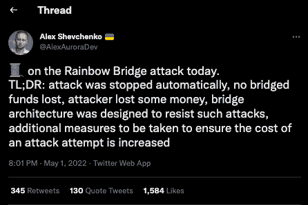
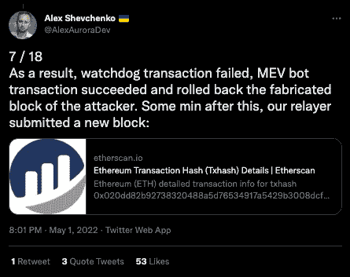
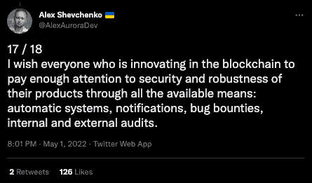
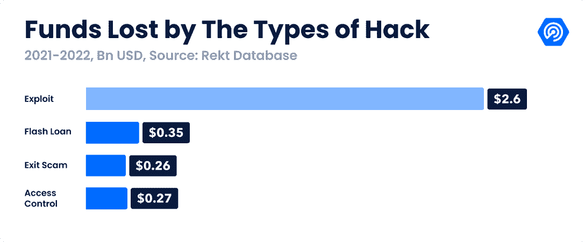

# 在彩虹桥附近失败的漏洞让黑客损失了 7000 美元

> 原文：<https://web.archive.org/web/https://dappradar.com/blog/failed-near-rainbow-bridge-exploit-cost-hacker-7000>

## NEAR 在潜在的利用上拉起吊桥

NEAR 协议阻止了坏人利用彩虹桥的企图，彩虹桥是一个在 NEAR、Aurora 和以太坊之间转移令牌的用户平台。Aurora 首席执行官 Alex Shevchenko [**通过 Twitter**](https://web.archive.org/web/20221004124129/https://twitter.com/AlexAuroraDev/status/1520810591803293696) **提醒社区，声明他们在团队调查攻击时暂停了桥梁。攻击失败了，没有资金损失，这次尝试让黑客损失了 2.5 ETH，也就是 7000 多美元。**

## 摘要

*   [在 NEAR 的彩虹桥上失败的黑客尝试](https://web.archive.org/web/20221004124129/http://what-happened/)花费黑客 2.5 ETH
*   [攻击失败](https://web.archive.org/web/20221004124129/http://what-happened/)，没有资金损失
*   [一系列高调桥梁开发的最新成果](https://web.archive.org/web/20221004124129/http://focus-on-security-/)

[彩虹桥](https://web.archive.org/web/20221004124129/https://dappradar.com/near/other/rainbow-bridge)是一个跨链桥，允许用户在以太坊、NEAR 和 Aurora 网络之间转移资产。它由 Aurora Labs 打造，以用户体验著称。有趣的是，在这种情况下，[舍甫琴科](https://web.archive.org/web/20221004124129/https://twitter.com/AlexAuroraDev/status/1520810591803293696)说将会采取额外的措施来确保进攻的成本会增加。

## 发生了什么事？

该企图始于 5 月 1 日，攻击者部署了一份合同，旨在存入一些资金以成为彩虹桥中继站。攻击的前提是发送虚构的轻型客户端块，这一切都始于通过 Tornado Cash 发送的一些 ETH。

[Shevchenko 在他的 tweet 中解释道](https://web.archive.org/web/20221004124129/https://twitter.com/AlexAuroraDev/status/1520810591803293696)过了一会儿，一个网桥监视器发现提交的块不在区块链附近，于是向以太坊发送了一个挑战交易。由于 watchdog 的操作，MEV bot 事务成功并返回以删除攻击者创建的虚构块。攻击者损失了 2.5 ETH，是因为挑战成功而支付给 MEV bot 的。

## 关注安全性

2022 年，超过 10 亿美元已经在这种桥梁攻击中被耗尽，因为它们已经成为坏人的焦点。尽管如此，桥对于 DeFi 的成功互操作性是至关重要的。这些桥梁使投资者能够有效地在网络之间转移价值，这就是为什么 NEAR 的 TVL 从 2022 年初的大约 1.2 亿美元[增加到今天的 4.73 亿美元](https://web.archive.org/web/20221004124129/https://defillama.com/chain/Near)。舍甫琴科[在推特](https://web.archive.org/web/20221004124129/https://twitter.com/AlexAuroraDev/status/1520810591803293696)上深入分析了这个漏洞，但最终还是想强调 DeFi 中的安全是最重要的。

根据 [Rekt 数据库](https://web.archive.org/web/20221004124129/https://defiyield.app/rekt-database)的数据，在 2022 年 Q1 奥运会上，1 2 亿美元的加密资产被盗，占有史以来被盗资金的 35.8%。有趣的是，2022 年至少有 80%的丢失资产是从桥梁上被盗走的。

2022 年，桥梁已经成为漏洞利用的最佳时机，仅在 2022 年，就有超过 10 亿美元的资金被这种黑客行为耗尽。[浪人桥](/web/20221004124129/https://dappradar.com/blog/how-blockchain-bridges-became-hackers-prime-targets/)攻击也许是最引人注目的，因为坏演员从智能合同中抽走了超过 6 亿美元，使领先的区块链游戏 Axie Infinity 处于自由落体状态。与此同时，更多的传统黑客活动猖獗，Rari Capitals Fuse pools 被利用了 8000 万美元，而 Saddle Finance 在撰写本文的最后 48 小时内遭受了 1000 万美元的利用。

 NewsletterUnsubscribe at any time. [T&Cs](https://web.archive.org/web/20221004124129/https://dappradar.com/terms) and [Privacy Policy](https://web.archive.org/web/20221004124129/https://dappradar.com/privacy-policy)

***以上不构成投资建议。此处给出的信息仅供参考。请行使尽职调查，做你的研究。作者持有多种加密货币的头寸，包括 BTC、瑞士法郎和雷达。***