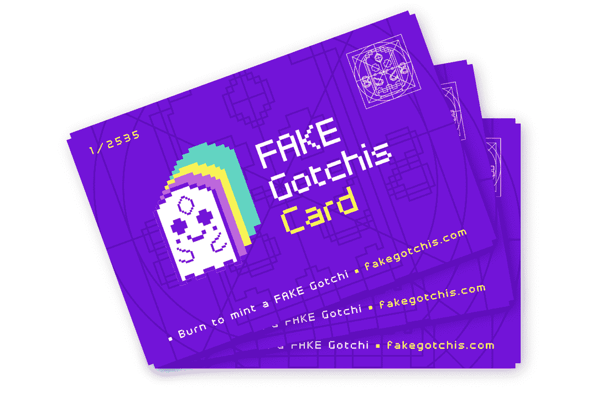
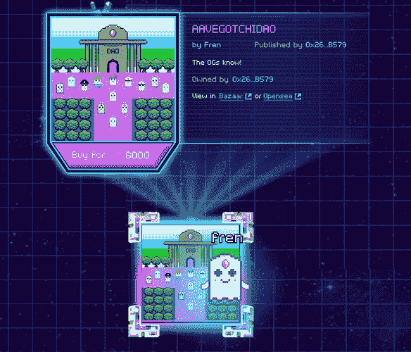
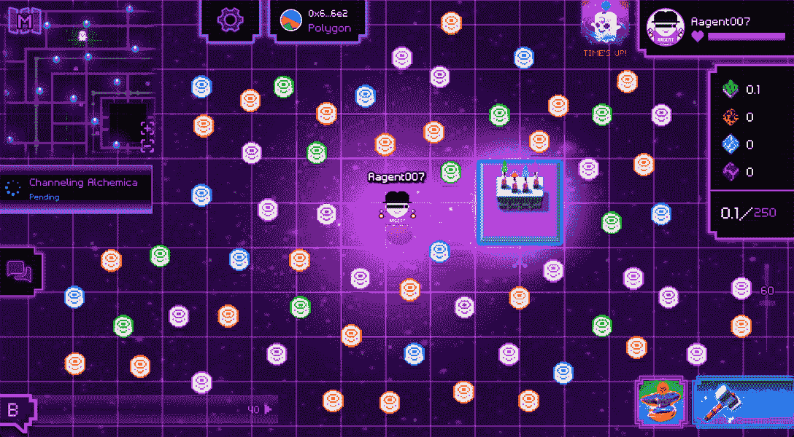

# 假哥特式和非现场艺术来到 aavegotchi

> 原文：<https://web.archive.org/web/https://dappradar.com/blog/fake-gotchis-and-nft-art-coming-to-aavegotchi>

## 高品质的艺术品和无与伦比的创造力进入 Gotchiverse

Aavegotchi 推出了假 gotchi 和 Gotchiverse Art Release，在更广泛的加密社区中点燃了一系列的创造力。一个将策划好的 Aavegotchi 风格的艺术品带到市场，另一个允许土地所有者将他们的艺术品放在 Gotchiverse。有人称之为 Gotchi 文艺复兴，或简称 Gotchissance，这不是没有原因的。

Aavegotchi 今年经历了很多发展。该项目从一个宠物 GameFi 项目发展到一个虚拟世界，玩家可以在其中建造、耕种和社交。最新的两项增加为 Gotchiverse 增添了全新的创意。

*These artworks by Roxiano and Onigiri are among the first to become part of the FAKE Gotchis*

## 假的哥特人，真正的艺术

Aavegotchi 社区欢迎[假 Gotchis](https://web.archive.org/web/20221203032125/https://blog.aavegotchi.com/introducing-fake-gotchis-a-frenly-art-karmic-experiment/) ，这是一个基于 Aavegotchi NFTs 和 Gotchiverse 知识的秘密艺术收藏。FAKE 代表 Frenly Art Karmic Experiment，突出了该项目的意图是成为加密艺术世界的领导者。。通过假 gotchi，任何艺术家都可以创作一件 NFT 艺术品，人们可以通过 FakeGotchis.com 的 Aavegotchi Baazaar NFT 市场或 OpenSea 购买。

要铸造一件 NFT 艺术品，需要一张假的戈奇卡。将只有 2535 张卡可用。

这些卡片将按以下方式分发:

*   35 张卡片被送到 Pixelcraft 工作室，作为第一个被称为“召唤作品”的假哥特人
*   根据稀有农场第四季的最终快照结果，将向 Aavegotchi 社区空投 1000 张卡片:
    *   BRS 排名前 334 的 Aavegotchis
    *   按亲属排列的前 333 名 Aavegotchis
    *   XP 排名前 333 的 Aavegotchis
*   剩余的卡将通过抽奖的方式发放

持卡人可以设计一个假的 Gotchi 并自己铸造，他们可以与艺术家合作并分享版税，或者出售他们的假 Gotchi 卡。

## 假 Gotchi 铸造过程

不仅仅是任何人都可以为假冒的 Gotchis 系列创作艺术品。社区完全通过适当的指导方针来推动该项目，以确保质量标准得到维护:

1.  当你提交作品时，你或者你合作的出版商需要一张假的 Gotchi 卡。您将在提交后的铸造过程中刻录这张 NFT 卡。
2.  一张假的 Gotchi 卡允许艺术家或出版商铸造多达 100 个版本的作品。总共有 2535 张假的 Gotchi 卡..
3.  提交后，作品进入队列。在这里，社区将策划艺术品。
    1.  艺术作品需要受到 Aavegotchi 或 Gotchiverse 更伟大的传说的启发。
    2.  艺术品需要对工作安全。所以没有攻击性的内容。
    3.  低努力的艺术品或仿制品将不被纳入收藏。
4.  一个艺术家看到自己的作品被拒绝，将不会得到他们的假 Gotchi 卡回来。但是，艺术家可能会被要求编辑并重新提交。在这种情况下，他们将获得一张新的假 Gotchi 卡。

## 在美术馆展示艺术

Aavegotchi 工作人员[引进了 NFT 展示](https://web.archive.org/web/20221203032125/https://blog.aavegotchi.com/epic-gotchiverse-art-release-to-deliver-three-amazing-new-features/)，允许土地所有者在他们自己的土地上展示 NFT。这包括伪造的 Gotchis 艺术收藏，以及其他 Aavegotchi NFTs，包括领域包裹、门户和 Aavegotchis 本身。

NFT 展示不仅仅是展示。路人可以站在显示器上，艺术品会弹出，显示更多关于这件作品的细节。如果是出售的话，甚至会有一个“立即购买”按钮。

最终，任何列入 Aavegotchi Baazaar 白名单的 NFT 收藏都可以在 Gotchiverse 直接购买。没必要离开游戏。对于其他集合，将有一个到 OpenSea 的直接链接。

## 新的制作食谱

在过去的几个月里，我们已经看到各种各样的工艺配方被添加到 Gotchiverse 中。玩家可以积累称为 FUD、FOMO、阿尔法和 KEK 的 Gotchus 炼金术令牌来制作新的 NFT 物品，通常在有限的时间内。例如，我们已经看到各种装饰瓷砖可供薄荷两个星期的时间。此外，制造和升级装置，优化所述令牌的收获，也需要炼金术。

随着 NFT 展示的引入，玩家得到了另一套制作食谱。最初，将有四个尺寸，每个都有一个基本和限量版的金色皮肤。要制作这些展示品，玩家需要以下物品:

*   4×4 NFT 显示器:400 FUD，600 阿尔法，100 KEK
*   4×6/6×4 NFT 显示器:600 FUD，800 阿尔法，200 KEK
*   8×8 NFT 显示器:1，600 FUD，2，000 阿尔法，600 KEK
*   4×4 勒金 NFT 显示器:4，000 FUD，6，000 阿尔法，1，000 KEK
*   4×6/6×4 勒金 NFT 显示器:6000 FUD，8000 阿尔法，2000 KEK
*   8×8 勒金 NFT 显示器:16000 FUD，20000 阿尔法，6000 KEK

[https://web.archive.org/web/20221203032125if_/https://www.youtube.com/embed/ozlO17r4jO4?feature=oembed](https://web.archive.org/web/20221203032125if_/https://www.youtube.com/embed/ozlO17r4jO4?feature=oembed)

## 如何吸引观众

哥特里维斯很大，充满了冒险。当展示或销售 NFT 艺术品时，你会想要吸引观众。这可能是一个相当大的挑战，但由于引入了弹跳门，这变得更加容易。只需免费制作一个弹跳门，并使用 GLTR 来维护门户。弹跳门每块消耗 1 GLTR，这意味着它每年需要 1570 万 GLTR 才能一直处于活动状态。

此外，土地所有者可以宣传他们的活动，并使他们的门户网站成为那些访问 Gotchiverse 的人的优先选择。只需花费 1 FUD，FOMO，阿尔法或 KEK，它将增加 1，2，4 或 10 个优先点。您花费的越多，您的活动在图表中显示的位置就越高。

到目前为止，只有 NFT 债券的所有者和借款者才能进入这个市场。没有 Aavegotchi 的玩家可以以观察者的身份进入这个世界，只需使用 Web3 钱包登录即可。

## 成长为伟人

伪造的 gotchi 和 NFT 显示可能看起来像小更新，但这些巩固了 Aavegotchi 不仅仅是元宇宙 GameFi 项目。这些最新的更新强调了 Aavegotchi 致力于建立一个身临其境的元宇宙体验..

在过去的两年里，Aavegotchi 已经成为 GameFi 的一个真正的例子，将分散化金融的元素与游戏结合起来。作为游戏玩家或投资者，Aavegotchi 平台提供了超过 [5 种赚取加密代币](https://web.archive.org/web/20221203032125/https://dappradar.com/blog/earn-crypto-coins-ghst-aavegotchi/)的方法。自今年以来，游戏和社区元素变得更加强大。玩家可以[借贷 Aavegotchis](https://web.archive.org/web/20221203032125/https://dappradar.com/blog/how-aavegotchis-gotchi-lending-takes-the-scholarship-model-to-the-next-level/) ，然后使用像素幽灵[农场资源](https://web.archive.org/web/20221203032125/https://dappradar.com/blog/aavegotchis-gotchiverse-farming-release/)。与此同时，[gochiverse 正在成长](https://web.archive.org/web/20221203032125/https://dappradar.com/blog/aavegotchi-gotchiverse-land-release/)，快速增加新功能。

凭借超过 1.31 亿美元的历史最高交易量，Aavegotchi 一举成名。目前，每天有超过 2000 名玩家与该项目互动。他们抚摸他们的 Aavegotchis，收获他们的资源，并在 Gotchiverse 社交。尽管在过去的两个月中宏观经济动荡，该项目在 NFT 的交易量已经达到 150 万美元。你可以在 Aavegotchi dapp 页面上查看最新的销售情况。

[https://web.archive.org/web/20221203032125if_/https://www.youtube.com/embed/9P9pq-2YH5E?feature=oembed](https://web.archive.org/web/20221203032125if_/https://www.youtube.com/embed/9P9pq-2YH5E?feature=oembed)

## 随身携带您的 Web3 之旅

使用 DappRadar 移动应用程序，再也不会错过 Web3。查看最受欢迎的 dapps 的性能，并关注您投资组合中的 NFT。您在 DappRadar 上的帐户会与我们的移动应用程序同步，这样您很快就可以选择实时接收提醒。

[Download the DappRadar app now](https://web.archive.org/web/20221203032125/https://dappradar.app.link/blog)[<picture></picture>](https://web.archive.org/web/20221203032125/https://play.google.com/store/apps/details?id=com.portfolio.dappradar) NewsletterUnsubscribe at any time. [T&Cs](https://web.archive.org/web/20221203032125/https://dappradar.com/terms) and [Privacy Policy](https://web.archive.org/web/20221203032125/https://dappradar.com/privacy-policy)