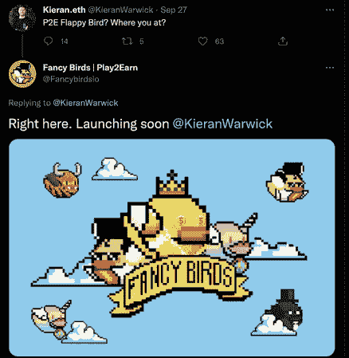
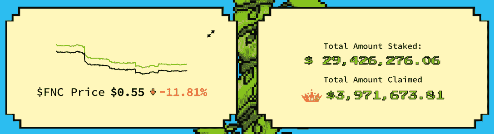
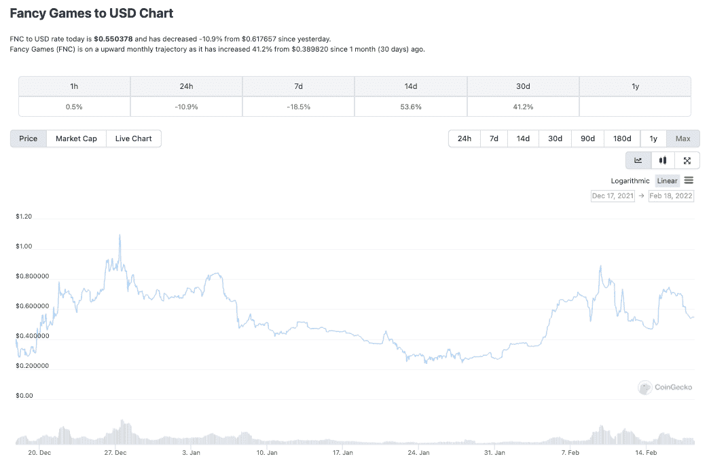
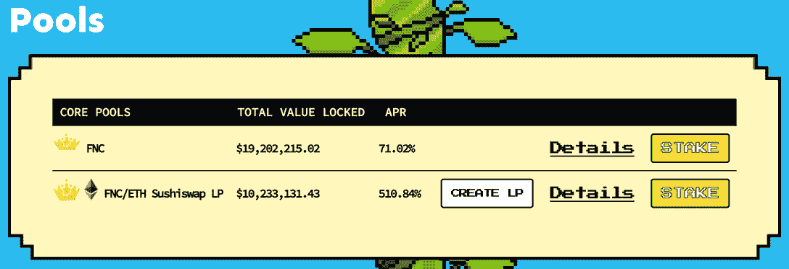
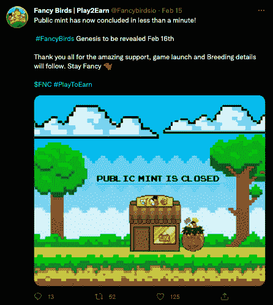
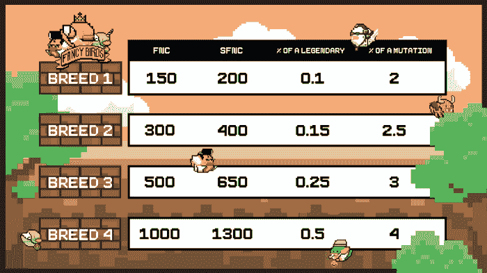

# 随着游戏今天开始，花式鸟在多边形上高飞

> 原文：<https://web.archive.org/web/https://dappradar.com/blog/fancy-birds-flying-high-on-polygon-as-gameplay-launches-today>

## 育种和游戏性在 2 月 18 日星期五发布

**新的“玩赚”dapp 花式鸟在完成其 genesis NFT 销售并推出第一款游戏机制后，正在飞上** [**多边形网络游戏排行榜**](https://web.archive.org/web/20230117081527/https://dappradar.com/rankings/protocol/polygon/category/games) **。花式鸟类最初于 12 月中旬抵达，现在“鸟巢”中下注的 FNC 代币总额已超过 2900 万美元。**

[花式鸟](https://web.archive.org/web/20230117081527/https://dappradar.com/polygon/games/fancybirds)是芯[花式游戏刀](https://web.archive.org/web/20230117081527/https://twitter.com/fancydao?lang=en)投稿人[花式先生](https://web.archive.org/web/20230117081527/https://twitter.com/_mrfancyy)的创意，因为他在 Discord 上被人熟知。长期竞技游戏玩家，有组织电竞赛事的背景。然而，当 [Illuvium](https://web.archive.org/web/20230117081527/https://dappradar.com/ethereum/games/illuvium) 的联合创始人 [Kieran Warwick](https://web.archive.org/web/20230117081527/https://twitter.com/KieranWarwick) 在推特上发表关于 P2E Flappy Bird 的想法时，真正的催化剂出现了。

在向 Illuvium 联合创始人展示了工作游戏的演示并解释了花式游戏的路线图后，Illuvium 联合创始人作为战略顾问加入了进来。第一轮种子投资者包括 Synthetix 的 [Kain Warwick](https://web.archive.org/web/20230117081527/https://twitter.com/kaiynne?lang=en) 、Sushi 的 [0xMaki](https://web.archive.org/web/20230117081527/https://twitter.com/0xMaki) 、1inch 的 [Anton Bukov](https://web.archive.org/web/20230117081527/https://twitter.com/k06a) 、Ankr 的 Ryan Fang、【Aave 的 Stani Kulechov 、Barnbridge 的[泰勒·伍德](https://web.archive.org/web/20230117081527/https://twitter.com/LordTylerWard)和 Quantstamp 的 Richard Ma。

## 什么是花式刀？

Fancy Games DAO 是一个专注于移动设备的游戏赚取平台，它希望通过免费游戏机制和利用加密技术将休闲游戏赚取带给大众。此外，用户将能够访问多个游戏赚取游戏，该公司希望这些游戏能够模仿休闲游戏平台如 99 的怀旧体验，同时也为游戏玩家提供了通过 FNC 治理令牌赚取奖励的机会。

用于繁殖，赚取，赌注，定制 NFT 资产，参加独家锦标赛和游戏模式。FNC 是花式游戏生态系统的治理标志，也是花式鸟类游戏的核心组成部分。

## FNC 治理令牌

FNC 代币销售于 12 月 14 日上线，寿司上的 ETH/FNC 流动性池在写作时提供超过 500%的年利率，在 Fancy Birds 网站上提供赌注。得益于赌注和流动性池从一开始就公开，象征性价格迄今保持稳定。花式鸟流动资金池和鸟巢的总赌注超过 2900 万美元。相比之下，这比整个 [Fuse network dapp 生态系统迄今](https://web.archive.org/web/20230117081527/https://defillama.com/chain/Fuse)多 500 万美元。

DeFi 机制在这个 dapp 中已经很强大了，它有一个有趣的机制，让赌注者可以轻松地选择 0 到 52 周的 FNC 锁定，APR 越高，锁定的令牌越长，在撰写本文时，52 周锁定的峰值为 71%。

该机制旨在激励 FNC 持有者尽可能长时间地保留他们的代币，以免破坏游戏中的经济和 FNC 的价格，并帮助团队提供路线图。随着近 400 万美元的 FNC 奖励已经支付，未来几天将是游戏上线的关键，但迄今为止，该系统似乎工作得很好。

## 学会飞翔，飞着去赚钱

[花式鸟是花式游戏刀的创世纪游戏](https://web.archive.org/web/20230117081527/https://dappradar.com/polygon/games/fancybirds)。该游戏旨在通过 8，888 个随机生成的 genesis Fancy Bird NFTs 创建一个开放的经济，为休闲街机游戏的上瘾乐趣添加一个赚钱的元素。玩家必须持有 NFT 才能玩游戏，并通过完成每日和每周的任务来获得 FNC。公开销售于 2 月 14 日启动，在 2 月 10 日进行早期造币后，几分钟内销售一空。

## 繁殖从 2 月 18 日开始

现在这些鸟已经出巢了，持有者可以饲养它们来揭示更多的基因和潜在的有用和有价值的非功能性食物。每只创世鸟每个月有四个品种。品种的数量每个月都会重新设定。每次繁殖后，在鸟儿可以再次繁殖之前，也会有 5 天的冷却期。繁殖后，用户将收到一个将在 24 小时内孵化的蛋。

上图显示了 FNC 或 sFNC(合成 FNC)的每只鸟的成本。根据图表，根据一只鸟繁殖的次数，画出一只传奇鸟或突变特征的几率会增加。一旦游戏开始，玩家将使用 NFT 鸟来升级并赢得 FNC。关于繁殖的更多细节可以在网站[上找到。](https://web.archive.org/web/20230117081527/https://medium.com/@fancybirds/welcome-to-the-love-house-fancy-birds-breeding-b40d6cd15177)

## 游戏发布时间表

2 月 14 日:创世纪的公共造币厂

2 月 15 日: [sFNC 申请启用](https://web.archive.org/web/20230117081527/https://medium.com/@fancybirds/fnc-on-polygon-bridge-liquidity-fcd0b856ee61)(世界协调时下午 7 点)

2 月 16 日:创世纪系列揭晓

2 月 18 日:发布[花式鸟第一版](https://web.archive.org/web/20230117081527/https://dappradar.com/polygon/games/fancybirds)

游戏发布的第一个版本将包括以下内容:

*   饲养
*   任务(每日和每周)
*   锦标赛(每日)
*   排行榜(季节性)
*   名字改变(改变鸟的名字)
*   安卓 APK

## 多边形网络上的先玩后赚

多边形网络已经成为这个领域一些最流行游戏的主机。例如，[疯狂防御英雄](https://web.archive.org/web/20230117081527/https://dappradar.com/polygon/games/crazy-defense-heroes) (CDH)是一款在手机上可以玩到赚的塔防游戏。今年 1 月，CDH 平均每天吸引超过 41，000 名 UAW，是去年 12 月注册玩家数量的两倍。塔防游戏成为网络中仅次于 QuickSwap 的第二大热门 dapp。

Polygon 最近特别关注移动领域。由 Animoca Brands 子公司 [Gamee](/web/20230117081527/https://dappradar.com/blog/arc8-grabs-the-top-spot-with-season-1-launch/) 开发的移动游戏赚钱 dapp arc 8 在 1 月份完成了季前赛，吸引了超过 58，000 名 UAW。移动游戏赚取 dapp 将推出其第一个正式赛季，包括新的迷你游戏。在许多方面，Arc8 和 Fancy Games DAO 的前景非常相似，因此，2022 年两者如何并肩作战将是一件有趣的事情。此外，看看[即玩即赚游戏如何增加今年多边形网络的使用率](/web/20230117081527/https://dappradar.com/blog/dappradar-x-bga-blockchain-games-report-january/)和整体吸引力。

 NewsletterUnsubscribe at any time. [T&Cs](https://web.archive.org/web/20230117081527/https://dappradar.com/terms) and [Privacy Policy](https://web.archive.org/web/20230117081527/https://dappradar.com/privacy-policy)

***以上不构成投资建议。此处给出的信息仅供参考。请行使尽职调查，做你的研究。作者持有 ETH、BTC、AGIX、HEX、LINK、GRT、CRO、OMI、不可变 X、GALA、AVASTR、GMEE、CUBE、RADAR、FLOW、FTM、BNB、SPS、WRLD、ATOM 和 ADA。***