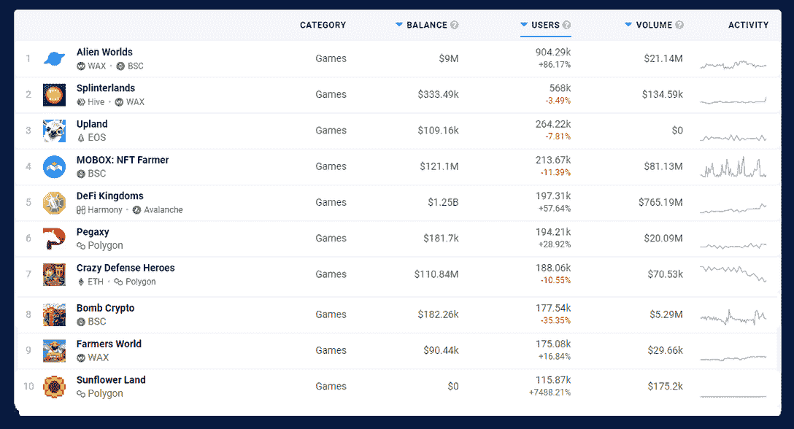

# fansite 准备开放 alpha 游戏发布

> 原文：<https://web.archive.org/web/https://dappradar.com/blog/farsite-preparing-for-open-alpha-game-release>

## MMO 航天公司完成了第四个发展阶段

在线太空游戏 [Farsite](https://web.archive.org/web/20221007160540/https://dappradar.com/ethereum/games/farsite) 将很快推出其游戏的开放 alpha 版本，将分散式游戏 dapp 推向新的领域。在此之前，该团队将于 4 月 25 日关闭商店，不再销售第四阶段的商品板条箱。

## 摘要

*   [Farsite 结束开发](https://web.archive.org/web/20221007160540/https://dappradar.com/blog/farsite-preparing-for-open-alpha-game-release/#ending)第四期并于 4 月 25 日关店
*   Farsite 使用信用，1，000 个信用值 1 个 FAR token
*   这个游戏是为以太坊 2.0 制作的，但是使用[多边形](https://web.archive.org/web/20221007160540/https://dappradar.com/rankings/protocol/polygon)和 zk-relay 来操作
*   [对游戏经济至关重要的土地部门](https://web.archive.org/web/20221007160540/https://dappradar.com/blog/farsite-preparing-for-open-alpha-game-release/#sectors)
*   Farsite alpha 游戏迫在眉睫，因为[游戏经济将需要自己运行](https://web.archive.org/web/20221007160540/https://dappradar.com/blog/farsite-preparing-for-open-alpha-game-release/#player)

## 第四阶段结束，店铺关闭

目前 Farsite 的游戏非常有限，但是玩家可以在行星上获得土地，建造基地和开采资源。玩家可以找到哪些资源，取决于他们的星球和地点。在 Farsite 的早期阶段，这些资源成为游戏未来的基石。资源进入游戏世界的唯一途径是玩家采矿、收集、制作和交易。

Farsite 开发的第四阶段引入了土地和初始采矿游戏。该团队还开放了星际之门，允许玩家进行长途旅行。更重要的是，玩家可以在内部市场上交易他们获得的资源，这为 Farsite 成为一个拥有真正经济的去中心化 MMO 奠定了基础。

如前所述，[店铺](https://web.archive.org/web/20221007160540/https://play.farsite.online/#/Store)将于 4 月 25 日关闭。随着商店的关闭，游戏的经济和内部市场将变得更加重要。Farsite 现在正准备在 alpha 阶段将游戏的经济交到玩家手中。

[https://web.archive.org/web/20221007160540if_/https://www.youtube.com/embed/DdrQlnF7Ax4?feature=oembed](https://web.archive.org/web/20221007160540if_/https://www.youtube.com/embed/DdrQlnF7Ax4?feature=oembed)

## Farsite 使用以太坊和多边形

Farsite 的积分存在于[多边形区块链](https://web.archive.org/web/20221007160540/https://dappradar.com/blog/tag/polygon)上，同时游戏还提供 FAR 代币。1 个远令牌将始终是 1000 个信用点。Farsite 建立在以太坊区块链之上，应该与以太坊 2.0 兼容。游戏使用三层:以太坊(L1)，多边形(L2)和 ZK 接力(L3)。多边形上的信用可以转换成以太坊区块链上的 FAR 代币，然后在公开市场上交易。所有涉及积分的动作和购买都发生在多边形上，而不涉及积分的游戏动作会通过游戏的 L3 层发生。

Farsite 中的每一艘宇宙飞船都是一个抵押 NFT (cNFT)，这意味着每一个 NFT 都有一个基础价值，因为里面储存了资源。这个想法是，玩家可以为他们的飞船获得贷款，或者在遭受严重损坏后宣布飞船完全报废。那些 NFT 存在于多边形区块链上。那些想跳进去的人，可以在 OpenSea 上找到船体、物品箱、飞船模块和蓝图。

船壳的底价是 0.05 ETH，属于可承受的项目。蓝图的价格至少为 0.085 ETH，而模块的价格只有 0.03 ETH。到目前为止，箱子是市场上交易的所有非功能性食物中价值最高的。这些将花费你至少 0.2 ETH 到 5 ETH 来购买公开市场上最贵的那些。

## 对游戏经济至关重要的土地区域

Farsite 背后的团队也在研究巨型加密城市，但这一次开放经济进入了下一个前沿领域。在太空中，玩家可以成为资源的生产者，交易者，或者可能是跨星系运输资源和货物的人。Farsite 中发生的一切都来自玩家，从联盟到冲突，从生产周期到星系间的市场支配。这不是没有原因的，团队已经在第四阶段的 pre-alpha 中激活了一些土地功能。

一块土地或一块区域允许玩家建造一个基地。拥有一个区域或一块土地可以被认为是核心游戏循环的重要部分。玩家可以为他们的领域选择一个专业，例如采矿厂，精炼厂，工厂，模块厂或造船厂。小型部门将有一个专业，中型部门可以有两个，而大型部门可以使用三个专业。每个扇区都有自己的地图，上面有预定义的资源点。

玩家需要与其他用户建立商业关系。结果玩家会结成联盟。玩家可以交易、结盟、提供服务，最有可能的是发动战争。重点是 Farsite 中的一切都将是玩家驱动的。玩家收集和交易资源、工艺物品，这些都是有限的。这种活动创造需求，这将创造某些热点。这种需求将不可避免地引发权力和控制权之争。

## 元宇宙土地和区块链博彩

不管你是把 Farsite 当做一个元宇宙产品，用户可以购买土地，拥有职业和角色，还是仅仅作为一个区块链游戏，这都无关紧要，但这里有一些特别的事情正在发生。暴雪娱乐通过《暗黑破坏神 3》展示了创建一个拥有无限数量游戏物品的开放经济是一个严峻的挑战。然而，随着区块链技术作为游戏经济基础的崛起，我们看到了新的机遇。

目前，区块链游戏市场约占所有独立活动钱包的一半。二月份，区块链博彩市场吸引了 110 万个每日独立活跃钱包，比一月份下降了 13%。像[外星世界](https://web.archive.org/web/20221007160540/https://dappradar.com/multichain/games/alien-worlds)、[农民世界](https://web.archive.org/web/20221007160540/https://dappradar.com/wax/games/farmers-world)、[向日葵地](https://web.archive.org/web/20221007160540/https://dappradar.com/polygon/games/sunflower-land)这样的游戏吸引了成千上万独特的活跃钱包。在过去的 30 天里，Alien Worlds、Splinterlands、Upland 和 Axie Infinity 是使用最多的 dapps，这表明游戏对区块链空间的影响有多强。

[<picture></picture>](https://web.archive.org/web/20221007160540/https://dappradar.com/rankings/category/games)

像 Farsite 这样的游戏，能够给用户一种不需要太多区块链技术知识的体验，将会成为主流。Farsite 是否会成为主流，还有待观察。传统上，太空游戏属于一个利基市场，但它往往非常专注。游戏玩家一直非常欣赏太空游戏，如 EVE Online，No Man's Sky，Elite Dangerous，Homeworld，Mass Effect 和 FTL，也许 Farsite 可以成为一个向那些热爱太空游戏的游戏玩家介绍真正所有权的游戏。但首先，让我们等待 Farsite alpha 的发射。