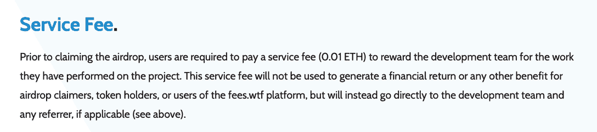
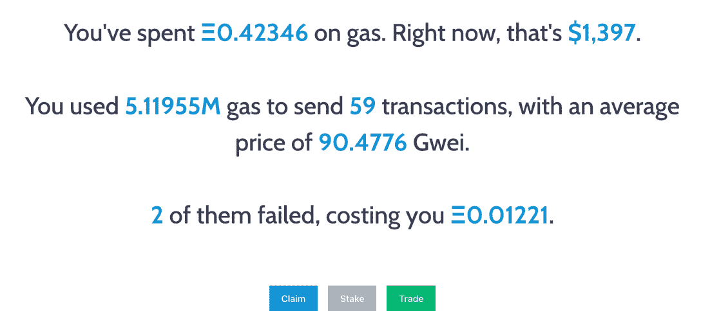
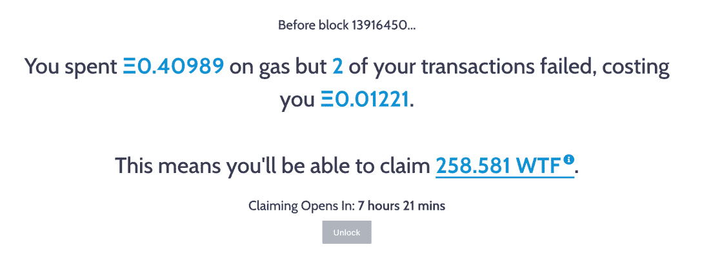

# WTF 空投发射费

> 原文：<https://web.archive.org/web/https://dappradar.com/blog/fees-wtf-airdrop-launches-today>

## 至少花了 0.05 ETH 汽油费的以太坊地址符合条件

**另一天，另一个[空投机会](https://web.archive.org/web/20220929050518/https://dappradar.com/hub/airdrops)给加密社区。这一次从以太坊燃气费跟踪网站费 WTF。一个致力于向以太坊用户展示他们一生在区块链交易气体费用上的花费的网站。所有在 2022 年 1 月 1 日发生的[区块 13916450](https://web.archive.org/web/20220929050518/https://blockexplorer.one/ethereum/mainnet/blockHash/13916450) 花费至少 0.05 ETH 的以太坊地址都有资格获得 WTF 令牌空投。空投将于 1 月 14 日星期五世界协调时 00:00 开始。**

Fees WTF 于 2019 年推出，允许用户连接 WalletConnect 或 MetaMask 钱包，以获取有关他们在以太坊网络上花了多少钱，这些交易的平均价格，失败次数以及这些失败的相应成本的信息。

## 停下来。看啊。听

然而，[白皮书](https://web.archive.org/web/20220929050518/https://fees.wtf/whitepaper.pdf)包含了一条主页上没有明确的重要信息。在申请 airdrop 之前，用户需要支付 0.01 ETH 的服务费，或在撰写本文时大约 33 美元，以奖励开发团队在项目上所做的工作。

[<picture></picture>](https://web.archive.org/web/20220929050518/https://fees.wtf/whitepaper.pdf)

Always DYOR

该服务费不会用于为 airdrop 申请人、代币持有者或费用 WTF 平台的用户产生财务回报或任何其他利益，而是将直接支付给开发团队和任何推荐人(如果适用)。可以说，该团队并不过度关注令牌在推出时的表现，因为毫无疑问将有数百万人有资格获得下降——为收费 WTF 团队带来了可观的收入。

尽管如此，这可能是一个双赢的局面。这就是如何检查你的空投资格。

## 如何申领 WTF 代币

1.  前往 https://fees.wtf/
2.  在右上角，您会看到“连接钱包”——点击它
3.  使用元掩码或 WalletConnect wallet 连接到网站
4.  如果您同时使用两个钱包并定期通过两个钱包进行交易，您可以检查它们的资格
5.  一旦你连接上你的钱包，这个网站会立刻告诉你你用了多少汽油

6.点击左下角的索赔按钮。

在这种情况下，索赔人有权获得 258.581 WTF 代币。在写的时候令牌没有被启动；因此，没有价格信息。空投将于 1 月 14 日星期五世界协调时 00:00 开始。此时，令牌应该被列出，并可以通过 CoinGecko 等网站进行跟踪。用户需要权衡提到的 0.01 ETH 费，任何申请中适用的汽油费，然后决定是否值得。

空投是组织让人们更多参与并对他们的服务感到兴奋的一种极好的方式。传统营销依赖于说服人们参与其中，而在加密领域，人们可以获得奖励，然后变得活跃起来。正如本文所回避的，用户需要做他们的研究，仔细观察每一次空投。

***以上不构成投资建议。此处给出的信息仅供参考。请行使尽职调查，做你的研究。作者持有 ETH、BTC、AGIX、HEX、LINK、GRT、CRO、OMI、不变 X、ENS、GALA、AVASTR、GMEE、CUBE、RADAR、FLOW、FTM、BNB、SPS、WRLD、ATOM 和 ADA。***