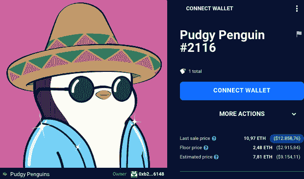
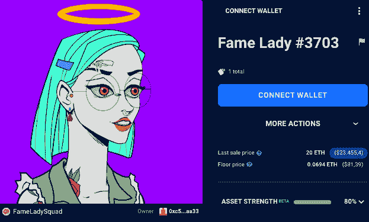
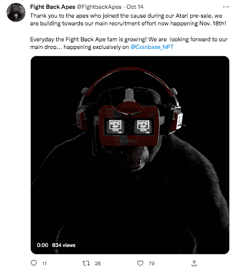

# 反击:社区或公司如何收回项目

> 原文：<https://web.archive.org/web/https://dappradar.com/blog/fighting-back-how-a-community-or-company-can-take-back-a-project>

## 了解社区如何团结起来“反击”NFT 地毯拉

**我们的** [**关于地毯拉手**](https://web.archive.org/web/20221130143530/https://dappradar.com/blog/not-all-rug-pulls-are-created-equal) **的多部分系列的第一篇文章探讨了什么是地毯拉手，它们如何工作，如何识别潜在的地毯拉手中的危险信号，以及如何区分地毯拉手和项目管理不善。**

在本系列的第 2 部分中，我们将更深入地探讨当面临困扰 NFT 空间的一些令人讨厌的陷阱时，社区如何团结起来“反击”。

## **内容**

*   我们所说的“反击”
*   **[如何反击:NFT 项目收购和社区控制](https://web.archive.org/web/20221130143530/https://dappradar.com/blog/fighting-back-how-a-community-or-company-can-take-back-a-project/#How-to-Fight-Back:-NFT-Project-Buyouts-and-Communities-Taking-Control)**
*   **[如何反击:用崎岖的社区创造全新的项目](https://web.archive.org/web/20221130143530/https://dappradar.com/blog/fighting-back-how-a-community-or-company-can-take-back-a-project/#Fight-Back-Apes-:-Creating-a-new-project-from-the-ashes)**
*   **[反击的步骤](https://web.archive.org/web/20221130143530/https://dappradar.com/blog/fighting-back-how-a-community-or-company-can-take-back-a-project/#Steps-For-Fighting-Back)**

## **我们所说的“反击”是什么意思**

正如我们上周所概述的那样，许多 NFT 项目屈服于那些进行拉地毯和其他骗局的坏演员。

对于许多项目来说，“拉地毯”或“骗局”的标签是一个丧钟，无论是否有保证，都可能导致项目的底价下跌。这是一个不幸的现实，因为血汗钱涌入 NFTs，希望获得丰厚的财务回报。

令人欣慰的是，我们现在有几个 NFT 社区“反击”挪用其项目的例子，以及更多管理经验和资本注入新生命和方向的公司和投资者。

[Check The NFT Explorer](https://web.archive.org/web/20221130143530/https://dappradar.com/hub/nft-explorer)

由不希望看到他们宝贵的 NFT 收集数字垃圾的社区领导人领导，我们下面概述的项目是关于社区如何在疏忽和恶意之后继续存在和繁荣的宝贵案例研究。

## **如何反击:NFT 项目收购和社区控制**

我们看到的社区收回项目的第一种也是最常见的方式是通过从最初的创始人那里购买项目的资产。矮胖企鹅和名媛队就是这种策略的例子，正直的 NFT 社区成员通过筹集资金直接购买这些项目来表明他们对这些项目的信任。

### 矮胖的企鹅:外来投资者来拯救

矮胖的企鹅于 2021 年 7 月制造，备受好评和兴奋，立即登上了 OpenSea 销量最高的项目排行榜。

该项目的最初创始人 Cole Thereum 通过承诺一系列令人敬畏的社区倡议来推动宣传。但是经过几个月的无所作为，社区变得焦躁不安。

The highest-selling Pudgy Penguin ( 10,97 ETH) in the past 7 days

[Discover Pudgy Penguins](https://web.archive.org/web/20221130143530/https://dappradar.com/hub/nft-explorer/collection/pudgypenguins/sales-activity)

矮胖的企鹅 whale [9x9x9](https://web.archive.org/web/20221130143530/https://twitter.com/9x9x9eth) 和其他知名的社区成员最终进行了投票，将科尔从项目中移除，同时购买该项目的要约开始慢慢到来。最终，最初的创始人以 250 万美元的价格将该项目卖给了矮胖企鹅霍尔德和洛杉矶企业家卢卡·内茨

### 名人女队:一个社区接管

2021 年夏天，Fame Lady Squad 因声称是这个由男性主导的领域中首批由女性主导的项目之一而成为头条新闻。这也是第一个大规模的、全女性的 PFP NFT 系列，当时在广受欢迎的阿凡达项目中展示的多样性非常少。

The most expensive Fame Lady NFT( current price: $23,443 time of sale: $78,466)

#### 创始人是诈骗犯

后来，这个社区发现创始人实际上是男性，这是一个古怪喜剧的转折。起初，创始人试图与社区谈判，以重新获得他们的信任。指控过后，创始人坦白承认了他们的欺诈行为。

[Discover Fame Lady Squad](https://web.archive.org/web/20221130143530/https://dappradar.com/hub/nft-explorer/collection/fameladysquad)

#### 社区接管了这个项目

被曝光的男性声称，他们将向面向女性的事业捐款，并建立一个资助计划，以支持新的由女性领导的 NFT 项目。但是社区不原谅他们不诚实的行为，投票支持创始人转移项目控制权。

在@digitalartchick 公开要求创始人放弃他们作为项目所有者的权利后，收藏的智能合同被传递给了她作为临时保管人。

同一天，在社区呼吁采取行动后，她将所有权转让给了@iamboredbecky。无聊的贝基和其他来自名人女士小队社区的女性领导人现在运行这个项目。

#### Daz3D 介入

最近，Daz3D ( [、CloneX](https://web.archive.org/web/20221130143530/https://dappradar.com/hub/nft-explorer/collection/clonex) 、RTFKT、Batcowls、CocaCola、Champion)介入，为女性领导者提供资金，并发展了 Fame Lady Squad，该公司正在悄然重建，计划在未来几个月重新推出。

名媛队的故事是 NFT 社区通过反击增强权能的一个里程碑，该项目从由假装是女性的男子创建到由正直的 NFT 女性社区成员拥有。

## 反击猿类:从灰烬中创造一个新项目

《进化的猿》是 NFT 历史上最早、最受公众关注的电影之一，也是第一部被主流媒体广泛报道的电影。在创始人带着 270 万美元消失后，进化猿社区的领导人决定“反击”

他们与领先的 3D 内容公司 Daz3D(CloneX、RTFKT、Batcowls、CocaCola、Champion 和即将推出的《权力的游戏》)合作，资助开发一个全面的复出系列，被恰当地称为“反击猿类”。

Source: [Fight Back Apes](https://web.archive.org/web/20221130143530/https://twitter.com/FightbackApes)

[反击猿类](https://web.archive.org/web/20221130143530/https://twitter.com/FightbackApes)代表了一个庞大的群体，包括那些受到进化猿类地毯拉力影响的人，以及那些受到 Web3 空间中其他地毯和骗局影响的人。

该社区的精神是提供教育社区倡议，以确定可能的障碍，审查项目团队，并避免 NFT 空间中许多人所犯的集体错误。

## **如何反击:在崎岖不平的社区创建全新的项目**

反击可能比从创始人手中回购项目更具挑战性。通常，执行 rug pulls 的创始人会消失得无影无踪，也不会遭受法律后果，这使得追踪他们的前景变得不可能，更不用说回购项目了。

在其他情况下，一个社区可能没有资金回购其项目，即使选项摆在桌面上。

幸运的是，NFT 社区存在于公共区块链。一个“坚固的”社区可以通过识别其持有人并创建一个行动过程来无缝分叉，以将这些持有人连接到一个新的集合和社区。

### **反击步骤**

#### 1.确定项目创始人和管理团队

正如我们在上面的例子中看到的 Pudgy Penguins 和 Fame Lady Squad，识别和与最初的创始人沟通是关键。如果创始人是清白的，雇佣调查公司和网络侦探( [CipherBlade](https://web.archive.org/web/20221130143530/https://cipherblade.com/) 就是一个例子)来揭露他们的身份。

#### 2.确定自然从社区中脱颖而出的领导者

天生的领导者在每个社区都有自己的地位，不管是网络 3 还是其他。识别对项目成功充满热情的人是非常重要的。支持这些领导人的探索。

#### 3.团结社区

利用你的社交媒体网络。创建您自己的私人群聊来协调私人论坛中的交流。与密友和社区的其他成员分享你的担忧。

#### 4.**提出项目的备选方案**

收集其他社区成员的观点。你对财政部的钱有计划吗？你希望看到新的创始团队接手吗？与他人一起计划可以让你的信息清晰。

#### 5.**对创始团队施加全场压力**

威胁立即采取法律行动。给创始人施加压力。向您居住的地方或联邦政府机构提交报告。OpenSea 和社交媒体上的报告集合。

#### 6.**与其他项目成员一起创建自己的社区**

如果直接购买项目不是一个选项，通过推出一个新的集合来分叉社区。这可以与采取措施为原始收藏的创建者带来正义同时进行。

#### 7.教育他人不要犯同样的错误

这可能很难做到，但在很多情况下，你能做的最好的事情就是在这个空间里继续前进。很多人都去过。非功能性测试仍然是一项新技术，有着陡峭的学习曲线。

#### 8.**昂起头，继续跋涉前行**

过早接触新技术本身就有风险。使用 DappRadar 等先进的数据工具来帮助自己和他人进行研究。

## **用 DappRadar 继续学习 NFTs】**

投资者必须经常做自己的研究，并对市场进行适当的教育。对于任何想尝试 NFT 的人来说，你知道的越多越好。

这个领域发展很快，但是你可以通过跟 DappRadar 学习来跟上最新的趋势和新概念。

[DappRadar 的 NFT 工具](https://web.archive.org/web/20221130143530/https://dappradar.com/nft)可以帮助你深入研究流行的 NFT 收藏、市场排名和顶级实时销售。

***这是研究 NFT 地毯拉花本质的系列文章的第二部分。该系列得到了 Fight Back Apes 的支持，这是一个超现实的 3D 猿类集合，具有复古未来主义美学，由进化猿类地毯拉的剩余持有者产生。跟随我们的系列来了解更多关于做你自己的研究和 NFT 安全***

 NewsletterUnsubscribe at any time. [T&Cs](https://web.archive.org/web/20221130143530/https://dappradar.com/terms) and [Privacy Policy](https://web.archive.org/web/20221130143530/https://dappradar.com/privacy-policy)