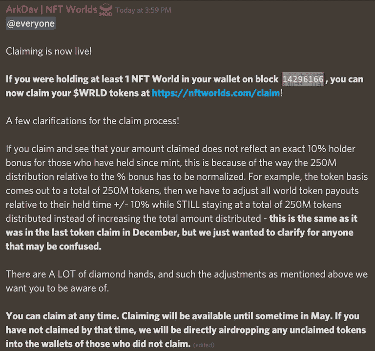
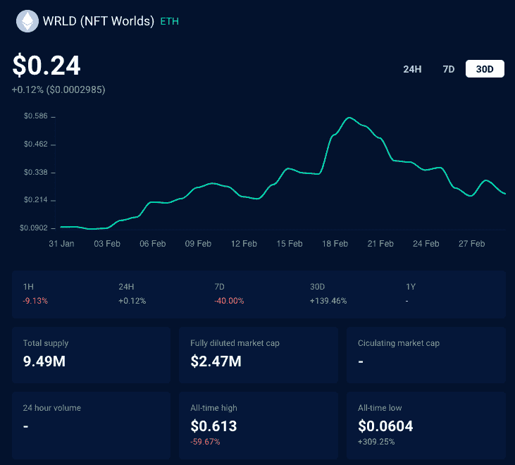

# NFT 持有者最后一次 WRLD 空投

> 原文：<https://web.archive.org/web/https://dappradar.com/blog/final-wrld-airdrop-for-nft-holders>

## NFT 世界 NFT 持有者的第二次也是最后一次空投今天开始

虚拟世界项目 NFT 世界为 NFT 土地所有者提供了第二次也是最后一次空投 WRLD 代币的机会。要获得空投资格，用户必须在 2022 年 2 月 28 日或之前在 block 14296166 的钱包中至少持有一个 NFT 世界。

Twitter 上的[官方公告通过一张不和谐的截图表示，符合条件的持有者可以在 5 月 22 日结束前的任何时间申领。此后，无人认领的代币将直接投入合格用户的钱包。](https://web.archive.org/web/20221230215950/https://twitter.com/nftworldsNFT/status/1498448665161076737)

## 如何认领 WRLD 空投

1.  如果您的钱包中至少有 1 枚 NFT 世界 NFT，您就可以申领 WRLD 代币。
2.  快照发生在 2022 年 2 月 28 日的[区块 14296166](https://web.archive.org/web/20221230215950/https://etherscan.io/block/14296166)
3.  进入官方声明页面:[https://www.nftworlds.com/claim](https://web.archive.org/web/20221230215950/https://www.nftworlds.com/claim)
4.  点击“继续认领”
5.  下一页将显示您将获得多少代币。按“认领 WRLD”
6.  Metamask 或另一个 Web3 wallet 将会弹出。确认交易。确保你有足够的钱来支付油费。
7.  等待几分钟，WRLD 将被转移到您的钱包
8.  确保你的钱包里有 WRLD。在元掩码中，转到“资产”，向下滚动并单击“导入令牌”
9.  单击“自定义令牌”
10.  添加 WRLD 令牌地址:0x D5 d 86 fc 8 D5 c 0 ea 1a C1 AC 5 dfab 6 e 529 c 9967 a45e 9
11.  按“添加自定义令牌”

尽管申请人 princess 与去年 12 月时一样，但该团队也概述了申请人可能不会获得持有人从铸造阶段获得的奖金的 10%。

**什么是 NFT 世锦赛**

NFT 世界将自己描述为一个分散的、可定制的、游戏赚钱的游戏生态系统，土地所有者可以在他们的虚拟世界中为他们的社区创造游戏体验。NFT 世界目前正在开发《我的世界》1.17 的开源版本。NFT 世界收藏包括 10，000 个独特的世界，从热带岛屿到森林地区，从沙漠到北极环境。

WRLD 是 NFT 世界生态系统的 ERC-20 公用事业令牌。玩家需要向 WRLD 的世界 NFT 持有者付费，以获得经验、物品、津贴、内容等。此外，世界所有者可以通过 WRLD 或雇佣经验证的世界建造者来获得角色或物品 NFT。

自 2021 年 12 月 30 日首次亮相以来， [WRLD 一直表现良好](https://web.archive.org/web/20221230215950/https://dappradar.com/hub/token/eth/WRLD?from=0xd5d86fc8d5c0ea1ac1ac5dfab6e529c9967a45e9)，似乎有许多手握钻石的投资者在 NFT 世界做多。2 月 19 日，尽管 BTC 和瑞士联邦理工学院在同一时间直线下跌，但该股票仍触及 0.61 美元的历史高点。

如果你有资格申请 WRLD 空投，也许你也可以申请我们的雷达令牌。看看[我们的代币页面](https://web.archive.org/web/20221230215950/https://dappradar.com/token)，连接你的钱包，看看你是否有资格获得雷达空投。下面你可以找到更多关于雷达令牌的信息。此外，达普拉达现在还主持 [WRLD 令牌空投](https://web.archive.org/web/20221230215950/https://dappradar.com/hub/airdrops)。

[<picture></picture>](https://web.archive.org/web/20221230215950/https://dappradar.com/token/airdrop)[<picture></picture>](https://web.archive.org/web/20221230215950/https://docs.dappradar.com/v/radar-token/radar-tokenomics )[<picture></picture>](https://web.archive.org/web/20221230215950/https://discord.gg/dappradar)

***以上不构成投资建议。此处提供的信息仅供参考。请尽职调查并进行研究。作者持有 ETH、BTC、AGIX、HEX、LINK、GRT、CRO、OMI、imberty X、GALA、AVASTR、GMEE、CUBE、RADAR、FLOW、FTM、BNB、SPS、WRLD、ATOM 和 ADA。***

 NewsletterUnsubscribe at any time. [T&Cs](https://web.archive.org/web/20221230215950/https://dappradar.com/terms) and [Privacy Policy](https://web.archive.org/web/20221230215950/https://dappradar.com/privacy-policy)