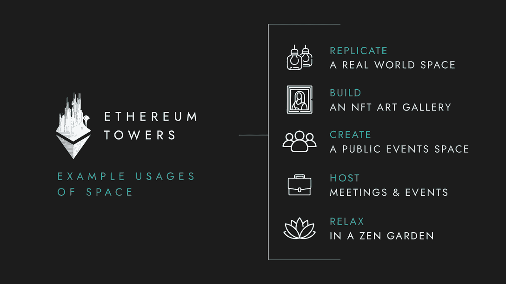

# 在以太坊塔中找到你梦想的虚拟家园

> 原文：<https://web.archive.org/web/https://dappradar.com/blog/find-your-dream-virtual-home-in-ethereum-towers>

## 以太坊塔邀请用户和他们一起建造虚拟的梦想家园

以太坊旨在为社区成员提供家庭般的虚拟体验。全球化的疫情极大地改变了人们的工作、生活和社交方式。因此，越来越多的人意识到，虚拟空间可以在现实和数字世界之间架起一座桥梁，有可能增强两者的体验。以太坊塔希望通过在塔内和塔周围创建一个半真实的环境来帮助恢复日常互动，以便在其中见面和社交。

元宇宙房地产投资者设想虚拟世界是人们可以生活、工作和相互交往的地方。当全球疫情影响日常互动时，远程工作以及与朋友和家人的互动变得更加容易接受和容易实现。它有助于人们的身体和心理健康，正因为如此，它产生了连锁效应，越来越多的人开始接受元宇宙在未来的社会中可以发挥越来越重要的作用。

以太坊塔是吸引加密社区注意力的元宇宙项目之一。该团队将社区置于项目的核心，旨在为用户创造一个鼓励和支持的环境。显然，该团队的愿景和使命引起了许多支持者的共鸣。他们的第一座塔楼已经满员，吸引了各种名人和秘密投资者。除此之外，开发团队还为用户分享了一些更具体和实用的用例，以可视化他们在以太坊塔中的生活，作为他们备受欢迎的白皮书的一部分。

**你可以在以太坊塔里做什么**

以太坊塔是以社区为中心建造的。该团队开发了一个定制引擎来实现这一愿景，使用户能够完全控制他们公寓的设计。有了这个软件，用户在建造和塑造他们的梦想家园时，就可以摆脱现实世界中的所有障碍。以下是一些如何使用以太坊公寓的例子。

**真实世界空间**

你可以选择设计、建造和布置一个类似你现实世界公寓的空间。如果你有你想重温的记忆，你可以布置虚拟公寓的内部来匹配你生活中的怀旧时期。你可以邀请你现实世界的朋友来参观，在那里闲逛，展示你的作品。这意味着地理差异将不再是见朋友的障碍，将有机会在这里一起放松，而不仅仅是通过 zoom 电话或在线游戏见面。

**美术馆**

居民们可以把他们的公寓作为一个艺术画廊来展示他们的 NFT 艺术收藏。你也可以设计、建造和装饰这个空间来反映你的风格和品味。此外，您可以邀请其他艺术家、艺术爱好者和潜在买家展示他们的作品，讨论艺术，分享灵感，所有这些都在一个沉浸式的环境中进行。你的画廊可以是虚拟版的白立方、高古轩和大卫·兹沃纳。

**公共活动空间**

社会互动一直是以太坊塔项目的重要元素。这些公寓旨在允许居民在其中策划和举办公共和私人活动。作为一名居民，你可以把你的公寓设计成一个公共娱乐场所，比如酒吧或音乐会场地。我们的目标是让用户有一个空间来参与社交和举办虚拟活动，他们可以免费提供或从中赚取收入。

**会议空间**

除了娱乐，更正式的场合也可以在这里举行。例如，业主可以建造一个会所来举行商务会议甚至研讨会。想象一下，在这里举行一次全球峰会，你可以邀请来自世界各地的人来讨论共同的目标。没有飞机，没有火车，没有酒店，它可能是见面和分享想法的理想选择，以环保的方式进行实时对话，而无需离开自己舒适的前屋。

**禅园**

以太坊塔等元宇宙项目可以提供身临其境的体验，帮助我们放松大脑。例如，巴塞尔艺术博览会公认的艺术家克里斯塔·金的冥想设计创造了一个冥想的世界，突出了虚拟现实如何从现实世界的压力和紧张中逃离。把你的以太坊塔变成一个禅宗花园可以为你提供一个属于你自己的冥想和放松的地方。

**关于以太坊塔**

以太坊塔是一个以社区为中心的垂直结构，由 4，388 个居民拥有的公寓和各种公共区域组成，位于元宇宙以太坊世界内。该项目将继续扩展，为所有用户提供一个不断发展的、令人兴奋的和社会动态的体验。Tower 2 第一期将于 3 月初推出，随后的几期也将陆续推出，你会在元宇宙最热门的房地产市场占据一个虚拟地址吗？

[网站](https://web.archive.org/web/20221206180518/https://ethereumtowers.com/)

[白皮书](https://web.archive.org/web/20221206180518/https://whitepaper.ethereumtowers.com/)

[不和](https://web.archive.org/web/20221206180518/https://discord.gg/ethereumtowers)

[Opensea](https://web.archive.org/web/20221206180518/https://opensea.io/collection/ethereum-towers)

**免责声明** —这是一篇赞助文章。DappRadar 不认可本页面上的任何内容或产品。DappRadar 旨在提供准确的信息，但读者应该在采取行动之前总是自己做研究。DappRadar 的文章不能被认为是投资建议。