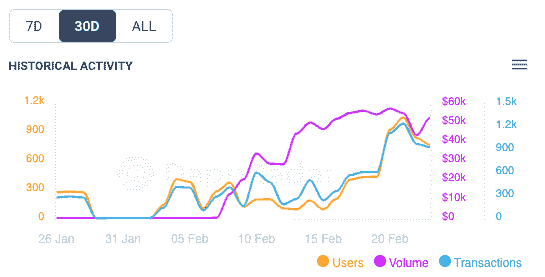
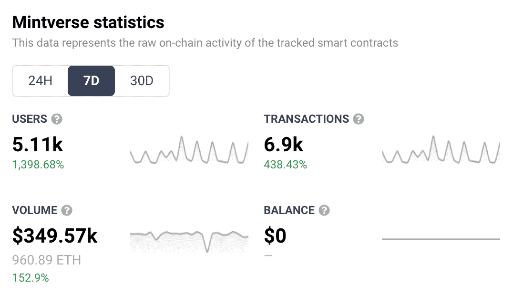

# 找到价格合适的 NFTs，Mintverse 获得了很大的吸引力

> 原文：<https://web.archive.org/web/https://dappradar.com/blog/finding-nfts-at-the-right-price-mintverse-gets-serious-traction>

## NFT 聚合器 Mintverse 将用户基数增加了 10 倍

多链 NFT 聚合器和市场[**mint verse**](https://web.archive.org/web/20230101214348/https://dappradar.com/multichain/marketplaces/mintverse)**正在以太坊和币安智能链上寻找牵引力，看到其用户群增加了十倍。在过去的一周里，独特的活动钱包数量增加了 1，398%，总数超过 5，000 个。**

NFT 空间继续增长。支撑新兴企业的是古老的交易艺术。这是人们试图卖出比他们买的更高的价格。因此，尽管有人在谈论未来的区块链和加密钱包，但该系统的基本机制还是一如既往。就像在现实生活中一样，金钱让这个世界运转。

人们需要一个地方来买卖这些 NFT。因此，市场如雨后春笋般涌现，以迎合新一代的精明商人和鲸鱼交易商。

Mintverse 是新出现的，它已经吸引了眼球和活跃用户，正如它在 DappRadar 排名中的出色表现所示。在 Mintverse [加入币安孵化项目](https://web.archive.org/web/20230101214348/https://twitter.com/BinanceChain/status/1485972580041433089)并独家推出糖果小猫 NFT 项目后，活跃钱包的增长随之而来。

## 快速浏览一下 Mintverse 最近的崛起

Mintverse 在 2021 年第四季度推出了测试版。从那以后，它一直稳步增长。但在过去几周内，该网站的排名才开始攀升。下图显示了自 2022 年初以来的活动，我们可以看到，交易量、用户和交易数量都在 2 月中旬开始攀升。那么，是什么导致了最近的飙升呢？

30 day Mintverse activity

Mintverse 最近的成功有几个原因。2 月 16 日，他们[在 Twitter 上宣布](https://web.archive.org/web/20230101214348/https://twitter.com/Mintverse_/status/1493920644832296962)Binopoly NFT 的交易员可以申请 6 个月的佣金回扣。他们也有各种 NFT 亲民党(个人资料图片)主要销售，可以从目前的 NFT 炒作饲料。

Mintverse 崛起的另一个因素是为币安智能链和以太坊推出了全栈 NFT 跟踪解决方案。这使得它可以索引更多的集合，这意味着用户可以在一个地方获得他们需要的所有信息。

对 Mintverse 来说，过去的一周尤其令人印象深刻。用户数量增长了 1，399%，交易量增长了 438%，交易量增长了 153%。在日益拥挤的市场中，这些数字是强劲的。OpenSea 一直保持着强劲而稳定的数字。[看起来过去一周房价在下跌。并且](https://web.archive.org/web/20230101214348/https://dappradar.com/ethereum/marketplaces/looksrare) [X2Y2](https://web.archive.org/web/20230101214348/https://dappradar.com/ethereum/marketplaces/x2y2) 在过去的 7 天里有了显著的增长([并且值得找出原因](https://web.archive.org/web/20230101214348/https://dappradar.com/blog/x2y2s-vampire-attack-on-opensea))。

7 day Mintverse analytics

现在我们知道了 Mintverse 在过去几周发生了什么，让我们来看看该产品及其当前提供的内容。

## 什么是 Mintverse？

Mintverse 是一个 NFT 聚合器和市场。在该平台中，用户可以:

*   交易和互换非功能性交易
*   进行市场调查
*   获得 NFT 独家优惠
*   列出他们自己的 NFT，可以单独列出，也可以作为一个集合列出

布局是为收藏者设计的，将 NFT 类型分组到集合中。用户可以交易各种各样的 NFT，从艺术到音乐，从体育到摄影。

## 它是如何工作的？

用户可以用他们的[元掩码](https://web.archive.org/web/20230101214348/https://dappradar.com/blog/what-is-metamask)或 [WalletConnect](https://web.archive.org/web/20230101214348/https://dappradar.com/blog/tag/walletconnect) 账户连接到平台。一旦你进去了，交易就简单了。点击进入收藏，查看当前价格并出价。许多卖家希望用包装好的衣服付款。所以这是需要计划的事情。你可以在以太坊上找到 ETH 或者 WETH [，但更重要的是](https://web.archive.org/web/20230101214348/https://dappradar.com/hub/token/eth/ETH)[也可以在 BSC](https://web.archive.org/web/20230101214348/https://dappradar.com/hub/token/eth/ETH) 上找到。

用户可以很容易地在市场上列出他们的项目。NFT 可以单独列出，也可以在集合中列出。UX 的设计秉承了简约的理念。任何人，从经验丰富的老兵到 00b，都可以遵循一步一步的过程，让他们的 NFT 上市。

## 它能为你做什么？

Mintverse 目前支持[币安](https://web.archive.org/web/20230101214348/https://dappradar.com/rankings/protocol/binance-smart-chain)和[以太坊](https://web.archive.org/web/20230101214348/https://dappradar.com/rankings/protocol/ethereum)区块链。最终，它计划扩展到其他第 2 层解决方案。第 2 层解决方案设计用于处理远离原始以太坊区块链的交易。目标是加快交易速度，降低汽油费用。

类似于许多分散的项目，Mintverse 提升了其社区的重要性。为此，该平台允许用户使用其平台众筹 NFT 项目。也有计划在不久的将来推出它自己的令牌——MINTS。

NFT 滴页面有公告为“独家 NFT 提供来自世界上最好的创作者”。对于任何寻找独特 NFT 产品的人来说，这些独家合作关系可能是值得关注的。