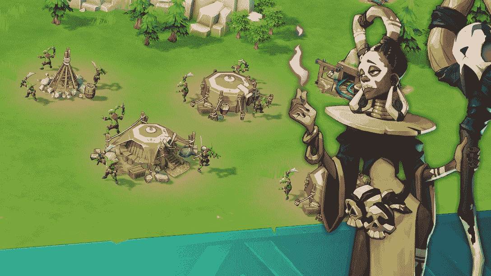

# 第一眼:联欢晚会游戏 RPG 永恒的悖论

> 原文：<https://web.archive.org/web/https://dappradar.com/blog/first-look-gala-games-rpg-eternal-paradox>

## 一个新的游戏赚取混合角色扮演游戏，以季节性战斗和史诗冒险为特色

《永恒的悖论》是一款混合 RPG 游戏，将于 2022 年底登陆盛大游戏。战斗、冒险和角色塑造，永恒悖论认为这样一个独特的组合会把玩家粘在他们的屏幕上。此外，游戏赚取机制将使所有玩家的时间都是值得的。

**总结**

*   永恒悖论是 4X 和回合制 RPG 格斗游戏的独特融合。
*   它将于 2022 年底作为 Gala Games 生态系统的一部分推出。
*   永恒悖论的特点是每日任务，PVP，排行榜，和玩赚。
*   游戏中有各种各样的 NFT，包括土地、英雄和城堡。

## **什么是永恒的悖论**

[永恒的悖论](https://web.archive.org/web/20220630224756/https://eternal-paradox.game/)是一款回合制 4X 角色扮演游戏，玩家可以组建并领导一支雇佣军队伍为奖励而战。永恒悖论由 [NDREAM](https://web.archive.org/web/20220630224756/https://www.ndream.com/game.html) 开发，这是一家韩国游戏工作室，拥有许多成功的游戏，如海洋&帝国、加勒比海盗、创世纪之战和交火战区。

解雇那些不熟悉游戏类型的人，4X 代表探索、扩张、开发和消灭，这是一种策略游戏，玩家可以广泛控制他们的操作。作为 4X 和 RPG 的混合体，《永恒悖论》在这种游戏类型中融入了角色扮演元素，为玩家带来扣人心弦的冒险。

## 如何掌握永恒悖论？

首先，《永恒悖论》让玩家走上史诗冒险之路，这是一款经典 4X 游戏的基础。此外，这里的角色塑造元素是精心设计的锦上添花，允许玩家揭开不同的故事情节。

在冒险过程中，玩家需要为未来的关键战斗训练他们的战士。但是在战斗之前，玩家需要运行日常任务，参与 PVP，在竞技场中比赛。更重要的是，这些活动将帮助玩家获得银牌积分，这是决定玩家排名的分数。更高的等级可能会带来更多的游戏内奖励，EPX 令牌。

我们之前提到的战斗将每九周发生一次，以控制毁灭之环。与电影*魔戒*中的那个类似，毁灭之环也拥有巨大的力量。“当光环停止旋转，世界将面临毁灭。”

所以季节之战是为了阻止永恒悖论的世界被诅咒之环毁灭。赢得擂台赛至关重要，因为击败所有对手自然会给胜利者带来 EPX 奖。

## NFT 在永恒悖论中是如何工作的？

NFT 代表永恒悖论中的各种游戏内资产，以促进生态系统。玩家可以拥有 NFT 土地并出租给其他玩家。土地 NFT 将会有 6 种稀有物品，每一种都有几块土地可以用来建造城堡。值得注意的是城堡也是 NFT。他们将在战斗准备中发挥关键作用。

游戏可以从四个基本的雇佣兵开始，玩家的游戏内战士，但英雄 NFTs 可能会在游戏性方面增加刺激。除了英雄和土地之外，开发者还计划了可以在城堡中使用的皮肤。

值得一提的是，游戏将保证所有类型的玩家的可玩性。那些免费玩的用户和 NFT 不那么罕见的玩家，只要他们玩得有策略，仍然可以有竞争力，他们将有机会击败竞争对手。

## 盛大游戏准备引领区块链博彩业

永恒悖论在 Gala Games 上的到来将有助于游戏工作室的进一步扩张。Gala Game 的游戏生态系统目前提供了广泛的游戏 dapps，从像 [Mirandus](https://web.archive.org/web/20220630224756/https://dappradar.com/ethereum/games/mirandus) 这样的 RPG 幻想到像蜘蛛坦克这样的 PVP 格斗家。

作为一个社区驱动的游戏工作室，Gala 也努力为其忠实的支持者赋权。例如，大混乱，节日游戏生态系统中最大的事件，整个月发放超过 400 万美元的奖金。

由于永恒悖论将于今年年底上线，玩家可能会在下一次 Mayhem 事件中从这款 4X RPG 游戏中赢得一些 [GALA](https://web.archive.org/web/20220630224756/https://dappradar.com/hub/token/eth/GALA?from=0x15d4c048f83bd7e37d49ea4c83a07267ec4203da) 。

DappRadar 将继续关注 Gala Games 和永恒悖论的最新动态。在 [Twitter](https://web.archive.org/web/20220630224756/https://twitter.com/dappradar) 、 [Discord](https://web.archive.org/web/20220630224756/https://discord.gg/4ybbssrHkm) 和 [Youtube](https://web.archive.org/web/20220630224756/https://www.youtube.com/c/DappRadar) 上关注我们，跟上区块链世界的动态。