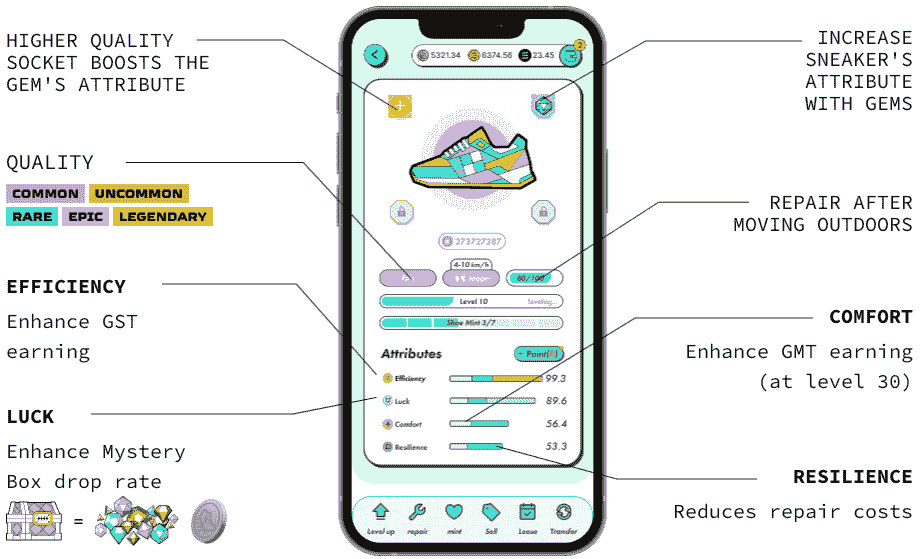
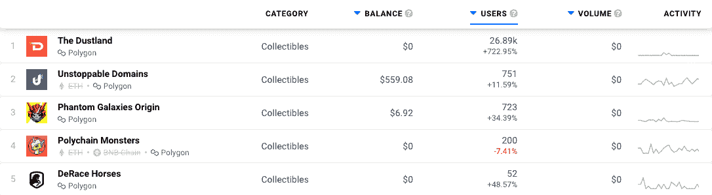

# 健身 Dapps 使用区块链让锻炼付费

> 原文：<https://web.archive.org/web/https://dappradar.com/blog/fitness-dapps-use-the-blockchain-to-make-exercise-pay>

## Move-to-earn 为元宇宙带来了锻炼和身体健康

移动挣钱 dapps 正在使用区块链技术来奖励在现实世界中保持健康的用户。 **过去一周，STEPN token 上涨了 25%。OliveX 健身元宇宙的一部分 Dustland 的用户数量同期增长了 723%。这些平台利用区块链技术为人们带来真正的好处。**

**总结**

*   ***Move-to-earn 奖励系统是拉近元宇宙和现实世界距离的又一举措。***
*   玩家因保持身体活动而获得奖励、代币和货币。
*   STEPN、OliveX 和 Genopets 只是在该领域进行创新并为区块链技术开辟新天地的三个平台。

慢跑在 20 世纪 60 年代开始在美国受到普遍关注。在过去十年左右的时间里，随着社交媒体应用的增长以及对保持活跃的重要性的更多理解，人们的注意力越来越多地转向健康和健身。休闲甚至是一种受人尊敬的时尚服装。

在这种背景下，区块链技术应用于健身房、慢跑和体育活动似乎只是时间问题。

Move-to-earn 是 Web3 奖励元宇宙人在现实生活中健康生活方式的第一步。移动赚取平台的用户可以通过古老的锻炼实践来赚取加密货币、NFT 和数字资产。

随着区块链健身运动的兴起，我们认识到了几个关键产品:STEPN、OliveX 和他们的 Dustlands platform 以及 Genopets。这些都带来了新的东西，并奖励用户在日常生活中的活跃。

## STEPN 设定速度

[STEPN](https://web.archive.org/web/20220925082221/https://dappradar.com/multichain/social/stepn) 是一个 move-to-earn 平台，奖励用户散步、慢跑、跑步以及一般燃烧现实生活能量的活动。它是建立在索拉纳区块链和 BNB 链兼容。它旨在通过提供离开办公桌到户外活动的奖励，推动数百万人走向更健康的生活方式。

用户需要下载 STPEN 应用程序，创建一个钱包，将一些溶胶转移到其中，并购买运动鞋 NFT。有一系列运动鞋可供选择，更稀有、更昂贵的运动鞋能提高球员的收入潜力。

How STEPN’s NFT Sneakers work

与一些将奖励机制作为整体游戏体验的一部分的移动赚取平台不同，STEPN 的最终目标是保持活跃。购买 NFT 可以让玩家做到这一点。他们也可以交易这些 NFT 并出租给其他人。

使用大多数锻炼应用程序，你可以简单地向你的朋友展示你跑了多远，也许还能赢得一些荣誉。有了 STEPN，你只需慢跑就能赚到真正的钱。

该平台基于双令牌机制，其中绿色 Satoshi 令牌(GST)充当游戏内货币，绿色元宇宙令牌(GMT)充当治理令牌。GMT 也被称为 STEPN。

在过去的 24 小时里，商品及服务税上涨了 12.7%，GMT 上涨了 22%。在过去 30 天的链上活动中，STEPN 是一个新条目，在 DappRadar 的 BNB 链社交 dapps 排名中排名第 8。在我们的[排名页面上，它排在所有索拉纳 dapp](https://web.archive.org/web/20220925082221/https://dappradar.com/rankings/protocol/solana/2)的第 37 位。

## OliveX 正在建立一个完整的移动赚取生态系统

OliveX 公司 37 岁的创始人兼首席执行官基思·鲁梅恩(Keith Rumjahn)说，“Move-to-earn 是一个游戏规则的改变者。有史以来第一次，玩家对他们的游戏拥有真正的数字所有权，游戏开发商赚得更多，因为没有中间人。所以这是双赢。

OliveX 已经是蓬勃发展的移动支付领域最大的参与者之一。2021 年 11 月，该公司筹集了 570 万美元，并用这笔资金开发了 Dustland Runner。

[https://web.archive.org/web/20220925082221if_/https://www.youtube.com/embed/rbyfCWLnWK4?feature=oembed](https://web.archive.org/web/20220925082221if_/https://www.youtube.com/embed/rbyfCWLnWK4?feature=oembed)

Dustland Runner trailer

接下来是尘地骑士和下注功能，玩家可以下注他们的[剂量](https://web.archive.org/web/20220925082221/https://dappradar.com/hub/token/eth/DOSE?from=0xb31ef9e52d94d4120eb44fe1ddfde5b4654a6515)代币并获得奖励。区块链以太坊的 DOSE 在过去 30 天里上涨了 68%。

总之，这些游戏构成了 Dustland 生态系统，过去一周，参与 dapp 的独特活动钱包数量增加了 723%。它目前位于 DappRadar 的多边形收藏品排名页面的顶端。

[The Dustland at the top of DappRadar’s Polygon dapps rankings page](https://web.archive.org/web/20220925082221/https://dappradar.com/rankings/protocol/polygon/category/collectibles)

OliveX 目前正在沙箱中构建一个虚拟健身世界。几年前，这种想法可能会遭到嘲笑。仇恨者仍然抵制元宇宙的想法，许多人认为这是昙花一现，永远不会取代物理世界。

OliveX 表明，有一种方法可以将现实生活中的活动与数字空间中的奖励结合起来。这也表明，网络世界并没有试图成为我们现实世界的新的、脱离现实的替代品。只要有一点创造力和创新，这两者就能和谐相处，成为一股向善的力量。

## Genopets 已经将移动赚取与传统游戏相结合

我们已经[在 DappRadar 上写了](https://web.archive.org/web/20220925082221/https://dappradar.com/blog/genopets-habitat-trading-surges-as-solana-minting-period-begins)关于成功的移动赚钱平台 Genopets。他们最近在铸造过程中推出了他们的栖息地 NFTs，随后在二级市场上的销售激增。

Genopets 建立在 Solana 区块链的基础上，结合了经典的 MMO 游戏和移动赚取系统，奖励人们外出活动。与 STEPN 类似，Genopets 有两个令牌:GENE，主要用于治理和赌注；还有 KI，也就是游戏内的货币。

[https://web.archive.org/web/20220925082221if_/https://www.youtube.com/embed/YtVwo2A4Ebc?feature=oembed](https://web.archive.org/web/20220925082221if_/https://www.youtube.com/embed/YtVwo2A4Ebc?feature=oembed)

Genopets trailer

Genopets 玩家提交他们的健康数据，作为良好表现的回报，他们的 Genopets 头像将会进化。有了更强大、更进化的基因宠物，玩家在游戏中的战斗和挑战中会表现得更好。

正是这种特殊的机制使得 Genopets 取得了成功。移动赚取奖励系统并不是在最后一分钟作为一个噱头附加上去的。一个游戏化身会随着它的积极训练和变强而进化，这是有道理的。所以玩家应该在现实生活中与他们的数字角色一起训练是有意义的。

你也可以通过关注我们的[博客](https://web.archive.org/web/20220925082221/https://dappradar.com/blog/)和我们的[推特](https://web.archive.org/web/20220925082221/https://twitter.com/DappRadar)页面来了解移动赚取的最新进展。在我们的[排名页面](https://web.archive.org/web/20220925082221/https://dappradar.com/rankings)查看社交网站和移动赚钱网站的排名。使用我们专门的 [NFTs](https://web.archive.org/web/20220925082221/https://dappradar.com/nft) 页面，看看 STEPN 和 Dustland 的资产是否在那里。