# 流量区块链生态系统:性能分析 2022

> 原文：<https://web.archive.org/web/https://dappradar.com/blog/flow-blockchain-ecosystem-performance-analysis-2022>

## 在 2022 年，Flow 将成为 NFT 交易的第三大区块链，仍然是有史以来交易的领导者。

**免责声明:本报告对交易计数的计算并不反映在区块链上执行的所有交易；它会考虑 DappRadar 在该特定网络上跟踪的来自 dapps 的所有事务。**

2022 年，[流量](https://web.archive.org/web/20230128214237/https://dappradar.com/rankings/protocol/flow)区块链使用量大幅增长，全年录得 9130 万笔交易。这比上一年增长了 105.52%，表明 Flow 的采用稳步增长。

此外，[博彩](https://web.archive.org/web/20230128214237/https://dappradar.com/rankings/protocol/flow/category/games)占整个连锁经营活动的 44.4%。使用 Flow 的技术已经开发了 30 多个游戏。从这些游戏中，[纸牌闪电战](https://web.archive.org/web/20230128214237/https://dappradar.com/flow/games/solitaire-blitz)和 [Trickshot 闪电战](https://web.archive.org/web/20230128214237/https://dappradar.com/flow/games/trickshot-blitz)脱颖而出，峰值分别为 44K 和 31.8K 每日唯一活跃钱包(dUAW)，并在两个 dapps 之间产生了 390 万笔交易。

2022 年，NFT 的 Flow 市场也值得关注，BloctoBay 超过了 T2 NBA Top Shot，成为 NFT 最主要的市场，占总交易量的 64.5%。Dapper Labs 以体育为导向的市场，如 [NFL All Day](https://web.archive.org/web/20230128214237/https://dappradar.com/flow/collectibles/nfl-all-day) 、 [UFC Strike](https://web.archive.org/web/20230128214237/https://www.ufcstrike.com/) 或 [LaLiga Golazos](https://web.archive.org/web/20230128214237/https://dappradar.com/flow/collectibles/laliga-golazos) 也能感受到他们的存在。

此外，还宣布了与 Ticketmaster、Mattel 和 Meta 的重要合作伙伴关系，同时 Flow 生态系统启动了一项 7.25 亿美元的基金，旨在为他们的平台和 Web3 带来进一步的创新和增长。该报告旨在分析 Flow 在 2022 年的表现，包括今年最相关的见解。

## 关键要点

*   区块链流量平均为 28，660 dUAW，比 2021 年增加了 4.62%；NFT 活动占总链上活动的 55%，而游戏活动占 44.4%。
*   2022 年的交易量比上一年大幅增长了 105.52%，共执行了 9130 万笔交易。
*   Solitaire Blitz 和 Trickshot Blitz 是 Flow 在 2022 年表现的重要贡献者，峰值为 44K 和 31.8K dUAW，并在两个 dapps 之间产生了 390 万笔交易。
*   2022 年，Flow 上的 NFT 交易量(6.34 亿美元)占当年 NFT 年度市场总量的 2.7%，Flow 成为 NFT 交易量第三大区块链，仅次于以太坊(83.9%的优势)和索拉纳(7.9%)。
*   Bloctobay 超过 NBA Top Shot 成为 Flow 上的顶级 NFT 市场，积累了 4.19 亿美元的交易量(Flow 2022 年 NFT 交易量的 64.5%)；NBA Top Shot 以 2.01 亿美元(29.5%)位居第二。
*   NBA 顶级投篮记录了 2022 年交易的 2.01 亿个‘时刻’；它已经成为 NFT 交易量第七大的收藏品。
*   Flow 与主要的体育联盟、Ticketmaster 和 Meta 合作，加速这些领先公司的基于 Web3 的计划。

## 内容

*   [2022 年流量活动概述](https://web.archive.org/web/20230128214237/https://dappradar.com/blog/flow-blockchain-ecosystem-performance-analysis-2022/#Chapter-1)
    *   [交易量上升:2022 年增长 105.52%](https://web.archive.org/web/20230128214237/https://dappradar.com/blog/flow-blockchain-ecosystem-performance-analysis-2022/#Chapter-1-2)
    *   [开发人员的采用率激增](https://web.archive.org/web/20230128214237/https://dappradar.com/blog/flow-blockchain-ecosystem-performance-analysis-2022/#Chapter-1-3)
*   [2022 年，单人纸牌游戏和 Trickshot 闪电战的顶级玩家](https://web.archive.org/web/20230128214237/https://dappradar.com/blog/flow-blockchain-ecosystem-performance-analysis-2022/#Chapter-2)
*   [流量协议 NFTs:尽管面临市场挑战，仍具有弹性](https://web.archive.org/web/20230128214237/https://dappradar.com/blog/flow-blockchain-ecosystem-performance-analysis-2022/#Chapter-3)
    *   [BloctoBay 和 NBA Top Shot:NFT 顶级市场流量](https://web.archive.org/web/20230128214237/https://dappradar.com/blog/flow-blockchain-ecosystem-performance-analysis-2022/#Chapter-3-1)
    *   [NFTs 在体育界的崛起](https://web.archive.org/web/20230128214237/https://dappradar.com/blog/flow-blockchain-ecosystem-performance-analysis-2022/#Chapter-3-2)
*   [增量融资:为流量区块链的赤字增长提供动力](https://web.archive.org/web/20230128214237/https://dappradar.com/blog/flow-blockchain-ecosystem-performance-analysis-2022/#Chapter-4)
*   [娱乐领域的 NFTs:与 Ticketmaster 和 Meta 的合作](https://web.archive.org/web/20230128214237/https://dappradar.com/blog/flow-blockchain-ecosystem-performance-analysis-2022/#Chapter-5)
*   [Flow 的 7.25 亿美元生态系统基金旨在加速区块链的采用](https://web.archive.org/web/20230128214237/https://dappradar.com/blog/flow-blockchain-ecosystem-performance-analysis-2022/#Chapter-6)
*   [结论](https://web.archive.org/web/20230128214237/https://dappradar.com/blog/flow-blockchain-ecosystem-performance-analysis-2022/#Chapter-6)

## 2022 年流动活动概述

Flow protocol 在 2022 年全年开展了各种活动，平均每天有 28，669 个独立活动钱包，比 2021 年的 27，402 个平均 dUAW 增长了 4.62%。

在查看年度绩效时，我们可以观察到，自 2022 年 2 月以来，流量协议的活动一直呈下降趋势，在 6 月达到最低点，平均为 8，784 dUAW。然而，从 7 月份开始，Flow protocol 的活动出现了上升，这要归功于游戏 dapps 的推出，如[纸牌闪电战](https://web.archive.org/web/20230128214237/https://dappradar.com/flow/games/solitaire-blitz)和[特技闪电战](https://web.archive.org/web/20230128214237/https://dappradar.com/flow/games/trickshot-blitz)，在 9 月份达到了最高点，平均 51，820 dUAW。随后，随着行业趋势，网络上的活动呈下降趋势，到 2022 年 12 月，平均 dUAW 记录达到 19，733。

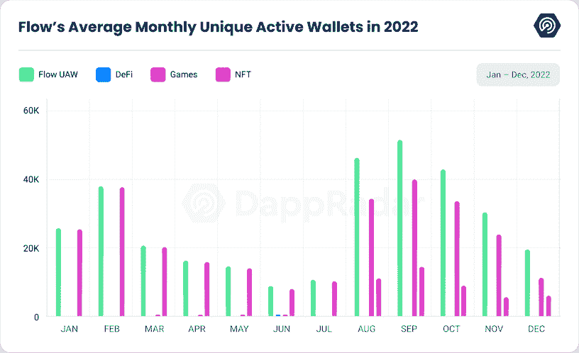

值得注意的是，在 2022 年上半年，NFT 活动在流量上相当高，而在下半年，游戏成为协议上的主导活动。总体来看，在活动中的主导地位，我们可以看到 [NFT 活动](https://web.archive.org/web/20230128214237/https://dappradar.com/nft/protocol/flow)占总活动的 55%，[游戏活动](https://web.archive.org/web/20230128214237/https://dappradar.com/rankings/protocol/flow/category/games)占 44.4%，DeFi 活动仅占 0.6%。

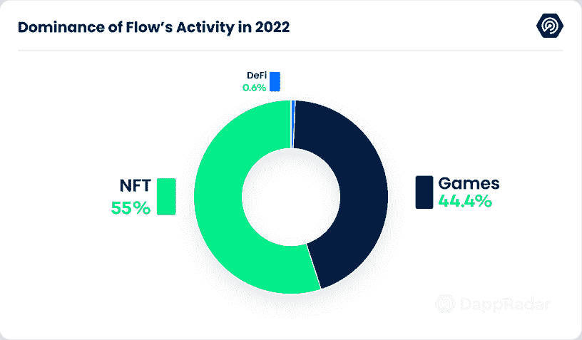

总体而言，尽管活动有一些波动，但 Flow protocol 的用户群略有增长，这为未来树立了积极的前景。

## 交易量上升:2022 年增长 105.52%

在 2022 年全年，流量协议的交易数量显著增加。共记录了 9，130 万笔交易，比 2021 年的 4，440 万笔增加了 105.52%。这表明流量协议的使用在全年中稳步增长。**(已读免责声明)**

当逐季分析数据时，可以观察到，在 2022 年的 Q1，记录的交易数量为 1970 万笔，比 2021 年同期增长了 77.93%。在 2022 年的 Q2，记录的交易数量为 1070 万笔，与 2021 年的 Q2 相比下降了 24.72%。与 2021 年同期相比，这是我们观察到的唯一一个下降的季度。

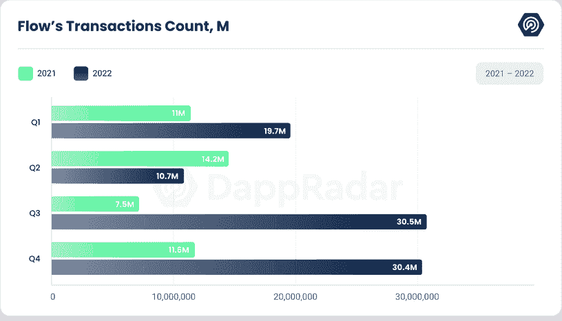

然而，在 2022 年第三季度，记录的交易数量为 30，499，869 笔，较 2021 年第三季度大幅增长 306.40%。最后，在 2022 年第四季度，记录的交易数量为 30，392，418 笔，与 2021 年第四季度相比增长了 161.44%。

## 开发人员的采用率激增

根据 [Flow 的年度市政厅](https://web.archive.org/web/20230128214237/https://flow.com/post/flow-blockchain-news-update-town-hall-data-stats-cadence-node-operation#:~:text=Developer%20Growth%20%26%20Productivity)，Flow 在 2022 年经历了令人印象深刻的开发者活动增长，有 7000 名新开发者将合同部署到 testnet。这代表了 250%的年同比增长，并凸显了开发人员社区中 Flow 的日益普及和采用。除此之外，Flow 客户端库下载 63 万次，较上年大幅增长。

在 mainnet 上，Flow developers 部署了总共 2，430 个合同，这是该社区在 6 月 22 日启动时的生产力和成功的证明。FCL 发现工具自推出以来也一直很受欢迎，每月平均有 128 000 次请求。

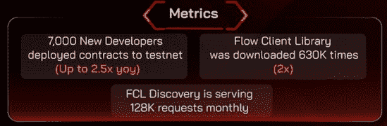

Source: [Twitter](https://web.archive.org/web/20230128214237/https://twitter.com/flow_insider/status/1603836004158562304?s=20&t=UWNQKYzf_bQk2ASGi5tbqQ)

为了支持和鼓励对开源生态系统的新想法和贡献的开发，Flow 在 2022 年引入了开发者补助金。共收到 90 份赠款提案，其中 35 份被接受，69 份赠款里程碑获得批准。这导致向受赠方分发了价值 677 000 美元的流量令牌。

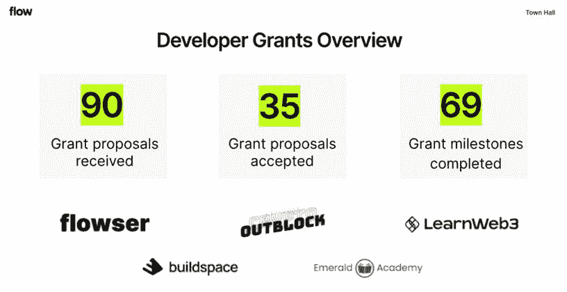

Source: [Flow yearly Town Hall 2022](https://web.archive.org/web/20230128214237/https://flow.com/post/flow-blockchain-news-update-town-hall-data-stats-cadence-node-operation)

这些资助支持了一系列项目和计划，包括 Flowser CLI 集成和 Outblock 的 iOS 和 Android SDKs 等工具和服务，以及 Buildspace、LearnWeb3 和 Emerald Academy 等教育计划，这些计划已经开办了训练营、课程并提供了链上证书。

## 2022 年，单人纸牌游戏和特技镜头闪电战顶级玩家

2022 年，Flow protocol 见证了区块链游戏领域的重大活动，几款游戏成为行业领导者。目前，有超过 30 款[游戏](https://web.archive.org/web/20230128214237/https://dappradar.com/rankings/protocol/flow/category/games)基于 Flow 技术，游戏活动占连锁活动的 44.4%。

2022 年最受欢迎的基于流量的游戏之一是由 Joyride Games Inc .开发的一款打牌手机游戏 [Solitaire Blitz](https://web.archive.org/web/20230128214237/https://dappradar.com/flow/games/solitaire-blitz) ，该游戏允许玩家参与 PvP 锦标赛、每周挑战和联赛，并赢得 RLY 代币。自推出以来，Solitaire Blitz 获得了巨大的人气，8 月份每天有超过 44，000 个独特的活动钱包和 400 万笔交易。然而，自那以来，其活动似乎一直呈下降趋势，12 月份的交易量为 5.2K dUAW 和 230 万。

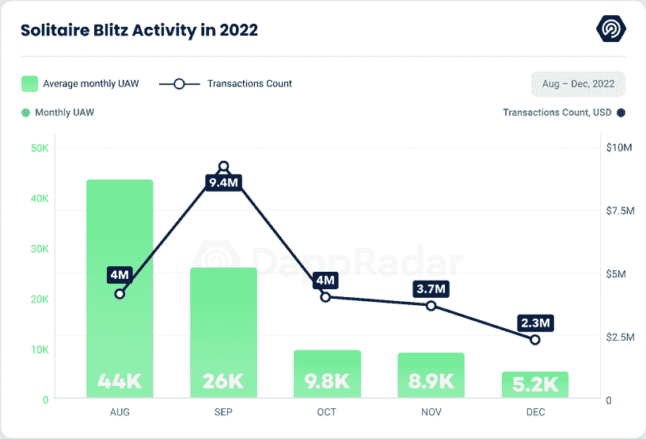

另一个基于流量的游戏领域的杰出游戏是 [Trickshot Blitz](https://web.archive.org/web/20230128214237/https://dappradar.com/flow/games/trickshot-blitz) ，这是一款经典的 8 球池手机游戏，具有区块链集成功能，也是由 Joyride Games 开发的。这款游戏于 2022 年 8 月 15 日推出，面向移动设备，允许玩家通过配对比赛进行竞争，同时通过赢得比赛获得 RLY 奖励。在头两周，该游戏的 dUAW 超过 31.8K，交易量为 370 万，活动和销售数量从 10 月开始呈下降趋势，游戏以 5.8K dUAW 和 160 万交易量结束了这一年。

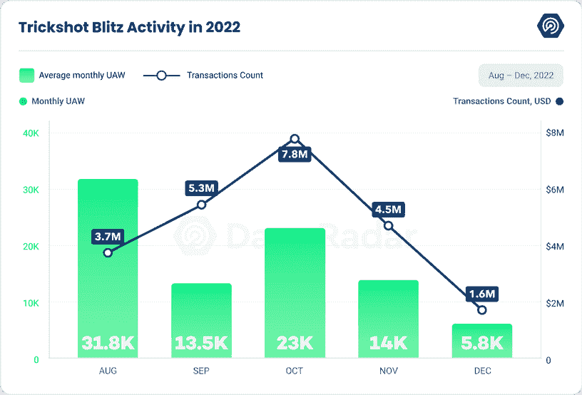

如上所述，这两款游戏都使用了 ERC-20 实用令牌 RLY，这是 Rally 的原生令牌，一种允许创作者推出令牌并建立数字经济的协议。通过使用这种现有的代币作为游戏中的货币，游戏可以从 RLY 社区中受益，因为它已经在多个平台上进行交易。玩家可以通过参加配对锦标赛来赢得 RLY 代币，这些代币可以存储在 Joyride 钱包中，并使用 Metamask 钱包进行存款。

## 流量协议 NFTs:尽管面临市场挑战，仍有弹性

2022 年，NFT 流动市场经历了交易量和销售数量的大幅波动。今年第一季度的 NFTs 尤其强劲，2 月份的交易量最高，达到 1.95 亿美元，销售额为 210 万美元。

然而，Q1 之后，NFT 市场开始走下坡路。到 6 月份，交易量和销售数量达到了 2022 年上半年的最低点，交易量为 1079 万美元，销售数量为 503，694。

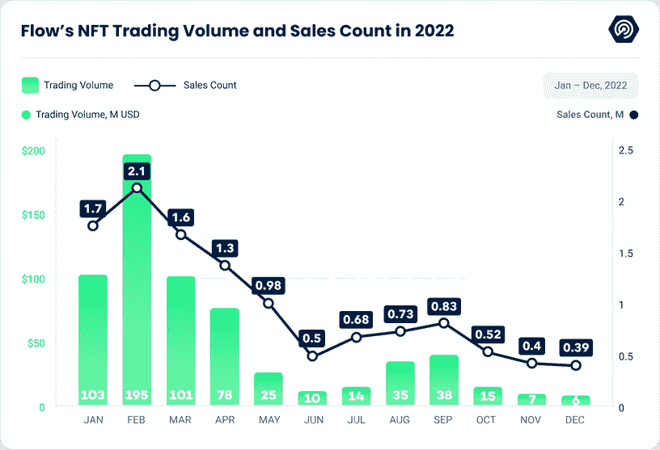

尽管如此，NFT 市场似乎在下半年反弹。9 月，交易量达到 2022 年下半年的最高点，为 3893 万美元，售出 835，346 份 NFT。9 月份之后，市场似乎经历了另一次低迷，以 677 万美元的交易量和 394，299 的销售计数结束了这一年。

总体而言，2022 年 Flow 上的交易额为 6.34 亿美元，比 2021 年的 8.12 亿美元下降了 21.95%。尽管有所下降，但值得注意的是，2022 年流量令牌价格下降了 92%以上，使得交易量结果更加令人印象深刻。

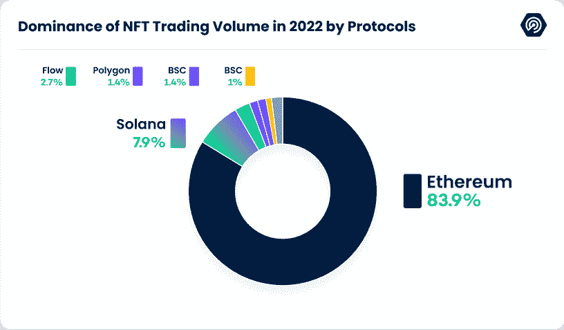

此外，2022 年 Flow 的交易量占当年 NFT 总交易量的 2.7%。这将 Flow 排在第三位，位于以太坊(Ethereum)和索拉纳(Solana)之后，以太坊占 83.9%的主导地位(196 亿美元)，索拉纳占 7.9%(15.7 亿美元)。

## BloctoBay 和 NBA Top Shot:流量上的顶级 NFT 市场

在 2022 年，流量上最具主导地位的 NFT 市场之一是[bloc to](https://web.archive.org/web/20230128214237/https://dappradar.com/flow/marketplaces/bloctobay)[B](https://web.archive.org/web/20230128214237/https://dappradar.com/flow/marketplaces/bloctobay)[ay](https://web.archive.org/web/20230128214237/https://dappradar.com/flow/marketplaces/bloctobay)，交易量超过 4.19 亿美元。这个专注于 NFT 收藏品和虚拟土地的市场在全年的人气和活跃度上都有显著增长，占 Flow 上 NFT 总交易量的 64.5%。

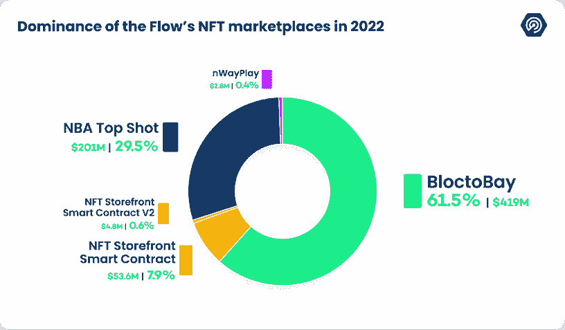

Flow NFT 市场中另一个值得注意的玩家是 [NBA Top Shot](https://web.archive.org/web/20230128214237/https://dappradar.com/flow/collectibles/nba-topshot) ，它在 2022 年的交易额超过 2.01 亿美元，占 Flow 总交易额的 29.5%。这个市场允许用户以 NFTs 的形式购买和交易官方授权的 NBA 收藏品，今年人气和活动激增，特别是随着几款备受追捧的 drops 的发布。

值得注意的是，NBA Top Shot 不仅是一个市场，也是一个游戏，球迷们可以在这里竞争和收集限量版、系列化的数字收藏品，这些收藏品以他们最喜爱的球员和时刻为特色。此外，该平台与现实世界的篮球有着密切的联系，因为球员、球队和联盟也参与其中。NBA Top Shot 创造了一种稀缺、真实和独特的感觉，同时也深入挖掘了粉丝群体。

NFT 商店的合同来自 V1 和 V2，这两家公司今年分别赚了 5840 万英镑和 8.5%的市场份额。 [NFT 商店合同表](https://web.archive.org/web/20230128214237/https://developers.flow.com/flow/core-contracts/nft-storefront)允许在区块链上创建一个 NFT 市场，使卖家在特定市场列出非功能性商店变得简单。

最后，还有 [nWayPlay](https://web.archive.org/web/20230128214237/https://dappradar.com/flow/marketplaces/nwayplay) 市场，该市场在 2022 年的交易量为 280 万美元，代表着 NFT 游戏领域的一个小而稳定的活动。这个市场专门从事 NFT 收藏品和游戏平台的项目。

## NFTs 在体育界的崛起

体育行业已经成为 Web3 的主要采用者之一。从大联盟的大型合作伙伴关系到数字收藏品、粉丝代币，甚至是梦幻游戏，体育的足迹在区块链产业中不断攀升——流量是更大的催化剂之一。

2021 年 1 月，有人可能会说，NBA 最佳射手启动了 NFTs 的巨大发展。随着同样的趋势，去年更多的体育收藏品来到了 Flow。2022 年，总部位于温哥华的区块链推出了另外三个与顶级体育联盟合作的市场，以补充 NBA dapp。

于 2022 年 8 月 18 日推出的 NFL All Day 已经取得了特别令人印象深刻的数字。2022 年，该系列的交易量为 3610 万美元，销售额为 120 万美元。该集合允许足球迷收集和交易不可替代的代币(NFT)，称为“时刻”，捕捉精彩传球、达阵和其他比赛的精彩片段。

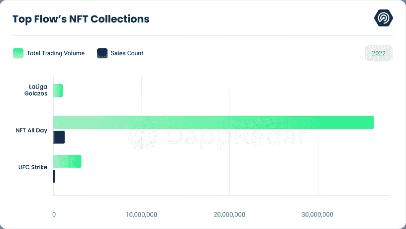

UFC Strike 是 NFT 在 Flow 上的另一个系列，于 2022 年 1 月 23 日推出，2022 年的交易量为 356 万美元，销售额为 197，785 美元。该系列由 Dapper Labs 与 UFC 合作创建，为粉丝提供了拥有体育格斗联盟历史上最具标志性时刻的机会。每个 UFC 罢工时刻 NFT 捕捉 UFC 历史的具体实例，具有强大的音频和视频内容。

LaLiga Golazos 于 10 月 27 日推出，交易量为 105 万美元，销售额为 9312 笔。该系列允许球迷收集捕捉 LaLiga Santander 及其球员亮点的时刻，包括 2005-2006 赛季以来所有俱乐部的标志性比赛，以及当前赛季每个比赛日的关键比赛。LaLiga Golazos 以西班牙语和英语两种语言让粉丝更接近他们热爱的运动。

所有这些收藏都证明了体育 NFT 越来越受欢迎，它是球迷与他们最喜爱的球队和时刻联系的一种方式。区块链技术的使用以及在点对点市场上购买、销售或交易这些数字收藏品的能力为体育纪念品的世界增添了一个全新的维度。

## 增量金融:为流动区块链的赤字增长提供动力

自 2022 年 7 月推出 Increment Finance 以来，Flow 的分散式金融(DeFi)总价值锁定(TVL)一直稳步增长，Increment Finance 是唯一一个将 TVL 锁定在 Flow 上的 DeFi dapp。根据提供的数据，在 2022 年 12 月 31 日，Flow 的 TVL 达到了 484 万美元，比启动日增长了 85.23%。

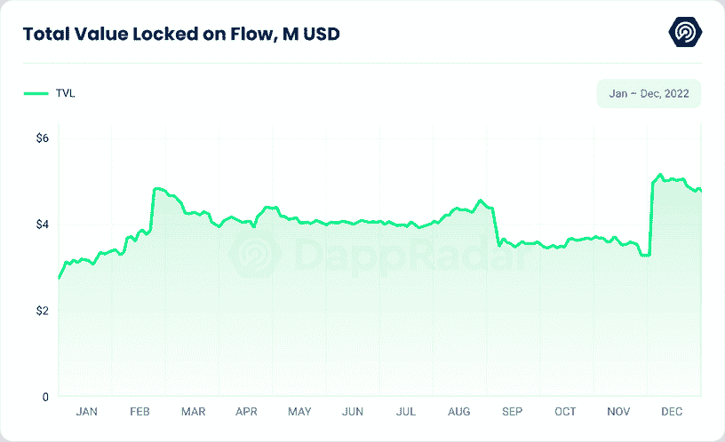

Increment Finance 是一个领先的 DeFi Flow 平台，专注于构建 DeFi 基础设施，以提高链上交易量和流动性。核心团队由区块链资深人士组成，他们自 2018 年以来一直在该行业发展，在智能合约开发、DeFi、oracles 和安全方面拥有丰富的经验。

Increment Finance 提供一系列 DeFi 服务，包括无需许可的自动做市商(AMM)掉期、分散式货币市场和非托管流动性赌注。这些服务允许用户在流量区块链上访问广泛的 DeFi 产品和服务，增加了网络的整体流动性和功能性。

此外，2023 年 1 月 5 日，Increment Finance [宣布](https://web.archive.org/web/20230128214237/https://mobile.twitter.com/IncrementFi/status/1611012231201947648)他们的 Liquid Staking 协议的安全审计已经完成，没有发现重大漏洞，所有问题都已修复。这凸显了该平台致力于确保 DeFi 服务的安全性和完整性，进一步增加用户对其产品和服务的信任。

## 娱乐领域的 NFTs:与 Ticketmaster 和 Meta 的合作

2022 年，Flow protocol 与娱乐行业的两家主要公司建立了重要的合作伙伴关系:Ticketmaster 和 Meta。

领先的票务销售和活动管理公司 Ticketmaster 于 2022 年 8 月 31 日宣布与 Flow 合作，探索在票务行业使用 NFTs。通过这种合作关系，Ticketmaster 旨在利用区块链流量的安全性和可扩展性来创建独特的、经过认证的活动数字门票，从而为粉丝创造专属体验并防止门票欺诈。

同样，科技巨头 Meta Platforms 在 8 月 5 日宣布了其平台 Instagram 上的数字收藏品的国际扩张。作为此次扩展的一部分，Meta 宣布支持在区块链流上创建的 NFTs，允许在其平台上创建唯一且可验证的数字资产。与 Flow 的这种合作关系使 Meta 能够为 NFT 的创建和交易提供一个安全透明的平台，同时也提高了链上交易量和流动性。

与 Ticketmaster 和 Meta 的合作表明，娱乐行业对流量协议的兴趣和采用程度在不断增长。流量区块链的安全性和可扩展性使其成为创建和管理独特且可验证的数字资产(如门票和收藏品)的合适选择，同时也有助于为粉丝创建专属体验并防止欺诈。这些合作伙伴关系也为 Flow protocol 在其他行业中的潜在用例树立了积极的前景。

## Flow 的 7.25 亿美元生态系统基金旨在加速区块链的采用

2022 年 5 月 10 日，Flow protocol [宣布](https://web.archive.org/web/20230128214237/https://www.dapperlabs.com/newsroom/flow-launches-725-million-ecosystem-fund-to-drive-innovation-across-the-flow-ecosystem)推出其生态系统基金，这是一个 7.25 亿美元的基金，旨在支持 Flow 社区的增长和发展。该基金是对任何区块链生态系统做出的最大联合承诺，旨在促进流量社区的创新和增长。

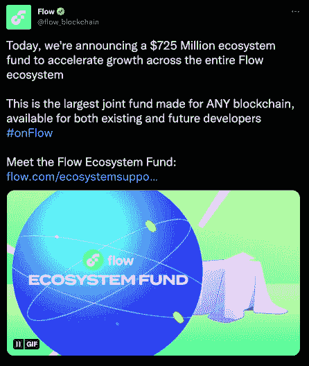

Source: [Twitter](https://web.archive.org/web/20230128214237/https://twitter.com/flow_blockchain/status/1524032944439844864?ref_src=twsrc%5Etfw%7Ctwcamp%5Etweetembed%7Ctwterm%5E1524032944439844864%7Ctwgr%5Ed830a1b98e067b6e7430a05d319dbf305be3a34b%7Ctwcon%5Es1_&ref_url=https%3A%2F%2Fboardroom.tv%2Fdapper-labs-fundraise-flow-blockchain%2F)

该基金将为现有和未来的开发者提供在 Flow 区块链上构建应用的支持，包括来自行业领先公司的参与，如 a16z、AppWorks、Cadenza Ventures、Coatue、Coinfund、数字货币集团(DCG)、Dispersion Capital、Fabric Ventures、Greenfield One、HashKey、L1 数字、米拉娜风险投资、OP Crypto、SkyVision Capital、Spartan Group、Union Square Ventures 和 Dapper Ventures。

生态系统基金的重点是为全球开发者创造更加分散和公平的 Web3 机会，特别强调游戏、基础设施、分散金融、内容和创作者。该基金提供的资源将被开发者用于产品开发、产品扩展、团队扩展、用户获取和一般运营支出。

除了资金支持，Flow 生态系统中的开发者将能够通过信息活动、办公时间、加速器和孵化器、补贴办公空间以及类似的举措来利用专业知识。例如，投资者将在柏林(绿地一号)和亚洲(AppWorks 加速器项目)等城市为 Flow 团队提供办公场所，自由城风险投资公司将为大学生提供两项奖学金，用于从事与 Flow 相关的项目。作为 Bybit 和 BitDAO 的风险合作伙伴，米拉娜风险投资也将有助于促进 Flow 项目的战略合作机会。

2022 年，总共有超过 40 个团队获得了 Flow 生态系统基金合作伙伴的资助。

## 结论

尽管市场环境充满挑战，但 Flow 在 2022 年表现强劲。记录的交易超过 9100 万笔，比上一年增长了 105.52%，很明显，该协议的使用持续增长。

Flow protocol 在 NFT 领域也表现稳定，交易量超过 7.78 亿美元，占当年 NFT 交易总量的 2.7%，位居以太坊和 Solana 之后的第三位。

此外，与娱乐行业主要公司(如 Ticketmaster 和 Meta)的合作进一步证明了 Flow 协议的潜力及其为创建和管理独特且可验证的数字资产提供安全透明平台的能力。

总的来说，随着它继续构建和扩展它的用例，Flow 已经被证明是一个有前途的弹性协议。