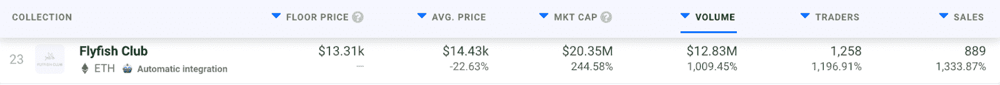
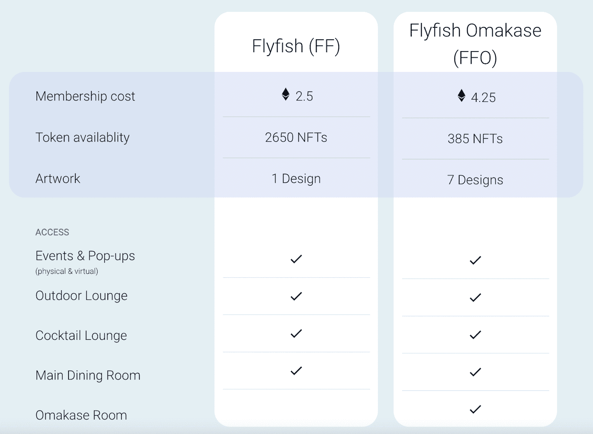

# 加里·维的 Flyfish NFTs 准许享用美食

> 原文：<https://web.archive.org/web/https://dappradar.com/blog/flyfish-nfts-by-gary-vee-grant-access-to-fine-dining>

## 在过去的 7 天里，NFT 收藏吸引了超过 1196%的交易者

加里·维是 NFT 空间中最受欢迎的名字之一，他最近推出的飞鱼 NFT 系列似乎受益于他的名气。Flyfish NFTs 旨在提供独家用餐体验，在过去七天里吸引了 1196%的交易者，交易量超过 1200 万美元。

飞鱼俱乐部是 3035 张 NFT 通行证的集合，每张通行证代表在即将开业的飞鱼俱乐部餐厅享受高级餐饮体验的独家权利。这个场地将位于纽约，由一个精致的专业团队创建，并由 Gary Vee 亲自领导。飞鱼俱乐部还承诺提供非凡的美食体验，结合 NFT 会员的独有性。

在过去的七天里，Flyfish NFTs 吸引了 1258 名交易者和 889 笔交易。令人印象深刻的是，这些 NFT 的平均价格为 14.430 美元，仅在过去一周，交易量就达到了 1283 万美元。

值得注意的是，该集合于去年 12 月中旬推出，但直到现在才在加密社区中获得关注。

## 你从 Flyfish NFTs 得到了什么？

飞鱼 NFT 分为两类——传统飞鱼和飞鱼 Omakase。传统的 Flyfish 通行证允许访问所有即将到来的虚拟和物理聚会和弹出窗口。此外，飞鱼会员可以享受餐厅的鸡尾酒室，以及主餐厅。

重要的是，只有 385 台限量版 Omakase NFTs。他们允许进入飞鱼俱乐部内部的独家会员 Omakase 餐厅。此外，Omakase NFTs 有七种不同的艺术设计，不像经典的 Flyfish 会员资格，所有 2650 个代币只有一种设计。

## 实用为王

Gary Vee 在加密领域是个响当当的名字，这不仅仅是因为他最近在 NFT 与 Flyfish Club 的合作。几个月来，他的 VeeFriends 系列一直是 DappRadar 顶级 NFT 系列排名中的票房冠军。

令人印象深刻的是，Gary Vee 积极致力于提供与体验相关的 NFT。有了 Flyfish Club，NFTs 就能让您享受独一无二的美食体验。通过 VeeFriends，NFT 授予 Gary Vee 本人访问权限。从这个意义上说，他正在 NFT 领域开创一股新的实用潮流。然而，拥有一辆 VeeFriends NFT 不会给飞鱼俱乐部带来任何好处。

实用性是决定 NFT 系列成功的关键因素之一。随着空间的不断发展，光有炫酷的设计和头像已经不够了。NFT 收藏家现在希望加入志趣相投的个人社区，并从独家获得产品或体验中受益。

加里·维带来的是新一波的实用性和独特性，这将彻底改变 NFT 的空间。除了是一个狂热的 NFT 收藏家，加里·维也在探索空间的边界。

DappRadar 将继续监测 Gary Vee 和 Flyfish NFTs，因为这些收藏越来越引人注目。如果你想获得最新的 NFT 销售数据，请查看 [DappRadar PRO](https://web.archive.org/web/20221206113759/https://dappradar.com/token/pro) 。使用 PRO，您可以浏览最近 15 分钟的链上数据。此外，你还可以进入独家 [Discord](https://web.archive.org/web/20221206113759/https://discord.gg/4ybbssrHkm) 频道和讨论。

 NewsletterUnsubscribe at any time. [T&Cs](https://web.archive.org/web/20221206113759/https://dappradar.com/terms) and [Privacy Policy](https://web.archive.org/web/20221206113759/https://dappradar.com/privacy-policy)