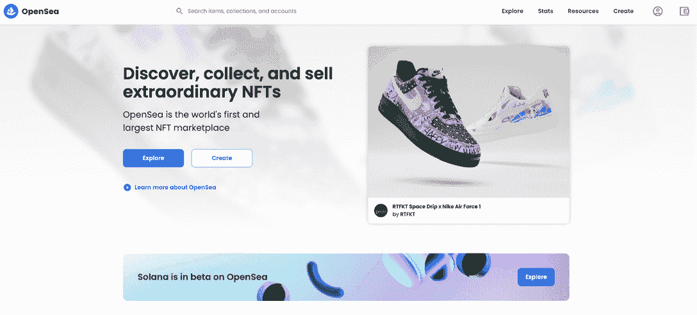

# 前 OpenSea 员工因内幕交易案被捕

> 原文：<https://web.archive.org/web/https://dappradar.com/blog/former-opensea-employee-hit-with-insider-trading-case>

## 内特·查斯蒂安的案子可能是一个分水岭

广受欢迎的[以太坊 NFT 市场](https://web.archive.org/web/20221004002929/https://dappradar.com/nft/protocol/ethereum)OpenSea，正面临一名前团队成员涉嫌内幕交易的问题。

[在 OpenSea 查看最热门的 NFTs】](https://web.archive.org/web/20221004002929/https://dappradar.com/ethereum/marketplaces/opensea)

31 岁的内特·查斯蒂安现在可能面临长达 40 年的监禁，因为监管机构将矛头指向了密码行业。

据称，Nate Chastian 作为产品经理很早就知道哪些 [NFT 系列](https://web.archive.org/web/20221004002929/https://dappradar.com/nft/sales/protocol/ethereum)会出现在主页上。

## OpenSea 正在采取行动

Chastian 因在主页上市前购买上述 NFT 并迅速套现获利而面临指控。

所谓的内幕交易最早[于 2021 年 9 月](https://web.archive.org/web/20221004002929/https://www.reuters.com/technology/opensea-employee-charged-with-insider-trading-nfts-2022-06-01/)曝光，当时这家初创公司对员工利用特权信息投资非专利交易几乎没有限制。

OpenSea 现在正在采取行动，禁止团队成员从收藏或创作者那里进行买卖。该禁令适用于公司宣传或促销期间。

除了后者，OpenSea 还禁止员工使用机密信息购买或出售任何 NFT。这项措施包括所有的非功能性测试，无论平台上是否提供。

由于事故和潜在的不良因素，我们可以预计该行业将出台更多的法规。

## 更多监管

直到今天，还不清楚检察官是否可以起诉与 NFTs 进行内幕交易的坏人。这个案例揭示了整个加密领域的情况有多糟糕，因为 NFT 仍然是一个巨大的灰色区域，不被视为证券。

## 更加清晰

尽管区块链提供了最透明和最有用的交易记录，但数字资产的法律清晰度仍然缺失。然而，到目前为止，监管机构很少关注。

## 曝光坏演员

当公牛在外面奔跑，每个人都在微笑的时候，很少有人谈论规则或变化。直到围绕着[稳定](/web/20221004002929/https://dappradar.com/blog/these-are-the-best-stablecoins-you-can-trust/)和 [UST 的问题严重震撼了这个行业](/web/20221004002929/https://dappradar.com/blog/these-are-the-best-stablecoins-you-can-trust/)。

宏观经济事件证实了熊市，同时黑客攻击和漏洞利用的数量也创下纪录。所有这些事件创造了一个锁定安全、交易规则和揭露不良行为者和骗局的故事。

## 更多诉讼

PoolTogether 正面临一名直言不讳的反加密参议员的前雇员提起的诉讼。

具有讽刺意味的是，他们发起了一个 [NFT 募捐活动](https://web.archive.org/web/20221004002929/https://dappradar.com/blog/nfts-to-the-rescue-as-pooltogether-mounts-legal-defense)来帮助他们筹集资金和打一场法律战。 [Uniswap](https://web.archive.org/web/20221004002929/https://dappradar.com/hub/token/eth/UNI?from=0x1f9840a85d5af5bf1d1762f925bdaddc4201f984) 也在接受审查，面临对其开发者和风投的集体诉讼。

针对 Uniswap 的集体诉讼声称其创造者应对“交易所猖獗的欺诈行为”负责。

根据集体诉讼，Uniswap 必须在金融业监管局(FINRA)注册为经纪交易商。

我们这些为钱而来，为技术而留的人，现在可以说对监管的演变和整个行业的良好发展非常满意。

此外，如果这个行业要以它迄今为止的速度进行破坏，我们需要更多的法律澄清什么是可以接受的，什么是不可以接受的。

 NewsletterUnsubscribe at any time. [T&Cs](https://web.archive.org/web/20221004002929/https://dappradar.com/terms) and [Privacy Policy](https://web.archive.org/web/20221004002929/https://dappradar.com/privacy-policy)

***以上不构成投资建议。此处给出的信息仅供参考。请行使尽职调查，做你的研究。作者持有多种加密货币的头寸，包括 BTC、瑞士法郎和雷达。***