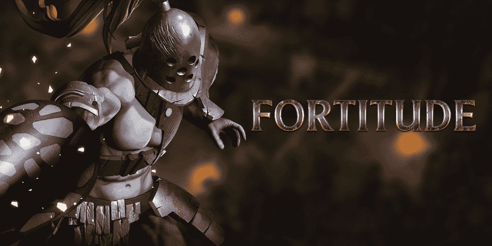
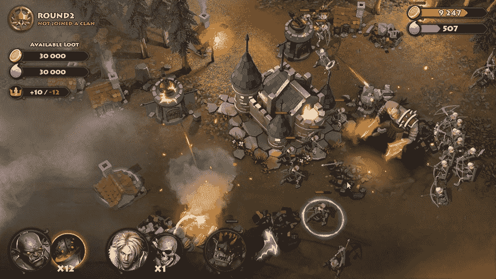

# 节日游戏的坚韧:部落游戏的近距离观察

> 原文：<https://web.archive.org/web/https://dappradar.com/blog/fortitude-by-gala-games-a-closer-look-at-clan-gameplay>

## 刚毅是一款塔防游戏，将于今年晚些时候加入游戏生态系统

刚毅是一款 web3 塔防游戏，具有逐赢机制和引人注目的团队游戏性。它将于今年第四季度来到 [**春晚**](https://web.archive.org/web/20220630221952/https://dappradar.com/blog/explained-gala-games-gala-token) **生态系统。刚毅的目的是避免塔防游戏通常会有的重复感，并通过将赚取游戏与部落游戏相结合来吸引玩家。**

**总结**

*   刚毅作为一款 PvP 塔防游戏丰富了 Gala Games 的生态系统。
*   它的游戏生态系统提供了广泛的 [NFT 物品](https://web.archive.org/web/20220630221952/https://dappradar.com/nft)，而氏族是其中最重要的一种。
*   一个氏族可以从领主升级为国王，以获得更多的游戏奖励。
*   要参与战斗，玩家需要服务或拥有一个部落，赢得战斗对获得更多坚韧[令牌](https://web.archive.org/web/20220630221952/https://dappradar.com/hub/tokens/ethereum/all/)至关重要。

## 变化使坚韧成为一个优秀的塔防游戏

塔防是一个经典的游戏类型，拥有大量的玩家。通常在塔防游戏中，玩家可以建立自己的军队并对抗入侵者。塔防游戏的一个很好的例子是像植物大战僵尸，兽人必须死亡，地牢守卫者和王国狂奔这样的游戏。然而，这些都不具备 NFTs 或游戏赚取机制，这些都是基于 Web3 的游戏的典型元素。

塔防的游戏性可能会因为其回合性质而相当重复。如果没有额外的叙事和多样性，它可能无法让玩家参与进来。所以塔防要在玩法上精雕细琢，不断给玩家带来新鲜感和刺激感。

坚韧作为 PvP 塔防游戏因其丰富的游戏性而脱颖而出。例如，它提供了广泛的防御建筑选择，如炮塔，箭塔和强大的魔法建筑，让玩家可以战略性地设计他们的防御。

此外，该游戏拥有一个有趣的叙事背景，在一个黑暗的幻想世界中，玩家组成部落，相互竞争入侵和保卫村庄。最重要的是，他们用 NFT 和游戏内代币创造了一个精心设计的奖励经济。

值得注意的是，坚韧中的氏族为游戏的设计奠定了至关重要的基础，为游戏提供了可玩性和深度。最重要的是，奖励机制也与氏族游戏密切相关。

## 掌握氏族游戏是屈服的关键

刚毅将利用 NFTs 来促进其在游戏中的生态系统，部落也是 NFT 的游戏项目。通过拥有一个 NFT 部落，领主可以变成国王，并开始从所有为这个部落战斗的领主那里获得收入。

一旦玩家建立了一个有竞争力的部落和一个防御有效的据点，那么他们就准备好赢得一些游戏内货币，坚韧令牌。有几种方法可以获得坚韧令牌，让我们深入研究其中的两种。

让玩家有资格获得坚韧令牌奖励的一个方法是完成系统给出的三个任务。这个任务机制每周工作一次。随着时间的推移，玩家可以继续完成相同的任务来获得更多的分数。

另一种方法是有效地摧毁敌人，使玩家获得王冠，这提高了玩家的坚韧令牌奖励。玩家不需要完全消灭对手就可以获得一定数量的代币。有一个精心设计的系统，用百分比来衡量玩家战斗的效率。

例如，取得 1 级胜利的玩家是那些设法摧毁敌人市政厅或城镇建筑 50%的人，2 级胜利意味着摧毁百分比超过 50%。在这个例子中，2 级胜利可以给玩家带来更多的王冠，从而带来更多的坚韧令牌。

## 最后的想法

《坚韧》是一款将“玩赚”机制完美融入经典塔防的游戏。为了增加游戏的可玩性,《刚毅 2》背后的团队设法为游戏提供了一系列有意义的变化。特别是，部落游戏可以用引人注目的叙述和掌控感吸引玩家。

据该团队称，这款游戏将于 2022 年第四季度在 Gala Games 生态系统中推出。到那时，更广泛的 NFT 物品将被揭开，包括 NFT 土地和潜在的英雄，部队和塔。

DappRadar 将继续关注 Gala Games 和 Fortitude 的最新进展。在 [Twitter](https://web.archive.org/web/20220630221952/https://twitter.com/dappradar) 、 [Discord](https://web.archive.org/web/20220630221952/https://discord.gg/4ybbssrHkm) 和 [Youtube](https://web.archive.org/web/20220630221952/https://www.youtube.com/c/DappRadar) 上关注我们，跟上区块链世界的动态。