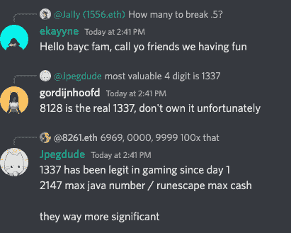

# 四位数的 ENS 名称 NFT 交易变得疯狂

> 原文：<https://web.archive.org/web/https://dappradar.com/blog/four-digit-ens-name-nft-trading-goes-wild>

## ENS NFT 交易量在 24 小时内上升了 334%,形成了一个新的集团

投资者和 NFT 投机狂热者正在为一批新发行的 10，000 ENS 域名 NFT 疯狂。编号从 0000 到 9999 的 NFT 收藏升值，并产生了自己的社区。

在过去的两天里，注册和购买新发布的四位数以太坊域名服务(ENS)的人数激增，导致交易量大幅飙升。在过去 48 小时内，超过 2.8 万个 ENS 名称注册，推动 ENS NFT 交易量增长 334%，至 316 万美元。

## 摘要

*   10，000 个四位数的 ENS 名称在 6 小时内售罄，每个 200 美元
*   它们现在在二级市场上的交易价格超过 1500 美元
*   围绕 10，000 ENS NFT 的四位数集合形成了一个新的集团
*   不和谐 10k 俱乐部已经有 32k 会员

## ENS NFT 交易量在 24 小时内增长了 334%

在过去的 24 小时内，购买 ENS 域名的交易者数量增长了 183%以上，达到近 9，000 人，而销售额增长了 198%，达到 22，153。这意味着每个交易者购买了两个 ENS 域名，因为人们争相获取四位数的 Web3 身份。

ENS 的 [Dune Analytics 仪表板向我们显示，高峰始于 4 月 21 日左右，到 4 月 24 日，注册人数从大约 2700 人跃升至超过 7000 人——在写作时再次跃升至超过 17000 人。重要的是，我们只关注注册，不关注续约。](https://web.archive.org/web/20221127152230/https://dune.com/makoto/ens-daily)

## 四是个神奇的数字

不管德拉索尔怎么想，四是个神奇的数字，至少对 ENS 来说是这样。

新的四位数 ENS 名称注册使得以太坊名称服务成为以太坊上三大耗油大户之一。购买需求。包含一个独特的四位数字符串的 eth 域名非常多，以至于 ENS 在天然气费用上与 OpenSea、Uniswap 和 Tether 竞争。在写作方面，它仍然高居第四位。四似乎是目前 ENS 的神奇数字。

这 10，000 个四位数的 ENS 名称售价为 200 美元，在二级市场上以约 1，500 美元的价格出售。这里发生的事情是，四位数的 ENS 名称似乎已经成为 NFT 的一个集合。

## 新 NFT 派

首先要了解是什么推动了 NFT 项目的成功。这不是代币，空投，或被动收入。这是文化，不仅仅是 NFTs 的专利。文化根植于人性之中。人们希望感觉自己是世界上某个特别事物的一部分。如果没有这种感觉，任何 NFT 项目都是徒劳的。在 BAYC 早期，猿类突袭俱乐部会所聊天，Discord 活动猖獗，在 Twitter 上超级活跃。

此外，一个社区不仅仅是许多人都持有一些代币或 NFT。这是一群代表某项事业或品牌的人，他们可能会佩戴徽章来证明这一点。你甚至可以说，一个真正的 NFT 社区更像一个家庭，而不是一个社区。当价格下跌时，他们都感受到了冲击。当它抽水时，他们都庆祝。

如今，成功的 NFT 项目都专注于围绕一个共同的 PFP 建立一个社区。这是一个屡试不爽的方法，看起来是一个成功的方案。然而，我们在这里看到的四位数 ENS 域显示了一些有趣的东西。PFPs 不是建立社区的唯一方式。一个名为 [10kClub](https://web.archive.org/web/20221127152230/https://twitter.com/10kClubOfficial) 的 Twitter 页面邀请所有四位数 ENS 名称的持有者加入一场独家的纷争。截至发稿时已有 3273 名成员。一个简单的举动就种下了一个社区的种子。看看[这个群体如何发展](https://web.archive.org/web/20221127152230/https://discord.com/invite/vdWWHy2c)以及它是否会进一步发展，将会非常有趣。

在 Discord 聊天中，有趣的是，持有人正在讨论子域名和他们所保护的号码的相关性。围绕某些四位数组合的价值，已经形成了疯狂的猜测。

随着 1337 游戏文化得到点头，而 2718 指的是伦纳德欧拉。我们还可以想象出生年份或对周年纪念日或世界大事的引用来获取值，如 0911。

## 每个 NFT 项目应该有一个子域

子域名可能有助于 NFT 项目结合基于 PFP 的集合和基于名称的项目的优势，更重要的是，通过右键单击保存反对者来消除 NFT 盗窃。图像是可以伪造的。一个域不能。简单地说，在 Twitter 上找到所有的猿 PFP 并不容易，例如，只找到真正的猿 PFP 几乎是不可能的。

使用#apefollowape 这样的标签曾经在收藏数量很少的时候有效，但在过去的六个月里，对用户来说变得更加棘手了。可以说，跟踪一个领域要容易得多，也更有效率，观察这种趋势是否会流行起来将会很有趣。

 NewsletterUnsubscribe at any time. [T&Cs](https://web.archive.org/web/20221127152230/https://dappradar.com/terms) and [Privacy Policy](https://web.archive.org/web/20221127152230/https://dappradar.com/privacy-policy)

***以上不构成投资建议。此处给出的信息仅供参考。请行使尽职调查，做你的研究。作者持有多种加密货币的头寸，包括 BTC、瑞士法郎和雷达。***