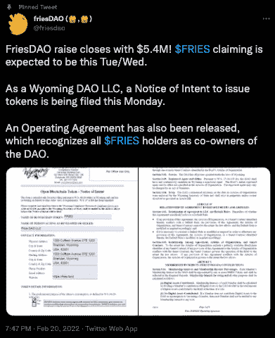

# 弗里斯道:拥有快餐特许经营权的一部分

> 原文：<https://web.archive.org/web/https://dappradar.com/blog/friesdao-own-part-of-a-fast-food-franchise>

## 围绕赛百味、多米诺骨牌等建立连锁和会员效用

FriesDAO 是一个新的分散自治组织(DAO ),它希望为参与者提供拥有部分快餐特许经营权的机会。FriesDAO 的目标是通过邀请 [**薯条代币持有者**](https://web.archive.org/web/20221127151004/https://fries.fund/) **经营一个快速服务餐厅或 QSR 的分散网络，获得并扩大像大力水手、汉堡王和塔可钟这样的快餐店特许经营权。**

[fries DAO 团队表示](https://web.archive.org/web/20221127151004/https://friesdao.gitbook.io/friesdao-docs/)从地铁特许经营权所有者开始，他们希望引导合作伙伴进入区块链空间，并迎合那些已经准备像经营企业一样经营 Dao 的人。重要的是，由于法律原因， [FriesDAO](https://web.archive.org/web/20221127151004/https://friesdao.gitbook.io/friesdao-docs/) 并不直接拥有任何店铺。相反，治理模型允许 DAO 成员在如何使用国库资金以及收购哪些商店方面有发言权。

他们还计划为 NFT 会员卡提供额外奖励，如免费食物或 FriesDAO 网络商店的交易。在撰写本文时，根据 Twitter 的消息，DAO 的融资额以[540 万美元收盘，超过了其最低 500 万美元的数字。推文进一步概述了路线图，指出正在提交一份发行令牌的意向通知，并且还发布了一份运营协议，承认所有](https://web.archive.org/web/20221127151004/https://twitter.com/friesdao/status/1495455077703770114)[薯条持有者](https://web.archive.org/web/20221127151004/https://friesdao.gitbook.io/friesdao-docs/logistics/usdfries-token)为 DAO 的共同所有者。

## 引进大人物

FriesDAO 最近聘请达美乐前总裁科里·斯皮罗夫(Kory Spiroff)为其顾问委员会成员。Spiroff 在餐饮业有超过 35 年的经验，他的职业生涯始于 1985 年为达美乐送披萨。他后来成为夏威夷的特许经营者，并最终成为达美乐德国公司的董事总经理，之后成为阿拉马食品公司(Alamar Foods Company)的 QSR 总裁，该公司在中东和北非拥有达美乐和 Dunkin '特许经营权。

FriesDAO 将依靠 Spiroff 的专业知识和专业网络来帮助识别和潜在收购知名餐饮品牌的特许经营权，因为它努力实现其将区块链的治理带到快餐业的雄心。

## 道的腾飞

Dao 可以将权力交还给最能利用服务的人，并为组织带来急需的战略清晰性和方向。一群投资者或重要的利益相关者对一家企业的运营拥有最终发言权，这绝不是一个新概念。在这个迭代中，成员可以匿名，不需要数十亿的财富来参与。

几天前，一名前思科系统公司员工发起了一项以约 40 亿美元收购丹佛野马队(Denver Broncos NFL)的 DAO。声明此举将建立一个基础设施，使各行各业的球迷都可以成为丹佛野马队的所有者。如果成功，道将加入绿湾包装工队，成为其球迷拥有的 NFL 球队。有趣的是，希望通过 DAO 拥有野马队股份的球迷可以尽可能少地捐款，而不是包装工队的每股 300 美元。

 NewsletterUnsubscribe at any time. [T&Cs](https://web.archive.org/web/20221127151004/https://dappradar.com/terms) and [Privacy Policy](https://web.archive.org/web/20221127151004/https://dappradar.com/privacy-policy)

***以上不构成投资建议。此处给出的信息仅供参考。请行使尽职调查，做你的研究。作者持有 ETH、BTC、AGIX、HEX、LINK、GRT、CRO、OMI、不可变 X、GALA、AVASTR、GMEE、CUBE、RADAR、FLOW、FTM、BNB、SPS、WRLD、ATOM 和 ADA。***