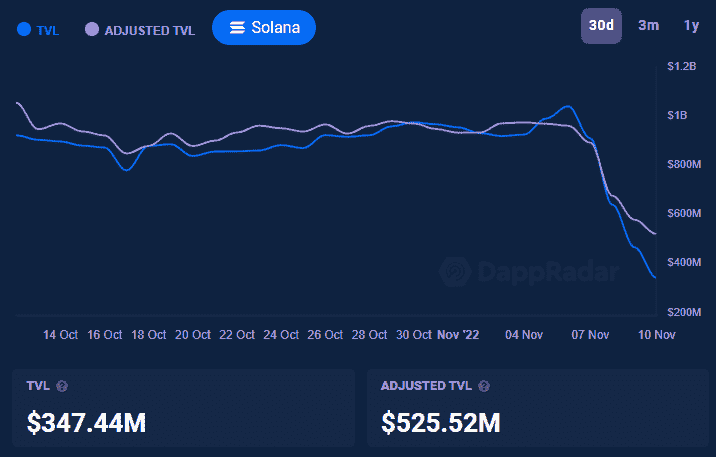
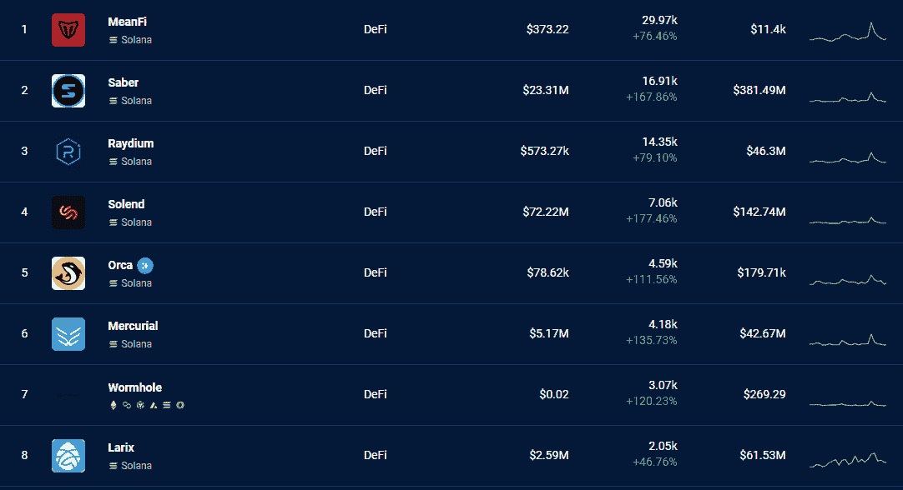
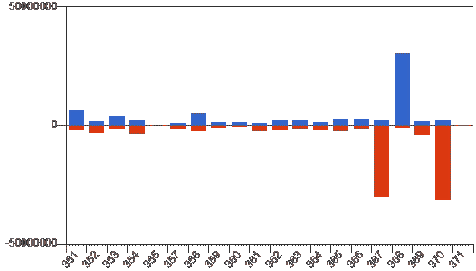

# TVL 下跌 66%后，FTX 在索拉纳引起混乱

> 原文：<https://web.archive.org/web/https://dappradar.com/blog/ftx-causes-chaos-on-solana-after-tvl-dropped-66>

## 随着 FTX 主要加密交易所的崩溃，加密技术陷入混乱

在过去的四天里，Solana 分散式金融平台锁定的总价值下降了 66.6%，这是由 FTX 破产问题引发的加密风暴造成的。总部位于美国的领先加密交易所 FTX 利用用户资金，过度杠杆化，摸索，并重挫，拖垮了整个行业。

**亮点**

*   索拉纳的 DeFi TVL 下降了 66.6%，至 3.4777 亿美元。
*   *DeFi dapp 活性增加了一倍，因为原生 SOL 令牌失去了 53%的价值。*
*   茄果类验证者已经看到了生态系统中溶胶数量的严重下降。

## DeFi 受到 FTX 的严重影响

FTX 的风险投资部门是今年早些时候崛起的区块链生态系统 Solana 的大投资者之一。随着有关 FTX 破产问题的消息冲击市场，对索拉纳母语 SOL 的信任迅速下降。这种代币的价值下跌了 53%，目前为 14.21 美元。

这种情况对 DeFi 市场产生了强烈影响，因为 TVL 在过去 48 小时内下跌了 19%。这一下降的很大一部分来自索拉纳区块链，其 DeFi 生态系统的价值从 11 月 6 日的 10.4 亿美元下降到 11 月 10 日的 3.4744 亿美元，下降了 66.6%。

[<picture></picture>](https://web.archive.org/web/20221217144332/https://dappradar.com/industry-overview)

## 对 dapp 活性的强烈影响

由于所有这些问题，在索拉纳上的 dapp 活性激增。领先的 DeFi 协议如 [Saber](https://web.archive.org/web/20221217144332/https://dappradar.com/solana/defi/saber) 、 [Raydium](https://web.archive.org/web/20221217144332/https://dappradar.com/solana/defi/raydium) 、 [Solend](https://web.archive.org/web/20221217144332/https://dappradar.com/solana/defi/solend) 和 [Orca](https://web.archive.org/web/20221217144332/https://dappradar.com/solana/defi/orca) 的活动在过去七天里增加了一倍多。11 月 9 日，所有的 DeFi 平台都经历了一次严重的活动激增。

[<picture></picture>](https://web.archive.org/web/20221217144332/https://dappradar.com/rankings/protocol/solana/category/defi)

使用 [DappRadar 行业概览](https://web.archive.org/web/20221217144332/https://dappradar.com/industry-overview)也可以从索拉纳区块链上活跃钱包的数量中看出这一活动。在一个多月的时间里，Solana 上唯一活跃钱包的数量达到了 40，000 到 45，000 个，但在 11 月 9 日达到了 64，980 个 UAW 的峰值。

[Discover DeFi dapps on Solana](https://web.archive.org/web/20221217144332/https://dappradar.com/rankings/protocol/solana/category/defi)

## 用户从验证器中取出 sol

索拉纳区块链使用验证器来运行它的生态系统，用户把 SOL 放在这些验证器上来加强验证器节点的地位。同时，节点向参与的用户支付 APY，但是这些用户，有时甚至整个验证者都退出了。

在 370 年,超过 3120 万的 SOL 从验证器中被取消，而只有 200 万被添加到 staking 池中。同样，在当前时期 371 中，更多的股份将被去激活而不是激活。

这是对来自 FTX 的问题的明确回应。散户投资者似乎很担心，并采取了预防措施，解除了他们的溶胶。SOL 的解散与前面提到的 DeFi 平台上的活动增加相一致，可以肯定的是，一些投资者将他们的 SOL 换成了 USDC，或者转移到了一个集中的交易所。

关注索拉纳行动，你可以利用我们的[索拉纳定义页面](https://web.archive.org/web/20221217144332/https://dappradar.com/defi)来跟踪其锁定的总价值。同时，确保遵循 [DappRadar 行业概述](https://web.archive.org/web/20221217144332/https://dappradar.com/industry-overview)中的图表，以掌握行业宏观趋势。

[Explore DeFi Rankings, Statistics and News](https://web.archive.org/web/20221217144332/https://dappradar.com/defi)

## 随身携带您的 Web3 之旅

使用 DappRadar 移动应用程序，再也不会错过 Web3。查看最受欢迎的 dapps 的性能，并关注您投资组合中的 NFT。您在 DappRadar 上的帐户会与我们的移动应用程序同步，这样您很快就可以选择实时接收提醒。

[Download the DappRadar app now](https://web.archive.org/web/20221217144332/https://dappradar.app.link/blog)[<picture></picture>](https://web.archive.org/web/20221217144332/https://play.google.com/store/apps/details?id=com.portfolio.dappradar)