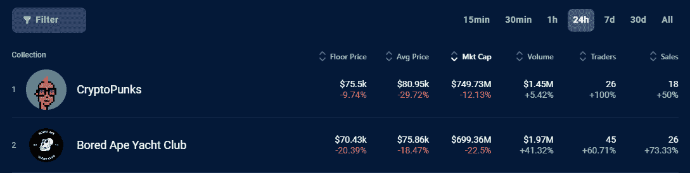
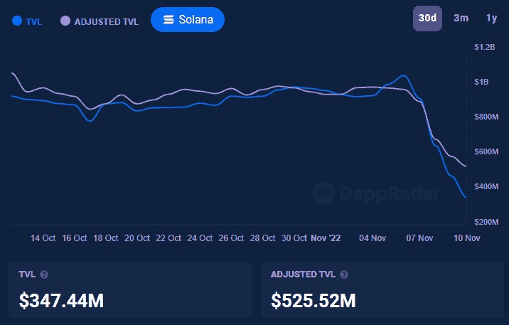

# FTX 的混乱使得 crypto 朋克再一次成为无聊的猿人

> 原文：<https://web.archive.org/web/https://dappradar.com/blog/ftx-turmoil-makes-cryptopunks-top-bored-apes-once-again>

## 第二次翻转发生在 BAYC 持有者抛弃他们的猿类时

随着美国 FTX 交易所的垮台及其毁灭性后果导致加密市场陷入混乱，CryptoPunks 已经取代 Bored Ape Yacht Club 成为 NFT 空间的领导者。

### **总结**

*   CryptoPunks 重新成为最有价值的 NFT 收藏品的第一名
*   Bored Ape 游艇俱乐部底价在几天内从 70 ETH 跌至 59.7 ETH

* * *

2021 年 12 月 [Bored Ape 游艇俱乐部](https://web.archive.org/web/20221130135901/https://dappradar.com/hub/nft-explorer/collection/bored-ape-yacht-club) (BAYC)成为市场上最昂贵的 NFT 系列。底价超过了长期以来被认为是所有 NFT 收藏家的圣杯的[隐朋克](https://web.archive.org/web/20221130135901/https://dappradar.com/hub/nft-explorer/collection/cryptopunks)。然而，随着 FTX 的衰落，许多 BAYC 持有者试图出售他们的收藏品。

一夜之间，价格大幅下跌。11 月 6 日，最便宜的无聊猿要 70 ETH。三天后，这一价格跌至 68 ETH，但在 11 月 10 日，最便宜的 BAYC 价格暴跌至不到 59.7 ETH。

与此同时，CryptoPunks 的价格波动要小得多。底价在 65 到 67 ETH 之间徘徊了一个月，但在所有的加密混乱中跌至 63 到 64 ETH。

无聊的猿类在不到一年的时间里一直排名第一，现在 CryptoPunks 又回到了第一的位置。这两个 Web3 品牌都属于宇迦实验室，该实验室将单个 NFT 的商业权利给予了 NFT 持有者。

现在，第二次翻转已经发生，但此时此刻，没有时间庆祝。

[Discover the most valuable NFT collections](https://web.archive.org/web/20221130135901/https://dappradar.com/hub/nft-explorer?order-by=mktCap)

## FTX 让加密市场陷入混乱

美国 FTX 密码交易所已经搞得一团糟，需要 80 亿美元来偿还债务。币安首席执行官赵昌鹏有接管 FTX 的想法。但是他在看了一眼交易所的金融混乱后离开了。

FTX 首席执行官萨姆·班克曼-朋友已经表示，他需要更多的资本来避免破产。与此同时，红杉资本(Sequoia Capital)等风险资本已经将其投资降至 0 美元。这表明投资者不再相信 FTX 会从中恢复。

随着混乱的加剧，加密市场已经损失了近 2000 亿美元的价值。领先的加密货币比特币跌至 15600 美元的低点。结果反弹到那个水平，现在是 16700 美元。自 2020 年 11 月以来，比特币的价格从未如此之低。

## 索拉纳感受到了 FTX 的痛苦

与 FTX 相关的投资可能会遇到麻烦。索拉纳的本币索尔受到了 FTX 下跌的严重影响，因为该交易所是这个生态系统的主要投资者。

所有这些问题的结果是，索拉纳上的 dapp 活性激增。领先的 DeFi 协议如 [Saber](https://web.archive.org/web/20221130135901/https://dappradar.com/solana/defi/saber) 、 [Raydium](https://web.archive.org/web/20221130135901/https://dappradar.com/solana/defi/raydium) 、 [Solend](https://web.archive.org/web/20221130135901/https://dappradar.com/solana/defi/solend) 和 [Orca](https://web.archive.org/web/20221130135901/https://dappradar.com/solana/defi/orca) 的活动在过去 7 天里增加了一倍多。11 月 9 日，所有的 DeFi 平台都经历了一次严重的活动激增。

这种活动的增加可能意味着用户一直在交换代币，或者他们从分散的交易所中移除了他们的流动性。在一个多月的时间里，Solana 上唯一活跃钱包的数量达到了 40，000 到 45，000 个，但在 11 月 9 日达到了 64，980 个 UAW 的峰值。

使用 [DappRadar 行业概览](https://web.archive.org/web/20221130135901/https://dappradar.com/industry-overview)我们可以看到这些用户移动了价值。在 10 月的最后几周，索拉纳的日交易量约为 5000 万美元，但在 11 月 9 日变成了 3.637 亿美元。Solana smart 合约锁定的总价值(TVL)现已从 11 月 6 日的 10.4 亿美元降至 11 月 10 日的 3.4744 亿美元。

关注索拉纳行动，你可以利用我们的[索拉纳定义页面](https://web.archive.org/web/20221130135901/https://dappradar.com/defi)来跟踪其锁定的总价值。同时，确保遵循 [DappRadar 行业概述](https://web.archive.org/web/20221130135901/https://dappradar.com/industry-overview)中的图表，以保持对行业宏观趋势的领先。

[Check the DeFi Overview](https://web.archive.org/web/20221130135901/https://dappradar.com/defi)

## 随身携带您的 Web3 之旅

使用 DappRadar 移动应用程序，再也不会错过 Web3。查看最受欢迎的 dapps 的性能，并关注您投资组合中的 NFT。您在 DappRadar 上的帐户会与我们的移动应用程序同步，这样您很快就可以选择实时接收提醒。

[Download the DappRadar app now](https://web.archive.org/web/20221130135901/https://dappradar.app.link/blog)[<picture></picture>](https://web.archive.org/web/20221130135901/https://play.google.com/store/apps/details?id=com.portfolio.dappradar)