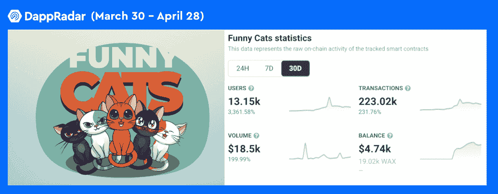
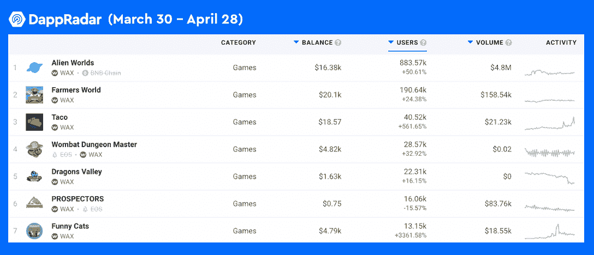

# 有趣的猫带来了互联网猫热潮蜡

> 原文：<https://web.archive.org/web/https://dappradar.com/blog/funny-cats-brings-the-internet-cat-craze-to-wax>

## 网络猫已经成为蜡像馆区块链上的一种 NFT 游戏

有趣的猫是一款在蜡像区块链上玩到赚到的游戏，旨在复制区块链真实世界中的猫热。这款以可爱小猫为特色的游戏在过去 30 天里用户增长了 3000%。

**概要:**

*   **Wax(**[**Wax**](https://web.archive.org/web/20221127151428/https://dappradar.com/hub/token/eth/WAX?from=0x39bb259f66e1c59d5abef88375979b4d20d98022)**)是最受欢迎的博彩型区块链之一，而** [**每天吸引着**](https://web.archive.org/web/20221127151428/https://dappradar.com/industry-overview) **大约 48 万个独特的钱包。**
*   ****上的一款玩赚游戏《有趣的猫》，在用户增长比例上超过了大多数其他 dapps，增幅超过 3000%。****
*   **在勉强令人满意的第一季度之后，[本月，蜡上游戏的数量开始反弹。](https://web.archive.org/web/20221127151428/https://dappradar.com/blog/dappradar-x-bga-games-report-q1-2022)**

 **Wax 凭借《外星人世界》、《农民世界》和许多其他王牌游戏确立了其在区块链游戏领域的领导地位。最重要的是，Wax 致力于打造吸引更广泛游戏观众的游戏 dapps。例如， [Blockchain Brawlers](https://web.archive.org/web/20221127151428/https://dappradar.com/wax/games/blockchain-brawlers) 旨在吸引主流游戏玩家加入 web3 游戏，并且已经在用户数量和交易方面显示出令人印象深刻的潜力。

看一下 Wax 数据一直飙升的图表，我们发现，在过去的 30 天里，游戏《滑稽猫》的用户数量暴涨了惊人的 3，361%。所以事不宜迟，让我们深入了解一下这个游戏到底是怎么回事。

## 什么是滑稽猫？

《有趣的猫》是一款由玩到赚的 NFT 游戏，讲述了五只热爱冒险的可爱猫咪的故事。为了掌握游戏，玩家需要收集尽可能多的猫，送它们去冒险，并赚取游戏内的令牌。有两种促进游戏经济的代币，它们有有趣的名字，猫和猫薄荷。玩家可以用猫开新地点，买猫，猫薄荷是用来补充玩家猫的能量的。

值得注意的是，由于其令人印象深刻的受欢迎程度，滑稽猫已经连续两周被选入 DappRadar 的每周趋势 dapp 报告。具体来说，滑稽猫在过去 30 天内吸引了超过 13，000 名独立玩家，大幅增长了 3，361%。此外，它记录了 223，025 笔交易，与前 30 天相比增长了 231%。

## 王牌 NFT 蜡上游戏

根据 DappRadar BGA 游戏 Q1 报告，尽管加密市场动荡不定，区块链游戏仍保持着稳定的活跃水平。今年前三个月，平均每天有 117 万个独立活跃钱包(UAW)连接到区块链游戏。

该报告的图表显示，韦克斯·区块链在独特的活动钱包中排名第六，与罗宁·区块链并肩竞争。

BGA 游戏报告还显示，在加密行业普遍低迷的情况下，Wax 在第一季度努力维持流量。然而，进入 2022 年第二季度，蜡迎来了坚实的反弹。

《异形世界》在过去的 30 天里记录了超过 88.3 万的用户，增长了 50.61%，产生了 2.83 亿笔交易。Farmers World 是另一款游戏 dapp，它在 30 天内实现了 6 位数的用户数，有近 20 万独立用户与 dapp 互动，增长了 24%。在 5 位数的用户数量俱乐部中，Taco 在 UAW 的注册量增长了 561%，其次是袋熊地下城主，增长了 32.92%，龙之谷增长了 16.15%。

最后，值得注意的是，Wax 从不缺乏游戏 dapps 的新创意。W ax 上的这 5 款新 NFT 游戏也将允许玩家获得加密奖励。DappRadar 将继续监测 Wax 及其生态系统的最新发展。在 [Twitter](https://web.archive.org/web/20221127151428/https://twitter.com/dappradar) 、 [Discord](https://web.archive.org/web/20221127151428/https://discord.gg/4ybbssrHkm) 和 [Youtube](https://web.archive.org/web/20221127151428/https://www.youtube.com/c/DappRadar) 上关注我们，跟上区块链世界的动态。**