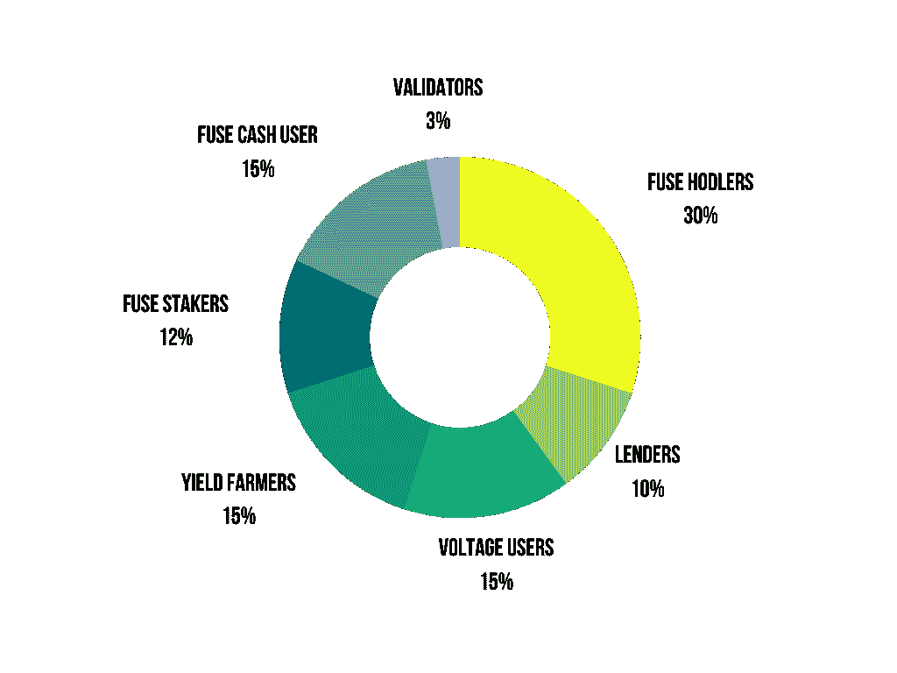
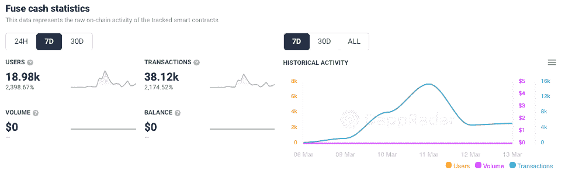
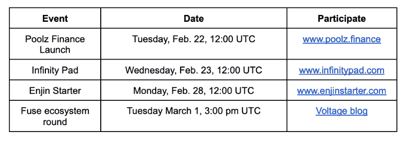
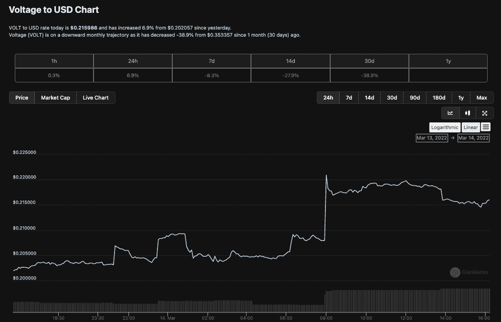
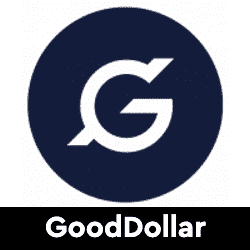

# VOLT Token 空投融合现金活动激增

> 原文：<https://web.archive.org/web/https://dappradar.com/blog/fuse-cash-activity-surges-with-volt-token-airdrop>

## 过去 7 天，联网钱包和交易量激增超过 2000%

期待已久的 Voltage Finance 代币生成活动于 3 月 10 日拉开帷幕，这刺激了 FuseCash 上用户活动的大规模涌入。用户被吸引与金融 dapp 互动，因为它将总电压供应的 15%分配给 Fuse 现金用户。

面向消费者的 [Fuse Cash](https://web.archive.org/web/20221003195958/http://onelink.to/m9jq3s) 移动钱包集成了 Voltage，允许用户在快速、友好的界面中交换加密资产，平台费用为零。令牌生成事件(TGE)通常表示在区块链上运行的项目创建令牌。更重要的是，TGE 会在令牌公开分发的那一刻发出信号。

Fuse Network 社区在增加 Voltage Finance 的价值和用途以及帮助其成为 [Fuse Network 领先的分散式交易所或 DEX](https://web.archive.org/web/20221003195958/https://dappradar.com/rankings/protocol/fuse) 方面发挥了至关重要的作用。作为奖励，从 3 月 11 日开始，VOLT 总供应量的 15% 的[空投分配给 Fuse Cash 用户。](https://web.archive.org/web/20221003195958/https://medium.com/fusenet/token-generation-event-ultimate-guide-to-claiming-staking-liquidity-migration-and-airdrop-1418e9feba14)

## VOLT airdrop 推动用户

在过去的 7 天里，连接到 Fuse Cash 的钱包数量[跃升了近 2，400%,达到 18，980 个独立活动钱包。这些钱包完成了 38，120 笔交易，同比增长 2，174%。具体来说，Fuse Cash 通常每天平均有大约 100 个钱包与之相连。大规模激增表明，这些钱包和交易中有相当大的一部分可以由用户申请 VOLT 代币，然后在应用程序中进行进一步的活动。](https://web.archive.org/web/20221003195958/https://dappradar.com/fuse/defi/fuse-cash)

## 什么是电压金融？

电压金融是一个在 Fuse 网络上的一体化分散金融(DeFi)平台。该平台曾被称为 FuseFi，但在 2022 年初被重新命名。随着电压 DAO 治理令牌 VOLT 的推出，该平台对用户和持有人的赌注和流动性提供进行奖励。这些治理令牌允许用户影响平台的决策过程。此外，投资者在成为 Fuse Cash 用户的同时，还有几个参与其中的机会。

如果你参加了 Poolz Finance 或 Infinity Pad 上的 launchpad 活动，在生态系统回合中用 Volt 替换了 Fuse，或者在过去 18 个月左右的时间里以任何方式参与了 Volt 的用户活动。你可能会得到[伏特的代币](https://web.archive.org/web/20221003195958/https://voltage.finance/)。目前总供应量刚刚超过[440 万伏代币](https://web.archive.org/web/20221003195958/https://www.coingecko.com/en/coins/voltage/usd#panel)，这是 TGE 迄今为止创造的代币总量。

Voltage 希望在为更有经验的 DeFi 用户提供服务的同时，确保通过用户友好的产品和服务来照顾加密和 DeFi 领域的新参与者。

## 保险丝点燃了

Fuse Network [今年的地位一直在上升](/web/20221003195958/https://dappradar.com/blog/gooddollar-ubi-platform-climbs-into-top-5-defi/)，似乎正试图打入区块链(TVL)总价值前 50 名。电压是 Fuse 生态系统的重要组成部分，因为它是一个 dapp，可以促进交易量、赌注和流动性供应。它可以帮助 [Fuse 网络增长其 TVL 数字](https://web.archive.org/web/20221003195958/https://defillama.com/chain/Fuse)，其 dapp 生态系统，以及整体用户活动。

Fuse dapps 的一个好处是，许多可扩展性和交易成本问题都可以通过在第一层 EVM 熔丝网络上使用类似电压的 dapps 来解决。其他功能包括在 170 多个国家直接进行移动银行到加密，以及该平台的本地稳定货币 FuseDollar 的利息收入，每年可产生高达 50%的回报。

[<picture></picture>](https://web.archive.org/web/20221003195958/https://dappradar.com/fuse/defi/fusefi)[<picture></picture>](https://web.archive.org/web/20221003195958/https://dappradar.com/fuse/defi/gooddollar)[<picture></picture>](https://web.archive.org/web/20221003195958/https://dappradar.com/fuse/marketplaces/tofunft)

***以上不构成投资建议。此处给出的信息仅供参考。请行使尽职调查，做你的研究。作者持有多种加密货币，包括 BTC、ETH 和 RADAR。***

 NewsletterUnsubscribe at any time. [T&Cs](https://web.archive.org/web/20221003195958/https://dappradar.com/terms) and [Privacy Policy](https://web.archive.org/web/20221003195958/https://dappradar.com/privacy-policy)