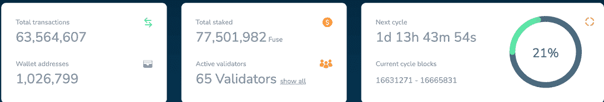
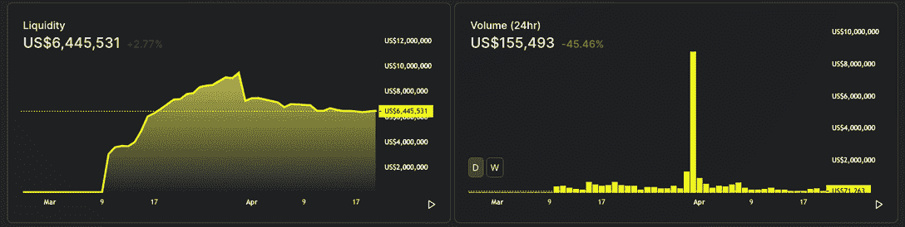
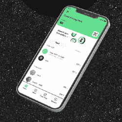

# 融合网络超过 100 万个钱包地址

> 原文：<https://web.archive.org/web/https://dappradar.com/blog/fuse-network-surpasses-1-million-wallet-addresses>

## 基于低成本 DeFi 平台的移动支付系统

注册到 Fuse 的钱包地址数量已超过 100 万，进一步显示了 Fuse 网络的稳健增长。这意味着更多的用户被引入到一个希望让所有人都可以使用 DeFi 和支付选项的网络中。

[Fuse](https://web.archive.org/web/20220927103736/https://dappradar.com/rankings/protocol/fuse) 成立于 2019 年，旨在革新传统的支付和金融体系。该平台正在努力设计一种快速、低成本的支付解决方案，在没有第三方参与的情况下简化区块链的日常活动。现在 Fuse 注册了 100 万个钱包地址，这强调了平台的成长性。

在写入时，Fuse 上有 1，026，799 个钱包地址处于活动状态。这些钱包已经完成了超过 6350 万笔交易，下注超过 7750 万 FUSE，即网络的原生令牌，或约 2600 万美元。有趣的是，每个钱包平均进行了 60 次交易。

Source: Fuse Block Explorer

尽管值得一提的是，领先的区块链以太坊早在 2017 年 2 月就超过了 100 万个钱包地址，并且在编写时继续增长到近 2 亿个，但 Fuse 在拥挤的市场中的[表现不容忽视。](/web/20220927103736/https://dappradar.com/blog/fuse-cash-activity-surges-with-volt-token-airdrop/)

## Fuse 为企业提供现成的解决方案

Fuse 将加密支付和 DeFi 带给大众的方法使其他项目、企业和社区能够采用加密支付和 DeFi。Fuse Studio 为企业提供了一个平台来轻松创建和管理基于令牌的应用程序。同时，Fuse wallet 技术为支付和金融服务提供了一个便捷的移动网关，可以轻松集成到任何应用程序中。

[Fuse dapp 生态系统](https://web.archive.org/web/20220927103736/https://dappradar.com/rankings/protocol/fuse)的独特之处在于，它是一些最受公用事业驱动的项目的家园，这些项目寻求利用 DeFi 和加密货币的力量。更重要的是，它有几个移动优先的 dapps，用户可以为 iOS 和 Android 设备下载。

## 融合网络 Dapps

几个应用在 [Fuse Network](https://web.archive.org/web/20220927103736/https://dappradar.com/rankings/protocol/fuse) 上脱颖而出，有可能改变现状。在这一切的基础上，我们有一个任何网络蓬勃发展所需的最关键的 DeFi 乐高积木。 [Voltage 是 Fuse Networks 的本地分散交换](https://web.archive.org/web/20220927103736/https://dappradar.com/fuse/defi/voltage)，对生态系统至关重要，因为它为用户提供了一种存储和使用 web3 服务的替代方式。此外，至关重要的是，通过农业和打桩活动创造价值，并为 Fuse 上的其他 dapps 创造流动性。

[Voltage](https://web.archive.org/web/20220927103736/https://dappradar.com/fuse/defi/voltage) ，更侧重于本地加密用户，设置为提供对 VOLT(电压的本地令牌)的下注，多汁的 APY 奖励高达 100%。最近发布的 VOLT 令牌刺激了 VOLT 在平台智能合约中的大量投资，极大地改善了 VOLT 和[保险丝网络](https://web.archive.org/web/20220927103736/https://dappradar.com/rankings/protocol/fuse)交易者的流动性、效用和滑点。

关于安培(第一种通过铸币税与保险丝挂钩的算法稳定币)的进一步宣布令人兴奋。主要流动性将被保存在 AMP-FUSE LP 池中，并创建 FUSE token 到流动性的大规模锁定，为 FUSE token 创造更多效用。

在 Atop Voltage 上，我们有 [Fuse Cash](https://web.archive.org/web/20220927103736/https://dappradar.com/fuse/defi/fuse-cash) ，这是一个移动首创的加密钱包，旨在让人们每天使用加密来购买、交换和储蓄，所有这些都是免费的。最重要的是，Fuse Cash 可以促进任何数量的企业采用加密技术并解决支付问题。真实世界的使用案例已经包括 Fuse Network，它为泰国考艾的一个节日启用了有史以来第一个基于区块链移动设备的支付系统。根据官方[博客文章](https://web.archive.org/web/20220927103736/https://medium.com/fusenet/mystic-valley-festival-mobile-payments-deployed-with-success-on-fuse-9804b3790818)，在三天内处理了超过 15，000 笔支付，所有这些都不需要任何额外的硬件成本，只需要移动设备。

虽然这两个是 Fuse dapp 生态系统的关键元素，但 Fuse 认为，面向用户的公用事业驱动的 dapp 可能是真正的游戏规则改变者。

## 从本地开始，扩展到全球

[Peepl 是一个建立在 Fuse](https://web.archive.org/web/20220927103736/https://dappradar.com/fuse/other/peepl) 之上的杰出项目。支付和奖励平台通过利用 web3 为当地企业提供稳定的货币交易，并赋予他们奖励客户的能力，从而帮助保持当地经济中的资金流动。

[Flambu 是另一个](https://web.archive.org/web/20220927103736/https://dappradar.com/fuse/marketplaces/flambu)以社区为中心的项目，它为用户提供了一个分享和借用当地物品的市场。在这些经济体中，用户分享他们不用的东西，借用他们需要的东西，以换取密码稳定币支付——这简化了一个漫长而不安全的过程。向人们介绍稳定的资本也是 DeFi 教育的一个重要部分，因为对波动性的误解仍然存在。

这两个项目都还处于起步阶段，但是如果 Flambu 和 T2 Peepl 能够抓住目前全球观众的 1%,他们将每天服务数百万人。更重要的是，他们可以吸引新类型的用户进入 crypto，关注实用性而非快速利润。

通过向企业提供易于使用的替代支付方式和解决方案， [Fuse Network](https://web.archive.org/web/20220927103736/https://dappradar.com/rankings/protocol/fuse) 可以在世界似乎注定要拥抱更开源、更分散的生活方式时接触到大众。

[<picture></picture>](https://web.archive.org/web/20220927103736/https://dappradar.com/fuse/defi/fuse-cash)

[Fuse Cash](https://web.archive.org/web/20220927103736/https://dappradar.com/fuse/defi/fuse-cash)

[<picture></picture>](https://web.archive.org/web/20220927103736/https://dappradar.com/fuse/defi/voltage)

V[oltage](https://web.archive.org/web/20220927103736/https://dappradar.com/fuse/defi/voltage)

[<picture></picture>](https://web.archive.org/web/20220927103736/https://dappradar.com/fuse/other/peepl)

[Peepl](https://web.archive.org/web/20220927103736/https://dappradar.com/fuse/other/peepl)

***以上不构成投资建议。此处给出的信息仅供参考。请行使尽职调查，做你的研究。作者持有多种加密货币的头寸，包括 BTC、瑞士法郎和雷达。***

 NewsletterUnsubscribe at any time. [T&Cs](https://web.archive.org/web/20220927103736/https://dappradar.com/terms) and [Privacy Policy](https://web.archive.org/web/20220927103736/https://dappradar.com/privacy-policy)