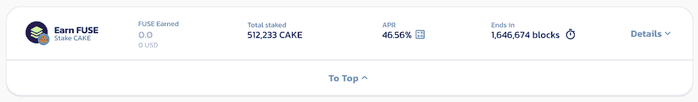
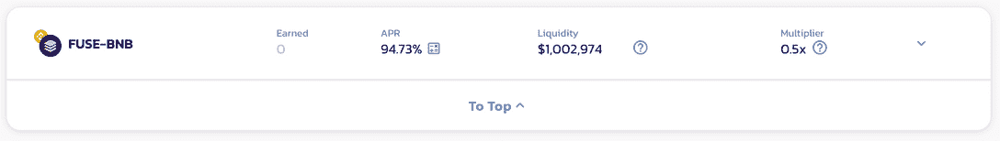
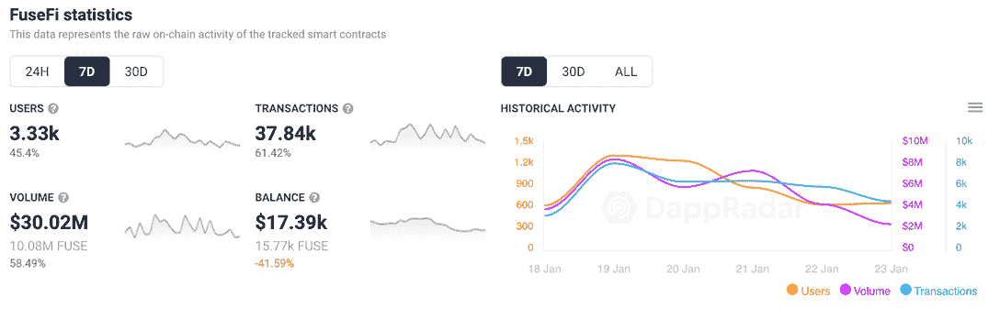
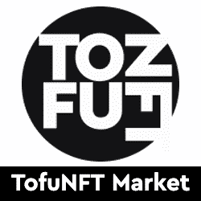
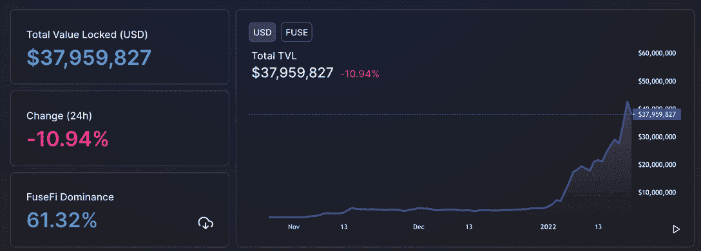

# FuseFi 币安桥推动用户活跃度 45%

> 原文：<https://web.archive.org/web/https://dappradar.com/blog/fusefi-binance-bridge-pushes-user-activity-45>

## 融合/BNB 农业对潘切克互换现在生活

随着 Fuse network 与 PancakeSwap 合作推出新的农场和糖浆池，DeFi 平台 FuseFi 的用户活动和交易量本周大幅增长。 [**通过 FuseFi**](https://web.archive.org/web/20221004141724/https://info.fuseswap.com/home) **的交易量从 1 月 18 日的约 340 万美元跃升至 1 月 20 日的超过 1230 万美元，因为用户使用 FuseFi 桥接服务将代币从 FUSE 转移到币安智能链。**

FuseFi 是一种分散式交易协议，以促进 Fuse 网络上的令牌交换而闻名。它旨在通过消费者友好的 Fuse Cash 移动应用程序将 DeFi 功能引入主流。 [PancakeSwap 是币安智能链上领先的去中心化交易所](/web/20221004141724/https://dappradar.com/blog/pancakeswap-pulls-away-from-competition/)和产量农业平台。

[新池](https://web.archive.org/web/20221004141724/https://twitter.com/Fuse_network/status/1484509679547990022)将为用户提供在 BNB/熔丝池中提供流动性的机会，以赚取蛋糕。而一个农场让用户在 PancakeSwap 的原生令牌蛋糕上下注来赚取 FUSE。在撰写本文时，总赌注为 512，233 块蛋糕或约 390 万美元，赌注者目前的年利率为 46.5%。为熔丝/BNB 池提供流动性目前的年利率略低于 95%，加上 0.5 倍的乘数。这个资金池已经增加了超过 100 万美元的流动性。

此外，随着用户通过 FuseFi 上的[令牌桥转移资金，他们正在产生交易量和用户活动，因为 FuseFi 在 2022 年稳健开局后寻求进展。连接到](https://web.archive.org/web/20221004141724/https://app.fuse.fi/#/bridge) [FuseFi](https://web.archive.org/web/20221004141724/https://dappradar.com/fuse/defi/fusefi) 的钱包跃升了近 46%，达到 3330 个，在过去七天里有近 38000 笔交易产生了超过 3000 万美元的交易量。与此同时，在过去的 30 天里，FUSE token 的价格几乎上涨了 [321%。](https://web.archive.org/web/20221004141724/https://www.coingecko.com/en/coins/fuse/usd#panel)

## $VOLT 即将推出

FuseFi 已经是一个去中心化的平台，然而，该平台在 1 月初放弃了其 VOLT 治理令牌的第一个标志，并提供了更多关于最终将治理该平台的 DAO 的信息。FuseFi 治理令牌将于 2022 年在 FUSE、ETH 和 BSC 网络上推出，它将允许令牌持有者共同决定 FuseFi DAO 决策流程。

[<picture></picture>](https://web.archive.org/web/20221004141724/https://dappradar.com/fuse/defi/fusefi)[<picture></picture>](https://web.archive.org/web/20221004141724/https://dappradar.com/fuse/defi/gooddollar)[<picture></picture>](https://web.archive.org/web/20221004141724/https://dappradar.com/fuse/marketplaces/tofunft)

## 引发火花的保险丝

自 12 月 1 日至今，Fuse Network (TVL)锁定的总价值[增长了 660%](https://web.archive.org/web/20221004141724/https://defillama.com/chain/Fuse) ，达到约 3800 万美元。FuseFi、Beefy Finance 和 Sushi 合计约 2600 万美元。除了 DeFi，[NFT 市场](https://web.archive.org/web/20221004141724/https://medium.com/fusenet/fuse-partners-with-tofunft-to-expand-options-for-fuse-nft-enthusiasts-10bf5f8c3afc)的推出以及 Fuse 上的任何即玩即赚游戏将不可避免地在 2022 年带来更多的活动。

PancakeSwap 是币安智能链上领先的 DeFi dapp，每周有近 100 万个活跃钱包通过该平台连接和交易。随着 Fuse 看起来要与 Gnosis、Celo 和 Telos 等网络对抗，越来越多的 dapps 开始在其网络上蓬勃发展[。](https://web.archive.org/web/20221004141724/https://dappradar.com/rankings/protocol/fuse)

与 PancakeSwap 的合作加上 fuse 作为第一层区块链的日益流行，看起来是一个很好的举措，可以为 Fuse 生态系统带来更多交易量，并获取更多价值。

 NewsletterUnsubscribe at any time. [T&Cs](https://web.archive.org/web/20221004141724/https://dappradar.com/terms) and [Privacy Policy](https://web.archive.org/web/20221004141724/https://dappradar.com/privacy-policy)

***以上不构成投资建议。此处给出的信息仅供参考。请行使尽职调查，做你的研究。作者持有 ETH、BTC、AGIX、HEX、LINK、GRT、CRO、OMI、不变 X、ENS、GALA、AVASTR、GMEE、CUBE、RADAR、FLOW、FTM、BNB、SPS、WRLD、ATOM 和 ADA。***