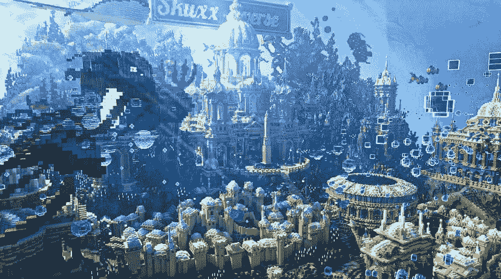
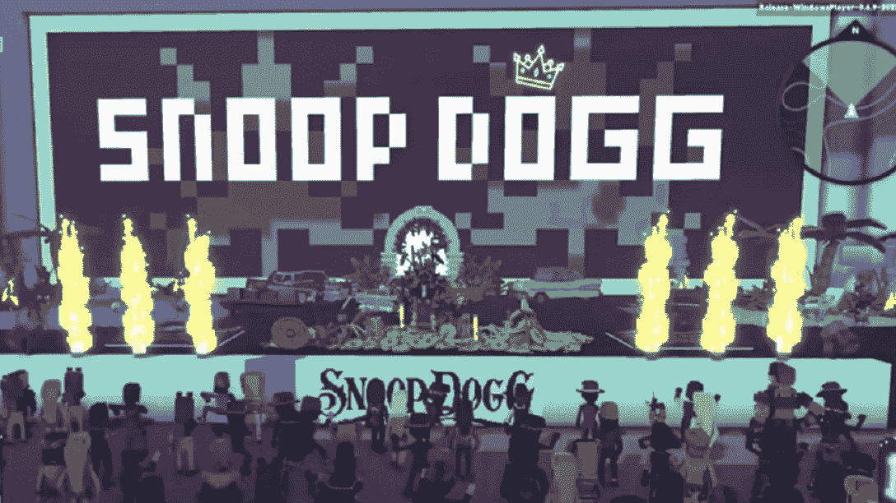

# skuxxverse 和沙盒中元宇宙的未来一瞥

> 原文：<https://web.archive.org/web/https://dappradar.com/blog/future-of-metaverse-glimpsed-in-skuxxverse-and-the-sandbox>

## 新颖的 NFT 应用带来新的可能性

随着 skuxverse[**沙盒**](https://web.archive.org/web/20221006034438/https://dappradar.com/ethereum/games/the-sandbox) **设计出所有权和价值问题的创新解决方案，元宇宙的未来开始成形。在过去的一周里，我们看到 SkuxxVerse NFTs 的价格上涨。在过去的几个月里，沙盒已经宣布与其他项目合作，以提高其内容提供。**

**总结**

*   ***skuxverse 模型搭建于*** [***NFT 一亩三分地***](https://web.archive.org/web/20221006034438/https://dappradar.com/blog/tag/nft-worlds) ***平台***
*   ***【skuxverse】NFT 持有者可以进入策划空间并通过空投获得 WRLD***
*   *作为金融工具的 NFT 给代币持有者带来巨大风险*
*   *[***【史努比】***](https://web.archive.org/web/20221006034438/https://dappradar.com/blog/tag/snoop-dogg)*[***女人的世界***](https://web.archive.org/web/20221006034438/https://dappradar.com/ethereum/collectibles/world-of-women) ***在元宇宙*** 有一个更可持续的建筑方法**

 **## NFT 为元宇宙提供了新的切入点

SkuxxVerse 是一个建立在 NFT 世界平台上的虚拟空间。该公司一直在收购 NFT 世界的土地，当时它的价值还不到一个 ETH。以目前 8.89 ETH (撰写本文时为 27，177 美元)的底价和[12.97 ETH](https://web.archive.org/web/20221006034438/https://dappradar.com/nft/collections)(39，140 美元)的七天平均售价，SkuxxVerse 肯定赚了不少钱。

但 SkuxxVerse 已经超越了单纯的 NFT 投机和投资组合构建。它最近铸造了 7777 个具有相当独特效用的 NFT。与大多数优秀的 NFT 项目不同，开发人员创建自己的令牌，然后创建赋予令牌价值的平台，SkuxxVerse 在现有的 NFT 项目平台内构建了自己的平台。在这种情况下，持有他们的 NFT 给你进入 NFT 世界的一部分。

这是 NFT 中的 NFT。

SkuxxVerse: a land with NFT Worlds

## SkuxxVerse 给持有人什么效用？

这是 NFTs、DeFi 和元宇宙之间关系的最新发展，它让我们看到了未来的情况。随着越来越多不同的区块链技术相互作用，跨应用程序项目可能很快会成为规范。在元宇宙的土地上下注 NFT 和赚取收益，用户在那里玩游戏，赚取代币和创造他们拥有和控制的世界。

SkuxxVerse 新令牌的所有权为持有者提供了两个好处:

*   令牌持有者可以独家访问 SkuxxVerse 定制的元宇宙生态系统。
*   拥有包含 NFT 世界代币的社区钱包的部分所有权。skuxverse NFT 持有者也将有资格获得 WLRD 空投。

SkuxxVerse 将通过赌注、租赁和 P2E 收益产生 WRLD，NFT 世界的原生令牌。由于 SkuxxVerse 显然在 NFT 世界拥有多块土地，他们将通过 NFT 世界的 DeFi 机制产生大量的 WRLD 用于空投。除此之外，根据 SkuxxVerse 路线图，该团队打算通过购买更多的地块和赚更多的钱来实现他们的利润。

SkuxxVerse golden tickets give holders extra benefits

## 平衡风险和机遇

正是在 NFT 和元宇宙创新之旅的这个阶段，我们开始认为 SkuxxVerse 这样的项目不是由社区驱动的有共同利益的团体，而是纯粹为积累金钱而建造的工具。

当你剥去金色门票和“定制元宇宙的独家使用权”时，skuxverse NFT 是一种证券化的投资工具，完全由一种不稳定的资产支持:NFT 世界。在过去的 30 天里，NFT 世界的平均土地价格飙升了 112%。暗示其价值可能在未来 30 天减半并不悲观——我们以前见过这样的波动。

如果这种情况发生，并且从赌注、租赁和 P2E 收益中获得的 WRLD 枯竭，那会给 SkuxxVerse 和它的 NFT 持有者留下什么？

## 在大商场开店的小项目

SkuxxVerse 正在进行相当激进的创新，以利用只有区块链科技才能提供的金融机会。其他小项目正在走“传统”路线。他们使用现有的虚拟世界作为他们内容的平台。

沙盒是最大的元宇宙世界之一，已经与 NFT 项目建立了各种商业合作关系。这些是传统的交换关系:沙盒需要内容，小企业需要一个大实体来存放它们的内容。这对每个人都适用。

不久前，我写了一篇关于[女性世界](https://web.archive.org/web/20221006034438/https://dappradar.com/ethereum/collectibles/world-of-women)与沙盒合作创造和管理一个互动世界的文章。目标是投资教育和指导那些想要参与网络 3 的女性。双方都将实现自己的一些商业目标，这是一个额外的收获。

史努比狗狗在沙盒里有一座著名的豪宅和[他自己的化身](https://web.archive.org/web/20221006034438/https://dappradar.com/blog/snoop-dogg-launching-nft-avatars-in-the-sandbox)集合，叫做[狗狗](https://web.archive.org/web/20221006034438/https://dappradar.com/ethereum/collectibles/the-doggies-snoop-dogg)。

He’s come a long way from Long Beach

## 维护一个超越炒作的社区

沙盒和它的伙伴从这些关系中得到什么是相当明显的。但是这对粉丝和用户有什么好处呢？主要是访问。如果你拥有一个 NFT 妇女的世界，你就可以自动进入她们在虚拟世界中策划的空间。

类似地，抱着一只小狗“可以进入一个可玩的沙盒角色，以及进入元宇宙的未来功能”。因此，持有这些非功能性金融工具确实有用，而元宇宙的平台似乎正在帮助提供这种工具。

对于任何一个 NFT 项目来说，要想在最初的宣传期过后存活下来，它必须做两件事情中的一件:[证明自己是一个价值储存库](https://web.archive.org/web/20221006034438/https://dappradar.com/blog/million-dollar-sales-azuki-and-clonex-take-over-the-charts-top-10-nft-sales)或者为持有者提供真正的用途。进入人们想要消磨时间的有趣空间似乎是一种真正的实用工具，可以吸引和保持忠实的粉丝群。

要了解更多关于 NFTs 和令人兴奋的新项目的新闻和故事，请务必关注我们的[博客](https://web.archive.org/web/20221006034438/https://dappradar.com/blog/)并关注我们的 [Twitter](https://web.archive.org/web/20221006034438/https://twitter.com/DappRadar) 订阅。您可以使用我们的[令牌浏览器](https://web.archive.org/web/20221006034438/https://dappradar.com/hub/tokens/ethereum/all/1)来跟踪元宇宙本地货币，如[沙](https://web.archive.org/web/20221006034438/https://dappradar.com/hub/token/eth/SAND?from=0x3845badade8e6dff049820680d1f14bd3903a5d0)或[法力](https://web.archive.org/web/20221006034438/https://dappradar.com/hub/token/eth/MANA?from=0x0f5d2fb29fb7d3cfee444a200298f468908cc942)。我们的 [NFT 排名页面](https://web.archive.org/web/20221006034438/https://dappradar.com/nft)是发现市场趋势的好地方，我们的 [Discord](https://web.archive.org/web/20221006034438/https://discord.com/invite/4ybbssrHkm) 服务器是你应该去的关于 web3 世界正在发生什么的有趣对话的地方。**