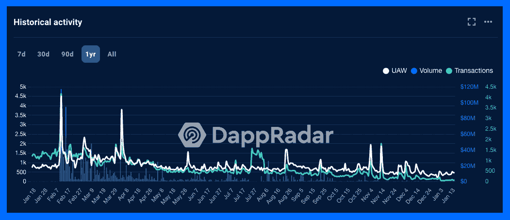
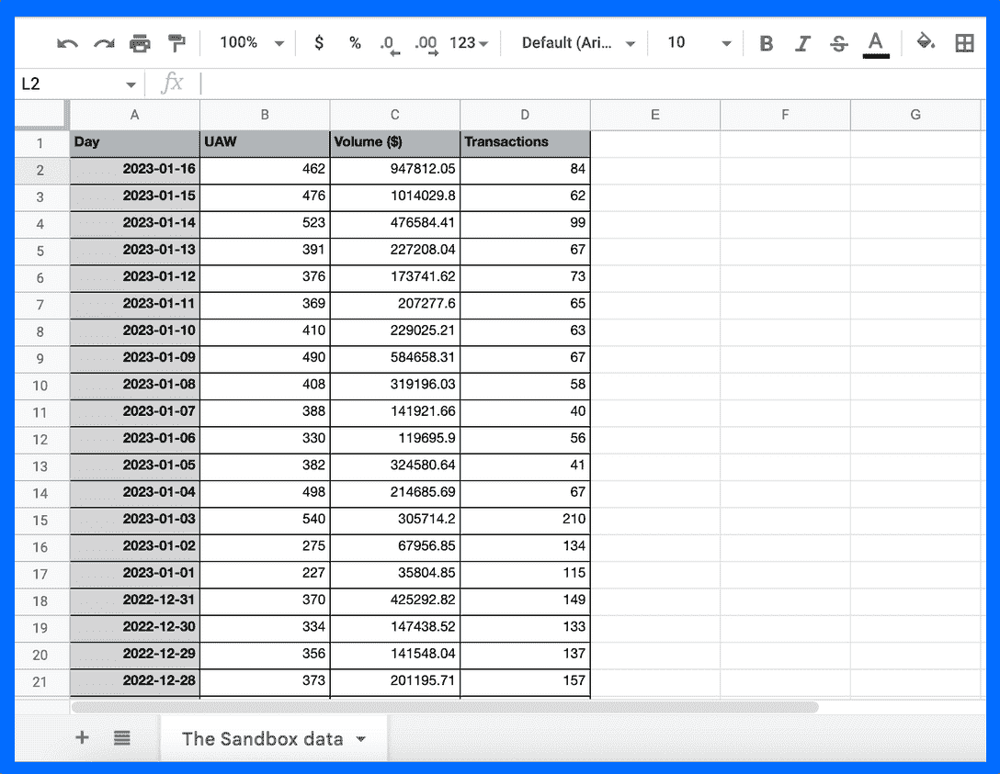
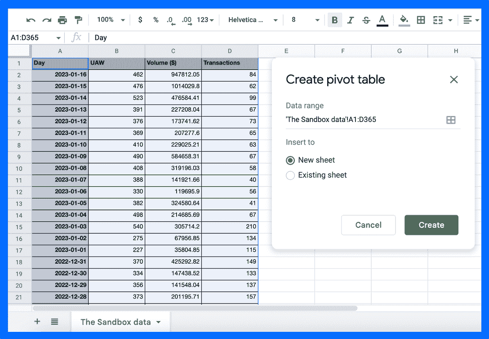
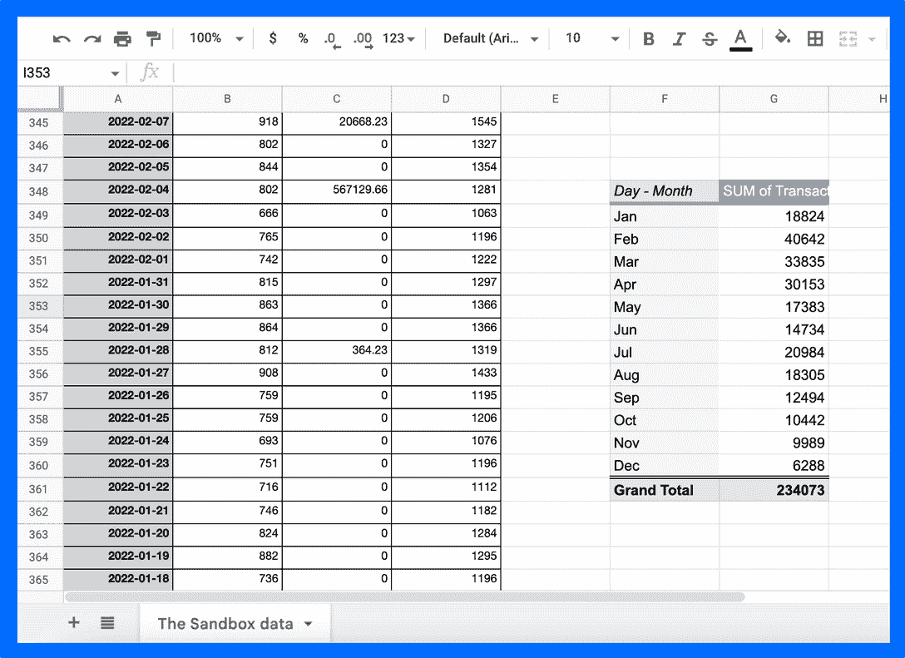
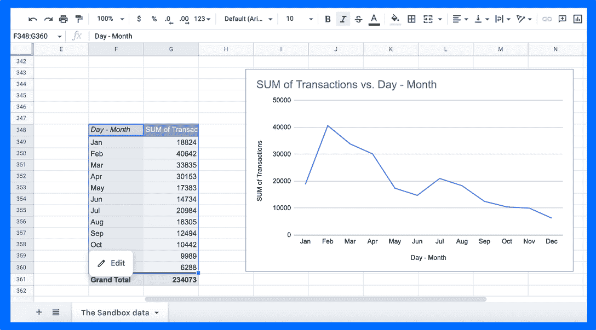
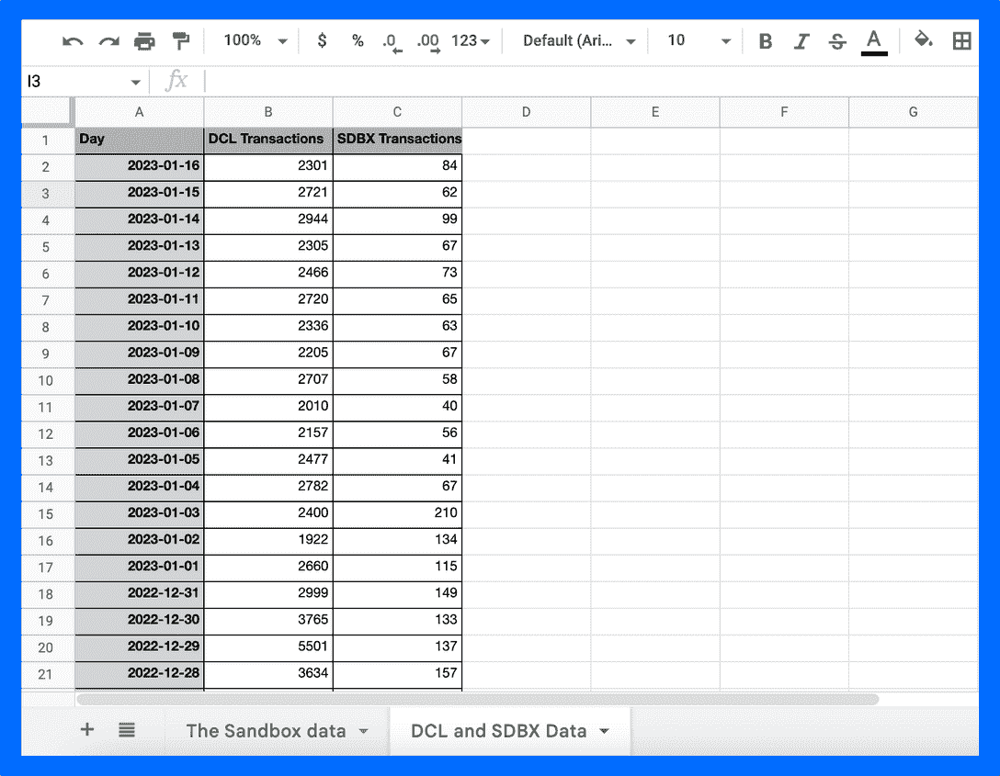
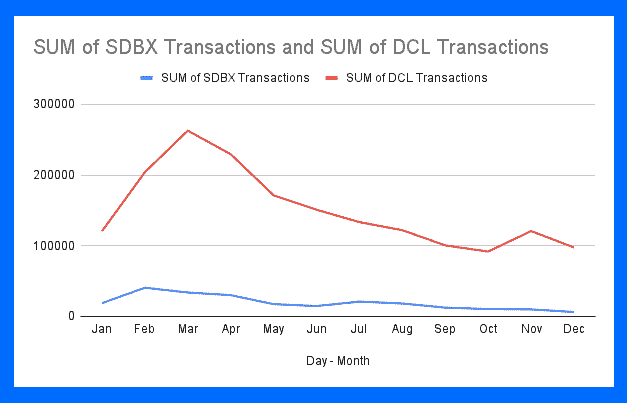
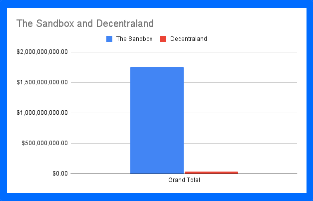

# 利用 DappRadar 数据获得 Dapp 市场洞察

> 原文：<https://web.archive.org/web/https://dappradar.com/blog/gain-dapp-market-insights-with-dappradar-data>

## DappRadar PRO 成员可以访问原始 dapp 数据，并创建自己的结论

当你决定参与哪个 Web3 项目时，研究链上 dapp 指标是你做出任何决定的基础部分。无论是你想玩的游戏，你想花时间去玩的元宇宙平台，还是你想投资的区块链项目，你都需要根据数据做出选择。

在 DappRadar，我们拥有最大的区块链数据存储。在超过 50 个区块链和超过 13，000 个 dapps 中，我们为用户提供他们可以用来做出明智决策的信息。现在，我们正在将数据的力量赋予我们的专业社区。

通过成为专业会员，您可以提取 CSV 文件形式的区块链数据，并将其转化为您想要使用的分析模型。你可以对 dapp 数据和 [NFT 数据](https://web.archive.org/web/20230123215922/https://dappradar.com/blog/dappradar-pro-member-floor-prices-csv-file)都这样做。因此，如果你是 PFPs 的交易者、分散式应用程序的投资者或在市场上寻找最佳游戏的游戏玩家，我们的数据将帮助你做出最佳决策。

[Become a PRO Member](https://web.archive.org/web/20230123215922/https://dappradar.com/token/pro)

## Dapp 数据指标

分割区块链数据的方法有很多种，所以如何使用我们的数据找到你想要的答案取决于你。在 DappRadar，我们将 dapp 数据分为以下几类:

*   **交易**:这是在 Web3 钱包和 dapp 的智能合约之间进行的交易(签名互动)的数量。它们不一定总是加密货币的转移或购买。

*   **唯一活动钱包**:这是连接到 dapp 的单个 Web3 钱包地址的数量。和唯一用户不一样，因为有的人可以有多个钱包。但是在连接到 dapp 的人数和唯一活跃钱包的数量之间有很强的相关性。

*   **数量**:这是在给定时间内通过 dapp 的智能合约交易的加密货币数量，以美元计。不出所料，代币交易所和 DeFi 平台总是在我们的排名中名列前茅。但是像 OpenSea 和 Blur 这样的二级市场也有很高的交易量。一些更受欢迎的游戏，如 Axie Infinity 和 Sandbox，会经历高容量时期，通常是在季节性活动和数字资产销售期间。

*   **Balance** :这是当前锁定在 dapp 智能合约中的资产的总价值。这对于判断分散式交易所或 DeFi 平台的实力和性能特别有用。一些游戏也可以有很高的余额，特别是如果他们有一个广泛的赌注程序或游戏中的比赛，你需要投入代币进入。

结合起来，我们可以使用这些指标来判断 dapp 的强度。单独来说，每一个都可以给我们低分辨率的洞察力，让我们知道我们认为一个平台在未来可能会有多好的表现。通过将它们放在一起并在更长的时间范围内运行数据，我们可以建立一个更大的数据集来帮助我们得出一些确定的结论。

[Explore Dapps](https://web.archive.org/web/20230123215922/https://dappradar.com/rankings)

## 下载 CSV 文件并创建图表

专业会员可以进入我们的档案，提取区块链数据，创建自己的图表，模型和分析。以下是获取数据并将其转化为信息的分步指南。

我们将使用沙盒作为我们的示例，但是您可以对任何想要探索的 dapp 数据采取以下步骤。

**1。转到沙盒单 dapp 页面。**

[转到沙盒](https://web.archive.org/web/20230123215922/https://dappradar.com/multichain/games/the-sandbox)并向下滚动到历史活动图表。确保您仍在概览选项卡上。当你在这里，选择你的日期范围，然后点击右上角的省略号。

The Sandbox on-chain activity

**2。点击下载 CSV。**

当您点击下载 CSV，您的文件将自动下载，并出现在您的下载文件夹。

Click on Download CSV

**3。打开文件并查看数据**。

选择你的电子表格，并使用它来开始处理你的数据。

On-chain data for The Sandbox

**4。突出显示数据并创建透视。**

突出显示要分析的数据，并插入数据透视表。

Insert pivot table

**5。将数据分类成您想要使用的格式。**

您可以选择多种方式来展示您的数据，这取决于您要寻找的答案。在这个例子中，我们正在查看沙箱在过去一年中每月处理了多少事务。要将单独的日期收集到月份中，请右键单击数据透视表中的日期列，然后转到“创建数据透视组”。

Sort the data into the view that works best for you

**6。将透视转换为图表。**

现在，我们可以将数据透视表转换为折线图，以图形方式展示 2022 年交易数量的变化。在图表中突出显示您想要的数据，转到插入，然后单击图表。现在，您可以在图表编辑器工具中选择您想要的图表类型。

Create your pivot and explore data in depth

[Explore The Sandbox Data](https://web.archive.org/web/20230123215922/https://dappradar.com/multichain/games/the-sandbox)

## 如何从数据中获得洞察力

现在你已经用你的图表将数据转化为信息，是时候开始分析它并发展一些洞察力了。同样，你可以有成千上万种不同的方式来查看信息，这取决于你想找到什么。

对于这个例子，我想看看沙盒和分散的平台上的交易相比如何。这可能会告诉我两件事:第一，哪个元宇宙项目在一段时间内表现最好。其次，我将查看交易中是否有任何相关的下降或上升，以了解哪种事件会对元宇宙 dapp 的性能产生影响。

**1。将分散的数据插入数据集中。**

通过上述步骤获取分散土地的交易数据。将它与沙盒中的数据放在一起。确保日期对齐，以便比较相似的数据集。

Decentraland and The Sandbox raw data combined

**2。把它变成一个数据透视表并创建你的图表。**

看起来，分散管理系统每月的事务数比沙盒系统多几万个。看起来，与沙盒平台相比，分散式平台处理的交易和交互要多得多，而且是两个平台中更好、更受欢迎的一个。

Start comparing dapp data

**3。探索其他指标来证实您的发现。**

如前所述，单个指标无法提供高分辨率的洞察力。根据一个因素来判断 dapp 的性能可能会告诉你一个不完整的故事，从而导致错误的结论。因此，让我们来看看过去 12 个月里这两家 dapps 智能合约的交易量。

Different datapoints tell a different story

看上面的表格，似乎有更多的人在沙盒生态系统中交易更多的钱。那么沙盒和分散土地谁的表现更好呢？

**4。超越数据。**

现在，我们需要开始探索，为什么在过去 12 个月里，当更多的资金通过沙盒的智能合约流动时，分散土地有更多的交易。

也许有必要搞清楚在分散化的土地上什么才算交易。是每次用户通过他们的 Web3 钱包确认某些事情时，还是每次他们使用加密货币进行交易时都是如此。无论是哪一个，你都需要用这个答案来构建你对这两个元宇宙项目的印象。

然后找出为什么这么多的钱通过沙盒而不是分散的土地。是沙盒的巨大赌注程序，还是人们对购买分散的 NFT 不感兴趣？现在你可以把数据集中在 NFT 交易上，而不是 dapp 互动上。这完全取决于你想找到什么。

带来你对这个行业更广泛的了解。利用在线资源——DappRadar 的文章、DappRadar 的 Discord 和 Twitter、YouTube、社交媒体——找到你的问题的答案。一旦你知道了这两个平台是如何工作的，你就可以做出明智的选择，在哪个平台上花费你的时间和资源。

## 随身携带您的 Web3 之旅

使用 DappRadar 移动应用程序，再也不会错过 Web3。查看最受欢迎的 dapps 的性能，并关注您投资组合中的 NFT。您在 DappRadar 上的帐户会与我们的移动应用程序同步，这样您很快就可以选择实时接收提醒。

[Download the DappRadar app now](https://web.archive.org/web/20230123215922/https://dappradar.app.link/blog)[<picture></picture>](https://web.archive.org/web/20230123215922/https://play.google.com/store/apps/details?id=com.portfolio.dappradar)