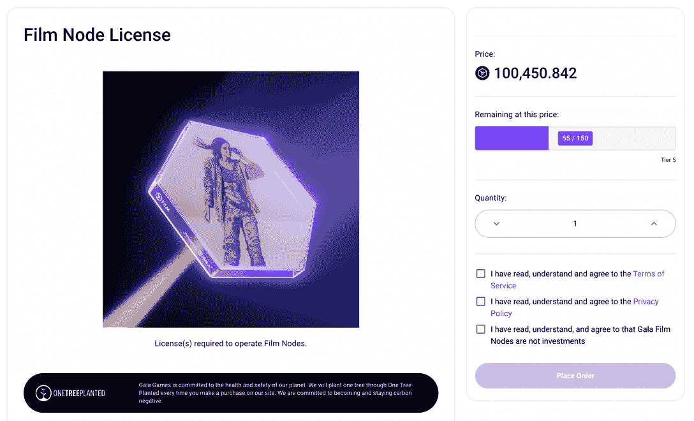

# Gala Film 让每个人都能从电影产业中获利

> 原文：<https://web.archive.org/web/https://dappradar.com/blog/gala-film-lets-everyone-profit-from-the-movie-industry>

## Web3 对电影行业有什么好处？

**春晚电影节点发售。用户可以购买这些节点来支持 Gala Film 平台上的内容分发，并获得奖励。值得注意的是，这是 Gala Games 在去中心化娱乐领域开创革命的战略举措。**

**概要:**

*   [Gala Games](https://web.archive.org/web/20221004220851/https://dappradar.com/blog/tag/gala-games) 是一个由[Gala token](https://web.archive.org/web/20221004220851/https://dappradar.com/hub/token/eth/GALA/ETH?from=0x15d4c048f83bd7e37d49ea4c83a07267ec4203da)驱动的分散式游戏平台。
*   区块链游戏平台最近推出了一个名为 Gala Film 的分散电影平台。
*   春晚电影平台引入电影节点作为其娱乐生态系统的基础。
*   运营一个电影节点可以给用户带来回报。

根据 Statista 的数据，2021 年全球票房收入从上一年的 118 亿美元上升到 213 亿美元。想象一下，在这个 100 亿美元的全球市场中，公众成为利润分享者是多么令人敬畏的事情。幸运的是，多亏了春晚电影公司，这个梦想正在变成现实。

## 加拉是谁？

Gala 或 Gala Games 是一个游戏平台，其使命是开发用户真正想玩的区块链游戏。其平台上最令人期待的游戏是 [Mirandus](https://web.archive.org/web/20221004220851/https://dappradar.com/ethereum/games/mirandus) ，这是一款具有沉浸式游戏体验的幻想 MMO。Gala Games 的系统通过节点网络得到保护，并由[GALA token](https://web.archive.org/web/20221004220851/https://dappradar.com/hub/token/eth/GALA/ETH?from=0x15d4c048f83bd7e37d49ea4c83a07267ec4203da)提供便利。

每年春晚主持人都会 May Mayhem，这是春晚生态系统中最值得期待的活动之一，用丰厚的奖励回馈用户。为了有资格获得 Mayhem 的百万美元奖金池，用户必须在 Gala 生态系统中玩游戏，如[城镇之星](/web/20221004220851/https://dappradar.com/blog/win-gala-prizes-in-town-star-during-may-mayhem/)和[蜘蛛坦克](/web/20221004220851/https://dappradar.com/blog/gamers-can-win-1-5-million-in-prizes-playing-spider-tanks-this-may/)。

如果你是一个游戏爱好者，DappRadar 游戏排名可以很容易地找到最受欢迎的游戏。点击链接了解更多关于[春晚游戏的最新成就](https://web.archive.org/web/20221004220851/https://dappradar.com/blog/tag/gala-games)。你也可以在这里看到最近[的表演。](https://web.archive.org/web/20221004220851/https://dappradar.com/hub/token/eth/GALA/ETH?from=0x15d4c048f83bd7e37d49ea4c83a07267ec4203da)

## 什么是春晚，如何参与？

区块链游戏平台最近对娱乐业进行了新的尝试。几周前，Gala 宣布推出电影节点，电影节点的销售仍在继续。

[https://web.archive.org/web/20221004220851if_/https://www.youtube.com/embed/wlYh_VzHJ9k?feature=oembed](https://web.archive.org/web/20221004220851if_/https://www.youtube.com/embed/wlYh_VzHJ9k?feature=oembed)

这些节点是 Gala 去中心化娱乐生态系统的基础。通过拥有和运营电影节点许可证，用户可以支持跨 Gala Film 的内容托管，并因其贡献获得奖励。要拥有一个春晚电影节点，用户可以从[官网](https://web.archive.org/web/20221004220851/https://film.gala.com/nodes)购买，并在[春晚](https://web.archive.org/web/20221004220851/https://dappradar.com/hub/token/eth/GALA/ETH?from=0x15d4c048f83bd7e37d49ea4c83a07267ec4203da)或 [ETH](https://web.archive.org/web/20221004220851/https://dappradar.com/rankings/protocol/ethereum) 付款。

DappRadar TokenSwap 让您轻松获得 GALA 令牌。

[Source](https://web.archive.org/web/20221004220851/https://film.gala.com/)

电影节点和 NFT 将为加拉电影生态系统提供动力。每一个在 Gala Film 现场直播的片名都将包含粉丝们可以作为 NFT 拥有的数字内容元素。但是，持有这些 NFT 有什么好处？这就是手表赚钱机制发挥作用的地方。

观看赚取机制允许 NFT 所有者因观众观看其 NFT 链接的电影而获得象征性奖励。但前提是它们的 NFT 连接到一个电影节点。

最重要的是，电影节点运营商也将获得这些激励措施，使 NFTs 能够在 Gala 电影平台上访问。

### 有什么奖励？

那么具体的回报会是什么呢？一旦 Gala Film 的内容分发平台上线，电影节点运营商将获得 Gala Film 代币奖励。值得注意的是，虽然春晚电影平台仍在建设中，但节点运营商已经可以获得激励。那是爆米花！。

爆米花！是电影节点运营商独有的 NFT 奖。通过允许节点操作员运行增加的工作负载，它可以提高节点操作员的效率。所以，一旦春晚电影 Token 直播，那些拥有爆米花的人！会获得更大的奖励。

[Source](https://web.archive.org/web/20221004220851/https://film.gala.com/)

## Gala Film Nodes 如何重新定义 Web3 娱乐模式

Gala Film 致力于创造一个三赢的经济，赋予艺术家、粉丝和支持者权力。该平台承诺让新兴电影制作人更加引人注目，并为他们提供新的机会来赚钱。

此外，Gala 希望激励任何为内容做出贡献的人。因此，无论是传播电影口碑的人，还是宣传有前途的艺术家，他们都应该因为为内容的成功做出贡献而获得奖励。

此外，Gala Film 将专注于保护知识产权。Gala Film 将通过提升、鼓励电影制作人并维护其权利的技术，作为一个分散的电影生态系统来实现这一目标。

Gala 电影生态系统将很快发布一份 litepaper，让用户更好地了解一切是如何工作的。

DappRadar 将继续关注 Gala Film 和 [Gala 生态系统的最新发展。](https://web.archive.org/web/20221004220851/https://dappradar.com/blog/tag/gala-games)在 [Twitter](https://web.archive.org/web/20221004220851/https://twitter.com/dappradar) 、 [Discord](https://web.archive.org/web/20221004220851/https://discord.gg/4ybbssrHkm) 和 [Youtube](https://web.archive.org/web/20221004220851/https://www.youtube.com/c/DappRadar) 上关注我们，跟上区块链世界的动态。

 NewsletterUnsubscribe at any time. [T&Cs](https://web.archive.org/web/20221004220851/https://dappradar.com/terms) and [Privacy Policy](https://web.archive.org/web/20221004220851/https://dappradar.com/privacy-policy)