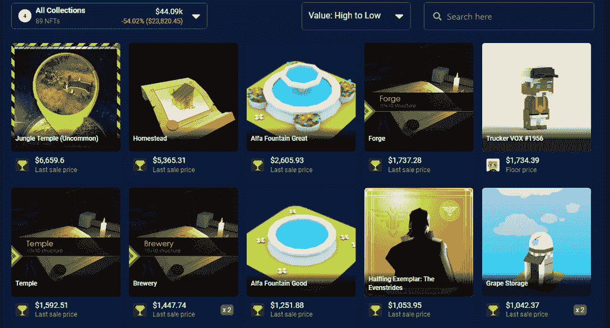

# 盛大游戏送出 400 万美元的游戏代币奖品

> 原文：<https://web.archive.org/web/https://dappradar.com/blog/gala-games-may-mayhem-4-million-token-and-nft-prizes>

## 一年一度的活动 May Mayhem 允许玩家获得 GALA 和 NFTs

在一年一度的 May Mayhem 活动期间，Gala Games 将向活跃玩家发放 400 万美元的庆祝代币，同时还赠送免费游戏 NFT。农业游戏城镇之星将成为这些活动的一大部分，但其他游戏也将加入这场战役。联欢晚会在 [**一篇博文**](https://web.archive.org/web/20220927114854/https://blog.gala.games/gala-games-puts-up-millions-in-may-c7b364ff9001) **中宣布欢庆活动。**

## 摘要

*   ***春晚游戏在五月期间发放 400 万美元的*** [***春晚代币***](https://web.archive.org/web/20220927114854/https://dappradar.com/hub/token/eth/GALA/ETH?from=0x15d4c048f83bd7e37d49ea4c83a07267ec4203da) ***。***
*   ***城镇之星玩家可分享一半奖金；其他几个倡议和游戏将分享其余部分。***
*   ***免费 NFT 空投快照将于 4 月 29 日发布。***
*   ***Gala Games 玩家可以使用***[***【DappRadar Portfolio Tracker】***](https://web.archive.org/web/20220927114854/https://dappradar.com/hub/wallet)***查看自己 NFT 持股的价值。***

去年，Gala Games 发放了 100 万美元的奖金，现在他们已经将这一数字提高到 400 万美元。这笔钱的一半将付给活跃在城镇之星的玩家，而另外 200 万美元将付给整个五月份其他几个游戏和活动的参与者。不过具体细节还没有透露。

此外，Gala Games 的团队将分发 NFT。整个五月，该团队将向持有特定 NFT 系列物品的玩家免费发放 NFT。快照将在太平洋时间 4 月 29 日星期五晚上 11:59 拍摄。该系统将查看用户以太坊钱包和 Gala Games 平台上的相关百宝箱中的 NFT。

## 面向游戏玩家的区块链生态系统

Gala Games 希望与 GameFi 运动保持距离，可以说 GameFi 运动对习惯了《使命召唤》、《超级马里奥》和《堡垒之夜》的游戏玩家没有吸引力。相反，Gala Games 希望在完整的游戏体验中加入区块链元素。城镇之星是一个具有挑战性和竞争性的农业游戏，而蜘蛛坦克提供了基于团队的 MOBA 游戏。他们正在开发幻想 MMORPG 米兰多斯，一个名为 Superior 的第三人称动作游戏，以及生存 MMORPG 行尸走肉:帝国。凭借皮特·莫利纽克斯的遗产和威尔·莱特对 VoxVerse 的投入，Gala Games 的团队甚至[吸引了传奇游戏设计师](https://web.archive.org/web/20220927114854/https://dappradar.com/blog/games-industry-veterans-join-gala-games-ecosystem/)。

Gala Games 长期依赖区块链以太坊，但现在正寻求推出自己的生态系统。社区给这个项目贴上了 GalaChain 的标签，但是在内部他们把它命名为[项目 Gyri](https://web.archive.org/web/20220927114854/https://dappradar.com/blog/gala-games-presents-its-blockchain-what-is-project-gyri/) 。新的区块链将为玩家量身定制，由社区成员运营，允许任何人转让、拥有、分享、出售、交易和保存私人钱包中的数字游戏资产。

## GALA 感受到了市场不景气

尽管 Gala Games 创造了一些新的和令人兴奋的东西，但这并没有反映在 GALA token 的价格上。像大多数市场一样，GALA token 在过去几个月里已经失去了很多价值。仅在过去 30 天内，GALA 的市值就下跌了 34%。与此同时，美元从 0.72 美元的历史高点下跌了 76%。目前，GALA 的价格为 0.17 美元。

#### [潜入 GALA，交换 DappRadar 上的代币](https://web.archive.org/web/20220927114854/https://dappradar.com/hub/token/eth/GALA/ETH?from=0x15d4c048f83bd7e37d49ea4c83a07267ec4203da)

在 5 月 1 日周日之前，我们的空投页面上仍有春晚[空投活动。在](https://web.archive.org/web/20220927114854/https://dappradar.com/hub/airdrops)[这篇解说文章](https://web.archive.org/web/20220927114854/https://dappradar.com/blog/explained-gala-games-gala-token)中了解更多关于令牌的信息。

## 你的盛会资产的价值

Gala Games 的玩家也可以将他们的钱包连接到 DappRadar。这将允许他们在一个概览中看到他们的 NFT 和代币组合持有的估计价值。只需遵循以下步骤:

1.  进入您在春晚游戏网站的账户
2.  转到安全>私钥
3.  下载私钥
4.  打开 Metamask >打开我的帐户(彩色圆圈)
5.  向下滚动>按“导入帐户”
6.  在此输入您的 Gala Games 帐户的私钥
7.  按“导入”
8.  现在，您的 Gala Games 帐户与您的 Metamask 绑定在一起。格拉茨。
9.  前往 DappRadar >将您的 Gala Games Metamask 钱包连接到网站
10.  [进入投资组合](https://web.archive.org/web/20220927114854/https://dappradar.com/hub/wallet)，查看您资产的估计价值！