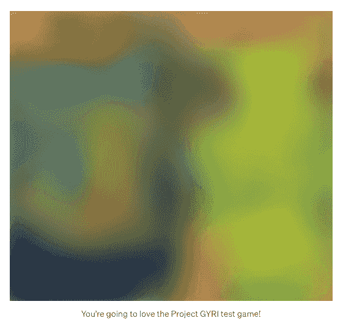
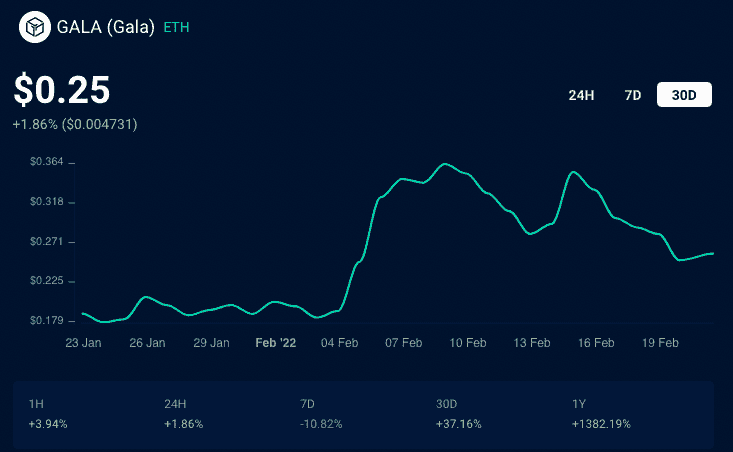
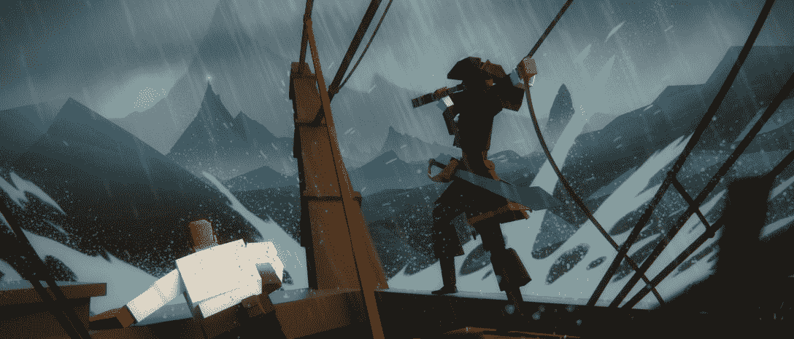

# Gala Games 展示其区块链:什么是 Project Gyri？

> 原文：<https://web.archive.org/web/https://dappradar.com/blog/gala-games-presents-its-blockchain-what-is-project-gyri>

## 游戏、音乐和娱乐的区块链生态系统

Gala Games 公布了他们定制的区块链基础设施计划，为备受期待的 Gala Games 生态系统提供动力。在接下来的几周内，一个社区范围的测试活动将上线，作为新链的第一次应用，称为 Project GYRI，它最终将成为 Gala 的区块链。

区块链联欢晚会，或称联欢晚会，已经期待了一段时间了。该团队表示，他们正在构建为其生态系统提供动力所需的精确区块链，除其他功能外，还具有以下功能:

*   更快的交易
*   减少对环境的影响
*   降低网络费用
*   降低铸造成本
*   整个节日世界的互操作性
*   以太坊的可移植性

## 庆典团队

创始团队由几位知名人士组成，如 Zynga 的联合创始人埃里克·希尔迈尔(Eric Schiermeyer)、加密领域最早的重要采矿者之一、拥有多项区块链技术专利的赖特·瑟斯顿(Wright Thurston)以及热门游戏《Farmville 2》背后的创意总监迈克尔·麦卡锡。此外，他们聚集旨在服务于游戏玩家，并给他们一个高品质的，游戏优先的体验与区块链所有权的好处。

Gala Games 团队表示，随着 [Gala 扩展到音乐](/web/20221101160311/https://dappradar.com/blog/music-flows-through-the-crypto-world/)和其他领域，他们可以对区块链的开发进行一些小的修改和进一步的改进，从而向听众、支持者、艺术家、粉丝、收藏家、早期用户等提供奖励。项目 GYRI 将在压力下测试 Gala Games 区块链解决方案的能力，同时就过渡对用户进行培训。

## 什么是 GYRI 项目？

直到最近，这个区块链在社区和团队中被称为“GalaChain”，但是人们决定创建一个 testnet 将是最好的前进方式。由于帐户可以保存金钱，并且游戏中的物品可以真正拥有，因此安全性对于 Gala 继续建立信任至关重要。

在接下来的几周内，一个社区范围的测试活动将作为 Project GYRI 的第一个应用程序投入使用。这个临时游戏将演示项目 GYRI 将如何运作。玩家将可以通过游戏赚取测试代币，然后通过测试获得一些不同的游戏内升级和奖励。重要的是，测试不能在任何地方转让或出售。这个测试不涉及销售或真金白银，但 Gala Games 团队希望它能给每个参与者带来乐趣和启发。在编写时，TBA 游戏将提供给整个社区使用一个标准的游戏帐户进行测试。官方声明甚至包括一张模糊的图片来进一步戏弄它。

一旦修复了错误，并且在测试环境中完全检查了一切，资产的迁移就将开始。重要的是，在大多数情况下，用户将能够将资产锁定到以太坊区块链中，尽管它们在游戏平台中并不容易使用。

## 盛会正在兴起

虽然 BTC、ETH 和 SOL 等加密货币在 2021 年出现了一些令人印象深刻的价格波动，但元宇宙和游戏代币无疑抢了风头。没有什么比 Gala Games GALA token 更能说明问题了，今年迄今为止，GALA token 已经上涨了 1300%以上。尽管加密价格整体下滑，Gala 甚至在去年 11 月初继续增长。将 GALA 升级为市值排名前 75 位的[加密货币](https://web.archive.org/web/20221101160311/https://www.coingecko.com/)。11 月中旬，受欢迎的加密货币交易所比特币基地将 GALA 添加到其可用硬币列表中，这给散户投资者带来了大量风险。

## 盛大游戏“玩即赚”

他们目前的游戏《城镇之星》是一款从游戏到收入的游戏，在游戏中，用户可以开发一个城镇来进行竞争性耕作，这实际上是 Gala 的旗舰测试游戏。玩家使用 NFT 游戏中的物品来完成日常挑战，并收集 TownCoin 奖励。11 月，Gala 宣布玩家可以购买许可来运行 Town Star nodes，本质上是为游戏的一部分提供动力来获得额外的奖励。计划推出一个专门针对城镇之星的新城镇标志。第二个游戏是[蜘蛛坦克，现在也在测试中。](https://web.archive.org/web/20221101160311/https://app.gala.games/games/spider-tanks)

万众期待的米兰多斯还没有上线；然而，Gala [在 12 月公布了](https://web.archive.org/web/20221101160311/https://blog.gala.games/what-is-materium-66e4a981cc64)游戏玩家何时以及如何获得游戏内实用令牌 Materium。该团队举办了一次游戏测试，示范 NFT 的所有者，拥有独特能力的精英化身，有资格收集数量不详的令牌。此外，一辆米兰多斯[沃克斯龙 NFT 以超过 148 万美元](https://web.archive.org/web/20221101160311/https://dappradar.com/ethereum/collectibles/vox-collectibles-mirandus)的价格售出，在 12 月[底](https://web.archive.org/web/20221101160311/https://dappradar.com/blog/mirandus-vox-dragon-nft-switched-owners-for-1-48-million)登上了 DappRadar 顶级销售排行榜的榜首。

领先的玩赚游戏 [Axie Infinity 在将程序切换到其定制的浪人侧链和武士刀敏捷时起飞](/web/20221101160311/https://dappradar.com/blog/dappradar-integrates-ronin-the-axie-infinity-sidechain/)。允许最受欢迎的区块链游戏的玩家快速且廉价地进出游戏，收取他们的奖励，并且享受他们自己而不遭受以太币气体费用。GYRI 项目是否会对 GALA token 的价格产生类似的影响还有待观察。

[<picture></picture>](https://web.archive.org/web/20221101160311/https://dappradar.com/blog/gala-games-announces-drop-date-for-vox-nfts)[<picture></picture>](https://web.archive.org/web/20221101160311/https://dappradar.com/hub/wallet)[<picture></picture>](https://web.archive.org/web/20221101160311/https://dappradar.com/hub/token/eth/GALA)

***以上不构成投资建议。此处给出的信息仅供参考。请行使尽职调查，做你的研究。作者持有 ETH、BTC、AGIX、HEX、LINK、GRT、CRO、OMI、不可变 X、GALA、AVASTR、GMEE、CUBE、RADAR、FLOW、FTM、BNB、SPS、WRLD、ATOM 和 ADA。***

 NewsletterUnsubscribe at any time. [T&Cs](https://web.archive.org/web/20221101160311/https://dappradar.com/terms) and [Privacy Policy](https://web.archive.org/web/20221101160311/https://dappradar.com/privacy-policy)