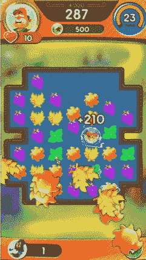
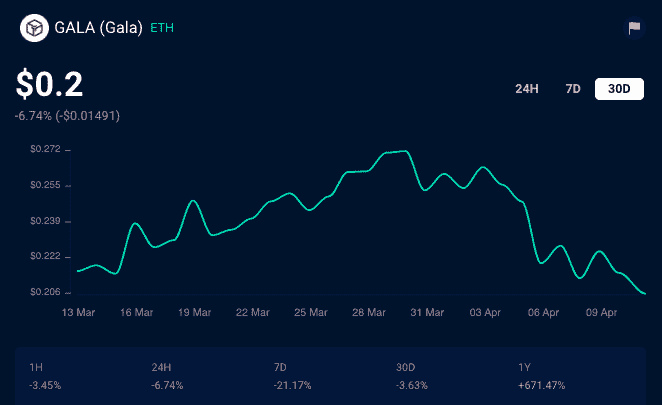

# Gala Games 用 Town Crush Alpha 戏弄 GalaChain 功能

> 原文：<https://web.archive.org/web/https://dappradar.com/blog/gala-games-tease-galachain-capability-with-town-crush-alpha>

## 将经济与游戏相结合以增强 web3

区块链游戏公司 Gala Games 宣布在其定制的 Gala 区块链上推出第一个项目。Town Crush open alpha 是项目 GYRI 的第一阶段，测试和准备过程。这将最终导致 Gala 完全迁移到一个由游戏玩家 ***运营并为其服务的定制区块链生态系统。***

## 摘要

*   2022 年 2 月底，Gala [首次公布了自己的区块链](https://web.archive.org/web/20221208170843/https://dappradar.com/blog/gala-games-presents-its-blockchain-what-is-project-gyri)
*   阿尔法测试[于 2022 年 4 月 11 日](https://web.archive.org/web/20221208170843/https://app.gala.games/games)开始
*   城镇粉碎是一个简单的比赛 3 游戏
*   [现在开始玩到赚的测试代币](https://web.archive.org/web/20221208170843/https://dappradar.com/blog/gala-games-tease-galachain-capability-with-town-crush-alpha/#TEST-Token)，但是这些代币不代表任何价值
*   Town Crush 旨在[给 GalaChain 施加压力](https://web.archive.org/web/20221208170843/https://dappradar.com/blog/gala-games-tease-galachain-capability-with-town-crush-alpha/#Testing,-feedback,-and-next-steps-)并帮助团队学习

Gala Games 是一个区块链游戏和媒体生态系统，由 [GALA token](https://web.archive.org/web/20221208170843/https://dappradar.com/hub/token/eth/GALA/ETH?from=0x15d4c048f83bd7e37d49ea4c83a07267ec4203da) 提供支持。该令牌遵循以太坊区块链上的 ERC-20 标准，因此与 BNB 链兼容。

城镇粉碎阿尔法项目的启动是 GYRI 项目的第一阶段。玩家第一次可以体验在 Gala 的区块链上玩游戏。他们希望这将展示区块链的许多[不同操作，这些操作最终将用于为整个春晚游戏生态系统提供动力。](https://web.archive.org/web/20221208170843/https://dappradar.com/blog/gala-games-presents-its-blockchain-what-is-project-gyri)

## 如何玩城镇粉碎

那些已经拥有 Gala Games 帐户的玩家可以立即在浏览器中开始玩《小镇粉碎》。或者，感兴趣的玩家可以在网站上建立一个帐户，然后开始玩。城镇粉碎的目标是收集尽可能多的点来完成关卡，并使农民走得更远。

玩家在完成关卡时会获得星星，然后使用这些星星来购买额外的生命或游戏中的物品，以在游戏中获得优势。如果你用完了生命，这不是一个问题，一定数量的生命将被免费发放。要玩 match-3 游戏，您需要点击并拖动一个符号来切换另一个相邻的符号。游戏不允许玩家进行切换，除非是颜色匹配。没有计时器，但是你只有一定数量的移动来达到该级别所需的点数。此外，这是一个简单的游戏，具有基本的玩赚机制，旨在建立一个强大的追随者。我们已经通过《探索 T2》的镜头看到了强烈的互动

## 测试令牌

该测试的一个关键组件是一个名为 test 的新临时令牌。它存在于区块链 GYRI 项目中，目前在 Gala Games 平台上被称为 GalaChain。这里有一些关于测试的基本知识。

当你第一次启动游戏时，系统会提示你支付测试代币的费用。这是为了允许在游戏中用测试代币购买，这可能会在项目 GYRI 的未来阶段实现。这个概念是玩家期望在区块链晚会上看到的功能的一个尝试。此外，虽然玩家的库存中没有任何测试代币，但在测试过程中的某个时候他们可能会有。

测试是 Gala 链条上的一个实际令牌，但它不可转让，也没有任何货币价值。它的存在只是为了测试区块链。

## 测试、反馈和后续步骤

Gala 计划让尽可能多的玩家参加这个最初的城镇粉碎游戏测试，希望他们能够克服关键的质量问题，并通过提供一个完全可操作的，可扩展的游戏。更重要的是，它旨在让 GalaChain 承受压力，并帮助团队了解突破点。在某些情况下，执行中的小问题是意料之中的，也是有益的。《小镇粉碎》完全是作为一个测试来构思和创作的，虽然创作者们做了出色的工作，但它不应该被视为一个完全开发或完整的游戏。相反，把它看作是对区块链盛会的一次有趣的测试。

此外,《小镇粉碎》的设计不同于玩家可能习惯的其他游戏。该团队有意在链条上创造了比定位任何断点所需更多的互动，使春晚能够为更重要的游戏支持更多的观众。鼓励社区成员通过团队的[官方不和谐频道](https://web.archive.org/web/20221208170843/https://discord.com/invite/JtnCNMFnnK)玩游戏并报告错误和问题。

## 晚会越来越强

Gala Games 是一家区块链游戏初创公司，由 Zynga 联合创始人 Eric Schiermeyer 协助创建，承诺推出令人兴奋的东西。在 Zynga，Schiermeyer 是对每个人都有吸引力的休闲游戏的支持者，比如 Zynga Poker 和 FarmVille。在 Gala Games，他的团队，包括首席游戏设计师迈克尔·麦卡锡，创造了广受欢迎的游戏赚钱竞技农业游戏，[城镇之星](https://web.archive.org/web/20221208170843/https://dappradar.com/hub/token/eth/TOWN/ETH?from=0x3dd98c8a089dbcff7e8fc8d4f532bd493501ab7f)。

此外， [Gala 在音乐世界的足迹正在增长](/web/20221208170843/https://dappradar.com/blog/snoop-dogg-and-gala-music-drop-nft-stash-boxes/)。最近，他们与世界著名的说唱歌手 Snoop Dogg 合作了他的新音乐主题项目[藏物盒](https://web.archive.org/web/20221208170843/https://dappradar.com/blog/snoop-dogg-and-gala-music-drop-nft-stash-boxes)。这些 NFT 出现在官方音乐网站上，代表了这位说唱歌手的新专辑《死囚之歌》。

区块链的引入让 Gala 走上了与浪人 Axie Infinity 和 DFK 连锁 T2【DeFi Kingdoms】相似的轨迹。Gala 希望将其蓬勃发展的生态系统建立在以太坊和其他第 1 层和第 2 层解决方案之外。[原生 GALA token](https://web.archive.org/web/20221208170843/https://dappradar.com/hub/token/eth/GALA/ETH?from=0x15d4c048f83bd7e37d49ea4c83a07267ec4203da) 目前是第 75 种加密货币，市值 16 亿美元。它目前的价格在 0.2 美元左右，在最近 12 个月里上涨了 671%。

Source: [DappRadar](https://web.archive.org/web/20221208170843/https://dappradar.com/hub/token/eth/GALA/ETH?from=0x15d4c048f83bd7e37d49ea4c83a07267ec4203da)

***以上不构成投资建议。此处给出的信息仅供参考。请行使尽职调查，做你的研究。作者持有多种加密货币的头寸，包括 BTC、瑞士法郎和雷达。***

[<picture></picture>](https://web.archive.org/web/20221208170843/https://dappradar.com/blog/gala-games-announces-drop-date-for-vox-nfts)[<picture></picture>](https://web.archive.org/web/20221208170843/https://dappradar.com/hub/wallet)[<picture></picture>](https://web.archive.org/web/20221208170843/https://dappradar.com/hub/token/eth/GALA)