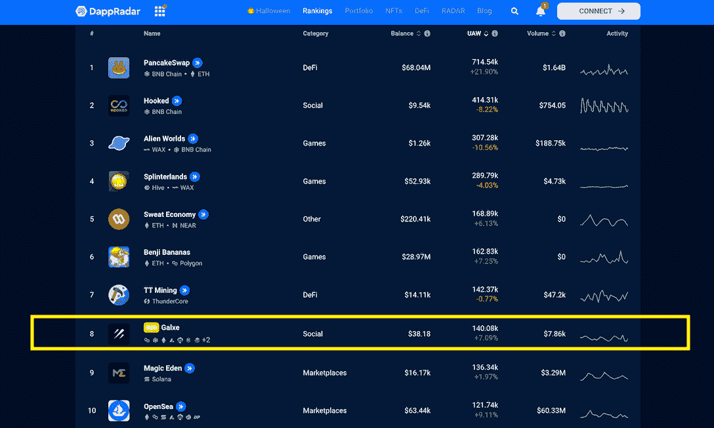
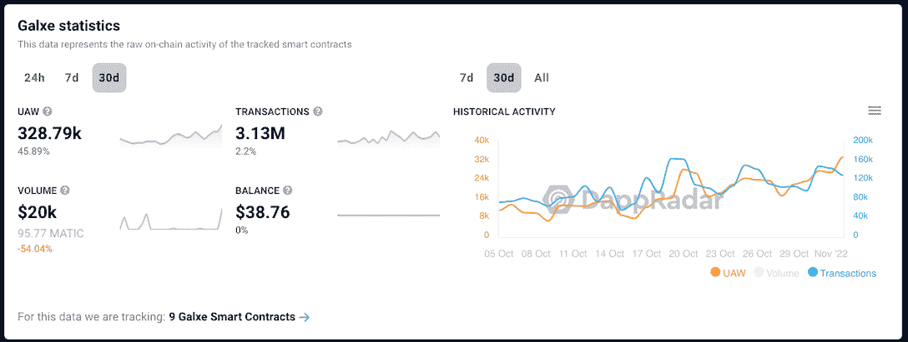
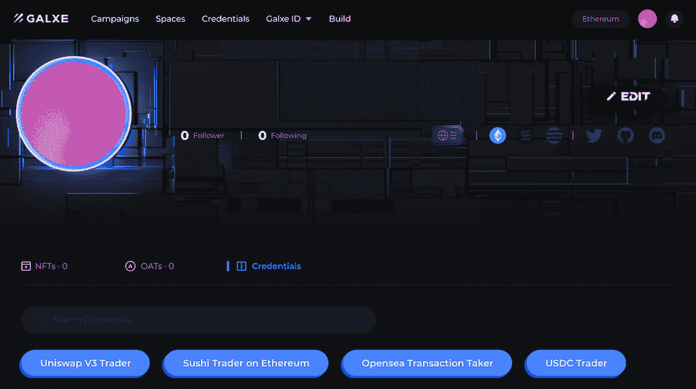
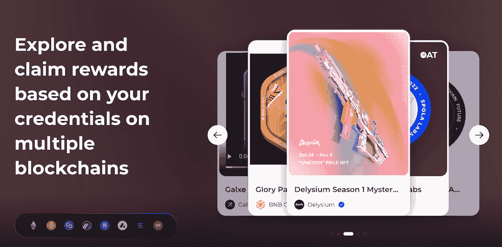
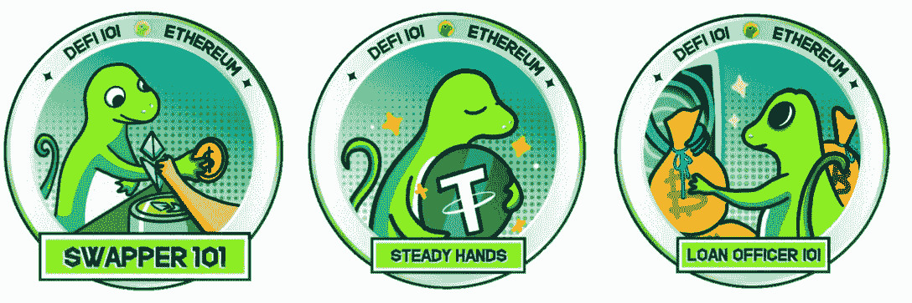
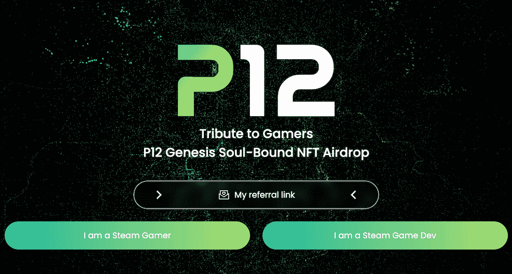

# Galxe 让用户了解 DeFi，寻找 NFT 交易，建立 Web3 声誉，等等

> 原文：<https://web.archive.org/web/https://dappradar.com/blog/galxe-lets-users-learn-defi-find-nft-deals-build-web3-reputation-and-more>

## Galxe 是一个协作性的凭证基础设施，使品牌和开发者能够参与 Web3 中的社区。

Galxe 数据网络探索了 Vitalik Buterin 早先设想的围绕灵魂绑定令牌和 Web3 身份认证的想法。值得注意的是，Galxe 已经取得了一些显著的成果，超过 1000 个项目与 Galxe 合作，以寻找、吸引和维护他们的用户。

**内容:**

*   [什么是 Galxe？](https://web.archive.org/web/20221201051756/https://dappradar.com/blog/galxe-lets-users-learn-defi-find-nft-deals-build-web3-reputation-and-more/#what)
    *   [Galxe ID](https://web.archive.org/web/20221201051756/https://dappradar.com/blog/galxe-lets-users-learn-defi-find-nft-deals-build-web3-reputation-and-more/#id)
    *   [活动](https://web.archive.org/web/20221201051756/https://dappradar.com/blog/galxe-lets-users-learn-defi-find-nft-deals-build-web3-reputation-and-more/#campaign)
    *   [空间](https://web.archive.org/web/20221201051756/https://dappradar.com/blog/galxe-lets-users-learn-defi-find-nft-deals-build-web3-reputation-and-more/#space)
*   [哪些项目在使用 Galxe？](https://web.archive.org/web/20221201051756/https://dappradar.com/blog/galxe-lets-users-learn-defi-find-nft-deals-build-web3-reputation-and-more/#which)
    *   [用硬币壁虎学习赚钱](https://web.archive.org/web/20221201051756/https://dappradar.com/blog/galxe-lets-users-learn-defi-find-nft-deals-build-web3-reputation-and-more/#gecko)
    *   [P12 创世纪灵魂束缚 NFT 空投](https://web.archive.org/web/20221201051756/https://dappradar.com/blog/galxe-lets-users-learn-defi-find-nft-deals-build-web3-reputation-and-more/#p12)
*   【Galxe 带来了哪些改变？

Web3 的格局在不断变化，但通过 DappRadar 排名，用户总能发现哪些 dapps 正在引起轰动。

如果你是一个忠实的 DappRadar 用户，你一定知道我们排名的前 10 名通常被游戏、DeFi 协议和 NFT 市场占据。但最近，我们看到社交 dapp 突然出现，用户参与度堪比游戏 Benji Bananas 和健身 dapp Sweat Economy 等流行 dapp。

[DappRadar Rankings](https://web.archive.org/web/20221201051756/https://dappradar.com/rankings)

本文将解释 Galxe，这是一个在社交领域取得突破的协议。

## 什么是 Galxe？

Galxe 是一个开放的协作式证书数据网络，所有 Web3 开发人员均可访问。使用 Galxe，用户可以管理数字证书并为数据网络做出贡献。因此，品牌和项目可以利用 Galxe 的无许可 NFT 基础设施来游戏化他们的忠诚度系统，开展营销活动，获取用户等。

[Get more stats about Galxe](https://web.archive.org/web/20221201051756/https://dappradar.com/binance-smart-chain/social/galxe)

每个用户都需要用他们的钱包登录，申领奖励需要交易。这解释了 DappRadar 如何能够跟踪 Galxe 中的用户活动。让我们更深入地探究一下这一切意味着什么。

在过去的 30 天里，Galxe 记录了超过 328，000 个不同的活动钱包，增幅高达 45.89%。假设每个唯一的钱包主人都是一个唯一的人，那就意味着过去一个月有 32.8 万用户使用了 Galxe。最重要的是，这些用户为 Galxe 的智能合同贡献了超过 300 万笔交易。

这些数字证明了 Galxe 目前相当受欢迎。

### Galxe ID

Galxe ID 是 Galxe 上的一个功能，作用类似于一个人的简历。它可以是用户的 Web3 LinkedIn 或脸书个人资料。要申领您的 Galxe ID，请访问 Galxe 网站并连接您的 MetaMask 钱包。登录后，您可以看到您的区块链行为已经应用于某些凭据标签。

如下图所示，我的凭证标签(蓝色按钮)显示我是 Uniswap V3 交易者、以太坊寿司交易者、OpenSea 交易接受者等。

由于 Galxe 是一个开放平台，开发者可以通过 Galxe ID toolkit 规划更多的凭证来丰富用户档案。此外，开发人员可以根据用户的数字证书为他们提供定制的功能。

[Check out Galxe](https://web.archive.org/web/20221201051756/https://dappradar.com/multichain/social/galxe)

### 运动

品牌或项目可以使用 Galxe 上的活动功能来组织活动，邀请用户参与，并奖励他们特殊的 NFT，这些 NFT 将在未来给予他们特殊的奖励或解锁权限。

到目前为止，许多品牌和项目已经利用这一功能来提高品牌知名度，促进赌注和治理，实施 NFT 驱动的忠诚度系统，等等。

[Access Galxe via single dapp page](https://web.archive.org/web/20221201051756/https://dappradar.com/multichain/social/galxe)

我们将在案例研究部分提供更多的例子。

### 空间

空间是一个品牌或者一个项目的验证页面。这个页面归档了一个项目通过 Galxe 启动的所有事件。关于空间最好的事情是这些页面的所有主机都经过验证；因此，用户不需要担心被骗。更重要的是，他们可以安心享受参与竞选的回报。

品牌每次组织活动，都会向 Galxe 的协议贡献数据。未来，Galxe 可以利用这些数据生成不同的用户角色，为品牌更精准地锁定用户。

## 哪些项目在用 Galxe？

接下来，让我们看看一些已经在 Galxe 上成功开展活动的项目，以便有一个更坚实的想法。

### 用 CoinGecko 学会赚钱

Galxe 和 CoinGecko 想要一种有趣的方式来教育和激励 Web3 生态系统上的 DeFi 初学者和爱好者。为了做到这一点，他们创建了终极 DeFi 课程，通过学习赚钱的机制来奖励用户。

“DeFi 101”NFT 活动包括五个课程，每个课程都有不同的 DeFi 协议任务。用户在完成每项任务后都会收到徽章。此外，完成所有五门课程的用户将获得荣誉学生徽章。

16，730 名用户参与了这项活动，每项协议都扩大了他们的社区。但是，最重要的是，该活动鼓励新用户更多地了解 Web3 世界。

### P12 创世纪灵魂束缚 NFT 空投

为了实现用户参与的目标，Project 利用 Galxe 的基础设施开展了名为 P12 Genesis Soul-Bound NFT 空投的空投活动。该活动旨在获取 Steam 上的离线游戏凭证。

想要的数据包括一个人在 Steam 上玩了多少小时，或者一个人是否在 Steam 上发布了一个流行的游戏。这些信息随后被密封到创世纪灵魂绑定的 NFT 中，并分发给所有符合条件的玩家和游戏发行商。

一周之内，Project 就拥有了超过 520，000 名经过认证的 Steam 游戏玩家/开发者和超过 210，000 名在线 NFT 持有者。

[Check out Galxe](https://web.archive.org/web/20221201051756/https://dappradar.com/binance-smart-chain/social/galxe)

## Galxe 带来了哪些改变？

Galxe 基础设施是提炼 Web3 生态系统参与者分散身份的关键。由于 Web3 还处于早期，用户数据高度碎片化和分散。

我们使用的许多产品并不直接采用分散技术。例如，像 CoinGecko 这样的数据服务提供商和 CoinDesk 这样的媒体机构本身并不提供 dapps。此外，大量的外链数据，包括 Twitter、Steam 和 Discord 上的数据，有助于定义我们的身份，被排除在区块链世界之外。

这正是 Galxe 旨在克服的。Galxe 的基础设施可以支持通过多个数据源管理凭证。此外，Galxe 希望利用这些数据来帮助团队更好地服务他们的用户。

需要注意的是，Galxe 不像一个集中式组织那样控制数据。相反，真正拥有数据的是用户自己。希望这些数据可以帮助团队更好地服务他们的用户。

为此，Galxe 鼓励其社区为其证书数据网络做出贡献，当其他人利用经策划的证书时，策展人将获得奖励。

Galxe 用户数据最近的增长证明了其平台在用户中越来越受欢迎，越来越多的项目正在其上开展活动。这反过来又会激励更多的开发者加入到生态系统中来开发更有价值的凭证。

[Access Galxe via single dapp page](https://web.archive.org/web/20221201051756/https://dappradar.com/multichain/social/galxe)

## 随身携带您的 Web3 之旅

使用 DappRadar 移动应用程序，再也不会错过 Web3。查看最受欢迎的 dapps 的性能，并关注您投资组合中的 NFT。您在 DappRadar 上的帐户会与我们的移动应用程序同步，这样您很快就可以选择实时接收提醒。

[Download the DappRadar app now](https://web.archive.org/web/20221201051756/https://dappradar.app.link/blog)[<picture></picture>](https://web.archive.org/web/20221201051756/https://play.google.com/store/apps/details?id=com.portfolio.dappradar) NewsletterUnsubscribe at any time. [T&Cs](https://web.archive.org/web/20221201051756/https://dappradar.com/terms) and [Privacy Policy](https://web.archive.org/web/20221201051756/https://dappradar.com/privacy-policy)