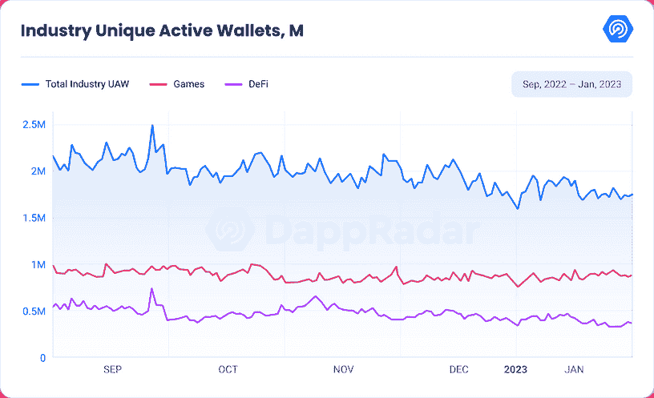
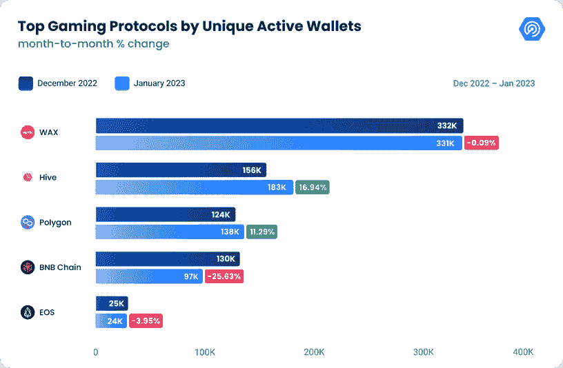
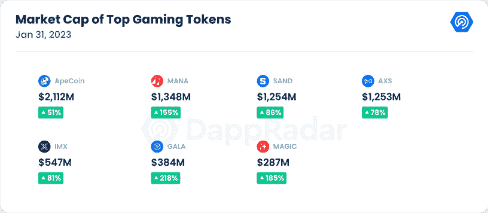
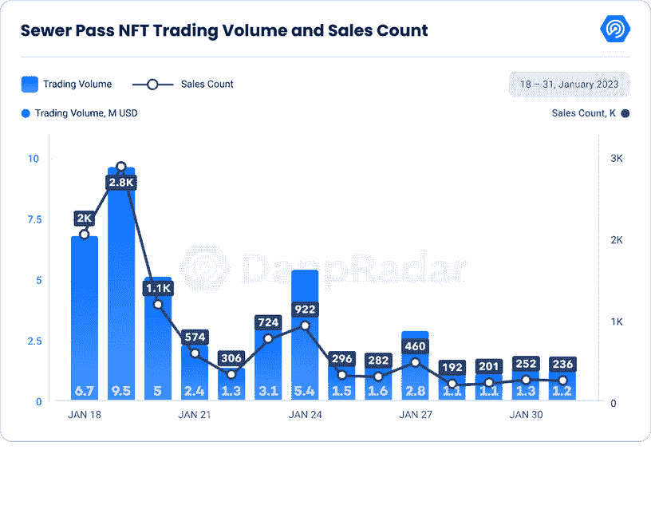
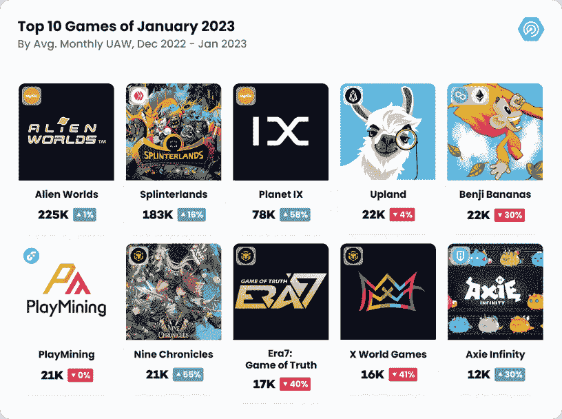
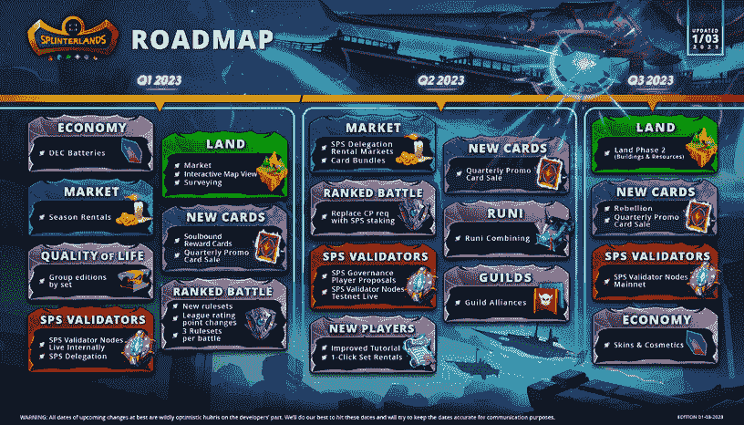
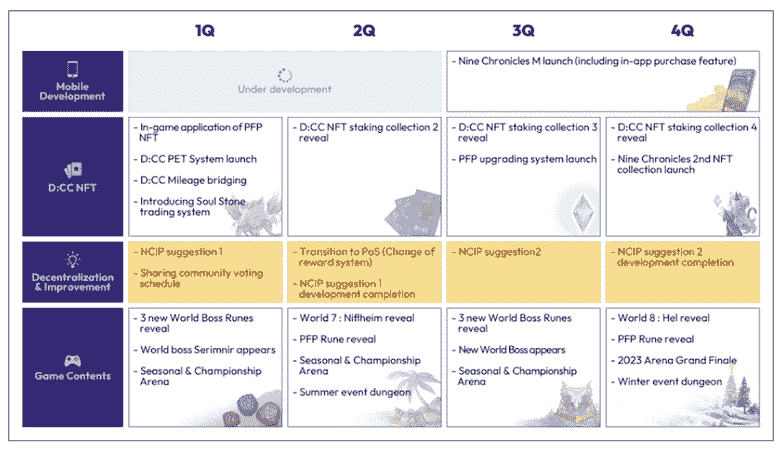
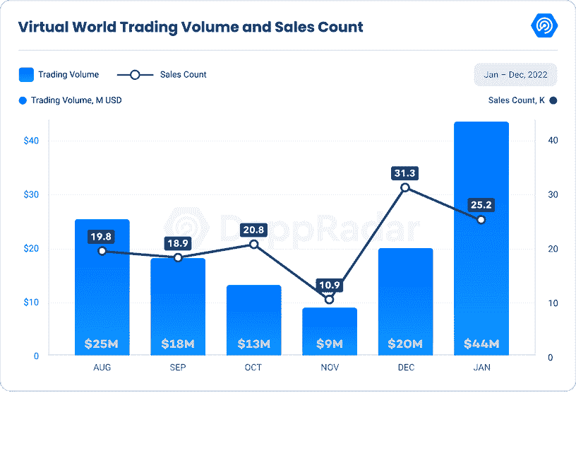
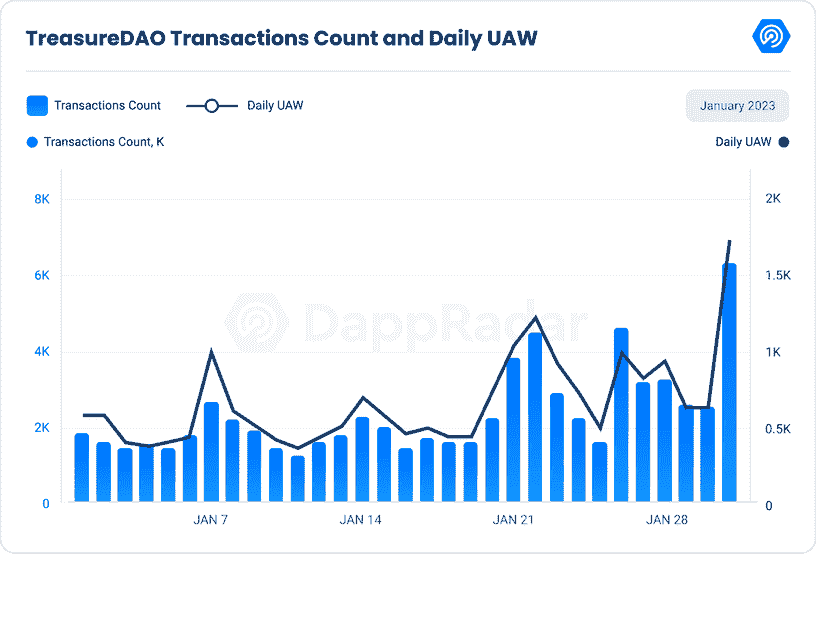
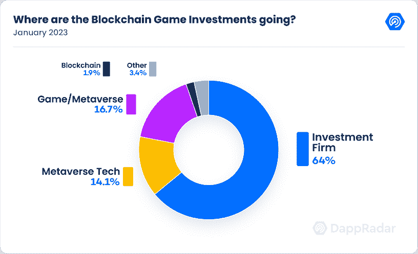

# 游戏和元宇宙代币价格上涨，环比指标强劲

> 原文：<https://web.archive.org/web/https://dappradar.com/blog/game-and-metaverse-tokens-rally-with-strong-on-chain-metrics>

## DappRadar x BGA 游戏报告#11

在经历了 2022 年区块链行业艰难的一年后，该行业似乎在 2023 年有了一个充满希望的开端，游戏将一路领先。在 [DappRadar](https://web.archive.org/web/20230311195650/https://dappradar.com/) ，我们分析了今年开始的游戏链数据，结果确实令人鼓舞。

## 关键要点

*   线上游戏活动增长 1.31%，至 858，621 dUAW，占 1 月份 dapp 活动的 48%。
*   顶级游戏代币的市值平均增长了 122%，其中 GALA 领先 218%，达到 3.84 亿美元。
*   在宇迦举办 Dookey Dash 比赛的两周内，Sewer Pass 产生了 4460 万美元的交易量，售出了 10561 张 NFT。
*   随着《国土安全与起源》第二季的推出，Axie Infinity 的交易量飙升了 71%，达到 720 万美元
*   对区块链奥运会和元宇宙项目的投资总计 1.56 亿美元。

## 目录

1.  [区块链游戏行业概述](https://web.archive.org/web/20230311195650/https://dappradar.com/blog/game-and-metaverse-tokens-rally-with-strong-on-chain-metrics/#Chapter-1)
2.  [看好连锁指标和大肆宣传推动顶级游戏代币大幅增加](https://web.archive.org/web/20230311195650/https://dappradar.com/blog/game-and-metaverse-tokens-rally-with-strong-on-chain-metrics/#Chapter-2)
3.  [游戏中的 NFT:游戏领域的宇迦效应](https://web.archive.org/web/20230311195650/https://dappradar.com/blog/game-and-metaverse-tokens-rally-with-strong-on-chain-metrics/#Chapter-3)
4.  [UAW 的《行星九号》、《夹板地》和其他顶级区块链游戏](https://web.archive.org/web/20230311195650/https://dappradar.com/blog/game-and-metaverse-tokens-rally-with-strong-on-chain-metrics/#Chapter-4)
5.  随着《国土安全》和第二季的推出，Axie Infinity 正在复苏
6.  [虚拟世界交易额猛增 114%，达到 4450 万美元](https://web.archive.org/web/20230311195650/https://dappradar.com/blog/game-and-metaverse-tokens-rally-with-strong-on-chain-metrics/#Chapter-6)
7.  [宝藏岛:在元宇宙释放魔法的力量](https://web.archive.org/web/20230311195650/https://dappradar.com/blog/game-and-metaverse-tokens-rally-with-strong-on-chain-metrics/#Chapter-7)
8.  区块链奥运会和元宇宙项目筹集了 1.56 亿美元
9.  Square Enix 将它的第一款 NFT 游戏 Symbiogensys 带到 Polygon
10.  [关闭](https://web.archive.org/web/20230311195650/https://dappradar.com/blog/game-and-metaverse-tokens-rally-with-strong-on-chain-metrics/#Conclusion)

## 1.区块链游戏行业概述

整个 2022 年，区块链产业经历了起伏跌宕的过山车，但区块链产业的[博彩业](https://web.archive.org/web/20230311195650/https://dappradar.com/topic/games)今年年初的数字充满希望，这值得关注。区块链博彩的连锁数据显示，1 月份的活跃度增长了 1.31%，每日独立活跃钱包(dUAW)达到 858，621 个，占 dapp 活跃度的 48%。

游戏活动最活跃的区块链网络继续保持着 [Wax](https://web.archive.org/web/20230311195650/https://dappradar.com/rankings/protocol/wax/category/games) 的地位，拥有 331，000 个 dUAW。凭借 2023 年 1 月 75%的统治地位，[外星世界](https://web.archive.org/web/20230311195650/https://dappradar.com/wax/games/alien-worlds)一直领先于蜡像区块链，而游戏活动数量保持不变。

蜂巢以 183，108 dUAW 位居第二，环比增长 17%。[夹板地](https://web.archive.org/web/20230311195650/https://dappradar.com/hive/games/splinterlands)是蜂巢上最占优势的 dapp，占 75%的优势。

[Polygon](https://web.archive.org/web/20230311195650/https://dappradar.com/rankings/protocol/polygon/category/games) 以 138,701 dUAW 位居第三，环比增长 11.29%。这一趋势进一步巩固了 Polygon 作为一个游戏链，其中[星球九](https://web.archive.org/web/20230311195650/https://dappradar.com/polygon/games/planet-ix)成为 Polygon 上最主要的游戏 dapp，占 1 月份链上活动的 59%。

虽然 Wax 上的活动保持稳定，但 Hive 和 Polygon 的游戏活动在 2023 年 1 月都有所增长。区块链游戏的这些链上指标描绘了一幅充满希望的画面，其中游戏活动推动了区块链技术的采用。此外，还值得注意的是，在顶级游戏区块链的代币方面，数字也很乐观。这将在下一节中进行分析。

## 2.看好连锁指标和炒作推动顶级游戏代币大幅增长

博彩业一直是一个繁荣和受欢迎的市场，吸引了来自世界各地的 26.9 亿消费者，并为 T2 带来了 1035 亿美元的年收入。几年前，游戏已经超过了电影业。随着区块链技术和加密货币的兴起，游戏代币近年来变得越来越受欢迎。2023 年 1 月，顶级游戏代币的激增令人印象深刻。

根据截至 1 月 31 日的市场数据， [ApeCoin](https://web.archive.org/web/20230311195650/https://dappradar.com/hub/token/eth/APE/ETH?from=0x4d224452801aced8b2f0aebe155379bb5d594381) 以 2，112，042，188 美元的市值领先，比本月初增长了 51.99%。紧随其后的是 [SAND](https://web.archive.org/web/20230311195650/https://dappradar.com/hub/token/eth/SAND?from=0x3845badade8e6dff049820680d1f14bd3903a5d0) ，市值 1254095738 美元，百分比涨幅 86.64%。

但其中最大的赢家是 [GALA](https://web.archive.org/web/20230311195650/https://dappradar.com/hub/token/eth/GALA?from=0x15d4c048f83bd7e37d49ea4c83a07267ec4203da) ，其市值为 384，667，325 美元，比本月初增长了 218.75%。其他值得注意的赢家包括 [IMX](https://web.archive.org/web/20230311195650/https://dappradar.com/hub/token/eth/IMX?from=0xf57e7e7c23978c3caec3c3548e3d615c346e79ff) ，魔术师， [AXS](https://web.archive.org/web/20230311195650/https://dappradar.com/hub/token/eth/AXS?from=0xbb0e17ef65f82ab018d8edd776e8dd940327b28b) 。

那么，游戏代币激增的背后是什么？

由于围绕宇迦实验室生态系统的大肆宣传，ApeCoin 的人气飙升。[下水道通行证](https://web.archive.org/web/20230311195650/https://dappradar.com/ethereum/collectibles/sewer-pass)的推出尤其成功，最近与天美时的合作，以[无聊猿游艇俱乐部](https://web.archive.org/web/20230311195650/https://dappradar.com/ethereum/collectibles/bored-ape-yacht-club)和[变异猿游艇俱乐部](https://web.archive.org/web/20230311195650/https://dappradar.com/ethereum/collectibles/mutant-ape-yacht-club)不可替代代币(NFTs)为特色，引起了更多的兴趣。

GALA 最近收购了一家拥有超过 2000 万活跃用户和超过 15 款游戏的移动游戏工作室，成为头条新闻。这一举措极大地扩展了区块链春晚网络的覆盖范围。此外，春晚音乐平台上的一位艺术家[获得了格莱美](https://web.archive.org/web/20230311195650/https://twitter.com/GoGalaGames/status/1613049168121200640?ref_src=twsrc%5Etfw%7Ctwcamp%5Etweetembed%7Ctwterm%5E1613049168121200640%7Ctwgr%5E74b66e66482fe10338565329188aa08b7970b053%7Ctwcon%5Es1_&ref_url=https%3A%2F%2Fcoindcx.com%2Fblog%2Fcrypto-news-global%2Fwhy-did-gala-price-jump-over-150-percent-in-the-past-10-days-11-january-2023%2F)提名，这为生态系统带来了更多的轰动。

魔术的受欢迎程度飙升可以归因于围绕[宝岛](https://web.archive.org/web/20230311195650/https://dappradar.com/arbitrum/games/treasuredao)的大肆宣传。这个新平台旨在将创作者、收藏家和粉丝聚集在一个独特的生态系统中，每个人都可以从中受益。这个概念受到了游戏社区的热烈欢迎，这帮助推高了魔法的价格。

最后， [AXS](https://web.archive.org/web/20230311195650/https://dappradar.com/hub/token/eth/AXS/ETH?from=0xbb0e17ef65f82ab018d8edd776e8dd940327b28b) 随着《Axie Origins》第二季的开播和《国土安全》的开播一直在兴风作浪。这些举措扩大了 AXS·区块链网络的覆盖范围，并在游戏玩家和投资者中引起了极大的兴奋。

总之，2023 年 1 月顶级游戏代币的激增对该行业来说是一个非常积极的信号。链上指标看涨，围绕这些硬币的炒作只会越来越多。

## 3.游戏中的 NFT:游戏领域的宇迦效应

NFTs 的世界已经被宇迦实验室的最新项目——下水道通道——弄得沸沸扬扬。这一新系列在 NFT 爱好者和收藏家之间引起了极大的兴趣和兴奋。下水道通行证是一个创新项目，旨在通过允许玩家使用他们的 NFT 来玩游戏和赚取奖励，从而将创作者放在第一位。该项目利用了 [Bored Ape 游艇俱乐部](https://web.archive.org/web/20230311195650/https://dappradar.com/ethereum/collectibles/bored-ape-yacht-club)的生态系统，并已经产生了令人印象深刻的回报，交易量达到 4460 万美元，头 13 天交易了 10561 笔 nfts。

下水道通道不仅仅是另一个 NFT 项目；它有一个独特的功能，使其有别于其他系列。它被设计成玩 Dookey Dash 游戏的钥匙。该游戏从 1 月 19 日持续到 2 月 8 日，玩家需要设定高分，然后将解开宇迦实验室所谓的“第一章”中的一些东西。

下水道通行证的推出对 NFT 市场产生了重大影响，特别是在 NFT 游戏领域，因为这只是一个开始，宇迦实验室计划在未来推出更多的 NFT 游戏。对于 NFT 爱好者和收藏家来说，这是一个令人兴奋的消息，因为这为他们使用资产和赚取回报开辟了新的途径。它还强调了 NFTs 在游戏行业中的潜力，我们可以期待看到更多创新的游戏项目。有趣的是，最高的 Dookey Dash 分数是由职业堡垒之夜选手蒙格拉获得的。

## 4.UAW 的《行星九号》、《夹板岛》和其他顶级区块链游戏

随着区块链博彩业的持续增长，我们来仔细看看 2023 年 1 月 UAW 评选的十大游戏。

根据 on-chain 数据显示，[外星世界](https://web.archive.org/web/20230311195650/https://dappradar.com/multichain/games/alien-worlds)仍居首位，平均 225,203 dUAW，较 2022 年 12 月微增 0.19%。1 月下旬，他们开放了第二轮社区资助计划，允许任何有想法改善或扩大外星世界生态系统的人提交 TLM 代币提案，以帮助资助他们的发展

排在第二位的是夹板地，平均为 183，003 dUAW，月环比大幅增长 16%。1 月初，他们宣布了 2023 年的路线图，同时在 2 月推出了 DEC 电池和灵魂绑定卡。建立他们的验证节点网络，更新他们的游戏经济和引入陆地游戏是他们计划的关键组成部分。

Source: [Twitter](https://web.archive.org/web/20230311195650/https://twitter.com/splinterlands/status/1613576535470137344)

此外，他们计划推出反抗卡，以及季度促销卡销售。该团队还列出了市场类别中的一些变化，如季租、卡捆绑和 SPS 代表团租赁市场。

第三名是科幻元宇宙游戏《行星九号》,该游戏月环比增长 58.40%，接近 79，000 dUAW。这款总部位于 NFT 的战略游戏拥有一个生态系统，1 月份的销售额超过 4 亿美元，交易额超过 200 万美元，在区块链游戏市场排名第三。

《九历记》是另一个值得注意的赢家，平均 21，507 dUAW，增长了 55%。他们最近宣布了他们的路线图，其中包括分散化&改进建议部分，在那里社区可以发表他们对游戏和操作的意见，以改善九历记。

Source: [Medium](https://web.archive.org/web/20230311195650/https://ninechronicles.medium.com/%EF%B8%8F2023-nine-chronicles-roadmap-is-here-%EF%B8%8F-c39df02e71c1)

该团队已经计划了几项活动，如 D:CC NFT 的游戏内应用程序和第一季度推出 D:CC PFP 宠物系统，第二季度过渡到更新的股权证明区块链，第三季度推出《九连环 M》，第四季度推出《2023 竞技场大结局》。

尽管 [Axie Infinity](https://web.archive.org/web/20230311195650/https://dappradar.com/multichain/games/axie-infinity) 在榜单上排名第十，但仍呈现增长态势，平均增长 30.45%，达到 12,068 dUAW。在下一节中，我们将讨论 Axie Infinity 的一月份更新，以及它们是如何恢复的。

## 5.随着《国土安全》和第二季的推出，Axie Infinity 正在复苏

世界上最受欢迎的区块链游戏之一 Axie Infinity 在 2022 年 3 月面临历史上最大的 DeFi 黑客攻击之一，当时连接其浪人网络侧链和以太坊的桥梁被黑客攻击，价值 6.22 亿美元的加密货币。

尽管遭到黑客攻击，Axie Infinity 仍在继续前进和创新。2022 年 12 月下旬，游戏推出了旗舰陆基资料片《国土安全》的 alpha 版本。在《国土安全》中，玩家引导他们的 axes 在 Lunacia 星球上建立定居点，在那里玩家可以从事各种任务，包括收集和储存材料，优化 axes 农业，在土地上建造建筑物，创建新设备，以及增加可以拥有的 axes 的数量。

《国土安全》的一个创新特性是它允许使用游戏中的土地进行 DeFi 功能。这意味着玩家可以通过分散交易(DEX)平台 Katana 上的赌注和流动性供应来使用他们的土地赚取收益。玩家还可以通过将自己的土地出租给其他玩家来获得额外的收入。这为 Axie Infinity 生态系统增加了一个新的游戏层，允许玩家通过他们的土地 NFT 获得奖励和被动收入。Axie Infinity 也在 1 月 11 日推出了 Axie Infinity: Origins 第二季。本赛季比第一季节奏更快，总共持续 42 天，排行榜支付快照在整个赛季中出现四次，而不是在赛季结束时出现一次。奖励和升级也会发生得更快，创造了强大的动力，尤其是在与新时代系统搭配的时候。

除了推出《国土安全》和《第二季》，Axie Infinity 还宣布了 2023 年武士刀流动性挖掘计划，这是通过武士刀 DEX 提供的 RON 流动性和激励措施的最新更新。从 2 月 7 日开始，WETH 对的发射奖励将转移到武士刀 DEX 上的新 RON 对。这将增加罗恩的流动性，并支持更多的活动浪人区块链。

这是迈向 RON staking 的重要一步，因为这将使 RON 更具流动性且更易接近。随着 Axie Infinity 生态系统的不断发展，很明显，该团队希望为玩家提供新的机会。虽然 DeFi 黑客是一个挫折，但 Axie Infinity 生态系统已经显示出了它的弹性。

## 6.虚拟世界交易额猛增 114%，达到 4450 万美元

虚拟世界在游戏玩家和投资者中广受欢迎。交易量和销售数量的最新数据表明，这一趋势继续快速增长。虚拟世界增长的激增来自各种元宇宙 dapps 的成功，它们为人们提供了与虚拟环境互动的新方式。

根据数据，虚拟世界的交易量和销售额在 2023 年 1 月出现了显著增长。1 月份的交易量为 4450 万美元，比 2022 年 12 月的 2070 万美元增长了 114%。然而，销量下降了 19%,达到 25，224 辆。

这种增长背后的驱动因素之一是元宇宙 dapps 的成功，如[沙盒](https://web.archive.org/web/20230311195650/https://dappradar.com/multichain/games/the-sandbox)和[分散化](https://web.archive.org/web/20230311195650/https://dappradar.com/multichain/social/decentraland)。[例如，沙盒](https://web.archive.org/web/20230311195650/https://dappradar.com/multichain/games/the-sandbox)在 2023 年 1 月达到了 150 万美元的交易量，比 2022 年 12 月增长了惊人的 114%。类似地，[分散的土地](https://web.archive.org/web/20230311195650/https://dappradar.com/multichain/social/decentraland)实现了 110 万美元的交易量，环比增长 83%。

这一增长激增的另一个重要因素是 [Otherdeed for Otherside](https://web.archive.org/web/20230311195650/https://dappradar.com/ethereum/collectibles/otherdeed-for-otherside) ，它在 2023 年 1 月实现了 3700 万美元的交易量，环比增长 107%。这种增长来自前面提到的 Sewer Pass 发布的成功。

随着虚拟世界的流行持续增长，我们可以期待看到元宇宙 dapps 空间的进一步发展。这将为投资者和游戏玩家提供更多参与虚拟世界经济的机会，因此，我们可以期待在未来看到交易量和销售额的持续增长。

## 7.宝藏岛:在元宇宙释放魔法的力量

Arbitrum 上的一个去中心化的 NFT 生态系统，作为区块链上的一个游戏平台，它很快受到欢迎。但 TreasureDAO 不仅仅是另一个 DeFi 平台或元宇宙项目。其独特的 token MAGIC 支撑着不断增长的 metaverses 和游戏网络，使其成为一个构建新型组织的平台。

宝藏岛的核心游戏围绕着名为“桥世界”的元宇宙中心，在这里魔法被释放和收获。玩家使用宝藏 NFT 挖掘魔法，建造基础设施和装备继续挖掘。魔法是市场交易的唯一货币，它与宝藏的关系形成了支撑桥世界的平衡。DAO 使用 MAGIC emissions 来开发新项目并支持更成熟的项目。

TreasureDAO 最初是一个社区驱动的游戏，流动性是其游戏的核心。它的创始人认识到大多数 GameFi 项目面临的问题，注意力和流动性，并看到许多团队正在以错误的方式解决问题。魔法被设计成一种资源，可以用来引导新的元经文，并通过将其编织到多个游戏叙事中来增加其效用。有了 MAGIC，GameFi 项目就不必为了吸引眼球而去构建拥有丰富叙事和错综复杂的游戏内经济的广阔游戏世界。相反，他们可以开发人们喜欢的常规游戏，并将魔法作为其基础货币。

宝岛不仅仅是一款游戏，它还是一个建设元宇宙项目的平台。其市场目前支持 10 个 NFT 系列，并计划再加入 10 个。军团创世纪系列的销量直线上升，最稀有的 NFT 售价超过 70 ETH。除了这些收藏之外，还有其他的 Smolverse NFTs，生命的种子，以及最初的战利品衍生物，宝藏。宝藏系列是目前唯一一个在赌注矿坑中获得魔法的系列，但这种情况有望改变，因为当新的赌注矿坑投入使用时，创世纪军团将获得大部分排放。

即将到来的整合包括 OlympusDAO(欧姆)蘑菇收集和流行的链上项目，P2E 以太兽人。这两个系列的底价都在 1 ETH 以上，一旦它们的集成完成，应该会给市场带来稳定的销量。

宝藏岛不仅仅是一个游戏，它是一个分散的游戏主机，任何新的或现有的游戏都可以插入宝藏生态系统，并享受魔法、市场和社区的好处。如果成功，MAGIC 将代表一个生态系统中的一部分，该生态系统拥有一个完整的 NFT 和游戏产品垂直市场，所有这些产品都相互连接并建立在彼此的基础上。就像乐高积木一样。有了宝岛，建设和探索元宇宙的可能性是无限的。

## 8.区块链奥运会和元宇宙项目筹集了 1.56 亿美元

2023 年 1 月，区块链博彩业在 10 项投资中筹集了 1.56 亿美元，这是一个充满希望的开局。Courtside Ventures 对其第三只早期风险投资基金进行了最大的投资，总额为 1 亿美元，专注于体育、收藏品、健康和游戏。

基金 III 的投资者包括全球各种职业体育行业的领导者，包括球队老板、运动员和行业高管。这使得 Courtside Ventures 的总承诺资本超过 2 亿美元，成为业内最大的风险投资基金之一。

Courtside Ventures 专注于体育、收藏品、健康和游戏，这清楚地表明了区块链博彩业的潜在增长。Courtside Ventures 的合伙人邦德(Bond)在接受 Games Beat 采访时表示，最大的成果总是出现在新的分销形式和新的货币化形式的交汇处。Web3 的前景也在这个领域，Courtside Ventures 已经做好了充分的准备来利用它。

除了 Courtside Ventures 之外，2023 年 1 月的投资中有 64%流向了投资公司，元宇宙理工大学(也被称为元宇宙导向型公司)以 11.5%的比例紧随其后。这对该行业来说是一个积极的信号，因为它表明更多的项目正准备投资区块链博彩业，重点是元宇宙。

## 9.Square Enix 为 Polygon 带来了它的第一个 NFT hame，Symbiogensys

日本游戏发行商 Square Enix 的备受期待的 NFT 游戏 Symbiogenesis 将在 Polygon 上首次亮相。Polygon 使用侧链提供比以太坊的 mainnet 更快更便宜的交易，在以太坊上推出的最初计划因可扩展性问题而取消后，polygon 被选中。

Symbiogenesis 是一个故事驱动的收藏品游戏，它将拥有 10，000 个与战略游戏机制相关的角色 NFT。此外，游戏中还会有其他的 NFT。虽然玩这个游戏并不要求拥有一个角色 NFT，但 Square Enix 表示，它为体验增加了“额外价值”。此外，人物 NFT 持有者可以创建“副本 NFT”与其他玩家分享故事信息。

游戏设定在一个被污染的未来地球上的漂浮大陆，一旦龙威胁到他们的安全避难所，社会被迫团结起来，做出艰难的选择。Symbiogenesis 将采用与故事情节相关的回合制游戏，随着用户完成任务以及持有或交易 NFT，游戏将采用不同的路径。

虽然 Square Enix 展示了龙塔罗牌和怪物故事书等 NFT 项目，但该公司没有透露这些资产的成本或它们如何影响游戏的具体细节。尽管如此，Symbiogenesis 在区块链游戏行业是一个令人兴奋的发展，因为 web2 游戏世界的一个主要参与者已经将一些重点放在了 web3 上。

Square Enix 的这一举动清楚地表明，区块链博彩正变得越来越主流，传统博彩公司正在注意到这一点。随着更多游戏公司探索 web3 和 NFTs 的可能性，我们可以期待看到行业的进一步创新和增长。

## 10.关闭

虽然 2022 年对区块链博彩业来说是充满挑战的一年，但 2023 年 1 月的表现表明，该行业正在反弹。尽管区块链博彩业在 2022 年经历了低迷，但强劲的资金为 2023 年的严重“建设”奠定了基础。

资金现在流向了已经证明了自己在构建网络 3 游戏方面经验的工作室，投资者正在考虑更长远的未来，在未来的五到十年内。2023 年，焦点的这种变化将为区块链游戏市场的建设者创造新的动力和机会，玩家和投资者的期望都将提高，质量优先于数量。

随着行业转变为“构建”模式，那些能够创造出最优秀游戏的人将会胜出。前景是积极的，我们期待看到区块链博彩业在未来继续增长和创新。所以游戏开始。