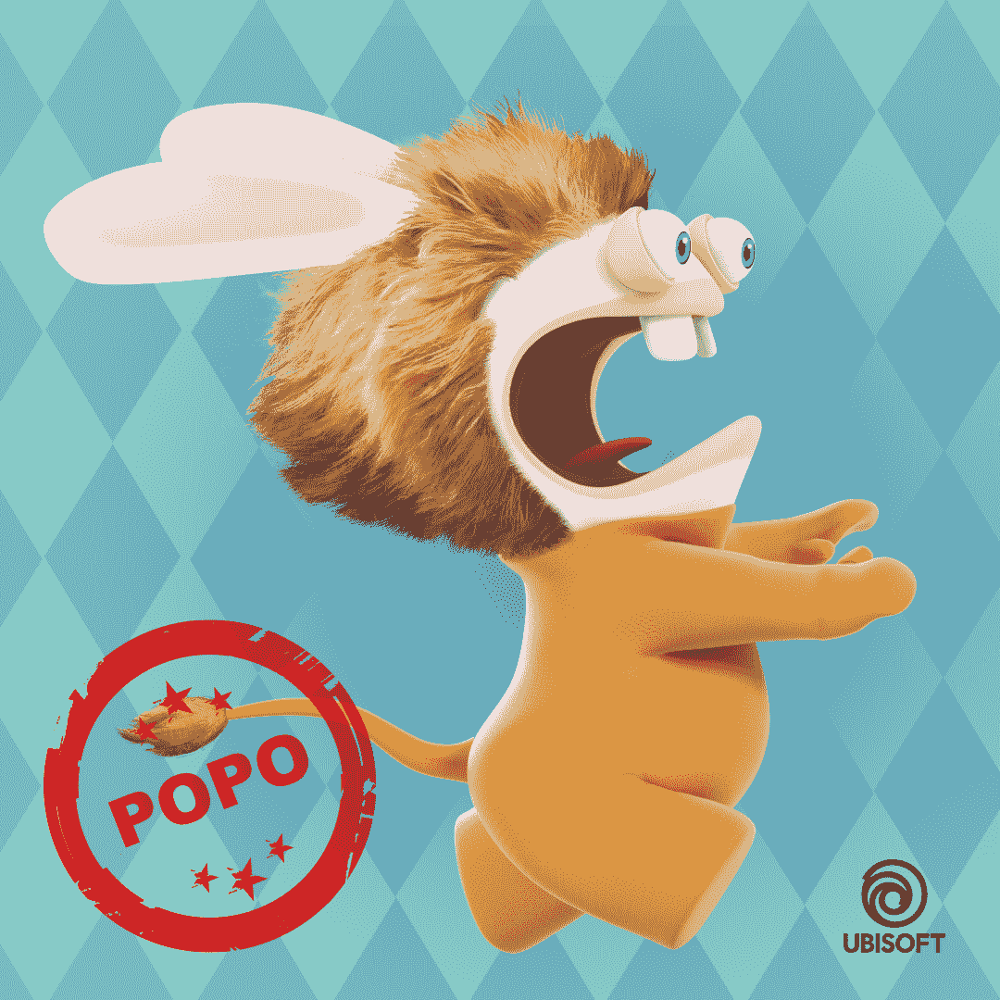

# 游戏公司育碧将胡言乱语的兔子带入沙盒

> 原文：<https://web.archive.org/web/https://dappradar.com/blog/game-company-ubisoft-brings-raving-rabbids-into-the-sandbox>

## 育碧将为元宇宙带来更多的知识产权。Bwaaaahhhhhhh！

**沙盒和法国游戏公司育碧已经** [**宣布了**](https://web.archive.org/web/20230112022243/https://medium.com/sandbox-game/the-sandbox-partners-with-ubisoft-to-bring-rabbids-to-the-metaverse-c7c08fd1360e) **的合作伙伴关系，因为这个游戏巨头将它的老牌品牌之一 Rabbids 带入了元宇宙。来自 Raving Rabbids 的疯狂兔子将进入育碧自己的虚拟庄园的沙盒，充满互动体验。**

育碧将把包括物品和角色在内的数字资产带到沙盒社区。允许任何人使用这些 NFT 资产创建新的游戏或体验。育碧自己的虚拟财产位于其他品牌附近，包括阿迪达斯。

[https://web.archive.org/web/20230112022243if_/https://www.youtube.com/embed/jP73-jcMNwU?feature=oembed](https://web.archive.org/web/20230112022243if_/https://www.youtube.com/embed/jP73-jcMNwU?feature=oembed)

最近育碧[在他们的在线射击游戏《幽灵侦察断点》中引入了 NFTs](https://web.archive.org/web/20230112022243/https://dappradar.com/blog/ubisoft-bringing-ghost-recon-game-nfts-to-tezos) 。玩家可以在节能的 Tezos 区块链上免费赢得 NFT。然而，这一消息引起了强烈的反弹，因为任何涉及 NFTs 的事情都可能成为游戏玩家的危险信号。另外育碧[投资了 Dogami](https://web.archive.org/web/20230112022243/https://dappradar.com/blog/ubisoft-invests-in-nft-pet-game-platform-dogami) 。

## 介绍胡言乱语的兔子

胡言乱语的兔子在任天堂 Wii 上引起了数字娱乐世界的注意。2006 年育碧发布了 Rayman Raving Rabbids，很快这些 Raving Rabbids 就独立出来，成为了他们自己的品牌。疯狂兔子已经出现在 20 多个不同的游戏和他们自己的电视节目中。

然而，这并不是我们第一次在区块链看到胡言乱语的兔子。2020 年 6 月，育碧发布了名为《Raving Rabbids Token》的 NFT 作品集，收入直接捐给了联合国儿童基金会。

Raving Rabbids NFT for UNICEF

## 为品牌打开的沙盒

育碧并不是第一家涉足沙盒的公司。沙盒中充满游戏的虚拟世界吸引了数百家合作伙伴，包括阿迪达斯、雅达利、蓝精灵、爱心熊和行尸走肉等主流品牌。此外，它还吸引了像 Deadmau5、Avenged Sevenfold、Richie Hawtin 和 Snoop Dogg 这样的名人和艺术家。

所有这些对元宇宙的关注以及将它们与沙盒联系在一起的品牌对代币和土地价格产生了强烈的影响。最便宜的地块现在超过 1 万美元，而在 2021 年 10 月，土地价格还不到 2000 美元。

与此同时，在 2021 年 10 月的最后几天之前，本地的[沙币](https://web.archive.org/web/20230112022243/https://dappradar.com/hub/token/eth/SAND?from=0x3845badade8e6dff049820680d1f14bd3903a5d0)还不到一美元。自那以后，代币的最高价为 8.40 美元，现在的价值为 4.61 美元。用户、玩家和投资者可以使用[和](https://web.archive.org/web/20230112022243/https://dappradar.com/hub/token/eth/SAND?from=0x3845badade8e6dff049820680d1f14bd3903a5d0)购买虚拟房地产或数字资产，同时代币也可以作为游戏奖励。
你希望哪家游戏公司进入元宇宙，拥抱 NFTs 和游戏即赚？在 Discord 上与 DappRadar 社区讨论这一点以及更多内容。