# 游戏公会——行业健康和可持续性分析

> 原文：<https://web.archive.org/web/https://dappradar.com/blog/game-guilds-an-analysis-of-the-industrys-health-and-sustainability>

## 风投和私人投资者已经向区块链的游戏项目投入了超过 100 亿美元。

这篇报道最初由 [Bibyt](https://web.archive.org/web/20220906092115/https://blog.bybit.com/en-US/post/game-guilds-an-analysis-of-the-industry-s-health-and-sustainability-bltbe1410a2a68bca68/) 发布。

# 概述

基于区块链的游戏已经成为 web3 最有前景的领域之一。根据与本地合同交互的独立活动钱包(UAW)的数量来衡量，游戏分散应用程序(dApps)目前占整个区块链行业活动的 52%。

此外，自 2021 年初以来，风投和私人投资者已经向区块链的游戏项目投入了超过 100 亿美元，而与 NFTs 和 DeFi 等其他相关 web3 市场的融合提醒了所有人 GameFi 的潜力。

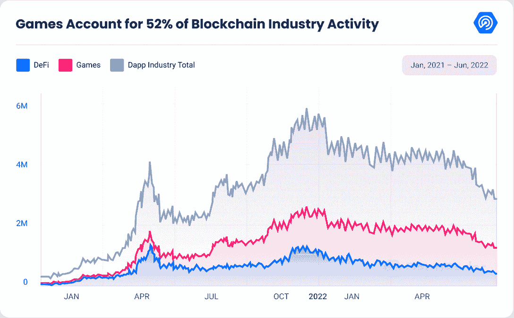

Source: [DappRadar](https://web.archive.org/web/20220906092115/http://www.dappradar.com/)

尽管区块链游戏在早期的亨特硬币时代就已经存在，或者是最近的 CryptoKitties 游戏，由 Axie Infinite 领导的“玩到赚”(P2E)革命让区块链游戏在地图上出现。P2E 游戏公司允许全球数百万玩家利用他们的游戏时间赚钱。

这种趋势开始在新兴市场获得社会意义，如菲律宾和委内瑞拉，这些国家在疫情后经济上苦苦挣扎。基于加密货币、NFT 和 DeFi 原则的游戏经济为区块链游戏的现状铺平了道路。

然而，由于市场和经济条件，区块链奥运会并不容易获得一些个人。

### 进入游戏公会

本报告讨论了行会的出现及其内部组织和经济模式。在此之后，我们深入行业，提供行业见解和趋势。最后，我们评估游戏公会是否是为未来可持续发展而建立的。

## 游戏公会的出现

随着一些 P2E dapp 的受欢迎程度呈指数级增长，这些游戏的准入门槛对数百万玩家来说变得太陡太快了。虽然区块链游戏提供了丰厚的回报，但其中一些平台需要在密码或 NFTs 方面进行初始投资才能开始游戏，在某些情况下，这成为了新玩家的准入门槛。

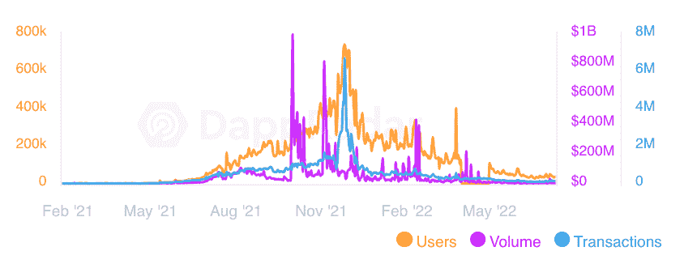

Source: [DappRadar](https://web.archive.org/web/20220906092115/http://www.dappradar.com/)

以 Axie Infinity 为例，在 2021 年下半年的 NFT 宣传期间，一个人平均需要至少 600 美元来投资三只 Axie 宠物，才能开始玩这个游戏。

试图成为流行游戏社区一部分的人被价格压得喘不过气来，这种情况在新兴经济体中很常见，那里的人很难达到所需的启动资金。

2018 年，Gabby Dizon 开始出租他的 Axie 怪兽，以便菲律宾同胞可以访问新游戏。他开始将他的 NFTs 货币化，同时给其他人一个机会成为有回报的视频游戏潮流的一部分。这是加密游戏公会的本质。这些组织为那些想利用自己的游戏时间赚钱的人提供了机会。

# 游戏公会是如何运作的，游戏公会给游戏带来了哪些价值

在 20 世纪 90 年代和 21 世纪初，像《魔兽世界》、《帝国时代》以及最近的《英雄联盟》和《堡垒之夜》这样的在线游戏体验将社交元素置于聚光灯下。因此，玩家组成了自组织的团体或行会，在这些免费游戏中联合起来完成任务并获得战利品奖励。然而，在区块链时代，行会团体的需求是不同的。GameFi 生态系统中的公会，如 Axie Infinity、沙盒等，旨在使游戏本身的访问民主化。反过来，降低了从游戏中获得丰厚回报的门槛。

加密游戏公会已经成为 web3 行业的重要玩家。游戏公会是一群管理分散的 GameFi 资产的个人，同时支持一种经济模式。公会或任何其他投资者拥有的 NFTs 或其他资产被借给其他玩家，让他们接触到业内一些领先的游戏 dApps。

公会的主要经济来源是奖学金——这是一个为游戏提供更容易进入的入口的项目。公会奖学金允许持有游戏资产的人将它们安全地分发给那些可能因价格过高而出局的玩家。通过这样做，资产持有人可以累积利益并获得奖励，而不必玩游戏，同时游戏玩家可以享受平台并获得利益，而不必进行初始投资。公会作为一个安全的中间人，协调 NFT 持有者或游戏管理者和与 NFT 一起游戏以获得奖励的学者。这个系统试图为所有相关方创造一个双赢的局面。

大多数区块链公会的学者系统都有独特的特点和要求，尽管过程基本相同。世界各地的玩家可以申请奖学金，开始玩各公会提供的各种游戏。

2020 年，Dizon 和 Beryl Li 共同创建了 Yield Guild Games (YGG)，这是一个领先的行业协会，它开启了 Axie scholar 的热潮。截至 2022 年 4 月，YGG 已经在全球招募了近 30，000 名学者，其中 86%来自 Axie。此外，由 YGG 推广的奖学金计划和 [Sky Mavis 游戏](https://web.archive.org/web/20220906092115/https://dappradar.com/multichain/games/axie-infinity)可以在任何 NFT 游戏中复制，包括夹板地、Thetan Arena、沙盒、Gods Unchained 和几乎所有可用的 web3 游戏，极大地扩大了游戏供应。截至目前，YGG 已经与 40 多个游戏合作，成为他们计划的一部分。

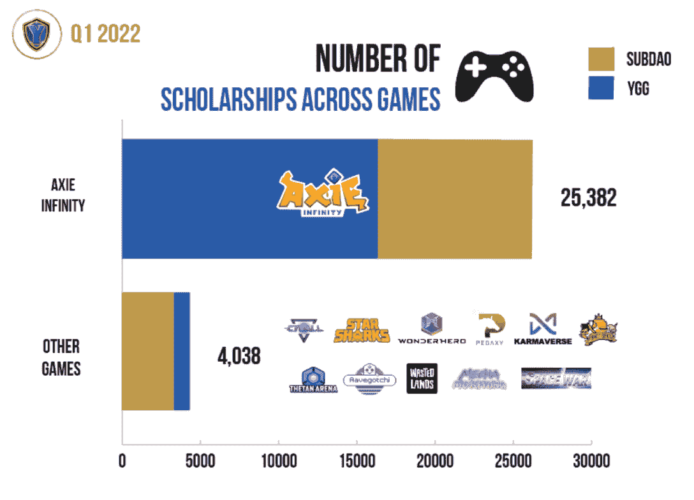

Source: [YGG](https://web.archive.org/web/20220906092115/https://medium.com/yield-guild-games/yield-guild-games-community-update-q1-2022-2afe6f2f549b#:~:text=2022%20has%20opened%20with%2013,expand%20the%20reach%20of%20YGG.)

像 YGG 一样，功德圈也是行业内的另一个领先公会。MC 令牌是仅次于 YGG 的第二大公会令牌，而公会是来自东南亚(SEA)、非洲、南美和许多发展中地区的 3750 名学者的家园。

Ready Player DAO、GuildFi、Unix 和 Avocado DAO 是其他拥有数千名全球学者的公会。总的来说，随着数十个令人兴奋的公会概念的出现，公会市场正在不断发展。

疫情开始后，奖学金模式的社会影响变得巨大。来自经济不景气地区的玩家从热门的区块链游戏中获益匪浅。在某些情况下，玩家积累的这些奖励甚至会超过他们所在地区的 GDP。

与此同时，行业协会催生了一种新经济，来自风投的投资和发布新项目的蓬勃发展的条件不断吸引和创造空间价值。

虽然奖学金是公会的主要收入来源，但是投资在公会的运作中扮演着重要的角色。一方面，来自公认风投的资本为行业协会提供了在这个 web3 领域进一步扩张的额外机会。

自 2021 年以来，风投和私人投资者已经向区块链游戏协会或孵化器投资了 18 亿美元。这个数字代表了区块链游戏相关项目所筹得总价值的 20%。

像 Animoca Brands、a16z、潘迪拉资本、蜻蜓资本、Hashed 等基金正在支持业内最著名的行业协会。因此，我们期待看到从散户投资者的角度来看，行业协会也能变得更加可信。

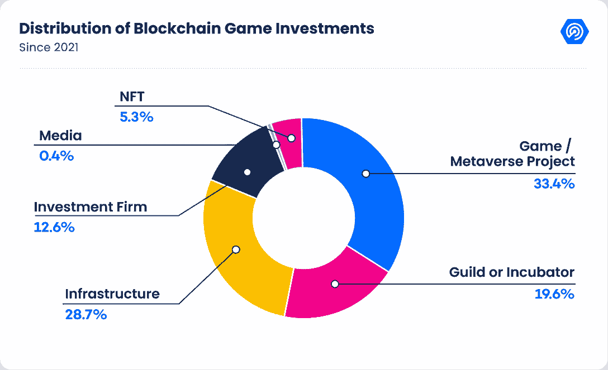

Source: [DappRadar](https://web.archive.org/web/20220906092115/http://www.dappradar.com/)

随着行业迅速成熟，行业协会开始扮演更积极的投资者角色。大多数公会将使用一部分资本和 NFTs 租赁的收益来投资 web3 游戏，以改善他们的前景。一个公会的积极投资策略将有利于数十个游戏 dapp 通过在关键阶段提供流动性来启动他们的项目，要么通过种子投资，要么成为帮助游戏 dapp 达到下一个水平的发射台或孵化器。

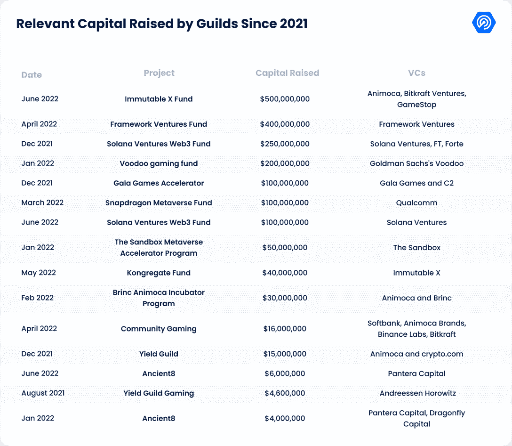

Source: [DappRadar](https://web.archive.org/web/20220906092115/http://www.dappradar.com/) & [ByBit](https://web.archive.org/web/20220906092115/https://www.bybit.com/en-US/)

此外，他们的资产价值应该会不断增加，因为大多数公会都可以获得顶级项目中的顶级资产，如沙盒，Start Atlas 和 Immutable X games，包括 Illuvium。

为了维持内部组织并提供所有行会运营和财政部资产管理的透明度，这些组织通常作为 Dao 运营，即由社区成员管理的分散自治组织，其投票权由治理令牌授予。财政部执行不同的金融职能，但最重要的是，最大化任何类型投资的收益。

DAOs 提供的透明度、信任度和财务灵活性是公会的理想选择，可以根据社区需求和偏好进行调整。一个例子是 YGG 的子道，独立和专门的道，侧重于生态系统中的利基，例如，轴的繁殖，租赁土地，或卡。

2021 年 10 月，当“功德圈”向提出租赁 1，000 支 Axie 团队(3，000 支 Axie)以使其学者基础翻倍时，对此请求持开放态度，但道并未同意。

此外，子 Dao 非常适合管理金库，直接向 YGG 代币持有者提供 DeFi 产品，分销来自公会的收入来源之一。

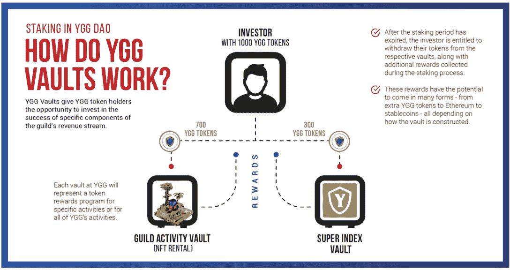

Source: [YGG](https://web.archive.org/web/20220906092115/https://blog.ondo.finance/introducing-ondo-yield-guild-vaults-a1d6e790b4ba)

综上所述，可以肯定地说，游戏公会在 GameFi 行业中扮演着至关重要的角色。公会的存在通过民主化参与 GameFi 生态系统，对我们的社会产生了积极的影响。此外，随着行业的不断成熟，公会将帮助 web3 games 吸引新一波游戏玩家，有可能保持游戏经济的可持续发展，同时吸引机构和散户投资者的新资本。

# 行业概述

在这一节中，我们将深入探讨该行业的主要参与者、他们支持的游戏以及代币价格的变动。

## 行业参与者

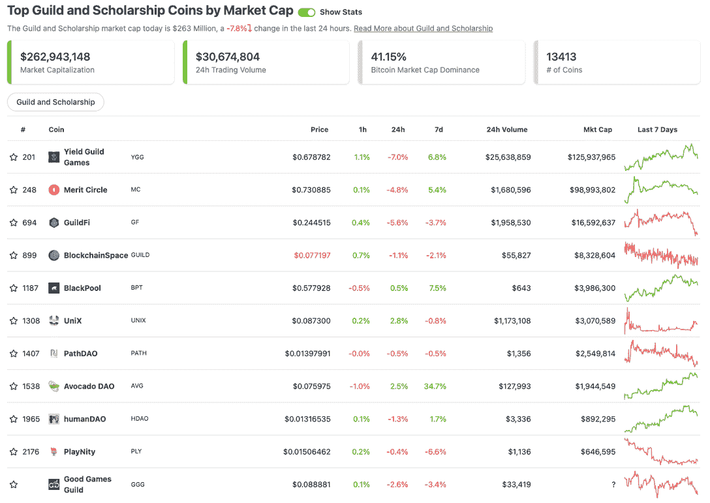

Source: [CoinGecko](https://web.archive.org/web/20220906092115/http://www.coingecko.com/) (data as of July 11, 2022)

上图显示，游戏公会的总流通市值为 2.63 亿美元。该行业仅占加密货币总市值的 0.02%。

积极提供奖学金计划的最著名的玩家包括 Yield Guild Game (YGG)、Merit Circle、GuildFi、BlackPool 和 UniX。查看 DappRadar 的详细[报告](https://web.archive.org/web/20220906092115/https://dappradar.com/blog/top-5-play-to-earn-gaming-guilds)以获得更多关于上述游戏公会的信息。

## 合作游戏

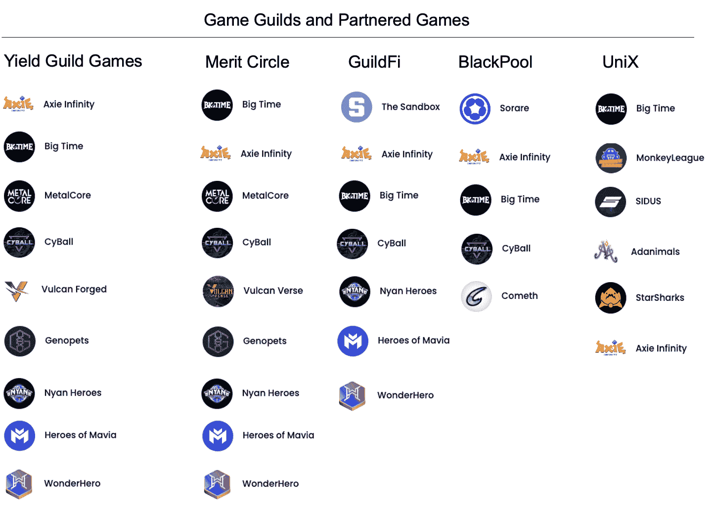

Source: [Bybit](https://web.archive.org/web/20220906092115/https://www.bybit.com/en-US/)

*注:如果披露，按 NFT 投资价值递减排列。该列表并不全面，仅用于说明目的。*

我们收集了一份每个顶级公会合作的热门游戏列表。毫不奇怪，看看那些由奖学金支持的游戏，Axie Infinity 是生态系统中支持最好的游戏，其次是 Big Time 和 CyBall。

## 令牌性能

Source: [CoinMarketCap](https://web.archive.org/web/20220906092115/https://coinmarketcap.com/) (data as of July 8, 2022)

从图表中可以看出，MC、YGG 和 GF 的代币价格从年初至今大幅下跌，这似乎与元宇宙指数(MVI)的表现一致，但与一般加密市场相比则显得苍白无力。

# 游戏公会生态系统的健康

当提到生态系统的健康时，我们缩小了对其财务状况、奖学金计划和游戏公会投资计划的关注。

## 财务状况的优势

**资金和市值汇总**

| 指标(百万美元) | 功绩圈 | 屈服公会游戏(YGG) | 吉尔菲艾斯(GF) |
| **流通市值(2022 年 7 月 11 日)** | 99.0 | 125.9 | 16.6  |
| **流通市值(2022 年 3 月 31 日)** | 197.7 | 272.1 | 74.7 |
| **代币投资(2022 年 3 月 31 日)** | 27.4 | 37.8 | 42.2 |
| **NFT 投资公司(2022 年 3 月 31 日)** | 9.6 | 19.8 | 10.0 |
| **公会和其他投资(2022 年 3 月 31 日)** | 钠 | 31.4 | 钠 |
| **流动资产(2022 年 3 月 31 日)** | 89.3 | 未披露 | 93.3 |
| **国库总余额(2022 年 3 月 31 日)** | 126.3 | 未披露 | 145.5 |

从最新的财政部报告中提取的数据仍然证明，最突出的参与者有充足的国库，包括流动资产(现金或高流动性代币)，如上所示。规模较小的参与者也注意到了强劲的国债(注意，这些数据反映了 3 月份的情况)。

表格中的其他亮点包括一小部分非流动性投资和无债务。庞大的外汇储备为它们提供了一个优势，可以安然度过熊市，并有可能抢购不太昂贵的资产。

最后，国库余额高于流通市场资本总额。从传统金融的角度来看，游戏公会估值合理，现金充裕。尽管国债余额滞后，但由于现金余额过大，下调幅度应该不大。

功绩圈每月发布财政报告。从其 2022 年 6 月的报告中，我们可以衡量其财务状况的健康程度，将其作为该行业整体实力的代表，特别是在动荡的 5 月和 6 月之后。

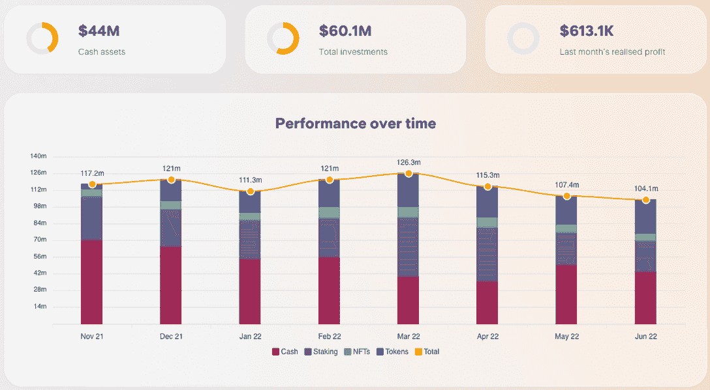

Source: [Merit Circle](https://web.archive.org/web/20220906092115/https://meritcircle.io/)

截至 6 月底，Merit Circle 的 NFT 投资组合总额为 640 万美元，较 4 月份的 890 万美元下降了 28%。尽管如此，由于高额的现金储备，公会的总金库在整个 5 月和 6 月都保持着弹性。

然而，值得注意的是，NFT 和其他投资的一部分交易不活跃，因此未能反映现有挑战性环境的影响。

特别是，在前三大玩家中，YGG 在 P2E 基础设施和庞大游戏投资组合中的非流动性余额最大，其估值可能不会根据当前的避险情绪进行调整。

尽管目前的熊市，大多数游戏公会的国库余额证明有足够的余额生存和繁荣。因此，可以有把握地得出结论，即使在最近的市场抛售之后，最大的游戏公会的财务状况仍然强劲。

## 奖学金计划——收入减少，活动减少

### 学者人数

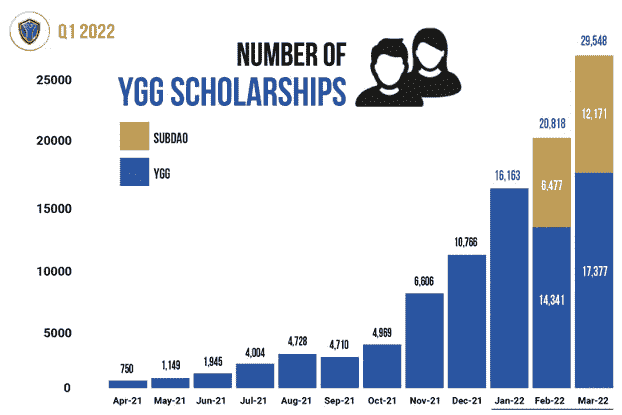

Source: [YGG](https://web.archive.org/web/20220906092115/https://yieldguild.io/)

让我们来关注一下 YGG，我们发现 22 季度的学者人数激增，因为子 DAOs 结构在这一季度有效地吸纳了更多的学者。总体增长呈陡峭曲线。然而，P2E 活动在 22 季度大幅下滑，表明增长轨迹可能弱于预期。

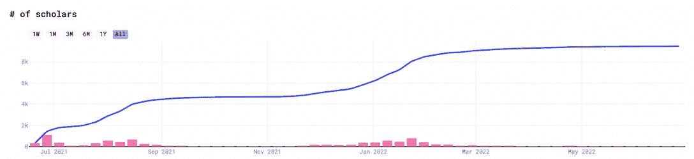

Source: [NFTBank](https://web.archive.org/web/20220906092115/https://nftbank.ai/) (data as of July 8, 2022)

根据 NFTBank 的数据，YGG 的 Axie Infinity 奖学金自 2022 年 3 月以来一直处于平稳状态。由于 Axie Infinity 拥有来自其他 P2E 游戏的多达 86%的学者和用户，我们可以估计学者的总数可能会反过来动摇 YGG。

### 过度依赖 Axie Infinity

我们已经注意到，几乎所有的游戏公会都支持 Axie Infinity，这可能是他们收入的主要来源。

截至 2022 年 3 月 31 日，86%的 YGG 学者玩 Axie Infinity，超过 60%的新学者在 22Q1 加入。与此同时，2022 年 1 月，超过 92%的 UniX 学者来自 Axie Infinity。

Axie Infinity 拥有大量的学者，难怪几乎所有的游戏公会都支持 P2E 游戏。此外，这一可观的数字可能表明，这些奖学金产生的收入也将占其收入的大部分。

随着 Axie Infinity 努力留住用户，并开始向其他新游戏认输，对 Axie Infinity 的过度依赖成为游戏公会发展的一个危险信号。不过，很高兴知道，NFT 的投资已经全面多元化，这可能有助于游戏公会行业的进一步发展。

### 收入增长

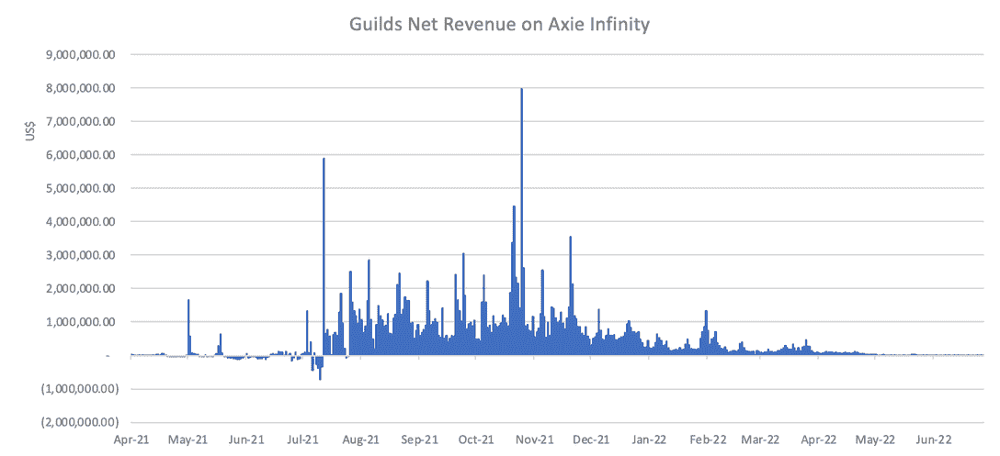

Source: Axie World, [ByBit estimate](https://web.archive.org/web/20220906092115/https://www.bybit.com/en-US/) (data as of July 8, 2022)

然而，即使他们的投资组合中增加了更多的合伙企业，也没有哪家合伙企业能与曾经无所不能的 Axie Infinity 相匹敌。如前所述，由于大多数奖学金和公会收入都来自 Axie Infinity，因此可以得出这样的结论:来自奖学金项目的公会总收入与流行的 P2E 游戏收入同步下降。

### 概括起来

随着新的游戏公会如雨后春笋般涌现，Q1 的学者人数大幅增长。然而，随着 P2E 工业从更广泛的抛售中蹒跚而行，这种发展可能已经达到了一个瓶颈。由于没有新游戏能够弥补 Axie 事件后收入的下降，奖学金总收入大幅下降。

## 投资部门——公会作为 Web3 游戏投资工具的角色

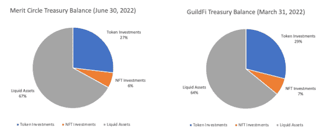

Source: [Merit Circle](https://web.archive.org/web/20220906092115/https://meritcircle.io/) and [GuildFi](https://web.archive.org/web/20220906092115/https://guildfi.com/) (based on the latest data available)

从上图可以看出，NFT 投资仅占国债余额的 6-7%。由于 NFT 的投资推动了奖学金项目的增长，这个数字低得惊人。

相比之下，除 NFT 以外的投资在国库中所占比重更大，这表明，与专注于奖学金的纯粹行业协会相比，行业协会的确更像是一种投资工具。事实上，奖学金项目看起来附属于公会，只支持投资游戏。我们将在下面的章节中回到这个问题。

简而言之，我们将公会视为投资工具，通过投资回报来衡量它们的健康程度。

| 百万美元 | 功绩圈(2022 年 5 月 31 日) | YGG(2022 年 3 月 31 日) | 吉尔菲艾斯(2022 年 3 月 31 日)* |
| 非现金余额成本 | 59.3 | 13.1 | 42.2 |
| 非现金余额的价值 | 65.8 | 89.0 | 52.2 |
| 价值成本比 | 1.11 | 6.79 | 1.24 |

**assumed GuildFi’s investments other than early-stage investments are at a cost*

游戏投资包括游戏内代币、治理代币或不公开的早期投资。如上表所示，游戏公会设法从他们的游戏投资中获利，VCR 在水面之上。

尽管 NFT 的投资回报率为负，但象征性投资和早期投资很少出现亏损。进入早期投资锁定了最初交易所发行的令人羡慕的利润。

YGG 不知何故设法坐拥比竞争对手更大的收益，这是因为它的运营历史悠久。它最近与 Merit Circle 的不和显示了 YGG 在 Merit Circle 的投资是多么有利可图，在和解后带来了 10 倍的回报。

行会的总体价值定位可能已经从繁荣的学者社区转移到有利可图的投资工具。不知何故，投资部门比奖学金项目更繁荣、更健康。同样值得注意的是，缺乏最近的融资可能低估了一些持有的非流动性资产。

## 公会真的支持 GameFi 开发吗？

游戏公会是 GameFi 吸纳新用户的重要组成部分。然而，在深入他们的生态系统后，发现他们的支持仅限于他们投资的游戏。

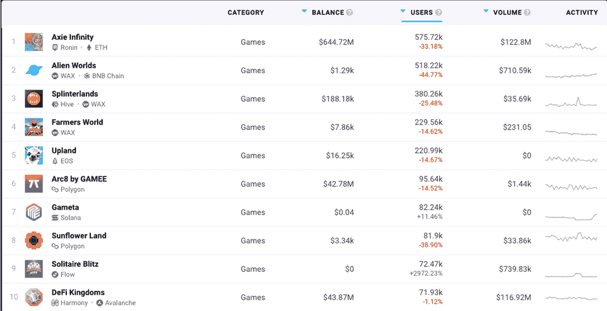

Source: [DappRadar](https://web.archive.org/web/20220906092115/http://www.dappradar.com/) (data as of July 8, 2022)

除了 Axie Infinity，公会奖学金计划支持的顶级游戏还有 Big Time、Cyball、Metalcore、Wonderhero、Monkeyball 和 Sidus。然而，如上所示，这些都没有反映出顶级 web3 游戏的列表。

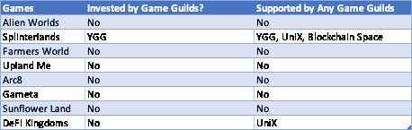

Source: [Chainplay](https://web.archive.org/web/20220906092115/https://chainplay.gg/blockchain/)

对于公会来说，在顶级游戏上建立一个奖学金社区听起来是一个合理的策略，因为它将奖学金的范围扩大到了更多的用户。

然而，似乎顶级游戏不是由游戏公会投资的，因此缺乏奖学金计划的支持。这些细微差别表明，用户获取并不是提供奖学金支持的决定性因素，这突显出奖学金项目是投资部门的附属部分这一事实。

也就是说，我们不能排除在那些顶级游戏上运行可能达不到公会的 ROI，因而不被支持的可能性。

## 概括起来

在财务上，游戏公会的财务状况很好，拥有大量的流动资产储备。

虽然学者的数量正在减少，他们从游戏，尤其是 Axie Infinity 获得的收入也大幅下降，但公会正在通过新游戏解决对 Axie Infinity 的过度依赖。然而，这种替代品很难找到。

游戏公会的生态系统是否健康的问题在于他们的价值主张。如果公会的价值主张是从奖学金中获得游戏收入，那么公会现在由于游戏收入的低迷而陷入困境。

另一方面，作为投资工具，行业协会是健康且有利可图的，它们通过获得早期投资为投资者增加价值。根据我们在上面章节中的分析，我们打算将公会视为投资工具，从这个意义上来说，他们一直在蓬勃发展。

# 游戏公会可持续吗？

我们在上面已经分析过，奖学金项目的情况并不好，但是游戏公会作为投资工具仍然发挥着健康的作用。在这一节中，我们将深入探讨决定奖学金和投资部门能否长期持续的因素。

## 下 NFT 入口屏障

游戏公会支持的顶级游戏的 NFT 底价

| **顶级游戏的 NFTs** | **NFTs 底价** |
| 轴(无限轴) | $7 |
| 赛布鲁(赛布鲁) | $14 |
| 武器；装甲(大时代) | 每个 3 美元(武器)；每个 20-200 美元(盔甲) |
| 英雄皮肤；武器；装备(WonderHero) | 每个 5 美元 |
| 英雄(Sidus Heroes) | $320 |

奖学金计划的一个基本主张是降低 web3 玩家的入学门槛。然而，如上所示，顶级游戏的 NFT 底价不一定很高。

在巅峰时期，每个 Axie 的底价在 Axie Infinity 高达 400 美元。由于需要三个轴才能开始游戏，因此它将准入门槛提高到平均 1000 美元。然而，随着 ETH 的下降和由于育种活动导致的 Axies 供应过剩，这些购买 NFTs 的初始投资显著下降。

排除 Axie Infinity 正处于低谷的事实，新游戏一开始并不要求很高的 NFT 价格，因此削弱了他们对奖学金的需求。

另一方面，游戏公会仍然帮助用户降低资金风险，形成一个培训和经验分享的闭路社区。

总而言之，游戏可能旨在降低准入门槛以吸引更多用户，从而降低对奖学金的需求。

### ERC-4907 标准制造逆风

ERC-4907 即将成为以太坊的最新标准。Double Protocol 是 NFT 的一个游戏租赁协议，它在 6 月 28 日提交了 Etherpad 批准的标准，并获得了批准。

ERC-4907 打破了 NFT 所有权和效用的分离，为游戏和元宇宙开发游戏内租赁功能创造了一个统一的标准。简单来说，用户只需一次链上交易，就可以在 web3 游戏中租赁 NFT，并将他们的 NFT 归还给所有者。

在未来，web3 游戏可能会天生支持租赁功能，像双协议这样的租赁协议可能会成为用户在没有初始成本的情况下开始游戏的另一个平台，对游戏公会提供的奖学金构成竞争。

## 可持续发展 P2E 游戏是游戏公会的关键

我们提到支持的游戏通常是由游戏公会投资的。随着 P2E 工业的下滑，从长远来看，他们的投资回报可能会受损。

P2E 的可持续性因其短暂的游戏生命周期而受损。这种循环性质存在于大多数 P2E 系统的 NFT 生态系统中，在那里用户经常被鼓励制造更多的 NFT 来出售或出租给新玩家——然后新玩家会试图做同样的事情。假以时日，如果没有外部资本注入游戏经济，“音乐椅”很可能会结束，引发代币价格暴跌以及不具吸引力的盈利能力。这个痛点还没有被现有玩家很好的解决。

自今年 3 月以来，StepN 从媒体那里抢走了很多风头，激发了新一波 X2E 游戏。它吸取了 Axie Infinity 的教训，在令牌组学和用户获取方面实施了敏捷管理，以保护游戏的生命周期。业界对 StepN 带领 P2E 奥运会走出困境寄予厚望。

我们在之前关于 P2E 工业可持续发展的[报告](https://web.archive.org/web/20220906092115/https://blog.bybit.com/en-US/post/will-stepn-suffer-the-same-fate-as-axie-infinity-a-data-driven-deep-dive-bltc077fe034c4d2abf/)中已经详细介绍了这一点。不幸的是，自从我们更新以来，StepN 并没有成功抵御用户流失和代币价格暴跌的死亡螺旋。

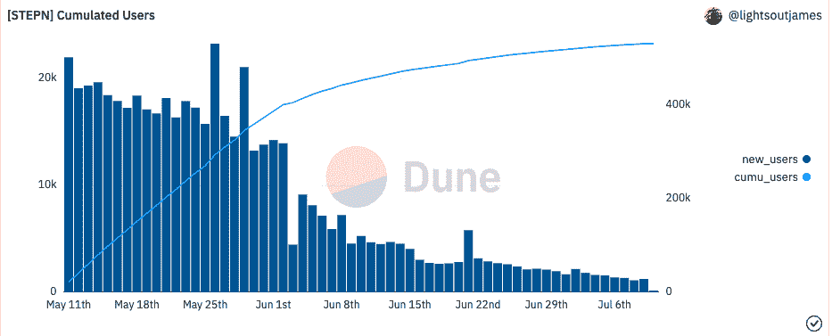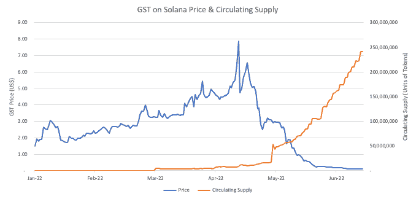

Source: [Dune Analytics](https://web.archive.org/web/20220906092115/https://dune.com/browse/dashboards); [CoinGecko](https://web.archive.org/web/20220906092115/https://www.coingecko.com/) (data as of July 10, 2022)

随着中国对该应用的禁令和全行业去风险化的展开，StepN 因用户流失而陷入困境，而用户流失又源于令牌的过度供应。StepN 最近的衰落表明 P2E 仍然问题重重，急需改革。

总而言之，如果 P2E 产业仍然无法自我维持，游戏公会作为 GameFi 生态系统的一部分，几乎没有希望自立。

# 结束语

游戏公会作为 GameFi 生态系统的一部分，设法降低了学者的准入门槛，并在新用户和资本支持下启动游戏方面发挥了作用。

在 P2E 行业摇摇欲坠的这个关头，奖学金计划未能获得稳定的现金流，因为没有其他新游戏可以弥补 Axie Infinity 收入的下降。

作为一种投资工具，像 YGG 这样的早期参与者，由于较早获得种子资金，已经获得了可观的利润。

与摇摇欲坠的学者社区相比，拥有强大资金的游戏公会在短期内看起来很健康，他们的投资部门预示着一个有利可图的业务。

然而，这背后的大假设必须是一个可持续的 P2E 生态系统，通过增强的游戏内可玩性保留稳定的用户群。

*披露:Bybit 的成员可能投资于以下文章中提到的部分或全部代币和项目。本声明披露任何利益冲突，并不建议购买任何代币或参与上述任何生态系统。这些内容仅用于教育目的，不应以任何方式解释为投资建议。如果您计划以任何方式参与这些项目，请谨慎行事并进行尽职调查。*