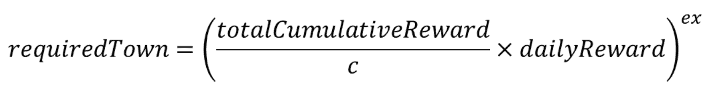

# 玩家现在有新的方法来获得每日城镇奖励

> 原文：<https://web.archive.org/web/https://dappradar.com/blog/gamers-now-have-new-ways-to-earn-daily-town-rewards>

## 城镇之星推出新的挑战机制和动力小时

Gala Games 引入了几个新的游戏机制，玩家可以在城镇之星中获得城镇奖励。竞技农业游戏是 Gala Games 网络中最受欢迎的游戏之一。 **更重要的是，这些新的奖励途径是一个备受期待的发展。**

城市之星奖励计划的第一个重要更新是新的动态明星挑战赛系统，将于 2022 年 3 月 1 日推出。这是一组新的每日挑战，基于玩家需要获得的星星数来完成它们。直到现在，城镇之星玩家必须聚集 1000 颗星星才能成功完成每日挑战。

随着新的动态星级挑战系统的玩家将获得越来越高的星级要求，一旦他们完成了以前的每日挑战。从这个意义上说，新城镇的第一个每日挑战将是获得 500 颗星星。一旦完成，第二天的挑战将是赚取 750 颗星。之后，每日挑战将要求玩家赚取 1000 颗星。这种粗糙的模式将一直持续到系列赛的第 31 个每日挑战。本月最后一场每日挑战将要求你赢得高达 8000 颗星的奖励。

重要的是，陷入日常挑战是可能的。该机制只允许你在成功完成所有日常挑战后进入下一阶段。从这个意义上来说，在任何时候，你都可能会在同一个挑战上坚持一天以上。

## 更多城镇奖励与电力小时

除了新的动态明星挑战系统，城镇之星也将迎来权力小时。电力时间是一种重新审视的城镇盈利机制。它看起来改进了决定有多少 NFTs 玩家可以进入他们的城镇的系统。

目前，玩家根据他们持有的[节日](https://web.archive.org/web/20221004131802/https://dappradar.com/hub/token/eth/GALA?from=0x15d4c048f83bd7e37d49ea4c83a07267ec4203da)和[城镇](https://web.archive.org/web/20221004131802/https://dappradar.com/hub/token/eth/TOWN?from=0x3dd98c8a089dbcff7e8fc8d4f532bd493501ab7f)代币获得最大 NFT 容量。在写这篇文章的时候，决定庆典力量的公式如下:庆典的数量，增加到你钱包里城镇代币数量的两倍。然而，在深入研究该话题后，Gala Games 团队意识到，约 98%的玩家每天的收入不到 1000 镇。这降低了他们的节日能量分数。

为了改善这种平衡，该团队正在推出一个修改后的机制。新的机制将引入一种结合曲线，将最大收益与所需的城镇持有量联系起来。换句话说，随着城镇奖励数量的增加，城镇玩家必须持有的奖励数量也会增加。这种新的 Gala 功率计算的基本公式是:

如果你想对你未来的春晚电量进行预测计算，在电量小时活动发布后，你可以查看[官方春晚游戏城镇计算器](https://web.archive.org/web/20221004131802/https://townstar.com/town-power-calculator)。

这两种奖励机制都旨在使城镇之星成为一个更加有利可图的游戏赚取机会。

DappRadar 将继续监测 Gala Games 生态系统和城镇之星。要了解更多关于《城镇之星》的信息，请点击这里查看之前的所有报道。此外，你可以在[的 Twitter](https://web.archive.org/web/20221004131802/https://twitter.com/dappradar) 上关注 DappRadar，首先了解最新的区块链博彩新闻。

 NewsletterUnsubscribe at any time. [T&Cs](https://web.archive.org/web/20221004131802/https://dappradar.com/terms) and [Privacy Policy](https://web.archive.org/web/20221004131802/https://dappradar.com/privacy-policy)