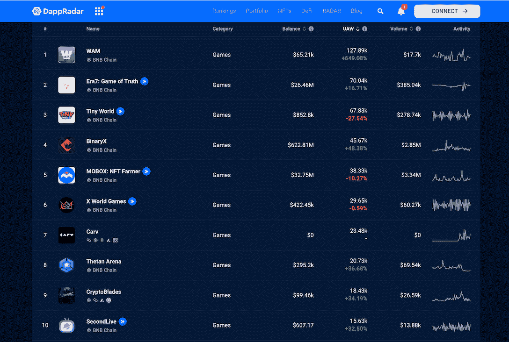
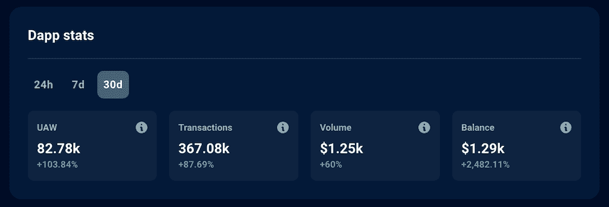
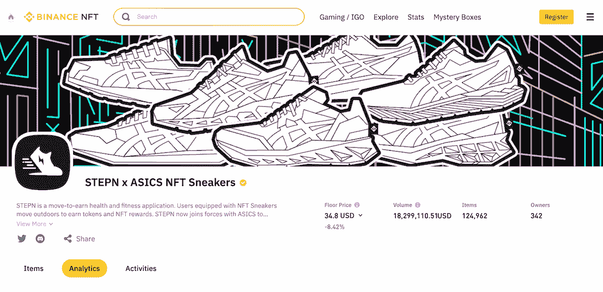
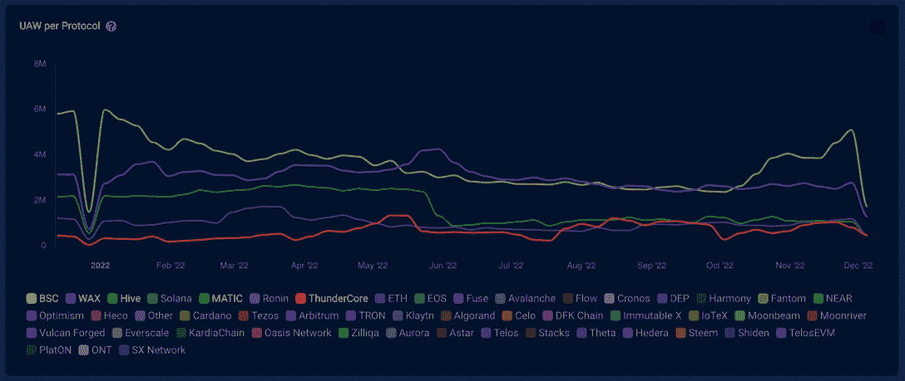
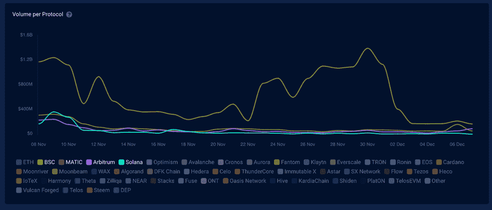

# 160 场比赛加入了 H2 2022 年 DappRadar 的 BNB 连锁排名

> 原文：<https://web.archive.org/web/https://dappradar.com/blog/games-joined-bnb-chain-ranking-on-dappradar>

## MegaWorld，Ultimate Champions，Puffverse，以及更多的公司将来到 BNB 连锁店。

随着 DappRadar 在 2022 年下半年增加了 160 款来自区块链的游戏，BNB 链已经成为游戏开发商中最受青睐的区块链之一。在与 BNB 生态系统相关的最新成功案例中，我们看到了 MegaWorld、Ultimate Champions 和 Puffverse。

**高亮显示**

*   越来越多备受瞩目的项目选择将其生态系统扩展到 BNB 连锁店。
*   它们包括 MegaWorld、Ultimate Champions、Puffverse 和 StepN。
*   这些项目选择 BNB 链家的原因各不相同，但他们主要是被其庞大的用户群、成熟的生态系统和多样化的融资机会所吸引。

BNB 链的可扩展性、安全性、经济性和易用性是开发者和企业想要部署他们的 dapps 的基本因素。此外，BNB 链提供财政和业务支持有前途的项目，以达到更广泛的用户群。

继终极冠军之后，MegaWorld 宣布将其业务扩展到 BNB 连锁店。为了庆祝这一事件并吸引 BNB 连锁店用户的注意，该项目将主办一次价值 100 万美元的空投。

> MegaWorld 以 100 万美元空投奖励扩展至 BNB 连锁[https://t.co/TSNBZQZo70](https://web.archive.org/web/20230120063205/https://t.co/TSNBZQZo70)[@ mega world _ io](https://web.archive.org/web/20230120063205/https://twitter.com/megaworld_io?ref_src=twsrc%5Etfw)[# crypto](https://web.archive.org/web/20230120063205/https://twitter.com/hashtag/crypto?src=hash&ref_src=twsrc%5Etfw)[# cryptonews](https://web.archive.org/web/20230120063205/https://twitter.com/hashtag/cryptonews?src=hash&ref_src=twsrc%5Etfw)[# cryptocurrency](https://web.archive.org/web/20230120063205/https://twitter.com/hashtag/cryptocurrency?src=hash&ref_src=twsrc%5Etfw)
> 
> — CoinGape Crypto News (@CoinGapeMedia) [December 6, 2022](https://web.archive.org/web/20230120063205/https://twitter.com/CoinGapeMedia/status/1600109559267397633?ref_src=twsrc%5Etfw)

元宇宙平台 MegaWorld 将于 2022 年 12 月 15 日在 BNB 首次亮相。除了空投之外，MegaWorld 补充说，早期的支持者和活跃的社区成员将可以获得稀有的游戏内资产。

毫无疑问，区块链的未来是多连锁的，但 MegaWorld 不是第一个优先扩展到 BNB 连锁的项目。目前，BNB 链上有超过 800 个游戏项目，其中 734 个可以在 DappRadar 上查看，了解活跃钱包、交易和交易量等关键指标。这些游戏中的许多要么迁移到 BNB 链，要么将 BNB 添加到他们的生态系统中。

[Explore games on BNB Chain](https://web.archive.org/web/20230120063205/https://dappradar.com/rankings/protocol/binance-smart-chain/category/games/1)

接下来，我们将看看还有哪些高调的游戏玩家加入了 BNB 的行列。

## 扩展到 BNB 连锁店的 Dapps

### 终极冠军获得了币安 400 万美元的资助

终极冠军最近宣布，它将在 BNB 链上部署，并将在币安粉丝令牌平台上提供。这项合作也得到了币安实验室 400 万美元的支持。终极冠军将利用筹集到的资金进一步开发其游戏，获得更多的体育合作伙伴，并扩大其社区。

终极冠军是一款多边形网络上的免费幻想体育游戏。最近，这款游戏借着世界杯热潮成为了玩家最多的游戏之一。在过去的 30 天里，终极冠军的独特活动钱包增长了 103%，交易量增长了 87%，交易量增长了 60%。

[View more stats about Ultimate Champions](https://web.archive.org/web/20230120063205/https://dappradar.com/multichain/games/ultimate-champions)

### StepN 寻求增加 BNB 连锁店的用户群

StepN 曾经是索拉纳区块链的旗舰移动收入 dapp。今年 4 月，这家健身游戏平台加入了 BNB 连锁生态系统，并在币安 NFT 市场发布了 ASICS x StepN 限量版运动鞋。

[Learn more about StepN](https://web.archive.org/web/20230120063205/https://dappradar.com/solana/social/stepn)

### 小米支持的 Puffverse 迁移到 BNB 连锁店

Puffverse 是一款由电子巨头小米支持的 3D 元宇宙游戏。这款游戏之前在以太网上发布了创世纪 NFT 系列。后来，Puffverse 在 10 月初参加了 BNB 连锁建筑商资助，并成功获奖。

因此，Puffverse 将利用这笔资金开发该项目，并将其优先部署在 BNB 链条上。这款游戏的特点是令人愉快的视觉风格，让用户想起超级马里奥 3D 世界。

[https://web.archive.org/web/20230120063205if_/https://www.youtube.com/embed/J19Ypn7PV6w?feature=oembed](https://web.archive.org/web/20230120063205if_/https://www.youtube.com/embed/J19Ypn7PV6w?feature=oembed)

[Learn more about Puffverse](https://web.archive.org/web/20230120063205/https://dappradar.com/ethereum/collectibles/puffverse/)

## 项目寻求资金、用户基础和 BNB 链上的无缝生态系统

DappRadar 在 49 个网络上跟踪超过 12，000 个 dapps，包括以太坊、BNB 链、索拉纳、Wax、Polygon 等。根据 DappRadar 的行业概述，BNB 智能链(BSC)在过去的一年里注册了业内最独特的活动钱包。此外，就过去 30 天的交易量而言，区块链仅次于以太坊。

BNB 链家庞大而活跃的用户群是这个网络吸引如此多项目的关键原因之一。

最重要的是，币安实验室专注于寻找和支持行业内的技术团队，以更快地建立 Web3 生态系统。这一年获得币安实验室资助的项目包括终极冠军、Hooked、Tatsumeeko、Sky Mavis、GAMEE 和 Mavia。它对 Web3 游戏的野心是有目共睹的。

最后但同样重要的是，BNB 连锁拥有业内最强大的生态系统之一。因此，将其集中交易与 EVM 兼容的区块链、本地钱包及其庞大的用户网络相结合的协同效应，对 dapp 开发者来说绝对是一个有吸引力的提议。

## 区块链游戏推动 Web3 向前发展

区块链游戏拥有 190 万个独立的活跃钱包，占所有与区块链应用程序交互的钱包的 42%。目前，我们看到以下区块链生态系统引领着市场:

*   《蜡像》凭借其热门游戏《外星世界》
*   蜂房，感谢交易卡游戏分裂之地
*   不可改变的 X，提供被解放的神，守护者协会，等等
*   和 Ronin，它托管 Axie Infinity，现在向更多开发者开放。

所有这些活跃的钱包在 10 月和 11 月期间产生了 5500 万美元的 NFT 交易量。在那段时间里，《被解放的上帝》引起了巨大的轰动，因为它占了所有交易量的 60%。通过用资金吸引游戏项目，BNB 连锁店希望分一杯羹。DappRadar 将继续关注 Web3 游戏世界和 BNB 连锁店的最新发展。在 [Twitter](https://web.archive.org/web/20230120063205/https://twitter.com/dappradar) 、 [Discord](https://web.archive.org/web/20230120063205/https://discord.gg/4ybbssrHkm) 和 [Youtube](https://web.archive.org/web/20230120063205/https://www.youtube.com/c/DappRadar) 上关注我们，跟上区块链世界的动态。

[Dive into BNB Chain’s ecosystem](https://web.archive.org/web/20230120063205/https://dappradar.com/rankings/protocol/binance-smart-chain)

## 随身携带您的 Web3 之旅

使用 DappRadar 移动应用程序，再也不会错过 Web3。查看最受欢迎的 dapps 的性能，并关注您投资组合中的 NFT。您在 DappRadar 上的帐户会与我们的移动应用程序同步，这样您很快就可以选择实时接收提醒。

[Download the DappRadar app now](https://web.archive.org/web/20230120063205/https://dappradar.app.link/blog)[<picture></picture>](https://web.archive.org/web/20230120063205/https://play.google.com/store/apps/details?id=com.portfolio.dappradar) NewsletterUnsubscribe at any time. [T&Cs](https://web.archive.org/web/20230120063205/https://dappradar.com/terms) and [Privacy Policy](https://web.archive.org/web/20230120063205/https://dappradar.com/privacy-policy)