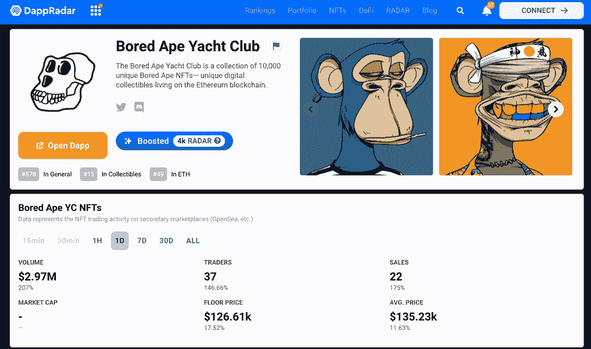
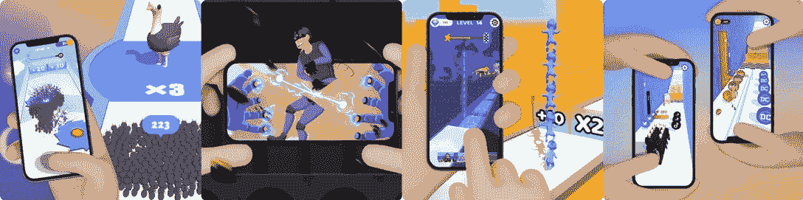

# Gameta 永远把用户放在第一位

> 原文：<https://web.archive.org/web/https://dappradar.com/blog/gameta-will-always-put-users-above-all-else>

## Gameta dev 团队也是 BAYC 的忠实粉丝！

DappRadar 发起了一系列新的 Dapp 开发者访谈。我们将与游戏、DeFi dapps、NFTs、协议等背后的团队进行激动人心的讨论。希望这些对话能激励更多的开发者为 Web3 的开发贡献他们的想法。

[区块链游戏](/web/20220926004555/https://dappradar.com/blog/play-to-earn-vs-move-to-earn/)，游戏历史上第一次授予用户游戏内数字资产的所有权。此外，它重新定义了用户参与游戏的范式，允许玩家以创新的经济模式获取收入。

在 DappRadar，我们跟踪数以千计的 dapp 为我们的用户带来数据驱动的信息。例如，他们可以在 [DappRadar 的游戏排名中找到最受欢迎和发展最快的游戏。](https://web.archive.org/web/20220926004555/https://dappradar.com/rankings/category/games)

在过去的几周里， [Gameta](https://web.archive.org/web/20220926004555/https://dappradar.com/solana/games/gameta) 见证了独立用户数量的持续增长。令人印象深刻的是，Gameta 在短时间内就突破了 10 万用户的基准。

在今天的采访中，我们将邀请 Gameta 的技术负责人 Joy 和他的团队分享他们平台成功的秘诀。另外，团队会和我们分享他们心目中的 Web3 游戏世界是什么样子的。

## 你与区块链人的第一次互动是什么？

肯定是比特币。比特币的出现向人们展示了创新的力量。这也是我们对 Gameta 的期望——利用我们在传统游戏开发和发行方面的优势来推动现有的 Web3 游戏市场。

另一个我们称之为“第一次互动”的体验是与无聊猿游艇俱乐部(BAYC)的 NFTs(T1)的互动。

猿 NFTs 的成功显示了文化的力量及其对人们思想和品味的影响。这启发了我们，让 Gameta 的河马 NFT 系列成为我们社区独特的文化标志。

## 除了你自己的，你最常用的 dapps 是什么？

我们对尝试一个产品的不同版本非常感兴趣，以感受它的用户体验和设计是如何发展的，以保持它对用户的吸引力。

这与构建我们的 Gameta 项目的想法产生了共鸣。我们不是第一个为 Web3 用户开发休闲游戏的团队，但是我们想为我们的用户建立最合适的平台。我们的理念是流畅的用户体验第一，Web3/crypto 技术第二。

归根结底，用户真正关心的不是成为加密货币专家，而是产品是否满足他们的需求。

## 在你所有的 NFT 中，你最喜欢哪一个？为什么，你能联系起来吗？

如上所述， [BAYC NFTs](https://web.archive.org/web/20220926004555/https://dappradar.com/ethereum/collectibles/bored-ape-yacht-club) 确实激励了我们。我们是这部电视剧及其所创造的文化影响力的狂热粉丝。

现在, [Bored Ape](https://web.archive.org/web/20220926004555/https://dappradar.com/ethereum/collectibles/bored-ape-yacht-club) 已经超越了它最初的 NFT 动力形象，成为一股能够影响数百万粉丝的文化力量。这个过程让我们感到惊讶，并激励我们用我们的 Hippo NFTs 构建类似的东西。

## 你正在做的 dapp 是什么？你能描述得好像我们不了解区块链一样吗？

当然可以。 [Gameta](https://web.archive.org/web/20220926004555/https://dappradar.com/solana/games/gameta) 提供一系列令人愉悦的休闲游戏；每个都可以在谷歌 Playstore 和苹果商店找到并下载。

当用户玩这些游戏时，他们会像玩普通休闲游戏一样参与其中。要开始玩，它只需要简单的电子邮件注册和密码设置。

一个细微的区别是，我们将自动为每个玩家提供一个免费的区块链钱包，并空投一只河马 NFT。一旦用户注册了游戏，系统会通知他们的所有权。用户不需要对它们做任何事情。

当用户玩这些游戏时，会有购买奖励宝石或花费来升级 NFT 的选项，这样他们就可以解锁更多隐藏的功能和级别。这些互动类似于常规的休闲游戏，但交易都被记录在链上。

有了 [Gameta](https://web.archive.org/web/20220926004555/https://dappradar.com/solana/games/gameta) ，玩家不用被迫学习 Web3 的复杂性就能熟悉 Web3。

## **在开发您的 dapp 时，您曾经或面临过哪些重大挑战？你能分享一下吗？你的建议能如何帮助别人？**

最大的挑战在于使我们的应用程序在与 Web3 世界交互时更加 Web2 用户友好。作为产品开发者，我们永远需要把用户放在第一位。

解决这个问题很简单，但是需要很大的信心。我们建议开发团队一直与你的目标用户和粉丝交谈，并从他们那里学习一切。

你必须让用户成为你产品开发的中心，并关注他们的反馈。因此，每一次产品升级都会让你的用户更开心，更喜欢你的产品。

## 在您看来，dapp/网络最关键的成功因素是什么？

永远了解你的用户。了解他们为什么玩/用你的产品。我们建议不要把“赚钱”作为你产品的主要吸引力。

## 对于 dapp 项目，什么更重要，是真正的去中心化还是易用性和简单的用户入门，还是其他？

对我们来说，我们投票赞成易用性和简单的用户入门。然而，这并不是一个牢不可破的规则。你所坚持的原则取决于你所服务的用户类型。

如果你服务于铁杆 Web 3 用户，真正的去中心化和创新是最重要的。另一方面，如果你的目标是精通技术的人，那么一款有着伟大创意的前卫产品可能更有吸引力。

对于 Gameta 来说，我们服务于在智能手机上玩休闲游戏的大量日常移动用户。作为回应，简单的体验是让他们更快乐的关键因素。毕竟，没有人来一个休闲游戏寻找激烈的游戏。

## 你认为有哪些重要的机会即将到来，你如何看待这些机会对你的项目有所帮助？

随着 Web3、元宇宙和 NFT 的概念继续成为主流，这是开始吸引公众注意力并帮助他们采用 Web3 的绝佳时机。如果你看到任何实现这一目标的可能性，那就去做吧！Web 3 的大规模增长有时会出乎意料，所以你必须现在就开始。

[Gameta](https://web.archive.org/web/20220926004555/https://dappradar.com/solana/games/gameta) 也是遵循这样一个信念的项目。凭借我们团队在休闲游戏开发和发行方面 10 多年的经验，我们有信心将数千万的 Web2 用户带入 Web3。

## **您的 dapp 生态系统提供了哪些 Web2 和“老方法”中的类似产品所没有的功能？**

首先，我们有钱包系统，允许我们休闲游戏的所有玩家拥有他们的数字资产。第二个是阿凡达 NFTs。我们希望 Gameta 上的所有用户都能获得他们可升级的头像 Hippo NFTs。

## 使你的项目独一无二的价值主张是什么？

凭借我们多年来构建休闲游戏的经验，我们已经创建了一个拥有超过 2000 万付费游戏用户的生态系统。这为我们打下了坚实的基础，而我们的任务就是引导他们在 Web3 中探索机会。

## 人们如何参与进来并了解你的项目？

首先，DappRadar 写了一篇很好的文章，解释了如何玩我们的游戏并赢得宝石。

用户还可以加入我们的[不和谐频道](https://web.archive.org/web/20220926004555/https://discord.com/invite/YDzewf3T6g)，关注我们的[官方推特](https://web.archive.org/web/20220926004555/https://twitter.com/Gameta_Official)。此外，我们欢迎任何人成为我们社区的志愿者，帮助新加入的 Web2 用户了解更多关于 Web3 的知识。

 NewsletterUnsubscribe at any time. [T&Cs](https://web.archive.org/web/20220926004555/https://dappradar.com/terms) and [Privacy Policy](https://web.archive.org/web/20220926004555/https://dappradar.com/privacy-policy)