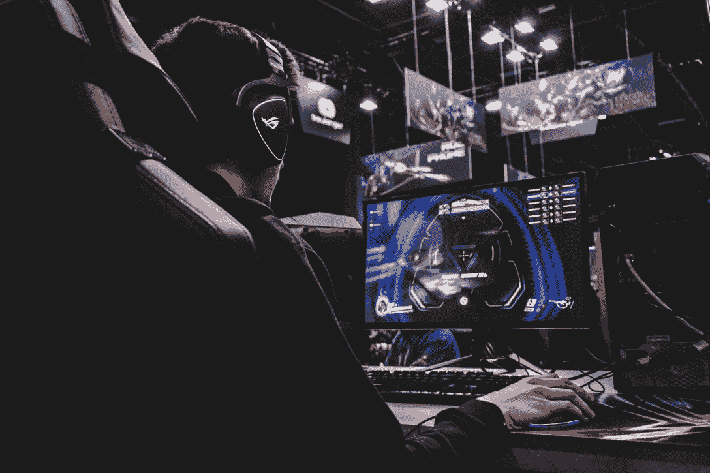

# 游戏:DappRadar 的终极指南

> 原文：<https://web.archive.org/web/https://dappradar.com/blog/gaming-dappradars-ultimate-guide>

## 学习一切你需要知道的关于区块链游戏的终极指南。

**区块链技术为游戏开辟了一个全新的可能性世界。现在不用付费玩一个游戏，可以玩游戏挣钱。**

Web3 游戏实现了游戏内资产的真正所有权，并让用户在管理他们玩的游戏时有发言权。

随着所有这些新技术和行业不同部分的快速创新和变化，人们有很多问题是很自然的。幸运的是，DappRadar 会保护你。

**内容**

*   **[什么是区块链博彩？](https://web.archive.org/web/20221003141053/https://dappradar.com/blog/gaming-dappradars-ultimate-guide/#what-is-blockchain-gaming)**
*   **[区块链博彩有哪些类型？](https://web.archive.org/web/20221003141053/https://dappradar.com/blog/gaming-dappradars-ultimate-guide/#What-types-of-blockchain-games-are-there?)**
*   区块链游戏有自己的硬币吗？
*   **[区块链博彩有哪些种类？](https://web.archive.org/web/20221003141053/https://dappradar.com/blog/gaming-dappradars-ultimate-guide/#What-types-of-blockchain-games-are-there?)**
*   区块链游戏有自己的硬币吗？
*   **[什么是玩即赚游戏？](https://web.archive.org/web/20221003141053/http://what-is-play-to-earn-gaming/)**
*   **[什么是游戏公会？](https://web.archive.org/web/20221003141053/http://what-are-gaming-guilds/)**
*   区块链博彩有什么缺点吗？
*   **[DappRadar 具体有哪些关于区块链博彩的内容？](https://web.archive.org/web/20221003141053/https://dappradar.com/blog/gaming-dappradars-ultimate-guide/#What-content-does-DappRadar-have-specifically-about-blockchain-gaming?)**

## 什么是区块链博彩？

区块链游戏是利用基于密码技术的元素的视频游戏，如 [NFTs](https://web.archive.org/web/20221003141053/https://dappradar.com/nft) 和[加密货币](https://web.archive.org/web/20221003141053/https://dappradar.com/defi)。

人们用于区块链游戏的其他名称包括 web3 游戏、玩赚游戏和加密游戏。因为这个行业太新了，社区还没有决定使用哪个术语。出于本文的目的，我们将使用术语区块链游戏。

像其他使用区块链技术的行业和部门一样，所有权是区块链博彩的核心。玩家以 NFTs T1 的形式拥有游戏中的资产，他们可以在二级市场上出售这些资产，比如 T2 的 OpenSea T3 和 T4 的魔法伊甸园 T5。玩家还可以持有代币和硬币，用于升级、皮肤、工具、武器等等。

分散的治理系统让玩家在游戏如何发展和游戏公司做出什么决定方面有更多的发言权。治理令牌将投票权传递给持有者，当游戏背后的团队提出一个提案时，社区就该做什么进行投票。

## 哪个区块链最适合玩游戏？

从技术上讲，游戏可以在任何区块链上开发。但是随着游戏产业在过去几年里的爆炸式发展，开发者已经创建了专门的网络来处理通过它们的大量信息。

Sky Mavis 专门为其热门游戏 [Axie Infinity](https://web.archive.org/web/20221003141053/https://dappradar.com/ronin/games/axie-infinity) 开发了[浪人](https://web.archive.org/web/20221003141053/https://dappradar.com/rankings/protocol/ronin)区块链。他们这样做是为了绕开以太坊高昂的汽油费，并为玩家提供更便宜、更流畅的游戏体验。

不可变创造了不可变 X 区块链，作为以太坊的扩展解决方案，“实现了近乎即时、零汽油费的交易”它支持每秒 9000 次交易，并主持游戏，如[神被解放](https://web.archive.org/web/20221003141053/https://dappradar.com/immutablex/games/gods-unchained)、[守护者协会](https://web.archive.org/web/20221003141053/https://dappradar.com/multichain/games/guild-of-guardians)、[伊鲁威姆](https://web.archive.org/web/20221003141053/https://dappradar.com/immutablex/games/illuvium)和[余烬剑](https://web.archive.org/web/20221003141053/https://dappradar.com/polygon/games/ember-sword)。

[WAX](https://web.archive.org/web/20221003141053/https://dappradar.com/rankings/protocol/wax/category/games) 代表全球资产交易，是为了交易游戏和虚拟世界中的虚拟资产而创建的。在 [DappRadar 的游戏排名](https://web.archive.org/web/20221003141053/https://dappradar.com/rankings/category/games)中，有三款顶级游戏出现在蜡像网上:[【外星世界】](https://web.archive.org/web/20221003141053/https://dappradar.com/multichain/games/alien-worlds)[夹板王国](https://web.archive.org/web/20221003141053/https://dappradar.com/multichain/games/splinterlands)和[农民世界](https://web.archive.org/web/20221003141053/https://dappradar.com/wax/games/farmers-world)。

游戏玩家应该看看的其他区块链有:

*   [鼠标](https://web.archive.org/web/20221003141053/https://dappradar.com/rankings/protocol/hive/category/games)
*   [迅雷核心](https://web.archive.org/web/20221003141053/https://dappradar.com/rankings/protocol/thundercore/category/games)
*   [多边形](https://web.archive.org/web/20221003141053/https://dappradar.com/rankings/protocol/polygon/category/games)
*   [和声](https://web.archive.org/web/20221003141053/https://dappradar.com/rankings/protocol/harmony/category/games)

对于更多与区块链或区块链技术发展的新闻和更新相关的文章，我们有带区块链标签的[故事。](https://web.archive.org/web/20221003141053/https://dappradar.com/blog/search/?q=blockchain)

Photo by [Florian Olivo](https://web.archive.org/web/20221003141053/https://unsplash.com/@florianolv?utm_source=unsplash&utm_medium=referral&utm_content=creditCopyText) on [Unsplash](https://web.archive.org/web/20221003141053/https://unsplash.com/s/photos/gaming?utm_source=unsplash&utm_medium=referral&utm_content=creditCopyText)

## 有哪些类型的区块链游戏？

正如在现实世界中，以及在 Playstation 和 Xbox 上的 web2 游戏世界中，有多种类型的区块链游戏。

有[农业游戏](https://web.archive.org/web/20221003141053/https://dappradar.com/wax/games/farmers-world)，在那里你[在虚拟的土地](https://web.archive.org/web/20221003141053/https://dappradar.com/polygon/games/sunflower-land)上劳作，并出售你的农产品以获取利润。还有[角色扮演游戏，在那里你可以穿越幻想世界](https://web.archive.org/web/20221003141053/https://dappradar.com/ethereum/games/mirandus)。

多人在线战斗竞技场(MOBA)游戏是为那些想要与多个敌人进行疯狂战斗的人准备的，而[塔防游戏](https://web.archive.org/web/20221003141053/https://dappradar.com/multichain/games/crazy-defense-heroes)是为那些想要保卫自己基地的人准备的。

[交易卡牌游戏](https://web.archive.org/web/20221003141053/https://dappradar.com/multichain/games/splinterlands)从实物[收集游戏](https://web.archive.org/web/20221003141053/https://dappradar.com/multichain/games/gods-unchained)中获得灵感，例如最初的神奇宝贝卡牌。同样，区块链中的[体育](https://web.archive.org/web/20221003141053/https://dappradar.com/polygon/games/metasoccer)和[赛车](https://web.archive.org/web/20221003141053/https://dappradar.com/polygon/games/revv-racing)类似于现实世界中的[体育](https://web.archive.org/web/20221003141053/https://sorare.com/)和[赛车](https://web.archive.org/web/20221003141053/https://dappradar.com/polygon/games/pegaxy)游戏。

除了这些更传统的视频游戏类型，区块链技术为游戏玩家带来了全新的娱乐方式。移动挣钱允许人们通过活动挣钱。 [DappRadar 的移动挣钱指南](https://web.archive.org/web/20221003141053/https://dappradar.com/blog/what-is-move-to-earn)概述了基本知识，我们对[Ste](https://web.archive.org/web/20221003141053/https://dappradar.com/blog/how-to-get-crypto-on-move-to-earn-platform-stepn)pN 和 [Fitfi](https://web.archive.org/web/20221003141053/https://dappradar.com/blog/how-to-get-crypto-with-fitfis-move-to-earn-app) 的介绍文章给出了更多关于一些最大的名字的细节。

## 什么是玩即赚游戏？

您可能听说过术语[即玩即赚游戏](https://web.archive.org/web/20221003141053/https://dappradar.com/topic/games)。听起来很简单:游戏玩家通过玩游戏赚真金白银。这是区块链游戏的关键特征之一，也是区块链技术赋予用户对其活动的所有权和权力的主要方式之一。

游戏玩家可以通过各种方式来赚取利润:在游戏中与对手、[、](https://web.archive.org/web/20221003141053/https://dappradar.com/blog/axie-infinity-land-nfts-attract-new-investments)和[的战斗中获胜，创造或寻找资产来出售](https://web.archive.org/web/20221003141053/https://dappradar.com/blog/nft-worlds-looking-to-stake-millions-of-wrld-tokens/)、[交易游戏内的 NFT 以获取利润](https://web.archive.org/web/20221003141053/https://dappradar.com/hub/nft-explorer/collection/the-sandbox)等等。

DappRadar 列出了可以玩并获得加密令牌的十大区块链游戏,对于任何希望开始区块链游戏的人来说，这是一个很好的起点。我们会定期更新我们的列表，因此请继续查看以获取最佳信息。

我们的[十大最佳 GameFi 游戏项目](https://web.archive.org/web/20221003141053/https://dappradar.com/blog/top-10-best-gamefi-projects-to-play-and-earn)提供了更多游戏，人们应该研究、享受这些游戏，或许还能从中赚钱。

## 区块链游戏有他们自己的硬币吗？

硬币和代币是区块链生态系统的重要组成部分。它们是保持轮子运转的润滑油。人们获得它们作为完成任务的奖励，并用它们作为货币来交换东西。

区块链博彩业也不例外。你可以因为各种各样的原因赢得游戏中的硬币和代币。你也可以用它们来买卖资产。最重要的是，当时机成熟且价格合适时，你可以将游戏中的货币兑换成现实世界的现金。 [DappRadar 的 Token Explorer](https://web.archive.org/web/20221003141053/https://dappradar.com/hub/tokens/ethereum/all/1) 可以帮你选择最佳时机把 crypto 变成 fiat。

DappRadar 列出了五种最好的游戏币。这份名单是基于每款游戏目前拥有的用户数量，可能会有变化。但是，了解哪些游戏平台拥有最大的社区，可以很好地洞察哪些平台具有高收入潜力。

关于有自己硬币的游戏的例子，请阅读这篇关于[冰刀王王国的本地国王令牌](https://web.archive.org/web/20221003141053/https://dappradar.com/blog/what-is-king-cryptoblades-kingdoms-native-token)的文章。DappRadar 深入研究了它是什么，它是如何使用的，它有什么好处。

## 什么是游戏公会？

游戏公会是使区块链游戏尽可能公开、公平和公正的一种创新方式。他们是分散的自治组织，有一个资源池，玩家可以租用游戏中的资产，并使用它们来玩游戏。

游戏公会对于那些刚开始涉足区块链游戏世界，并且可能没有足够的资金来购买所有必要的 NFT 的玩家来说是非常棒的。或者也许有人只是想尝试一下，不想花很多钱却发现自己不喜欢这个游戏。

DappRadar 列出了五大游戏公会，并按市值对最大的公会进行了分类。我们列出的 [5 款带游戏赚钱奖学金项目的最佳游戏](https://web.archive.org/web/20221003141053/https://dappradar.com/blog/best-play-to-earn-games-scholarship-programs)显示了哪些特定的游戏最容易被那些想在购买前尝试一下的人获得。

## 区块链博彩有什么缺点吗？

正如生活中的所有事情一样，没有什么是完美的。区块链游戏有其自身的缺点，[尽管人们一直在努力最小化其影响](https://web.archive.org/web/20221003141053/https://dappradar.com/blog/axie-lunar-event-ending-february-20th)。

区块链博彩业的主要问题是，经济模式通常基于增长。当增长停滞时，利润也会停滞。当利润停滞时，现有用户会转向别处。

一些评论者指出了它们与金字塔或庞氏骗局的相似之处，在这些骗局中，早期采用者从新用户那里获得资金。其他人注意到，当 NFT 和加密货币价格上涨时，区块链游戏很棒，但当价格下跌时，就会失去动力。

游戏开发商正在研究如何消除游戏中经济的峰值和谷值。 [Gala Games 更新了城镇之星的奖励分配系统，他们试图在未来找到更多的可持续性](https://web.archive.org/web/20221003141053/https://dappradar.com/blog/town-star-updates-economy-again)。

## DappRadar 有哪些关于区块链博彩的内容？

DappRadar 是世界上的 Dapp 商店，也是区块链分析的权威机构。我们记录并分析来自数千个平台的数据，游戏是我们工作的一大部分。

我们的游戏的[排名页面显示了在不同时间段哪些游戏表现最好。我们专门的](https://web.archive.org/web/20221003141053/https://dappradar.com/rankings/category/games)[区块链游戏门户网站](https://web.archive.org/web/20221003141053/https://dappradar.com/topic/games)提供了整个行业的概况，以展示其作为一个整体的表现。

我们博客的[游戏部分提供了影响区块链游戏的最新趋势。我们也有关于 web3 游戏的最新新闻报道的更新文章。我们权威的](https://web.archive.org/web/20221003141053/https://dappradar.com/blog/category/games)[区块链游戏联盟(BGA)报告](https://web.archive.org/web/20221003141053/https://dappradar.com/blog/category/bga-game-reports)被[行业专家](https://web.archive.org/web/20221003141053/https://cointelegraph.com/news/gamefi-continues-to-grow-despite-crypto-winter-dappradar-report)使用，并被[主要媒体](https://web.archive.org/web/20221003141053/https://www.forbes.com/sites/ninabambysheva/2021/08/04/nft-sales-top-12-billion-in-july-as-demand-for-blockchain-games-soars/)定期引用。

 NewsletterUnsubscribe at any time. [T&Cs](https://web.archive.org/web/20221003141053/https://dappradar.com/terms) and [Privacy Policy](https://web.archive.org/web/20221003141053/https://dappradar.com/privacy-policy)