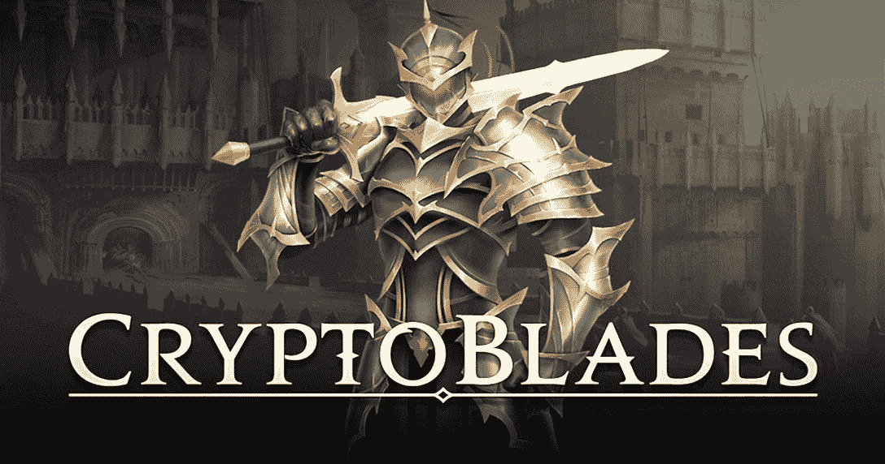
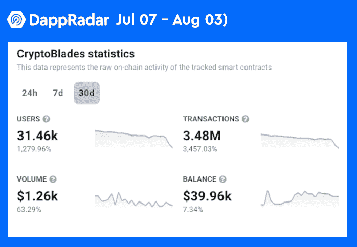
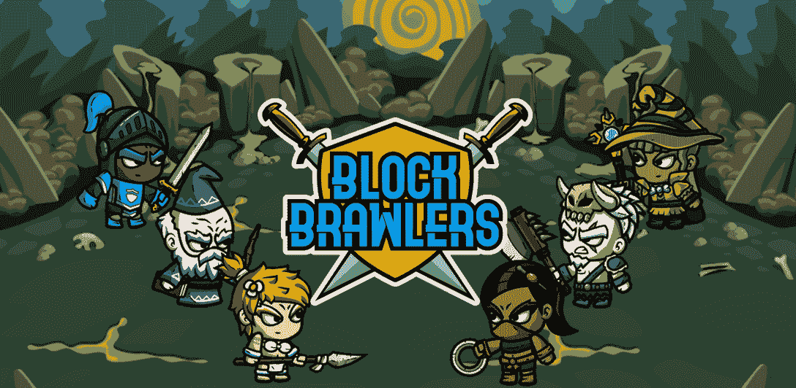
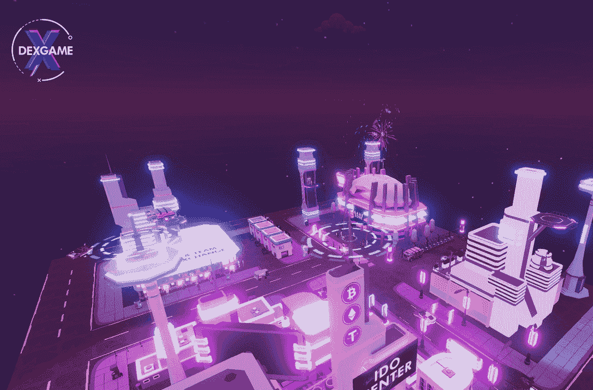
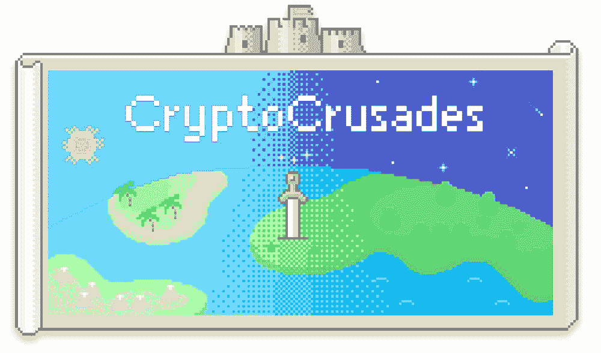

# 游戏 Dapps 在 SKALE 的零气体区块链网络上蓬勃发展

> 原文：<https://web.archive.org/web/https://dappradar.com/blog/gaming-dapps-are-thriving-on-skales-zero-gas-blockchain-network>

## SKALE 上现在有了 CryptoBlades 和 Block Brawlers，更多游戏正在筹备中。

SKALE 的零排放网络可以将区块链的游戏设备带到一个新的高度。SKALE 的独特架构支持自由铸造、高吞吐量和交易的即时终结。最重要的是，终端用户没有燃气成本。

**概要:**

*   SKALE 希望通过其高性能和零排放的区块链网络来推动区块链游戏领域的发展。
*   SKALE 是模块化的、灵活的，并且兼容 EVM，这使得它非常适合举办区块链奥运会。
*   各种游戏 dapps 已经在 SKALE 上运行，包括 [CryptoBlades](https://web.archive.org/web/20220819023341/https://dappradar.com/multichain/games/cryptoblades) 和 Block Brawlers。
*   此外，SKALE 正在引入一系列游戏和游戏生态系统，Snook T1、DEXGame、StonkLeague、CryptoCrusades、元宇宙入侵者和 Crypto Colosseum 都加入了这个网络。

加密市场现在显然不在最佳状态。然而，这是不公平的说，下降的数字是目前加密行业的全部故事。

在消化了四分之一的市场数据后，DappRadar 在其 [BGA Q2 报告](https://web.archive.org/web/20220819023341/https://dappradar.com/blog/dappradar-x-bga-games-report-q2-2022)中透露了一些积极的信号。根据该报告，区块链游戏受熊市影响最小，今年第二季度游戏 dapps 记录了近 110 万台无人机。值得注意的是，与 2021 年同期相比，这是一个令人印象深刻的 232%的增长。

随着快速致富者从动荡的市场退出，游戏开发商终于可以专注于与真正的游戏玩家互动并解决他们的需求。考虑到这一点，SKALE 希望为游戏开发者提供一个不可或缺的基础来构建 dapps，这是一个以太坊原生区块链的高性能和零气体网络。

## 游戏玩家如何从 SKALE 中获益？

SKALE 设想了一个由可扩展性和互操作性驱动的 Web3 未来。为了实现这一目标， [SKALE 推出了一个高度可配置的按需区块链网络](/web/20220819023341/https://dappradar.com/blog/how-skales-hybrid-modular-layer-1-stands-out-as-a-blockchain-scalability-solution/)，该网络完全可与以太坊互操作和兼容。但是这对用户和开发者意味着什么呢？

首先，这样的设计让 SKALE 继承了以太坊的安全性。此外，SKALE 的模块化架构为开发人员提供了一个灵活的网络来实现特定的服务，以便在生态系统中运行他们的 dapps。

在 SKALE 上运行 dapps 最吸引人的好处是，该网络不向其最终用户收取任何汽油费。例如，如果玩家想用 Ruby 交换游戏代币。交易所，SKALE-native 交易所，交易不加油。

SKALE 的建筑非常适合举办区块链奥运会。SKALE 的特性，如无汽油用户体验、零成本铸造、链上随机数生成器、高吞吐量和即时终结，为沉浸式、响应性和无缝的用户体验奠定了坚实的基础。

## 游戏玩家准备好出发了

SKALE network 不遗余力地创造了一个互联互动的区块链世界，开发者可以在其中实现自己的抱负。值得一提的是，各种游戏团队都青睐 SKALE 的零排放、环保和多功能基础设施。

### CryptoBlades 和 Block Brawlers 用户已经可以享受 SKALE 驱动的无气游戏体验。

CryptoBlades 是一款“玩到赚”的 RPG 游戏，让用户参与战斗，使用他们的资产来赚取游戏的原生令牌——技能。游戏可以跨越多个区块链，包括[多边形](https://web.archive.org/web/20220819023341/https://dappradar.com/rankings/protocol/polygon/category/games)、 [BNB 链](https://web.archive.org/web/20220819023341/https://dappradar.com/rankings/protocol/binance-smart-chain/category/games)、[雪崩](https://web.archive.org/web/20220819023341/https://dappradar.com/rankings/protocol/avalanche/category/games)和斯卡莱。

如果用户通过 SKALE 连接到游戏，他们可以享受 100%无气体的游戏体验。这无疑使 CryptoBlades 成为更受欢迎的 dapp，其出色的数据说明了一切。这款游戏总共吸引了约 32，000 名用户，在过去 30 天里产生了 348 万笔交易。

Block Brawlers 是另一款 P2E 游戏，它利用 SKALE 强大的网络来优化用户的游戏体验。在 Block Brawlers 中，玩家可以训练他们独特的角色，完成任务，并通过战斗获得有报酬的奖励。

由于 SKALE 的零汽油性质，这种快节奏的游戏允许用户沉迷于兴奋中，而不用担心成本。

### DEXGame、Snook 和 Crypto Crusades 正在加入 SKALE

更多的游戏正在加入 SKALE 网络，从战略和休闲到元宇宙，为 SKALE 的游戏生态系统增添了多样性。所以先来先睹为快，SKALE 有什么游戏要来了。

#### doxgame

DEXGame (DEXG) 最初是一个位于区块链的元宇宙，面向游戏行业的利益相关者。现在，DEXGame 将把它的动态宇宙扩展到 SKALE 网络。

DEXGame 最令人惊叹的功能包括其赛博朋克视觉元素和前所未有的沉浸式体验。这对于那些希望在游戏领域引起轰动的项目来说是令人兴奋的，因为他们将能够在 DEXGame 中为用户策划独特的体验。此外，它将由 SKALE 的无气网络提供支持。

#### 锯盖鱼

[https://web.archive.org/web/20220819023341if_/https://www.youtube.com/embed/fNOJlch93Ko?feature=oembed](https://web.archive.org/web/20220819023341if_/https://www.youtube.com/embed/fNOJlch93Ko?feature=oembed)

Snook 是一款基于技能的 NFT 区块链游戏。这个游戏玩起来很简单，但是有一个独特的经济模式，结合了玩到赚和 DeFi。Snook 的游戏内生态系统得益于它的 SNK 令牌。

玩家需要向 SNK 支付游戏角色史努克-NFT 的费用，以便开始相互竞争。当用户的钱包里有 SNK 代币时，他们也可以用它们来解锁独特的游戏权限。

#### 密码十字军

CryptoCrusades 是一款由人鱼游戏工作室开发的手机友好型大型战略游戏。目前，该游戏仍在开发中，未来将面向 IOS 和 Android 用户。CryptoCrusades 允许用户建造建筑、进行贸易和与其他文明战斗，以壮大他们的区块链帝国。

## 最后的话

风险资本仍然看好区块链博彩业，今年[已经在 Q2 投资了 25 亿美元](https://web.archive.org/web/20220819023341/https://dappradar.com/blog/dappradar-x-bga-games-report-q2-2022)，很明显博彩业不会倒退。这间接证明了用户对区块链游戏的需求呈现刚性。SKALE 正在从技术角度为区块链游戏世界增添动力，并帮助推动区块链的大规模采用。

为了激励更多的游戏玩家加入这个网络， [SKALE 已经启动了一个 500 万美元的资助项目](https://web.archive.org/web/20220819023341/https://p2e.skale.network/mp),资助游戏开发者和构建 P2E、元宇宙和 NFT 游戏的项目。

了解更多关于 SKALE 的信息:

[网站](https://web.archive.org/web/20220819023341/https://skale.space/) [SKALE Docs](https://web.archive.org/web/20220819023341/https://docs.skale.network/develop/) [白皮书](https://web.archive.org/web/20220819023341/https://skale.space/whitepaper) [推特](https://web.archive.org/web/20220819023341/https://twitter.com/SkaleNetwork?ref_src=twsrc%5Egoogle%7Ctwcamp%5Eserp%7Ctwgr%5Eauthor) [博客](https://web.archive.org/web/20220819023341/https://skale.network/blog) [不和](https://web.archive.org/web/20220819023341/https://discord.com/invite/gM5XBy6)
[电报](https://web.archive.org/web/20220819023341/https://t.me/skaleofficial)

**免责声明** —这是一篇赞助文章。DappRadar 不认可本页面上的任何内容或产品。DappRadar 旨在提供准确的信息，但读者应该在采取行动之前总是自己做研究。DappRadar 的文章不能被认为是投资建议。