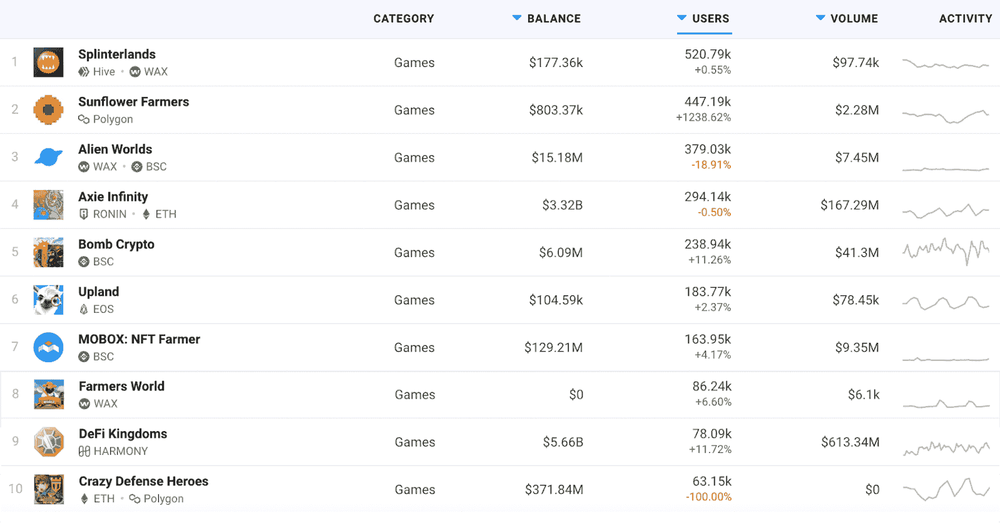

# 游戏 Dapps 在一周内吸引了 200 多万玩家

> 原文：<https://web.archive.org/web/https://dappradar.com/blog/gaming-dapps-attract-more-than-2-million-players-in-a-week>

## 在过去的 7 天里，排名前 10 的游戏带来了超过 8 . 41 亿美元的收入

**从用户基础来看，排名前 10 的游戏 dapps，无论是玩到赚到的还是游戏化的 DeFi，在过去一周已经吸引了超过 200 万个独立的活动钱包。根据 DappRadar 的数据，这些 dapps 也为该行业带来了巨大的交易量价值。**

在过去的七天里， [DappRadar Games](https://web.archive.org/web/20220929044521/https://dappradar.com/rankings/category/games) 排名中的前 10 名 dapps 吸引了 245 万个独立活动钱包，产生了超过 8.41 亿美元的交易量。对于 2022 年的头几天来说，这是一个了不起的成就。

Play-to-earn 和 GameFi 作为游戏行业的主要新兴领域脱颖而出。到 2021 年，[区块链产业中接近一半的用户已经连接到游戏 dapp。重要的是，这一趋势将在 2022 年的第一周强劲延续。重要的是，许多游戏 dapps 的用户群显著增长。](https://web.archive.org/web/20220929044521/https://dappradar.com/blog/2021-dapp-industry-report)

## 新游戏抢镜

游戏类别的整体表现令人印象深刻，这是不可否认的。另一个有趣的趋势表明，新的游戏 dapps 正在活跃地登上排行榜的榜首。像全新的[向日葵农民](https://web.archive.org/web/20220929044521/https://dappradar.com/polygon/games/sunflower-farmers)和已经流行的 [DeFi 王国](https://web.archive.org/web/20220929044521/https://dappradar.com/harmony/games/defi-kingdoms)和[疯狂防御英雄](https://web.archive.org/web/20220929044521/https://dappradar.com/multichain/games/crazy-defense-heroes)这样的新兴热门节目吸引了大量观众。

Axie Infinity 等成熟的游戏赚取平台是销量最高的应用程序。然而，由于新奇的因素，新的游戏 dapps 吸引了更大的用户群。此外，dapp 开发者开始探索更多的协议，如[和谐](https://web.archive.org/web/20220929044521/https://dappradar.com/rankings/protocol/harmony/category/games)和[多边形](https://web.archive.org/web/20220929044521/https://dappradar.com/rankings/protocol/polygon/category/games)。这允许更多的用户从“玩到赚”的体验中受益。

随着越来越多的 dapps 加入到“玩即赚”和 GameFi 运动中来，DappRadar 将继续关注区块链游戏行业。要了解游戏行业的最新消息，请在 Twitter 和 T2 Discord 上关注 DappRadar。你也可以看看 [DappRadar PRO](https://web.archive.org/web/20220929044521/https://dappradar.com/token/pro) 。它让你可以进入关于不和的独家讨论频道，以及一系列其他的额外津贴。

 NewsletterUnsubscribe at any time. [T&Cs](https://web.archive.org/web/20220929044521/https://dappradar.com/terms) and [Privacy Policy](https://web.archive.org/web/20220929044521/https://dappradar.com/privacy-policy)