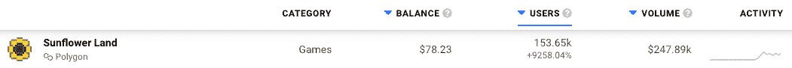
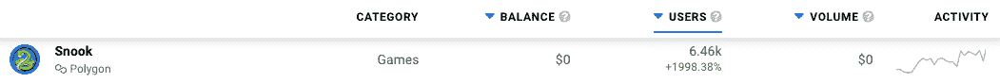
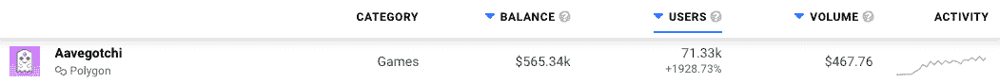
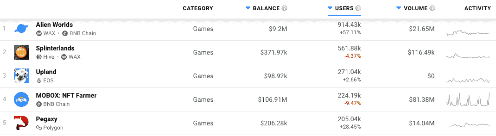

# Polygon 上的游戏在 4 月份表现强劲，因为市场份额之争加剧

> 原文：<https://web.archive.org/web/https://dappradar.com/blog/gaming-on-polygon-sees-strong-april-as-battle-for-market-share-intensifies>

## Polygon 上的游戏 dapps 在 4 月份有着出色的表现

长久以来，博彩业一直是多边形区块链最重要的产业之一。令人印象深刻的是，在 2022 年 4 月，该链上的许多游戏 dapps 都出现了巨大的增长，并吸引了成千上万的新用户。然而，问题仍然是 Polygon 是否会超越 BNB 连锁店这样的大型行业玩家，以及新一轮定制游戏区块链的兴起。

## 总结:

*   整个四月份，Polygon gaming dapps 的活动全面增加
*   [向日葵地](https://web.archive.org/web/20220930100336/https://dappradar.com/polygon/games/sunflower-land)、[史努克](https://web.archive.org/web/20220930100336/https://dappradar.com/polygon/games/snook)和[阿韦戈奇](https://web.archive.org/web/20220930100336/https://dappradar.com/polygon/games/aavegotchi)领先，吸引了比三月份多 1000%的钱包
*   BNB 连锁店仍然主导着[游戏排行榜](https://web.archive.org/web/20220930100336/https://dappradar.com/rankings/category/games)
*   《异形世界》凭借 4 月份记录的最高数量的独立活跃钱包荣登 30 天排行榜榜首
*   像罗宁和 DFK 这样的定制连锁店受到欢迎

## 兴起的多边形游戏

由于其快速的处理速度和几乎不存在的交易费用，Polygon 长期以来一直是游戏开发商首选的区块链之一。今年 4 月，该连锁店的受欢迎程度甚至更高，因为游戏 dapps 吸引了数千个独特的活动钱包。让我们看一些例子。

### 向日葵地用户在 30 天内增加了 9，258%

向日葵地发布了正式测试版，并向 Discord 社区之外的玩家开放。这导致了活动的大量增加，在过去三十天里，该平台吸引了超过 153，000 个独特的活动钱包。与《向日葵之地》3 月份的封闭测试观众相比，增长了 9，258%。

### 斯诺克吸引了成千上万的新玩家

类似蛇的游戏 [Snook](https://web.archive.org/web/20220930100336/https://dappradar.com/polygon/games/snook) 在过去的三十天里有了巨大的增长，吸引了超过 6000 个独特的活动钱包。这款游戏于去年 10 月在 Polygon 上推出，现在它正在产业链上的顶级玩家中寻找牵引力。与 3 月份相比，Snook 平台上连接的玩家钱包增加了 1，998%。

### 多边形最爱 Aavegotchi 继续连胜

由于游戏虚拟世界 Gotchiverse 的推出，三月对 Aavegotchi 来说是个大月份。整个 4 月，该平台似乎都在收获回报，因为它吸引了超过 70，000 个独特的活动钱包。与之前的三十天相比，这是一个令人印象深刻的 1928%的峰值。

虽然上面提到的 dapps 显示了最令人印象深刻的峰值，但对于 Polygon 上的大量游戏来说，绿色向上的趋势是明显的。 [Pegaxy](https://web.archive.org/web/20220930100336/https://dappradar.com/polygon/games/pegaxy) 的用户群增长了 28%， [Arc8](https://web.archive.org/web/20220930100336/https://dappradar.com/polygon/games/arc8-by-gamee-1) 推出了新一季，用户群增长了 39%，[幻影星系起源](https://web.archive.org/web/20220930100336/https://dappradar.com/polygon/games/phantom-galaxies)吸引了 183%的用户。

总的来说，April 在 Polygon 上的区块链游戏领域取得了成功。尽管链上的几个游戏 dapps 的受欢迎程度显著增加，Polygon 仍然努力跟上大枪，即 BNB 链，Wax 和 Hive。

## 前 5 名游戏玩家讲述了一个不同的故事

BNB 连锁店，前身是币安智能连锁店，是业内一些最成功的游戏玩家的家园。由于其知名的名字和广泛的影响力，BNB 链吸引了开发者和 GameFi 爱好者。

谈到过去三十天里玩得最多的游戏 dapps,《外星世界》显然是赢家。游戏最初在 Wax 上推出；然而，它最近引入了 BNB 连锁整合，帮助它接触到更多的玩家。因此,《异形世界》高居 DappRadar Games 排行榜之首也就不足为奇了，在过去的一个月中有超过 900，000 个独特的活跃钱包注册。

像 Wax 和 Hive 这样的区块链公司也长期处于区块链博彩业的前沿。在过去的一个月里，蜂巢的分裂之地排名第二，拥有超过 50 万个独特的活动钱包。

这里有趣的对比是完全没有基于多边形的 dapps。尽管四月取得了巨大的成功，但唯一进入前 5 名的多边形游戏是 Pegaxy。表现最好的 Aavegtochi 和 Snook 甚至没有进入前 10 名，而向日葵地勉强排在第九位。

对这种差异的合理解释可以在 Polygon 上游戏 dapps 的相对新生状态中找到。BNB 连锁店、蜂巢和蜡像馆已经举办区块链奥运会多年了。另一方面，Polygon 有了一个很好的开端，看到更多的 Polygon 游戏 dapps 登上排行榜榜首并不奇怪。然而，一个障碍可能是游戏专用链的新概念。

## 定制连锁店是下一个大事件吗？

像以太坊和 BNB 连锁店这样的通用连锁店从一开始就统治了区块链市场。像 Polygon 这样的后起之秀带来了改进和更好的输出。然而，游戏领域出现了一个新成员:游戏专用的区块链。

成功的以游戏为中心的连锁店已经在向前推进。以罗宁为例。专注于 Axie Infinity 的连锁店现在托管着与游戏内和游戏外交易、购买以及整个游戏经济相关的一切。此外，区块链还主办所有游戏内的连锁活动。尽管经历了一些挑战和不幸的几周，Ronin 已经成为第一个获得全球认可的游戏专用区块链。毕竟，Axie Infinity 在过去 30 天里吸引了超过 90，000 个独特的活动钱包。Axie Infinity 的创造者 Sky Mavis 对链有[的主要计划，它的潜力几乎是无限的。](https://web.archive.org/web/20220930100336/https://dappradar.com/blog/ronin-network-finally-making-long-proposed-ron-utility-updates/)

另一个令人印象深刻的游戏专用链的例子是最近推出的 DFK 链。它在和谐和雪崩上扩展了已经存在的 DeFi 王国的基础设施。DFK 链是一个 EVM 兼容的区块链，主持游戏的[水晶山谷扩展](https://web.archive.org/web/20220930100336/https://dappradar.com/blog/how-to-get-started-in-defi-kingdoms-crystalvale)。在[雪崩子网](https://web.archive.org/web/20220930100336/https://dappradar.com/blog/defi-kingdoms-launching-own-dfk-blockchain-to-improve-game-experience)的支持下，DFK 链是 DeFi 王国的指数增长之路。

区块链游戏领域的其他大牌也在为他们的项目探索定制链。例如，Gala Games 在今年 2 月推出了 Gyri 项目，目前正在积极开发中。4 月，游戏工作室发布了第一款在定制区块链上运行的阿尔法游戏[。](https://web.archive.org/web/20220930100336/https://dappradar.com/blog/gala-games-tease-galachain-capability-with-town-crush-alpha)

特定于游戏的区块链仍然是游戏 dapp 领域的一个非常新的方面。然而，越来越多的大公司开始涉足这个尚未开发的潜力之井。虽然以太坊和 BNB 链等知名品牌和 Polygon 等后起之秀仍然是首选，但有足够支持和资源的项目已经在走定制链的道路。

随着新的 dapps 和新的连锁店崛起，DappRadar 将继续监测区块链的游戏空间。如果你想更深入地了解这些数据，请查看 [DappRadar PRO](https://web.archive.org/web/20220930100336/https://dappradar.com/token/pro) 。专业会员资格让您可以查看 dapps 和 NFT 系列的每日和每小时活动明细。此外，你可以在[推特](https://web.archive.org/web/20220930100336/https://twitter.com/dappradar)上关注 DappRadar，抢先获得最新的区块链博彩新闻。

 NewsletterUnsubscribe at any time. [T&Cs](https://web.archive.org/web/20220930100336/https://dappradar.com/terms) and [Privacy Policy](https://web.archive.org/web/20220930100336/https://dappradar.com/privacy-policy)