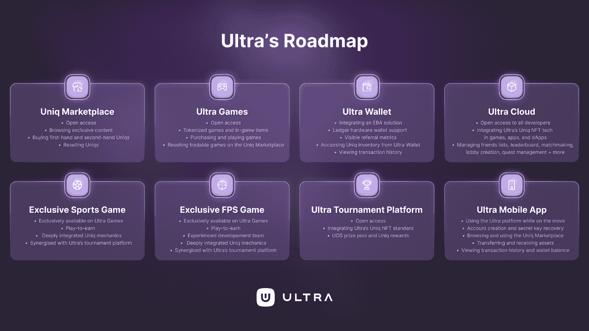

# 游戏平台 Ultra 计划在 2022 年推出大动作

> 原文：<https://web.archive.org/web/https://dappradar.com/blog/gaming-platform-ultra-plans-big-moves-in-2022>

## 该团队发布了更新的路线图

在 2021 年取得令人印象深刻的成功后，游戏平台 Ultra 宣布了其 2022 年路线图。该平台今年计划了许多令人兴奋的功能和项目，因此请继续阅读，了解更多有关 Ultra 2022 年路线图的信息。

去年，Ultra 平台引入了一系列游戏项目。2022 年，该团队将专注于扩展整体平台功能。新路线图中详述的一些更重要的里程碑包括 Uniq 市场、钱包更新和专用移动应用程序。

Uniq Marketplace 收藏了所有的数字资产。无论你想买还是卖，市场都是你应该看的地方。这款应用是 Ultra 生态系统不可或缺的一部分。它将为开发者、艺术家、品牌等铺平道路，使他们的内容符号化，并与他们的社区分享。

随着 Uniq Marketplace 的推出，Ultra 将专注于进一步开发集成的 Ultra Wallet。这项服务对游戏玩家、收藏者和开发者都起着重要的作用，因为它促进了平台上的所有交易。2022 年，Ultra 平台背后的团队将致力于通过创新的 Easy 区块链账户技术使钱包更加安全。

## 即将推出的 Ultra 游戏

除了对平台上的不同工具进行功能开发，Ultra 还将向用户推出大量新游戏。新公布的路线图指出了两个独家版本，将为游戏玩家提供非常独特的体验。

首先，Ultra 正在开发一款全新的体育游戏。该游戏将与一家知名游戏工作室合作，在该平台上独家开发。重要的是，体育爱好者将能够利用 Uniq 市场，因为所有游戏内的资产都将是 Uniq NFTs。

更重要的是，该团队正在致力于发布一款免费的第一人称射击游戏。这是 Ultra 与 AAA 游戏开发工作室开展的第二个主要合作项目。虽然关于这两款游戏的细节仍然很少，但项目已经在开发中。

达普拉达将继续监控区块链的游戏空间。根据我们的最新报道，区块链博彩业占据了区块链所有活动的一半以上。从这个意义上说，像 Ultra 这样的平台能够吸引新用户，并在游戏行业留下自己的印记。为了首先获得最新的区块链游戏新闻，请在 [Twitter](https://web.archive.org/web/20230115071444/https://twitter.com/dappradar) 上关注 DappRadar，并关注[顶级游戏 Dapps](https://web.archive.org/web/20230115071444/https://dappradar.com/rankings/category/games) 排行榜。

 NewsletterUnsubscribe at any time. [T&Cs](https://web.archive.org/web/20230115071444/https://dappradar.com/terms) and [Privacy Policy](https://web.archive.org/web/20230115071444/https://dappradar.com/privacy-policy)