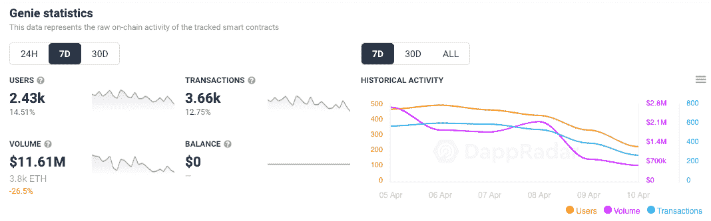
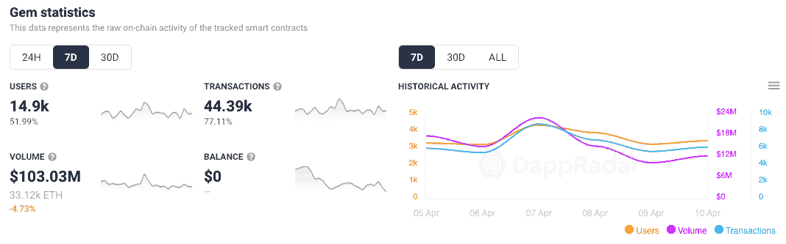
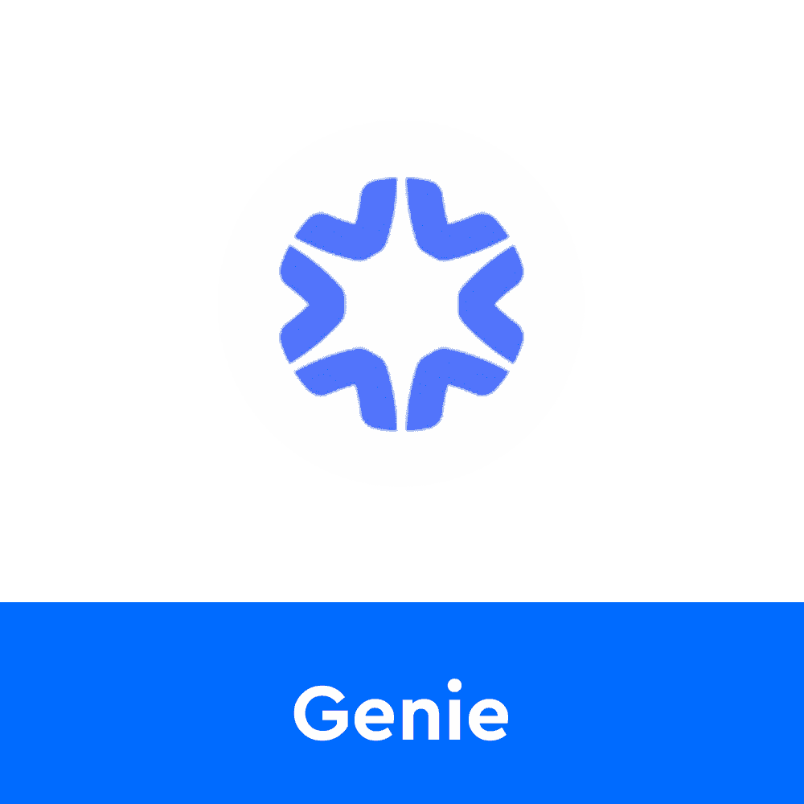
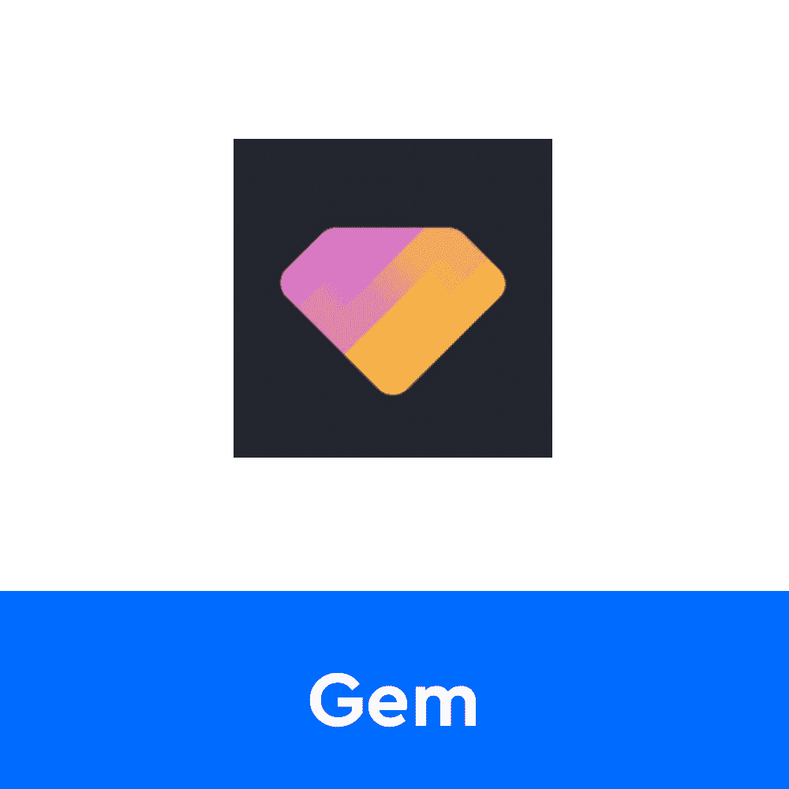
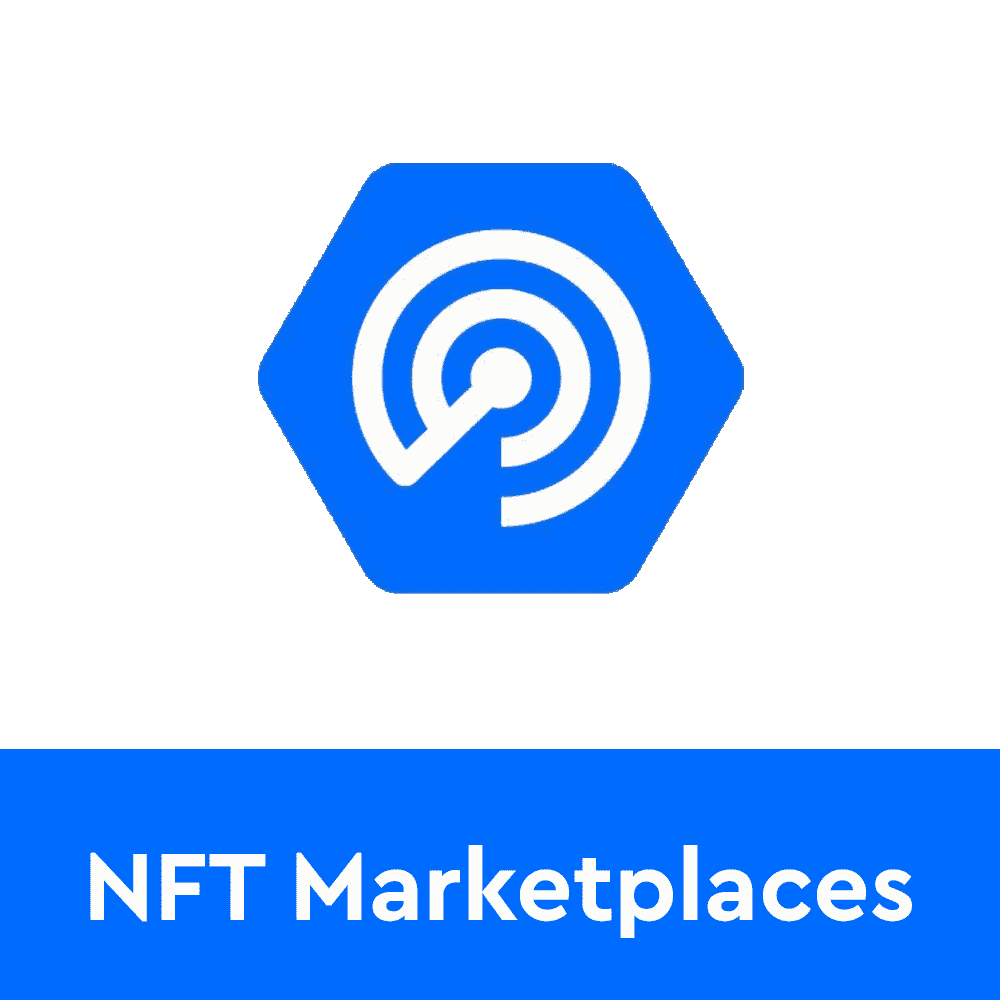

# 创业板在 NFT 市场整合战中领先

> 原文：<https://web.archive.org/web/https://dappradar.com/blog/gem-leading-in-battle-for-nft-marketplace-aggregation>

## 尽管有先发优势，但主要竞争对手 Genie 落后了

目前，Gem 和 Genie 是两个领先的 NFT 市场聚合平台。他们的故事绝对有趣。但是，在这个新的 NFT 市场中，哪一个占据了头把交椅呢？请继续阅读，寻找答案。

*概要:*

*   *什么是 [NFT 市场聚合器](https://web.archive.org/web/20221229123648/https://dappradar.com/blog/gem-leading-in-battle-for-nft-marketplace-aggregation/#marketplace-aggregation)？*
*   *[精灵](https://web.archive.org/web/20221229123648/https://dappradar.com/blog/gem-leading-in-battle-for-nft-marketplace-aggregation/#genie)是第一个 NFT 市场聚合服务*
*   [*宝石*](https://web.archive.org/web/20221229123648/https://dappradar.com/ethereum/marketplaces/gem) *vs* [*精灵*](https://web.archive.org/web/20221229123648/https://dappradar.com/ethereum/marketplaces/genie)
*   [*Gem*](https://web.archive.org/web/20221229123648/https://dappradar.com/ethereum/marketplaces/gem) *与 Genie* 相比，上周多注册了 12，000 个独特的活动钱包

NFT 市场聚合是一个相当新的领域，然而，对这种服务的需求正在上升。像 Gem 和 [Genie](https://web.archive.org/web/20221229123648/https://dappradar.com/ethereum/marketplaces/genie) 这样的平台为用户提供了在一次交易中从各种收藏和市场购买 NFT 的能力，节省了这个过程中的汽油成本。假设你想从 5 个不同的系列中购买 10 件 NFT。如果你在像 OpenSea 这样的市场上这样做，这将意味着 10 次交易和 10 次支付汽油费。

NFT 市场聚合器允许你将所有这些购买捆绑在一个篮子里交易，节省汽油费用。这可能意味着节省了数百甚至数千英镑，这取决于您购物篮中的 NFT 数量。

## 精灵掀起了浪潮

Genie NFT 市场聚合器是第一个出现在 NFT 的此类平台。它在 2021 年底开始获得牵引力，因为 NFT 空间正在经历一场爆炸式的活动。

该平台号称节省了高达 40%的油费，当然这取决于单笔交易中捆绑的 NFT 数量。用户可以用他们的以太坊钱包登录，浏览数以千计的捆绑了各种 NFT 的 NFT 收藏，并且只需支付一次汽油费。

Genie 为 NFT 市场带来了革命性的购买和上市机制，并迅速走红。然而，商业伙伴关系有时很难管理，Genie 就是一个完美的例子。就在该平台于 2021 年 11 月正式推出之前，Genie 的一位联合创始人未经通知就离开了该项目。另一位精灵联合创始人斯科特·埃思(Scott _ eth)表示，这是根本错位的结果。尽管如此，Genie 还是成功发射，并席卷了 NFT 空间。

## 宝石大战精灵

[Gem](https://web.archive.org/web/20221229123648/https://dappradar.com/ethereum/marketplaces/gem) ，第二个开始流行的 NFT 市场聚合器，于 2022 年 1 月推出。该平台提供了与 Genie 几乎相同的功能，但是性能统计数据却大不相同。

虽然 Gem 也允许用户批量购买和上市 NFT，但一个很大的区别来自于该平台支持的市场列表。2022 年 1 月初，一个名为 LooksRare 的新平台接管了二级市场空间。用代币奖励吸引用户，LooksRare 迅速流行起来，Gem 利用了这一点。

与 Genie 不同，Gem NFT 市场聚合器支持[looks are](https://web.archive.org/web/20221229123648/https://dappradar.com/ethereum/marketplaces/looksrare)销售和购买。更重要的是，Gem 允许其用户仍然受益于 [LooksRare 的 LOOKS token 奖励](https://web.archive.org/web/20221229123648/https://dappradar.com/blog/looksrare-nft-marketplace-token-airdrop-is-live/)。这是 Gem 和 Genie 之间竞争的转折点。

## 全球创业观察接管了 NFT 的聚合空间

现在我们来看一些数据。在过去的七天里， [Genie](https://web.archive.org/web/20221229123648/https://dappradar.com/ethereum/marketplaces/genie) ，第一个推出的 NFT 市场聚合器，吸引了超过 2400 个不同的活跃钱包。与前一周相比，这是一个 14%的不错的峰值。该平台处理了超过 3 600 笔交易，产生了 1 161 万美元的交易量。

虽然这些数字不错，但主要竞争对手 Gem 似乎做得更好。在过去的七天里，Gem 吸引了近 15，000 个独特的活动钱包。与前一周相比，这一数字上升了 51%，比 Genie 记录的数字高出了 12，000。

此外，Gem 在同一七天时间内处理了十多倍的交易，产生的交易量是 Genie 的近十倍。从这个意义上说，目前创业板的表现远远超过其前身。

然而，人们不应该把 Genie 作为 NFT 市场聚合领域的一个可行选项。这两个平台都还非常年轻，处于发展的早期阶段。凭借坚实的用户基础和创新的服务，这两个项目都将继续存在。NFT 社区急切地抓住一切机会节省汽油费，因此 Genie 和 Gem 只会吸引越来越多的用户。

DappRadar 将继续关注这一有趣的竞争，因为 NFT 市场聚合成为 NFT 鲸鱼和一流收藏家的首选服务。如果你想了解更多关于 Genie 和 Gem 的知识，请点击下面的链接。你也可以在 Twitter 上关注 DappRadar，并加入我们的专业社区，首先获得最新的 NFT 新闻。

[<picture></picture>](https://web.archive.org/web/20221229123648/https://dappradar.com/ethereum/marketplaces/genie)[<picture></picture>](https://web.archive.org/web/20221229123648/https://dappradar.com/ethereum/marketplaces/gem)[<picture></picture>](https://web.archive.org/web/20221229123648/https://dappradar.com/nft/marketplaces) NewsletterUnsubscribe at any time. [T&Cs](https://web.archive.org/web/20221229123648/https://dappradar.com/terms) and [Privacy Policy](https://web.archive.org/web/20221229123648/https://dappradar.com/privacy-policy)