# 利用 PlayDapp R 级 NFT 赌注赚取被动收入

> 原文：<https://web.archive.org/web/https://dappradar.com/blog/generate-passive-income-with-playdapp-r-grade-nft-staking>

## 将 PLAYZ NFTs 与诸神一起下注，并获得 PLA 代币的每日奖励

PlayDapp R 级 NFT 为用户提供了赚取被动收入的绝佳机会。而且这些 NFT 在 PlayDapp 上的所有游戏中都有显著的价值。目前，在《与神同行》中下注 R 级 NFT 可以让用户获得每日 PLA 奖励的特权。

**内容:**

*   什么是 PLAYZ NFT，如何获得奖励？
*   一步一步的教程 R 级 NFT 赌注。
*   将 6 台 R 级 NFT 合并升级为 SR 级 NFT，以提高收益。
*   使用 PlayDapp 进行身临其境的 P2E 之旅

“玩赚”(Play-to-earn，P2E)作为一种创新的游戏形式，让玩家通过参与游戏来获得被动收入，从而推动了游戏的繁荣。根据 DappRadar 最新的 BGA 报告，区块链游戏占据了该行业近 60%的份额，7 月份产生了 8 . 57 亿美元的交易。

获得金钱奖励的潜力和引人入胜的游戏性使 P2E 成为许多人探索的新领域。本文将解释如何使用 PlayDapp 的 PLAYZ NFT 在 PlayDapp 的 P2E 生态系统中赚取代币奖励。

在开始今天的指南之前，[别忘了加入 PlayDapp NFT 空投](https://web.archive.org/web/20221001180811/https://dappradar.com/hub/airdrops)。免费赢取 PLAYZ NFT，立即开始您的 P2E 之旅！

## 什么是 PLAYZ NFT，如何获得奖励？

PLAYZ NFTs 作为 PlayDapp 的平台 NFT，通过更多的互操作性和可玩性来增强生态系统。此外，玩家可以利用这些 NFT 解锁更精彩的游戏，并在 PlayDapp 上的游戏中获得代币奖励。

普拉达普镇的 NFT 有三个稀有等级，从最稀有到最稀有:R，SR 和 SSR。要获得 PLAYZ，用户可以去 PlayDapp NFT 市场。

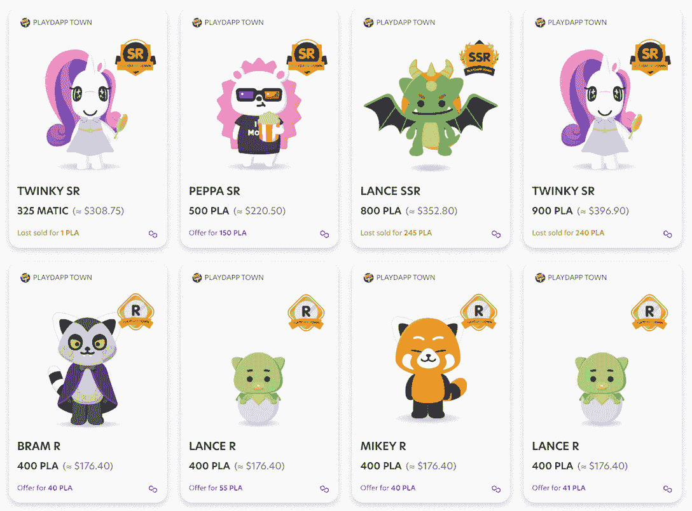

玩家可以通过在 PlayDapp 平台的游戏中下注 PLAYZ NFTs 来赚取 PLA 代币。在接下来的章节中，让我们看看如何在 PlayDapp 的旗舰 P2E 游戏《众神》中加入 PLAYZ R-Grate NFTs。

## PlayDapp R 级 NFT 定位的分步指南

1.  [在 Google Play 上点击此链接，下载](https://web.archive.org/web/20221001180811/https://go.playdapp.com/DappRadar)与神同行(AWTG)。
2.  AWTG 是一个令人兴奋的 RPG 冒险游戏，玩家可以开始任务，打败敌人，并获得丰厚的奖励！[查看这篇文章](https://web.archive.org/web/20221001180811/https://dappradar.com/blog/how-to-play-and-win-along-with-the-gods)了解这款游戏的详细指南。

在下面的预告片中先睹为快。

[https://web.archive.org/web/20221001180811if_/https://www.youtube.com/embed/OGNdW1p2dXA?feature=oembed](https://web.archive.org/web/20221001180811if_/https://www.youtube.com/embed/OGNdW1p2dXA?feature=oembed)

3.  接下来，你将进入游戏设置并选择赛季服务器。

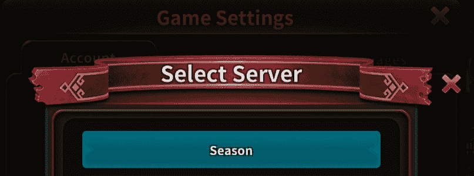

4.  创造一个角色成为你旅程的主角。游戏有五个角色类别和超过 100 个英雄。
5.  开始杀死一些怪物和水平！一旦你到了 20 级，你会在主屏幕的左下角找到物品管理图标。当你沉浸在 AWTG 的世界时，时间过得很快。所以只需要一天就能达到这个水平。

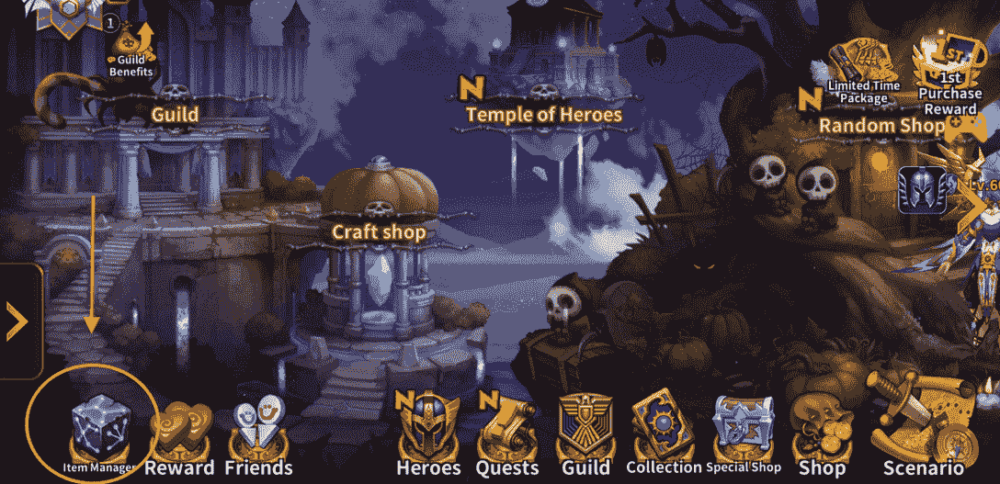

6.  要访问物品管理器，你需要登录并将你的钱包连接到 [PlayDapp 的 NFT 市场。](https://web.archive.org/web/20221001180811/https://market.playdapp.com/)

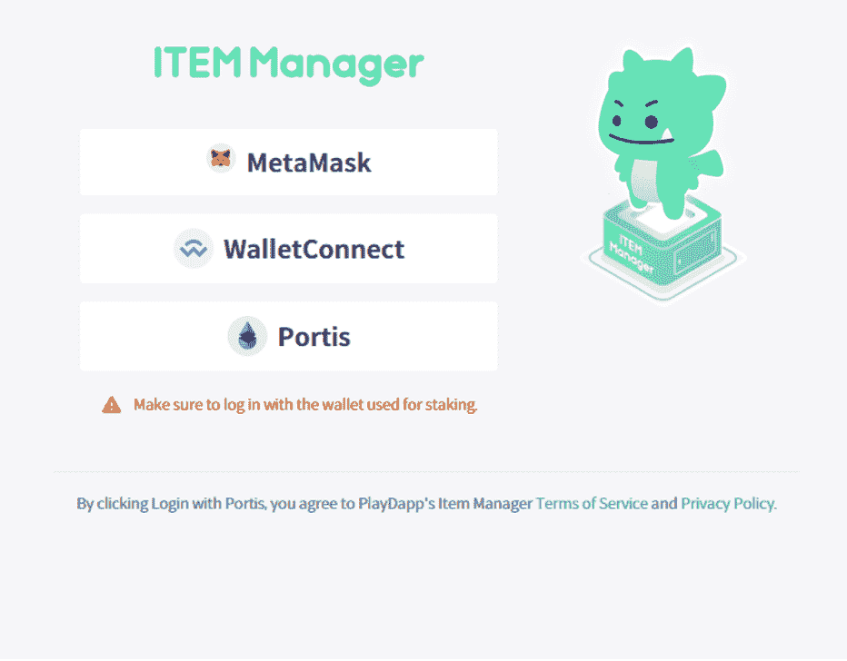

您必须使用有效的启用多边形的钱包和钱包地址从“即玩即赚”服务器登录到项目管理器。这一步会将你的钱包绑定到你的游戏账户，这是你开始赚取 PLA 奖励的关键过程。

7.  现在你可以看到赌注菜单。首先，打开 R 级锁紧，然后点击开始锁紧。接下来，你需要选择一个 R 级 NFT。

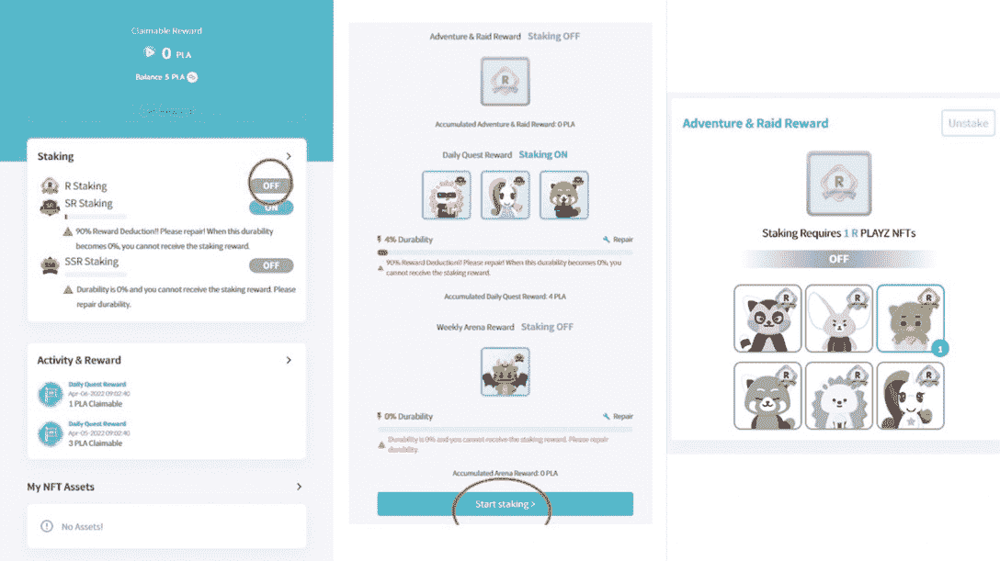

8.  当您看到弹出窗口时，单击确定并确认您的交易！在区块链上确认大约需要 5 分钟。

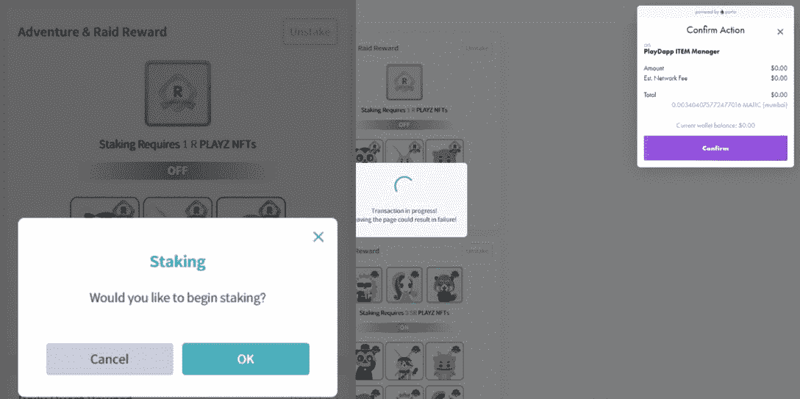

9.  项目管理器允许你检查你的 NFT 的最新状态。回到游戏，点击物品管理器，你会在右上角发现一个 NFT 福利图标。

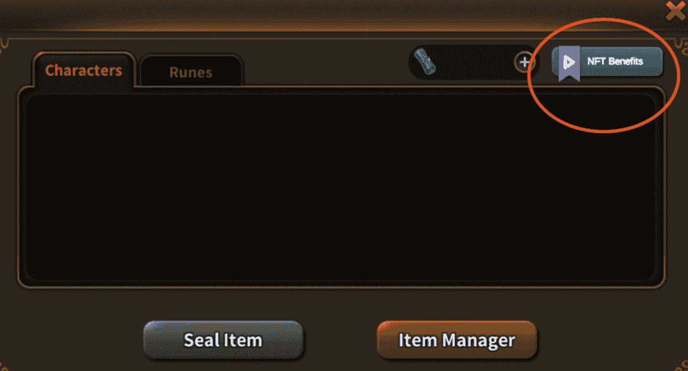

10.  点击 NFT 福利。如果你看到这个屏幕，你的 NFT 正在为你赢得 PLA！

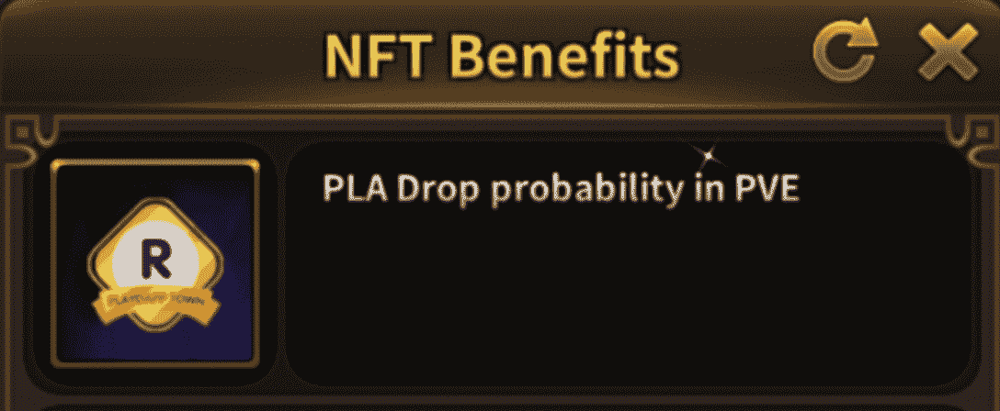

根据下注开始的时间，需要 1 到 2 天才能收到下注奖励。例如，赌注时间每天在 UTC 00:00 重置，因此如果用户在稍后的时间下注，他们将不得不等待不到两天的时间。但是如果用户在 UTC 00:01 下注，那么总有一天他们会收到他们的奖励。

你可以直接在物品管理器中申领 PLA 奖励。只需点击“获取奖励”,您就可以领取您获得的所有可用的 PLA 奖励。申领成功后，PLA 令牌将出现在您绑定的钱包地址中。

现在，您已经学习了如何将 R 级 NFTs 作为权益的赌注，【to】在 Google Play 上点击此链接，下载《与神同行》，并收获回报！

## 将 6 个 R 级 NFT 合并和升级为 SR 级 NFT，以提高收益

如果你想从你的 NFT 赌注中得到更多，合并你的 R 级 NFT 将会达到目的。现在让我们来看看如何做到这一点。

1.  进入 PlayDapp 的 NFT [市场](https://web.archive.org/web/20221001180811/https://market.playdapp.com/)，点击你的个人资料图标，打开你的钱包。

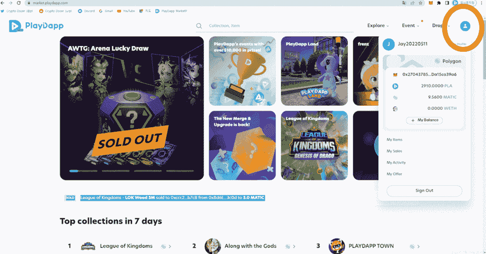

2.  在此页面上，您将看到您拥有的所有 PLAYZ NFTs。然后，点击合并和升级。

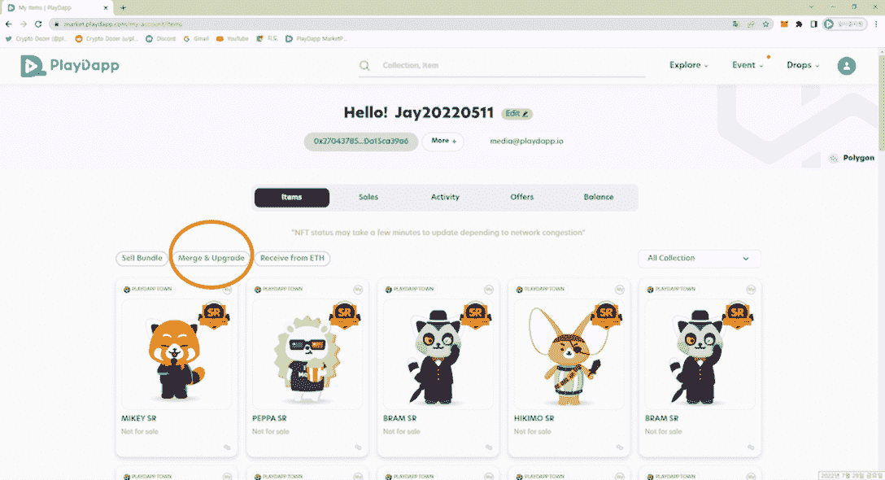

3.  选择 6 个 R 级 NFT，然后单击合并 NFT。烧那些 R 级 NFT，完成升级大概需要 5 分钟。

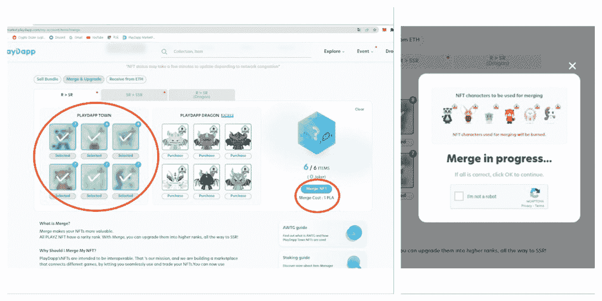

[下载](https://web.archive.org/web/20221001180811/https://go.playdapp.com/DappRadar)与神一起，尝试神奇的合并 NFT 功能，获得更大的好处！

## 使用 PlayDapp 进行身临其境的 P2E 之旅

PlayDapp 致力于为应用和游戏开发者提供中间件区块链解决方案和技术。它为开发者提供了一个一体化的平台，通过 NFTs 和精心设计的游戏内经济将他们的游戏货币化，其中 PLA 充当了生态系统的令牌。

PLA 在比特币基地、币安、北海巨妖等主要交易所上市。根据 DappRadar 的数据，在撰写本文时，PLA 目前为 0.37 美元。其市值超过 160，000，000 美元，24 小时交易量超过 14，000，000 美元。

PlayDapp 拥有区块链游戏领域最具活力的生态系统之一。在过去的 30 天里， [PlayDapp 的 NFT 市场](https://web.archive.org/web/20221001180811/https://dappradar.com/multichain/marketplaces/playdapp-marketplace)的交易量增长了 100%以上。值得注意的是，PlayDapp 蓬勃发展的 P2E 生态系统也吸引了三星、KB 银行(韩国最大的银行)、Line Friends(1.75 亿用户)等大公司的合作伙伴。

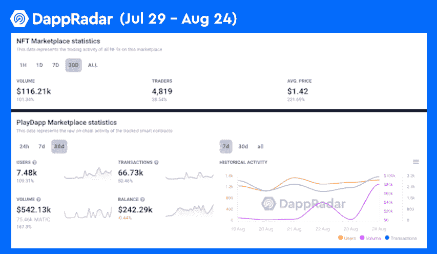

有一些帮助用户跟踪 PlayDapps 最新发展的链接。

*   [PlayDapp 单个 Dapp 页面排名](https://web.archive.org/web/20221001180811/https://dappradar.com/multichain/marketplaces/playdapp-marketplace)
*   [PLA Token](https://web.archive.org/web/20221001180811/https://dappradar.com/hub/token/eth/PLA/ETH?from=0x3a4f40631a4f906c2bad353ed06de7a5d3fcb430)
*   [如何与神一起玩并赢得游戏](/web/20221001180811/https://dappradar.com/blog/how-to-play-and-win-along-with-the-gods/)

了解更多关于《与神同行》和 PlayDapp 的信息。

[随神下载](https://web.archive.org/web/20221001180811/https://go.playdapp.com/DappRadar)

[网站](https://web.archive.org/web/20221001180811/https://playdapp.com/)

[中等](https://web.archive.org/web/20221001180811/https://medium.com/playdappgames)

[推特](https://web.archive.org/web/20221001180811/https://twitter.com/playdapp_io)

[不和](https://web.archive.org/web/20221001180811/https://discord.gg/aT5YFW7)

[电报](https://web.archive.org/web/20221001180811/https://t.me/cryptodozer_io)

**免责声明** —这是一篇赞助文章。DappRadar 不认可本页面上的任何内容或产品。DappRadar 旨在提供准确的信息，但读者应该在采取行动之前总是自己做研究。DappRadar 的文章不能被认为是投资建议。