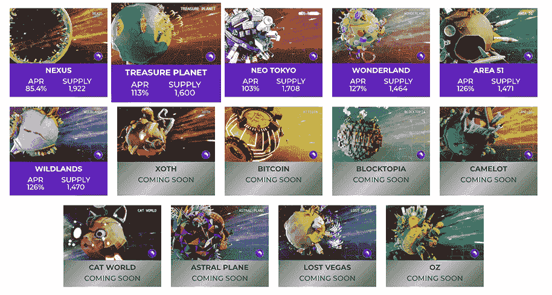
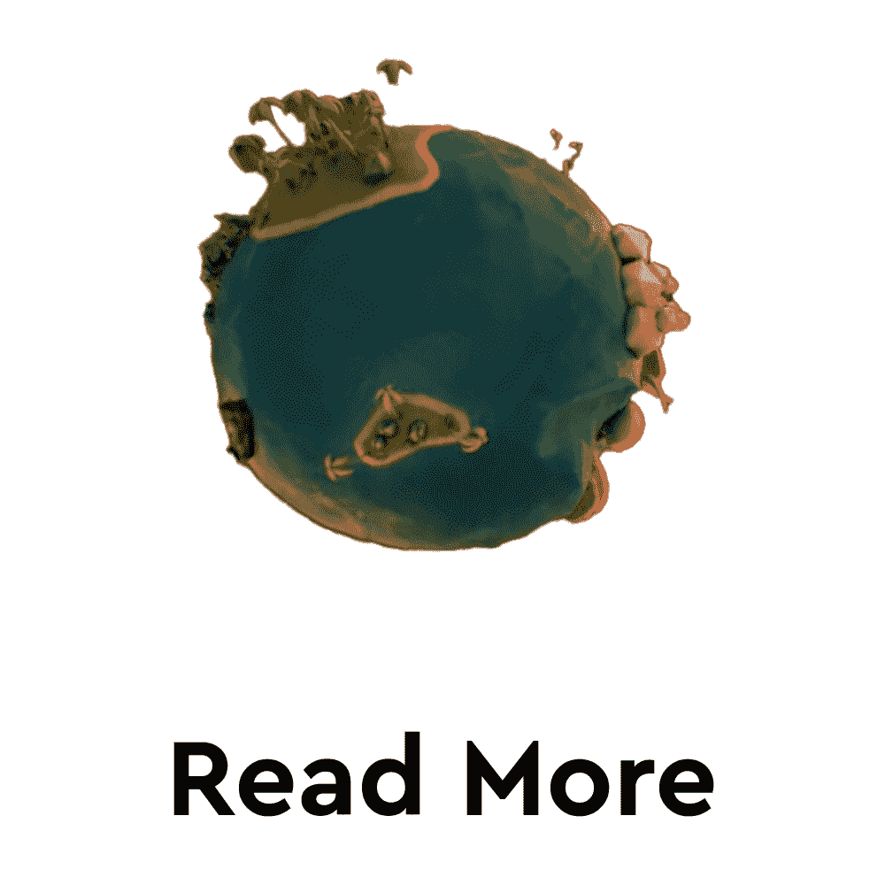
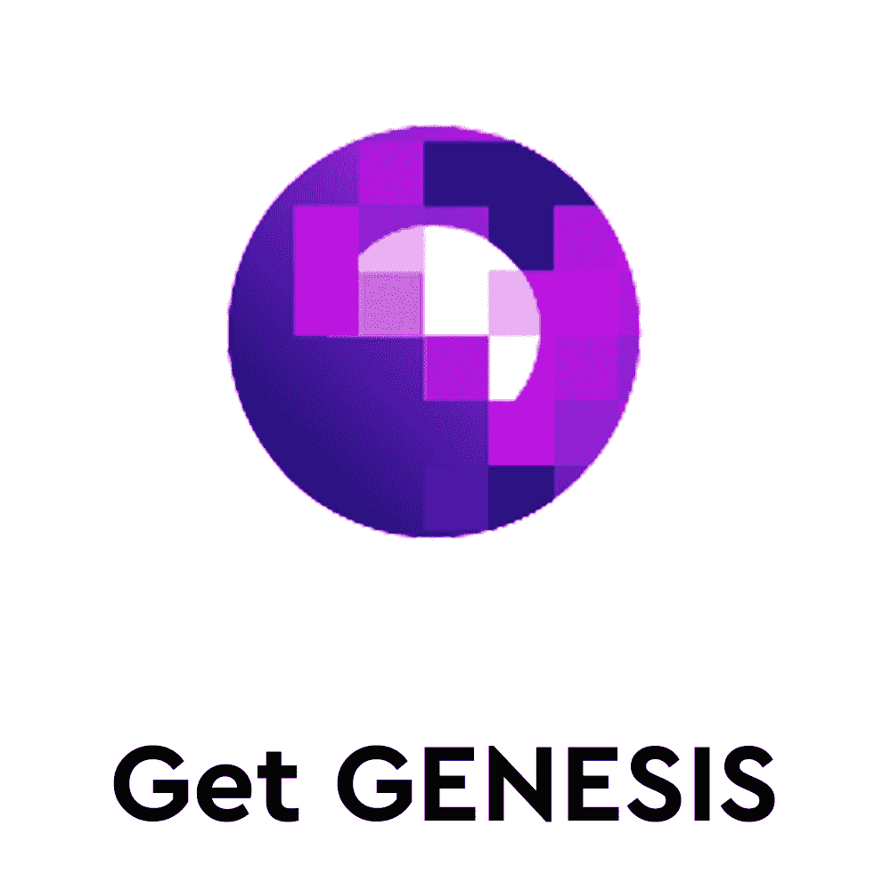
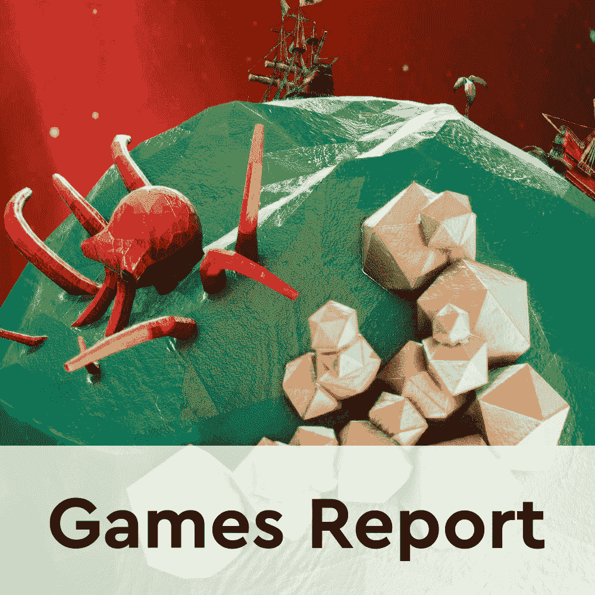
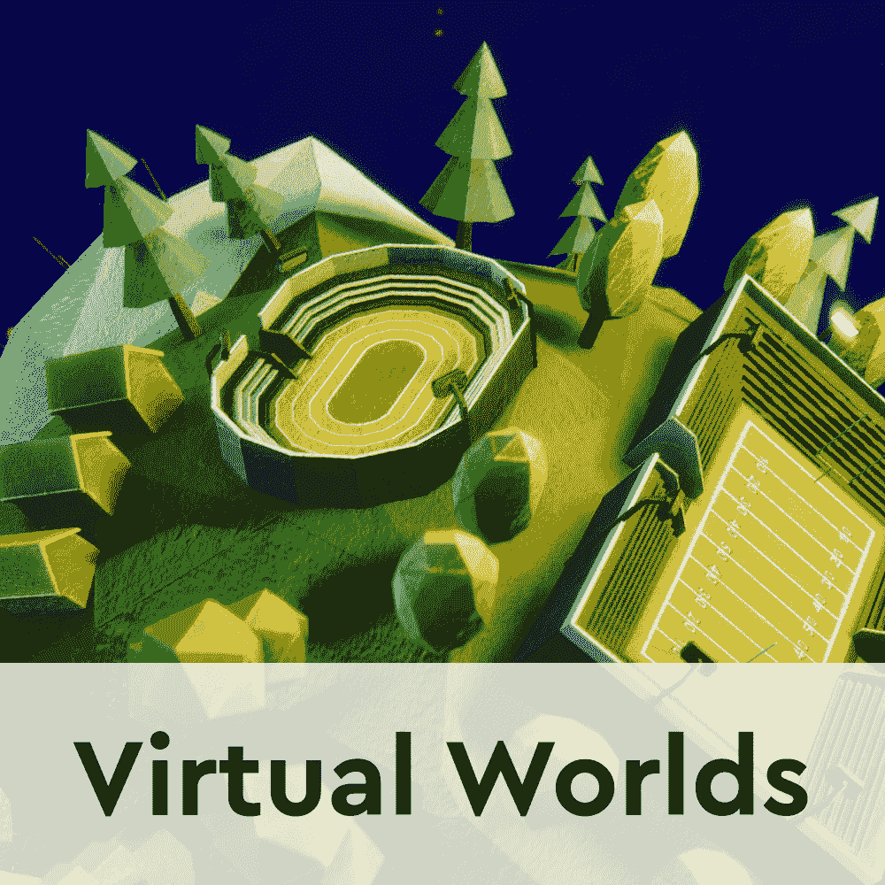

# 创世纪世界在四月揭开了 Blocktopia 和 XOTH 行星的面纱

> 原文：<https://web.archive.org/web/https://dappradar.com/blog/genesis-worlds-unveils-blocktopia-and-xoth-planets-in-april>

## 下个月，虚拟世界将迎来两个新的采矿机会

虚拟世界平台创世纪世界将于今年四月展示两颗新行星。Blocktopia 和 XOTH 将为玩家提供新的采矿机会，以及赚取创世令牌的更多机会。

创世纪世界是一个新兴的 web3 平台，结合了区块链空间的许多方面。首先，玩家有机会以 NFTs 的形式开采一个星球的一部分。令人印象深刻的是，这些 NFT 在创世纪代币中赚取被动收入。更重要的是，下注创世纪代币可以让玩家从自动复利机制中获益，进一步提高他们的利息收入。

每一个采矿权 NFT 授予所有者一年开采 2982 个创世纪令牌的权利。该采矿奖励的美元价值约为 141.65 美元，而 GENESIS staking APR 为 115.06%。

随着 Blocktopia 和 XOTH 来到平台，玩家将总共获得八个星球可供开采。虽然关于这两颗新行星上可用地块的细节尚未透露，但其他六颗行星每个都有 1400 到 1900 块地块。此外,《创世纪》已经宣布了再释放六颗行星的计划。

## 创世纪世界将 NFTs、游戏和 DeFi 结合在一起

创世纪世界是一个游戏世界，结合了区块链空间的许多方面。NFT 土地，DeFi 结构，如打桩和自动复合，以及虚拟世界的经验，一起在创世纪世界平台。

重要的是，该平台还包含了一个严肃的游戏方面。每个星球，包括新宣布的 Blocktopia 和 XOTH，都代表着不同的游乐场。创世纪世界的用户可以探索每个星球，并参与玩家创造的任务。当然，在一个真正的玩到赚的方式中，任务授予奖励。这些包括 NFT 收藏品，玩家可以升级，使用和出售给其他玩家。

此外,《创世纪》采用了分散自治组织(DAO)原则。这意味着该平台将治理和开发工作交给了拥有 GENESIS 令牌的玩家。创世纪世界还引入了游戏代币，它与治理结构一起作为游戏中的货币。

[<picture></picture>](https://web.archive.org/web/20221004122111/https://dappradar.com/blog/5-alternative-virtual-worlds-cheaper-than-decentraland-and-the-sandbox/)[<picture></picture>](https://web.archive.org/web/20221004122111/https://dappradar.com/hub/token/polygon/GENESIS?from=0x51869836681BcE74a514625c856aFb697a013797)[<picture></picture>](https://web.archive.org/web/20221004122111/https://dappradar.com/hub/token/polygon/GAME_1?from=0x8d1566569d5b695d44a9a234540f68D393cDC40D)

## 虚拟世界接管了区块链空间

《创世纪》世界受到了虚拟世界的关注，比如《沙盒游戏》、《T2》、《分散世界》、《T4》、《NFT 世界》、《T5》。随着主流品牌开始投资虚拟世界，2021 年第四季度元宇宙平台飙升。

根据最新的 [DappRadar 和区块链游戏联盟报告](https://web.archive.org/web/20221004122111/https://dappradar.com/blog/dappradar-x-bga-games-report-february-2022)，2 月份区块链上近一半的活动都是由区块链游戏产生的。这种活动的很大一部分来自虚拟世界。此外，元宇宙平台在过去一个月产生了超过 1.29 亿美元的交易量。

这些数据只表明虚拟世界将会继续存在。像《创世纪》这样的项目带来了革命性的功能，这要归功于它结合了区块链空间的方方面面。这种组合在密码爱好者和新用户中都很受欢迎。随着 web3 和元宇宙继续吸引用户并获得突出地位，DappRadar 将继续监测区块链的游戏空间。

要了解更多关于区块链游戏空间的信息，请点击下面的链接。此外，你可以在 Twitter 上关注 DappRadar，并加入我们的 T2 不和谐社区，分享你在元宇宙的想法和经历。

[<picture></picture>](https://web.archive.org/web/20221004122111/https://dappradar.com/rankings/category/games)[<picture></picture>](https://web.archive.org/web/20221004122111/https://dappradar.com/blog/dappradar-x-bga-games-report-february-2022)[<picture></picture>](https://web.archive.org/web/20221004122111/https://dappradar.com/blog/5-alternative-virtual-worlds-cheaper-than-decentraland-and-the-sandbox/) NewsletterUnsubscribe at any time. [T&Cs](https://web.archive.org/web/20221004122111/https://dappradar.com/terms) and [Privacy Policy](https://web.archive.org/web/20221004122111/https://dappradar.com/privacy-policy)