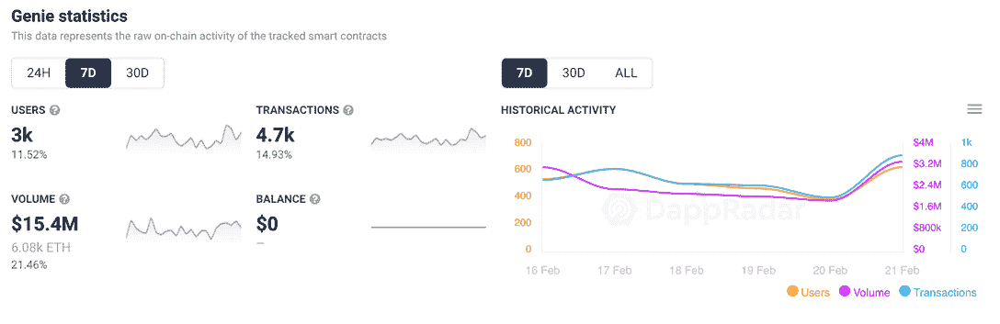
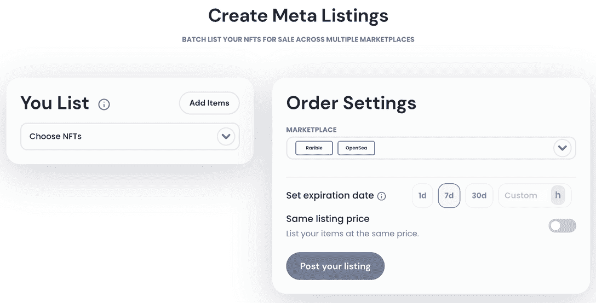
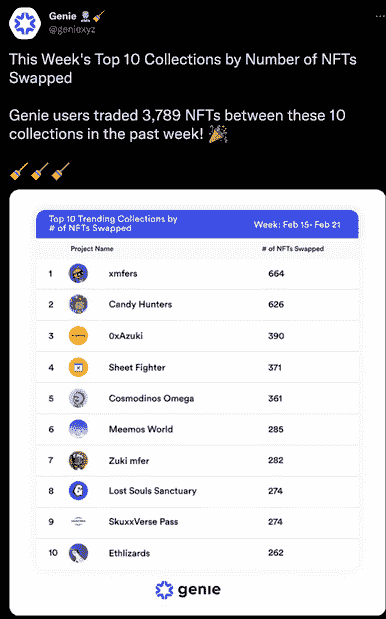
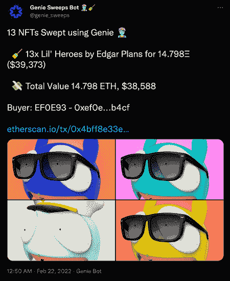

# 精灵:正在扫地的市场 Dapp

> 原文：<https://web.archive.org/web/https://dappradar.com/blog/genie-the-marketplace-dapp-thats-sweeping-floors>

## 在一次交易中批量购买并列出所有主要市场的 NFT

本周，NFT 市场工具精灵吸引了很多关注。该平台允许收藏家和投资者在一次交易中在几个主要市场批量购买和上市非交易品。

基于以太坊的工具最初于 2021 年 8 月推出，并随着元宇宙和游戏 NFT 的崛起而受到关注。现在，随着 NFTs 开始进入一个全新的资产类别，Genie 看到了第二波兴趣。在过去的七天里，连接到 [Genie 平台](https://web.archive.org/web/20220925071925/https://dappradar.com/ethereum/marketplaces/genie)的钱包增长了近 12%，达到 3000 个，而交易量也增长了 14%以上，达到 4700 笔。由于收藏者利用批量购买和出售功能，每笔交易平均花费约 3200 美元。

## 什么是精灵

Genie 是一个 NFT 市场聚合器,允许用户在一次交易中在所有主要市场批量购买和出售。该平台采用多种机制来减少气体消耗，包括广泛使用库和委托调用。此外，在进行交易时，平台会将任何可能的逻辑移出链外。此外，Genie 的架构旨在帮助用户在单个交易中高效地批量处理多个操作，以节省以太坊的汽油费，同时不收取平台费。值得注意的是，用户将在 OpenSea 或 Rarible 上支付市场费用以及相关的版税，这取决于收藏。

Genie marketplace 平台向 NFTX 和 NFT20 上的流动性池出售 NFT，这意味着如果没有足够的流动性，用户可能会收到“没有找到即时流动性”的消息。如果这条消息出现在你拥有的 NFT 名下，Genie 没有流动性池来立即出售你的 NFT。然而，不要担心，因为你仍然可以使用精灵列表出售它。第二个服务允许用户批量列出他们在多个支持的市场上销售的 NFT。在编写时，Genie 支持 [OpenSea 和 Rarible](https://web.archive.org/web/20220925071925/https://dappradar.com/nft) 。

Genie 支持整合市场上列出的所有 NFT，如果 NFT 收藏目前没有列出，用户可以在搜索栏中粘贴收藏的合同地址。Genie 将导入，然后花 1-2 分钟来索引收藏。此外，虽然用户可以批处理的交易数量是无限的，但 Genie 建议用户在一次交换中最多购买 20 个 NFT。可以说，查看热门收藏是了解哪些非艺术收藏品收藏家试图囤积的一种方式。

## 灯里的精灵出来了

Genie 还建立了一个免费的 Twitter feed ,感兴趣的人可以关注 Genie 用户购买的 NFT 收藏。单独出售每一家公司都会产生每次上市的汽油费，然后是出售的平台费。使用 Genie，NFT 有影响力的人和收藏家可以快速上传整个收藏进行销售，更好的是，直接将其销售到 NFTX 或 NFT20 流动性池中。

在重要的蓝筹股集合之外，流动性一直是 NFT 的一个问题。如果用户手中的 NFT 没有需求，就很难将该资产转化为有形价值。另一方面，许多收藏品需求量很大，一些持有者在造币厂或在其生命周期早期就购买了非功能性艺术品。这意味着，如果他们能卖掉 NFT，现在可能会坐拥一大笔财富。虽然更高级的用户可能会看到以不同的价格出售每个产品的吸引力，但那些寻求更快退出的人可能会发现像 Genie 这样的[工具非常有用。](https://web.archive.org/web/20220925071925/https://dappradar.com/ethereum/marketplaces/genie)

 NewsletterUnsubscribe at any time. [T&Cs](https://web.archive.org/web/20220925071925/https://dappradar.com/terms) and [Privacy Policy](https://web.archive.org/web/20220925071925/https://dappradar.com/privacy-policy)

***以上不构成投资建议。此处给出的信息仅供参考。请行使尽职调查，做你的研究。作者持有 ETH、BTC、AGIX、HEX、LINK、GRT、CRO、OMI、不可变 X、GALA、AVASTR、GMEE、CUBE、RADAR、FLOW、FTM、BNB、SPS、WRLD、ATOM 和 ADA。***