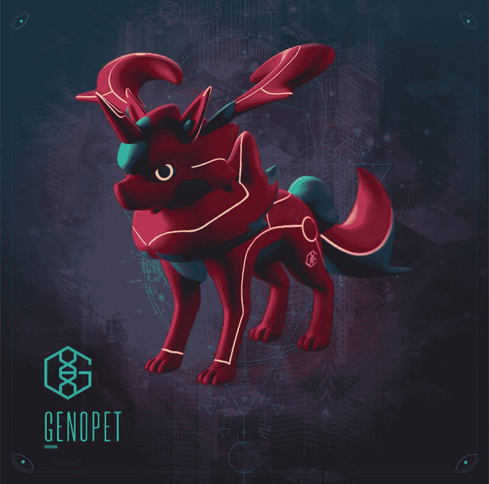
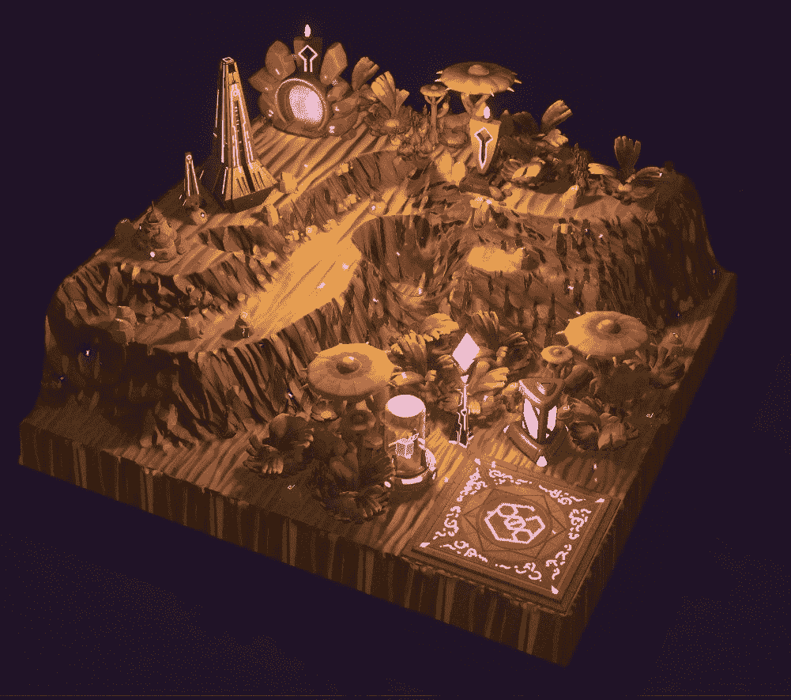

# 随着索拉纳铸币期开始，基因宠物栖息地交易激增

> 原文：<https://web.archive.org/web/https://dappradar.com/blog/genopets-habitat-trading-surges-as-solana-minting-period-begins>

## 索拉纳·区块链游戏拥有一批忠诚的追随者，他们努力工作，为我们带来新的生活世界

Genopets Habitat 独特的铸造过程于 4 月 4 日在 Solana 开始，工艺窗口将开放整整一个月。这给了所有长期的社区成员足够的时间来收集必要的原料和铸造他们的新土地。

**总结**

*   ***geno pets 栖息地的铸造过程是为长期粉丝设计的。***
*   ***栖息地的销售价格已经达到平均 16.47 索尔***
*   ***Genopets 是市面上第一款移动赚取游戏，使玩家能够因在现实世界中活跃而赚取奖励。***

## 玩家会得到什么

对于基因宠物的持有者来说，4 月 4 日是个好日子。毫不夸张地说，这是一个新世界的黎明。受欢迎的 NFT 项目为基因宠物的持有者引入了独立的栖息地。如果你还不熟悉这个项目，这里有一张 Genopet 头像的图片。

Genopet avatar

基因宠物的创造者描述栖息地是“美丽的生殖 3D 景观 NFT，促进你的基因宠物的增强和进化，并释放你定期赚取 KI 的能力”。这件艺术品的确名副其实。

Image of Genopets Habitat

栖息地有五种基本类型:

*   火
*   木
*   地球
*   金属
*   水

通过拥有一个栖息地，玩家可以收获在其中产卵的未提炼的水晶。特定的元素种类赋予持有者特定的水晶种类。利用栖息地实验室，玩家可以提炼(铸造)这些水晶。

一旦完成，有两个选择:玩家可以在公开市场上出售他们的水晶，或者将它们应用到他们的基因宠物上，以改变它的外观或解锁新的动作集。

一旦一个玩家收获并提炼了他们想要的所有水晶，他们会尝试与另一个用户交换栖息地，进行互利的交易。或者，如果你只是热爱你拥有的那块土地，你可以留着它。

## 目前我们对造币厂的了解

自从生境铸造过程启动以来，二级市场上的活动一直很活跃。在最大的索拉纳市场之一的[魔法伊甸园](https://web.archive.org/web/20221007155658/https://dappradar.com/solana/marketplaces/magic-eden)，有 328 个上市的基因宠物栖息地，目前的底价为 16.5 索尔(撰写本文时为 1701 美元)。

不过，过去 24 小时的平均售价略高，目前为 16.47 索尔(1698 美元)。生境交易总额为 9，944 索尔(1，033，181 美元)。

自从在二级市场上出现以来，生境 NFT 就一直保持着这样高的价格，这是基因宠物项目得到大力支持的一个迹象。然而，这种高需求伴随着低供给。我们都知道这会导致什么。

从技术上讲，铸造过程是开放的，任何人都可以参与。但是为了做到这一点，一个用户需要五块水晶，一颗地球形状的种子和 10 个基因。在二级市场上买这些东西的人大约要花 700 美元。所以真的，从一开始就坚持不懈的社区将为蓬勃发展的二级市场提供新的栖息地。

## 什么是 Genopets 项目？

Genopets 项目始于 2021 年 8 月，是世界上第一款移动赚钱的 NFT 游戏。它的目标是通过在玩家起床活动时奖励他们经验值来激励他们积极的生活方式。

Genopets 平台通过智能手机或健身可穿戴设备追踪用户的运动。一个人走动得越多，基因宠物就长得越成熟，变得越有价值。

[https://web.archive.org/web/20221007155658if_/https://www.youtube.com/embed/YtVwo2A4Ebc?feature=oembed](https://web.archive.org/web/20221007155658if_/https://www.youtube.com/embed/YtVwo2A4Ebc?feature=oembed)

Genopets move-to-earn trailer

仅仅根据它的名字，你可能会认为 Genopets 类似于神奇宝贝。然而，Genopets 在其中加入了健身元素，给这个项目带来了独特的变化。当放眼更广泛的区块链游戏产业时，任天堂拥有的游戏品牌的影响力是不可否认的。Illuvium 将会在[不变 X](https://web.archive.org/web/20221007155658/https://dappradar.com/rankings/protocol/immutablex) 上发布，重点放在战斗上。

与此同时，Chainmonsters 将成为 [Flow 区块链](https://web.archive.org/web/20221007155658/https://dappradar.com/rankings/protocol/flow)上的 MMO，而 [BSC 生态系统已经见证了各种 GameFi 产品](https://web.archive.org/web/20221007155658/https://dappradar.com/rankings/protocol/binance-smart-chain/category/games)融入捕捉和繁殖怪物的概念。比如[元蒙](https://web.archive.org/web/20221007155658/https://dappradar.com/binance-smart-chain/games/metamon)和[我的 DeFi 宠物](https://web.archive.org/web/20221007155658/https://dappradar.com/binance-smart-chain/games/my-defi-pet)。甚至市场上最受欢迎的区块链游戏[也从神奇宝贝中获得了灵感。](https://web.archive.org/web/20221007155658/https://dappradar.com/ronin/games/axie-infinity)