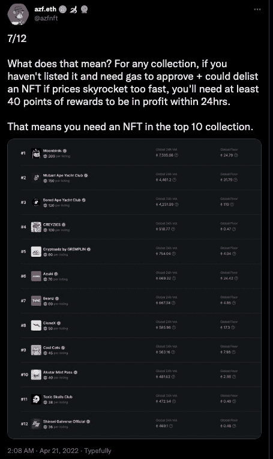
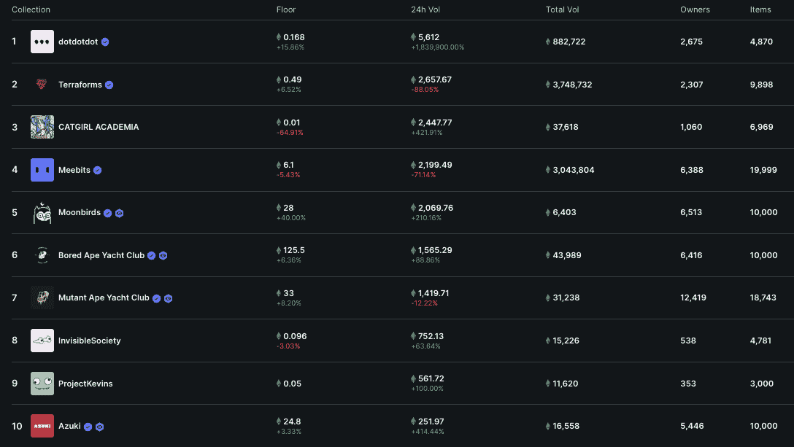
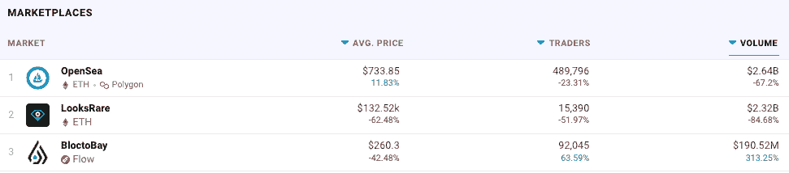

# 在 LooksRare 上列出 NFT 可以获得报酬

> 原文：<https://web.archive.org/web/https://dappradar.com/blog/get-paid-to-list-nfts-on-looksrare>

## 列出前 25 名 NFT，赢取 LOOKS 奖励

备受争议的 NFT 市场 LooksRare 推出了一项新的奖励活动，让那些将自己的非功能性广告挂牌出售的人有权获得以 LOOKS 代币支付的经济奖励。新的上市奖励计划将通过奖励用户在平台上上市销售 NFT 来提高流动性。每天 250，000 次浏览将被分配给符合条件的每个人。

## 摘要

*   [LooksRare 推出列出前 25 名 NFT 的 LOOKS 奖励](https://web.archive.org/web/20220925081330/https://dappradar.com/blog/get-paid-to-list-nfts-on-looksrare/#How-it-works)
*   [每天将有 250，000 次浏览分配给符合条件的用户](https://web.archive.org/web/20220925081330/https://dappradar.com/blog/get-paid-to-list-nfts-on-looksrare/#How-it-works)
*   [该运动旨在增加流动性和刺激增长](https://web.archive.org/web/20220925081330/https://dappradar.com/blog/get-paid-to-list-nfts-on-looksrare/#Why-LOOKS-Rewards?-)
*   [looks 被激励的用户人为增加交易量](/web/20220925081330/https://dappradar.com/blog/marketing-genius-or-foul-play-two-wallets-generate-1-1-billion-on-looksrare/)

[公告](https://web.archive.org/web/20220925081330/https://twitter.com/LooksRareNFT/status/1516777029206949892)标志着自 2022 年初推出以来最大的结构调整。FirstLook 凭借其新推出的平台震动了 NFT 市场，该平台[超过了领先的 NFT 市场 OpenSea](/web/20220925081330/https://dappradar.com/blog/daily-rewards-for-trading-and-staking-on-looksrare-drop-big-time/) 。然而，他们通过使用[一些有争议的策略](/web/20220925081330/https://dappradar.com/blog/marketing-genius-or-foul-play-two-wallets-generate-1-1-billion-on-looksrare/)做到了这一点。在发布之初， [LooksRare](https://web.archive.org/web/20220925081330/https://dappradar.com/ethereum/marketplaces/looksrare) 用户仅仅通过交易 NFT 就获得了关注，这导致一些不良行为者在他们之间进行交易，以虚增费用来赚取更多奖励。

尽管如此，数码收藏爱好者可以通过交易、下注以及现在在 LooksRare 上出售一件 [NFT 来获得 LOOKS 奖励。然而，一些早期的投机者做了一些快速的计算，并检查了细节。他们](https://web.archive.org/web/20220925081330/https://dappradar.com/ethereum/marketplaces/looksrare)[透露](https://web.archive.org/web/20220925081330/https://twitter.com/azfnft/status/1516916736674598912)要获得任何适当的奖励，用户需要一件 NFT 在最昂贵的 10 件收藏品中。

## 它是如何工作的

当你列出前 25 个精选的 NFT 时，只要物品和精选符合下面的标准，你每十分钟就可以赢得点数。

*   列出的 NFT 来自通过滚动 24 小时交易量排名的前 25 个合格集合之一(排名每 10 分钟更新一次)
*   该列表是一个活动的和可执行的订单
*   挂牌价在全球集合底价的 1.5 倍之内，即 OpenSea 或 LooksRare 的最低底价

除了上述个别上市的标准，NFT 收藏必须满足以下标准，才有资格获得上市奖励。

*   项目总数为 20，000 或更少
*   大于 0%的版税
*   符合 ERC-721 令牌标准。不幸的是，ERC-1155s 和其他标准在计算方法中引入了太多的复杂性。

这里重要的一点是，被确定为人为增加交易量以提高其收藏量排名的收藏将被取消资格。这一举动表明，虽然 LooksRare 可能采用了一些有争议的策略来取得今天的成就，但它现在正寻求直接夺取 OpenSea 的桂冠。

[看似象征性的交易奖励](https://web.archive.org/web/20220925081330/https://docs.looksrare.org/about/looks-tokenomics)总是旨在鼓励交易量。由于上市奖励是交易量奖励，LooksRare 将 140 万份每日交易奖励中的 25 万份投入到新项目中。在首次推出后，LooksRare 表示，如果一切按计划进行，它可能会调整上市奖励计划，并使用其他来源的代币。

## 关键日期

*   4 月 20 日 09:00 UTC，将开始记录奖励积分列表
*   4 月 21 日 09:00 UTC，首次上市奖励计算
*   4 月 21 日 11:00 UTC，第一个列表奖励付款

## 为什么要看奖励？

这场运动背后的策略很简单，流动性。越多的 NFT 以合理的价格出售，越多的人会使用和交易 LooksRare。你现在可以通过下注赢得表情代币来赢得下注奖励，还可以通过买卖任何 NFT 的表情来获得交易奖励。后者是提升 LooksRare 交易量的关键第一步，并直接转化为增加 LOOKS 赌注者的收益。

尽管迅速崛起，但 LooksRare 希望有更多的交易量，并增加流动性。简单来说，LooksRare 上可供购买的 NFT 数量越多，平台上发生的买卖就越多。

不仅如此，流动性也需要在一个好的价格范围内，否则收藏家可能只是去其他地方以更好的价格购买。上市奖励计划还鼓励以接近底价的价格上市，looks 甚至为那些希望以较低价格上市并吸引眼球的人提供了一个 PFP 框架模板。

## 谁能参加？

如前所述，用户需要在 LooksRare 上查看 24 小时交易量排名前 25 位的 NFT，这是一个排名表，可以快速变化，但仍包含 BAYC、志那都红豆和 Terraforms 等忠实用户，但有趣的是，没有 CryptoPunks。

这场运动虽然有利于那些持有高价值 NFT 的人，但其设计方式是为了增加 LooksRare 的流动性和总体交易量。然而，我们预计它会受到批评，因为该公告耸人听闻的标题会让大多数人认为这是一笔简单的上市现金交易。事实上，根本不是那么回事。

另一方面，它可能做的一件事是刺激奖金猎人的前 25 个 NFT 收藏的销售。随着 NFT 市场在如此活跃的 2021 年后进入平静期，这些策略不仅有利于 LooksRare，也有利于整个 NFT 市场。

LooksRare NFT 市场不断发布产品，展示他们对社区的关注。此外，在最初的[看起来采矿回报减半](/web/20220925081330/https://dappradar.com/blog/daily-rewards-for-trading-and-staking-on-looksrare-drop-big-time/)之后，无机或 wash 交易活动迅速下降。这些代币奖励激励了无机交易行为，并在最初推动了该平台，帮助它超越了 OpenSea 并获得了严重的关注。虽然 OpenSea 似乎在拖后腿，但 LooksRare 正在全力进攻，这位作者预测，到 2022 年底，守卫将发生变化。

[<picture></picture>](https://web.archive.org/web/20220925081330/https://dappradar.com/blog/what-are-non-fungible-tokens-nfts)[<picture></picture>](https://web.archive.org/web/20220925081330/https://dappradar.com/nft/marketplaces)[<picture></picture>](https://web.archive.org/web/20220925081330/https://dappradar.com/nft/sales)

***以上不构成投资建议。此处给出的信息仅供参考。请行使尽职调查，做你的研究。作者持有多种加密货币的头寸，包括 BTC、瑞士法郎和雷达。***

 NewsletterUnsubscribe at any time. [T&Cs](https://web.archive.org/web/20220925081330/https://dappradar.com/terms) and [Privacy Policy](https://web.archive.org/web/20220925081330/https://dappradar.com/privacy-policy)