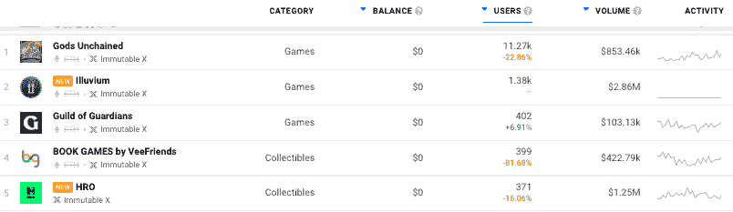

# GET 协议将在不可变 X 上启动 NFT 票务市场

> 原文：<https://web.archive.org/web/https://dappradar.com/blog/get-protocol-will-launch-nft-ticket-marketplace-on-immutable-x>

## 不变 X & GET 联手打造连锁 NFT 票务市场

领先的 NFT 机票提供商 GET Protocol 正与以太坊第二层解决方案 Immutable X 合作，推出 NFT 机票二级市场。GET 希望这种整合将使该协议能够搭载下一个 10 亿用户到 web3，直接转售无汽油、完全碳中和的 NFT 门票，在链上无缝接入菲亚特 onramp。

通过 GET Protocol，票务公司和个人已经发行了多达 200 万张 NFT 门票，其中包括说唱明星古驰·马内、路易斯·卡帕尔蒂和英国雷鬼集团 UB40。GET Protocol 团队研究了活动行业的痛点，以增强创作者、运动员和艺术家的能力，包括防止倒票、验证粉丝出席率和为未来活动融资。

[查看不可变 X 上最热门的 Dapps】](https://web.archive.org/web/20220712041519/https://dappradar.com/rankings/protocol/immutablex)

GET Protocol 希望成为“防止任何访问的 NFT”的全球数据标准通过利用 Immutable X 的规模和深入的知识来促进顶级 NFT 市场，如 [VeVe](https://web.archive.org/web/20220712041519/https://dappradar.com/immutablex/collectibles/veve) 。GET Protocol 将访问所有必要的工具和资源，为赛事门票建立一个易于使用和可扩展的全球二级市场。开发过程已经开始，将在未来几个月内得到充实。

## 什么是 GET 协议

GET Protocol 是 NFT 票务的市场领导者，自 2016 年以来，已向主流活动参与者发放了约 200 万张在线门票。该协议提供的工具允许任何发行门票的人获得 NFT 和区块链创新的好处，同时为购票人提供完全无摩擦的体验，技术复杂性为零。

一系列传统挑战已经得到解决，例如倒票、欺诈、恶意倒卖，甚至为新活动提供资金。全球合作伙伴使用 GET Protocol 的工具套件，从完整的白标包到现有票务实体的数字双解决方案。通过定制工具，如“活动融资”模块，结合使用 DeFi 和抵押 NFT 门票进行未来活动。

## 什么是不可变的 X

[Immutable X 是领先的 NFTs 第 2 层扩展解决方案](/web/20220712041519/https://dappradar.com/blog/immutable-x-the-nft-specific-blockchain/),支持无气体铸造和交易，同时不影响全球最常用的 NFTs 区块链以太坊的安全性。

[通过 DappRadar 发现顶级 NFTs 以太坊系列](https://web.archive.org/web/20220712041519/https://dappradar.com/nft/protocol/ethereum)

该解决方案提供即时交易确认和高达每秒 9，000 笔交易的巨大可扩展性，以及出色的开发人员和用户体验。Immutable X 已经宣布与诸如 OpenSea 和 Mintable 等成熟市场进行整合，而 T2 则为一些最大的 NFT 和游戏应用提供支持。

[<picture></picture>](https://web.archive.org/web/20220712041519/https://dappradar.com/rankings/protocol/immutablex)

## 为什么它很重要

NFTs 的力量远不止 PFP 头像收藏和价值百万美元的加密艺术。经过过去 18 个月的大肆宣传，该行业似乎正在安定下来，重新致力于公用事业项目，这些项目可以更接近于实现大规模采用。对于投资者来说，在市场周期的这个阶段，它是关于识别趋势和挑选赢家的，虽然没有人有水晶球，但有些事情是有意义的——此外，这是使用 DappRadar 工具检查你的投资组合的好时机。

NFT 的门票很有意义。不仅仅是活动观众，还有艺术家和活动组织者。在独特的[音乐产业与区块链播客](https://web.archive.org/web/20220712041519/https://youtu.be/OvNW5-DPPSI\)中详细讨论的一个话题，该播客由[英国 Dubstep DJ Plastician](https://web.archive.org/web/20220712041519/https://en.wikipedia.org/wiki/Plastician) 主持。

https://youtu.be/OvNW5-DPPSI\

DJ、乐队或艺术家可以在任何时候直接与购买他们演出门票的人互动，这种想法对于一个行业来说是非常不可思议的，在这个行业中，累死累活、通常没有报酬的工作是获得成功和建立粉丝基础的主要途径。

与此同时，对于活动组织者来说，消除门票兜售和不公平的定价是一件需要很长时间的事情。更不用说，一旦活动观众的钱包里有了永久的、潜在的 NFT 门票，将会出现持续的营销和销售机会。此外，所有持票人将很快能够以闪电般的速度铸造和交易 NFT，并且没有以太坊的[汽油费限制。](/web/20220712041519/https://dappradar.com/blog/when-are-ethereum-gas-fees-lowest/)

 NewsletterUnsubscribe at any time. [T&Cs](https://web.archive.org/web/20220712041519/https://dappradar.com/terms) and [Privacy Policy](https://web.archive.org/web/20220712041519/https://dappradar.com/privacy-policy)

***以上不构成投资建议。此处给出的信息仅供参考。请行使尽职调查，做你的研究。作者持有多种加密货币的头寸，包括 BTC、瑞士法郎和雷达。***