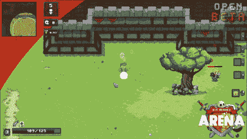
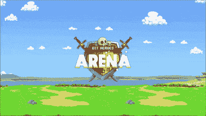

# 准备好参加比特英雄竞技场公开测试版的复古游戏吧

> 原文：<https://web.archive.org/web/https://dappradar.com/blog/get-ready-for-retro-gaming-with-the-bit-heroes-arena-open-beta>

## 玩家很快就可以在比特大陆体验比特英雄竞技场和比特英雄跑垒员。

**比特英雄竞技场公测将于 11 月 16 日上线，比特英雄跑者也指日可待。这两款游戏是由 Kongregate 构建的游戏平台 Bitverse 的一部分，Kongregate 是一家拥有超过 15 年经验的老牌游戏公司。该平台旨在让更多的 Web2 游戏用户加入 Web3。阅读这篇文章，为这些激动人心的游戏做好准备吧！**

**目录**

*   [*Bitverse 为游戏社区带来复古游戏*](https://web.archive.org/web/20221217114944/https://dappradar.com/blog/get-ready-for-retro-gaming-with-the-bit-heroes-arena-open-beta/#bitverse)
*   [*什么是比特英雄竞技场*](https://web.archive.org/web/20221217114944/https://dappradar.com/blog/get-ready-for-retro-gaming-with-the-bit-heroes-arena-open-beta/#arena)
*   [*什么是比特英雄亚军*](https://web.archive.org/web/20221217114944/https://dappradar.com/blog/get-ready-for-retro-gaming-with-the-bit-heroes-arena-open-beta/#runner)
*   [*比特大陆英雄*](https://web.archive.org/web/20221217114944/https://dappradar.com/blog/get-ready-for-retro-gaming-with-the-bit-heroes-arena-open-beta/#heroes)
*   [*如何获得 Bitverse 英雄*](https://web.archive.org/web/20221217114944/https://dappradar.com/blog/get-ready-for-retro-gaming-with-the-bit-heroes-arena-open-beta/#how)
*   [*2023 年更值得期待在比特大陆*](https://web.archive.org/web/20221217114944/https://dappradar.com/blog/get-ready-for-retro-gaming-with-the-bit-heroes-arena-open-beta/#2023)

## Bitverse 为游戏社区带来了复古游戏

对于有经验的游戏爱好者来说，复古游戏将永远在我们心中占有一席之地。

Bitverse 带来了 80 年代街机的复古视觉效果，唤起了资深游戏玩家的回忆。与许多其他充满无聊游戏的加密游戏不同，Bitverse 中的游戏有足够的挑战和动作来保持有趣。

此外，每个可玩的角色，被称为比特大陆英雄，提供了一个完全独特的体验。

我们将在本文中介绍的 Bitverse 游戏是 Bit Heroes Runner 和 Bit Heroes Arena，后者将于 11 月 16 日开始公测。

事不宜迟，让我们招募一些英雄，敲击键盘，粉碎一些统计！

[Join Bit Heroes Arena Open Beta](https://web.archive.org/web/20221217114944/https://www.thebitverse.io/)

## 什么是比特英雄竞技场

比特英雄竞技场是一个 2D 多人游戏，在比特宇宙中以幻想为主题的皇家战役 RPG。玩家将在一场快节奏的战斗中面对多达 40 名其他玩家，他们将剑拔弩张，施展魔法，成为最后站立的英雄。

有了 RPG 元素作为游戏必不可少的一部分，比特英雄竞技场的回报就大得多了。基于等级的 RPG 进程允许玩家升级他们的装备，抢夺史诗武器，提高统计数据，并最终爬上排行榜的首位。

在比特英雄竞技场，战斗是紧张和令人上瘾的。各种攻击和武器将允许玩家在激烈的战斗中找到奇妙的攻击组合。

[Bit Heroes Arena Winning Tips](https://web.archive.org/web/20221217114944/https://the-bitverse.medium.com/the-arena-is-opening-89593eff595a)[Join Bit Heroes Arena Open Beta](https://web.archive.org/web/20221217114944/https://www.thebitverse.io/)

## 什么是比特英雄跑垒员

[https://web.archive.org/web/20221217114944if_/https://www.youtube.com/embed/RqnE7mNGD-I?feature=oembed](https://web.archive.org/web/20221217114944if_/https://www.youtube.com/embed/RqnE7mNGD-I?feature=oembed)

比特英雄跑者是一个冒险驱动的无止境跑者。它允许玩家穿越丛林和地牢，同时避免障碍，击败敌人，躲避龙的火焰。

值得注意的是，冒险模式增加了这款跑步游戏的可玩性。每个新的冒险都将在有限的时间内可用，并以不同的敌人、危险、装备和环境为特色。此外，玩家可以在每日、每周和每月的排行榜上与社区竞争，并获得奖励。

## 战斗英雄

比特大陆英雄是存在于区块链上的独特角色，可以在市场上买卖和交易。这些 NFT 人物是可定制的，具有独特的特质，玩家可以将他们带入比特大陆的所有游戏中。在与比特大陆英雄对战时，他们的进度、获得的物品和声望将被保存在 NFT 上。

玩家可以用一个标准英雄或他们拥有的任何一个独特的 1 对 1 比特世界英雄 NFT 登录比特英雄 Runner 和比特英雄竞技场。然而，只有那些拥有 NFT 比特大陆英雄的人才能获得专属特权。

英雄 NFT 还提高了玩家在所有 Bitverse 游戏中的每日奖励，更不用说在游戏中赚取游戏内令牌的能力了。如果这还不够刺激的话，英雄 NFT 还能提供更多。因为这些化身的主人将有权获得一个专属的 NFT 宠物空投。

[Learn all the features of Bitverse Heroes](https://web.archive.org/web/20221217114944/https://kongregate.gitbook.io/bitverse/game-assets/bit-hero-avatars)

### 如何获得英雄

Bitverse 是不可变 X 上的一个去中心化游戏平台。因此，用户[需要将他们的钱包连接到不可变 X](https://web.archive.org/web/20221217114944/https://www.thebitverse.io/purchase) 上，以购买或查看 Bitverse 英雄作为他们的资产。钱包中已经有 Hero NFTs 的用户可以在 Bitverse 平台的“我的资产”中看到它们。

[Get Bitverse Heroes now](https://web.archive.org/web/20221217114944/https://www.thebitverse.io/purchase)

为了让一个英雄在比特大陆游戏中发挥作用，主人需要用木桩支撑这个英雄。这将使玩家能够在游戏中使用他们独特的头像，并存储信息和进度。

一旦用户锁定了一个英雄，这实际上是把 NFT 从他们的钱包里转移到一个集中的地方阅读。这意味着 NFT 只能在游戏中玩，不能在市场上交易或出售。

[Learn everything about Hero stakin](https://web.archive.org/web/20221217114944/https://the-bitverse.medium.com/get-your-hero-ready-dba8293c7d9d)

## 在比特大陆，2023 年有更多值得期待的

Bitverse 是一个完全资助的项目，这意味着它不仅仅依靠销售来支持其运营。这使得该项目可以专注于提高游戏质量，而不是引导用户花更多的钱。他们有一些时间来开发他们的产品和扩大他们的受众。

《比特英雄竞技场》将于 11 月 16 日开始公测，《比特英雄跑垒员》即将推出。凭借其 15 年以上的游戏经验，Kongregate 将为用户带来更多高质量的游戏。

加入官方 [Twitter](https://web.archive.org/web/20221217114944/https://twitter.com/BHBitverse) 和 [Discord](https://web.archive.org/web/20221217114944/https://discord.gg/bitverse) 成为第一个体验乐趣的人。

**更多有用链接:**

*   Kongregate [网站](https://web.archive.org/web/20221217114944/https://www.kongregate.com/)
*   [Bitverse 网站](https://web.archive.org/web/20221217114944/https://www.thebitverse.io/)
*   [白面纸](https://web.archive.org/web/20221217114944/https://kongregate.gitbook.io/bitverse/)

**免责声明** —这是一篇赞助文章。DappRadar 不认可本页面上的任何内容或产品。DappRadar 旨在提供准确的信息，但读者应该在采取行动之前总是自己做研究。DappRadar 的文章不能被认为是投资建议。