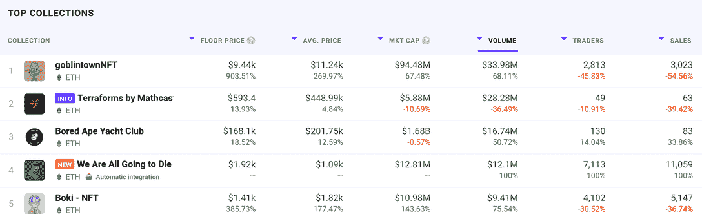
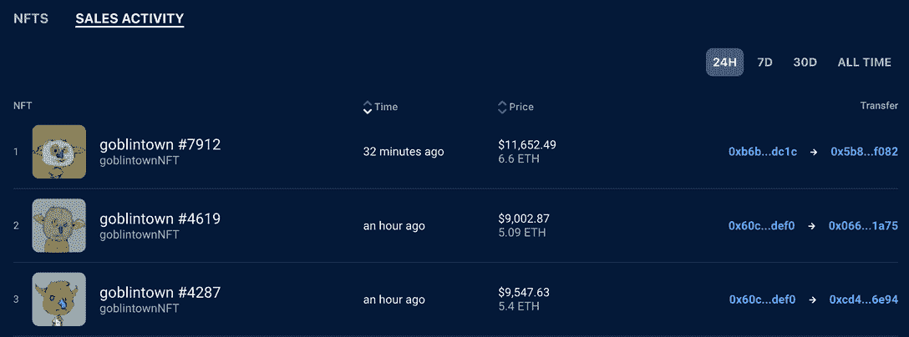
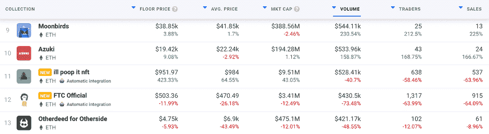
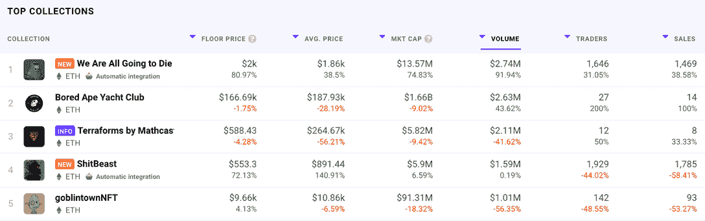
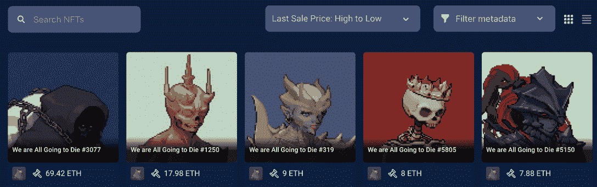

# 哥布林镇模仿者出现在 DappRadar 排名中

> 原文：<https://web.archive.org/web/https://dappradar.com/blog/goblin-town-copycats-appear-in-dappradar-rankings>

## 因为文化引领着一群模仿者

5 月 22 日，哥布林镇似乎不知从哪里掉了下来。从那以后，它的价格和受欢迎程度都上升了。现在，它是当前熊市中的王者，仿制品正在争相取代它的位置。在一个不断寻找新事物的市场中，这些与众不同的创意能存活下来吗？

**总结**

*   ***地精镇在两周内加入了 NFT 主要收藏品的行列。现在，其他项目，如《为了文化》和《我们都将死去》,正试图使用他们的公式并上升到顶端。***
*   ***达普拉达的*** [***NFT 探险者***](https://web.archive.org/web/20220705011235/https://dappradar.com/hub/nft-explorer) ***显示，尽管在过去的 24 小时内略有下降，但哥布林镇的平均销售价格仍保持在 6.19 ETH。其底价在过去一天甚至上涨了 13.86%，至 5.53 ETH。***

自从哥布林镇 NFTs 在没有大张旗鼓，没有路线图，没有主要影响者或复杂的开发团队的情况下首次亮相以来，已经过去了两个多星期。NFT 是免费分发的，并很快成为一个迷因集合。

但与大多数来得快去得也快的互联网迷因不同，这个迷因一直存在。我已经在这里给出了我认为这个系列流行的原因。还有很多其他评论家和分析家评论说，丑陋的小 PFPs 是在正确的时间正确的集合。

## 哥布林镇两周

两周前我们写了关于地精镇的文章，当时它的底价大约是 0.5 ETH。对于一个自由的 NFT 来说，这已经很了不起了。从那以后，它的价值越来越高，目前的地板位于 5.53 ETH。最高售价为 77.75 ETH，哥布林镇在 T2 达普拉达的七天交易量排名中遥遥领先。

[DappRadar’s seven day NFT Rankings](https://web.archive.org/web/20220705011235/https://dappradar.com/nft)

如果我们看一看 DappRadar 的 NFT 探险者上的[地精镇，我们可以看到销售价格仍然很高，任何免费铸造或提前购买地精的人都将获得可观的利润。通过点击每个 NFT，我们可以看到元数据、交易历史、最后成交价和资产实力的明细。这对于考虑到实用性和路线图而开发的 NFT 来说是有用的信息；对于哥布林镇来说，谁也说不准什么是有利的属性。](https://web.archive.org/web/20220705011235/https://dappradar.com/hub/nft-explorer/collection/goblintownnft/sales-activity)

[DappRadar’s Sales Activity for Goblin Town NFTs](https://web.archive.org/web/20220705011235/https://dappradar.com/hub/nft-explorer/collection/goblintownnft/sales-activity)

当哥布林镇下跌时，我们写道，该系列的不敬是市场中的一股新鲜空气，市场陷入了熊市趋势和糟糕的氛围。我们注意到它的成功将如何导致一大批模仿者，每个人都希望跳上哥布林镇时髦的新燕尾服。新的模仿者是否会抓住收藏家的想象力还有待观察。

## 对于引领模仿潮流的文化

因为文化是另一个 NFT 收藏，它从无到有，没有追随者，也没有路线图，以产生一个巨大的社交媒体追随者和一个专门的社区。该系列的基调是公开的不敬，它甚至向人们支付 0.01 ETH 来铸造他们的 NFT。因为这种文化显然是从地精镇开始的。

> pic.twitter.com/h3l6OhTNpxgjᵒobeₗᵢᶦnₛₛaeʳᶦᵉfᶦᵣᵈakuˡturʳʳ
> 
> — For The Culture (@nftftc) [June 6, 2022](https://web.archive.org/web/20220705011235/https://twitter.com/nftftc/status/1533721564390297603?ref_src=twsrc%5Etfw)

Source: Twitter

它目前在 DappRadar 的 24 小时交易量排名中排名第 12 位，收藏家在此期间交易了价值超过 430，500 美元的尚未披露的 NFT。最令人震惊的是，与前一天相比，这一数字下降了 73.48%，当时价值超过 755.5 ETH(140 万美元)的文化基金易手。

[DappRadar’s 24 hour NFT ranking](https://web.archive.org/web/20220705011235/https://dappradar.com/nft/collections)s

## 我们都会死

虽然该文化可能是哥布林镇的直接继承者，因为它显然从该项目中获得了如此多的灵感，但另一个更成功的系列目前是其主要竞争对手。我们都将死去也没有网站，没有推特，没有路线图。它只有以太坊合同和一个到这个 Twitter feed 的链接。

在最近的 24 小时内，价值 274 万美元的《我们都会死》已经转手。这使它比无聊猿游艇俱乐部高出一个位置，到目前为止，他们还没有一个伟大的一周，比哥布林镇高出四个位置。

[DappRadar’s 24 hour NFT rankings](https://web.archive.org/web/20220705011235/https://dappradar.com/nft/collections)

看一看我们都将与 [NFT 探险者](https://web.archive.org/web/20220705011235/https://dappradar.com/hub/nft-explorer)一起死去，我们可以看到收藏中最贵的令牌卖到了 69.42 ETH(121，463 美元)。通过过滤元数据，任何人都可以找到哪些属性是最理想的，然后根据这些属性在二级市场上寻找最佳交易。

[We Are All Going to Die on NFT Explorer](https://web.archive.org/web/20220705011235/https://dappradar.com/hub/nft-explorer/collection/we-are-all-going-to-die)

这些系列是否能在短暂的创新期过后继续存在，还有待观察。互联网、NFT 文化和社区品味变化如此之快，以至于一个月后，所有这些项目都可能显得过时。

但是当乐趣持续的时候，DappRadar 将会继续关注它并且带给你最新的更新。关注我们的[博客](https://web.archive.org/web/20220705011235/https://dappradar.com/blog/)来追踪这个故事，并加入我们的[推特](https://web.archive.org/web/20220705011235/https://twitter.com/DappRadar)来获取突发新闻。亲自试用我们新的 [NFT 浏览器](https://web.archive.org/web/20220705011235/https://dappradar.com/hub/nft-explorer)，从单一来源获取所有重要信息。使用我们的 [NFT 收藏](https://web.archive.org/web/20220705011235/https://dappradar.com/nft/collections)排名页面，跟随妖精、文化和骷髅在我们的列表中上下移动。

 NewsletterUnsubscribe at any time. [T&Cs](https://web.archive.org/web/20220705011235/https://dappradar.com/terms) and [Privacy Policy](https://web.archive.org/web/20220705011235/https://dappradar.com/privacy-policy)